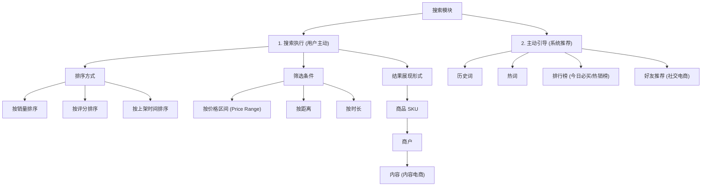
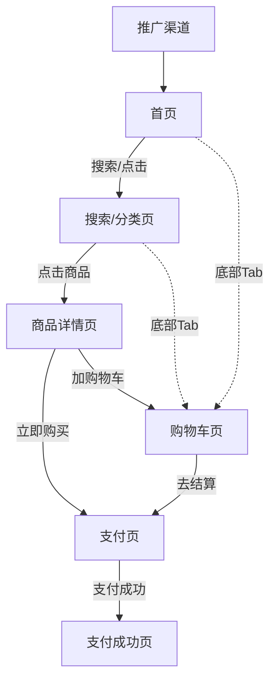

# 1. 产品设计的“五张图”概述
在进行产品设计与开发时，撰写繁复臃肿的PRD文档往往效率低下。经验表明，通过几张基础的图形即可将产品的核心理念和细节表述清楚。本文以电商场景为例，介绍贯穿产品设计生命周期的五张核心图形。

# 2. 五张核心图详解

## 2.1 第一张图：核心体验图 (Core Experience Diagram)
核心体验图旨在向所有利益相关者说明产品的核心用途和核心业务路径。
- **作用**：帮助团队达成最底层的共识，明确产品的核心生命周期和流转路径。
- **电商示例**：
  - **核心路径**：找商品 -> 了解商品 -> 下单 -> 收货
  - **效率指标与转化率**：核心体验图上的每一条连接线都代表着核心业务转化率或履约效率，是未来优化产品的核心数据北极星。
    - *首页到详情页转化率*：代表用户从“找商品”到“了解商品”的过程（即从首页等入口进入商品详情页）。
    - *订单转化率*：代表用户从“了解商品”到“下单”的决策转换。
    - *履约效率*：代表用户从“下单”到“收货”的供应履约过程（涉及是否缺货、货物破损率等指标）。

```mermaid
graph TD
    A["找商品 (如首页/搜索/类目)"] -->|首页进详情页转化率| B["了解商品 (详情页)"]
    B -->|订单转化率| C["下单 (支付)"]
    C -->|履约效率 (避免缺货/破损)| D["收货 (物流履约)"]
```

## 2.2 第二张图：产品模块图 (Product Module Diagram)
产品模块图用于展示整个系统由哪些顶层业务模块组成，提供顶层的系统视角。
- **作用**：
  - 让项目团队全面了解系统功能版图。
  - 作为大型企业划分团队职能与界定部门边界的重要依据。不同团队负责不同的模块线，关注不同的指标与数据。
- **电商顶层模块划分示例**：
  - **导购模块**：包含首页、搜索、商品详情页、类目页等。
  - **交易模块**：包含支付、售后服务等。
  - **营销模块**：包含优惠券、积分、拼团等促成交易的功能。

| 模块名称 | 包含子功能/页面 | 核心团队关注指标 |
| :--- | :--- | :--- |
| **导购模块** | 首页、搜索、商品详情页、类目页 | 页面访问深度、点击转化率、搜索召回率 |
| **交易模块** | 支付、售后 | 支付成功率、退款率、售后处理时效 |
| **营销模块** | 优惠券、积分、拼团 | 营销拉动GMV、券核销率、复购率 |

## 2.3 第三张图：产品功能树 (Product Function Tree)
产品功能树是产品模块图的进一步展开，将某个具体模块的详细功能细化，通常可以使用思维导图软件绘制。
- **作用**：向下拆解功能分支，理清技术边界。
- **以“搜索模块”为例的展开结构**：
  - **搜 (搜索执行)**：用户主动输入词进行搜索。
    - *搜索结果排序*：按销量排序、按评分排序、按上架时间排序。
    - *搜索结果筛选*：按价格区间筛选、按距离筛选、按时长/时间筛选。
    - *搜索展现形式*：商品SKU展示、商户展示、内容展示（内容电商场景）。
  - **主动引导**：平台主动推荐引导用户。
    - *历史词*：记录并展示用户搜索历史，便于快速检索。
    - *热词*：展示平台当下热门搜索词。
    - *排行榜*：各类目榜单、今日必买、单品推荐。
    - *社交推荐*：朋友在买等内容推荐（内容电商与社交电商场景）。



## 2.4 第四张图：页面关系图 (Page Relationship Diagram)
页面关系图用来表述产品中包含的页面以及它们之间的流转跳转逻辑。
- **作用**：直观展示页面链路；评估开发工作量；检查产品逻辑的完整度与闭环。
- **自洽比对原则**：页面关系图与产品功能树是自洽的。功能树里的每个子功能，最终都必须承载在具体的页面中。两张图互相对照可以快速发现逻辑遗漏。
- **电商页面关系流转示例**：
  - 用户从各个渠道进入 **首页** -> 通过搜索/点击进入 **搜索页/结果页** -> 挑选商品进入 **商品详情页** -> 确认购买进入 **支付页** -> 支付成功进入 **支付成功页**。
  - 用户在页面上也可以选择将商品加入购物车。**购物车** 作为电商的基础功能，通常放置在底部导航栏 (Tab)，因此几乎所有导购与详情页面都能够直接跳入购物车，且购物车可以直接进入支付页面。



*注：在页面关系图的矩形框内，可以简单列出该页面的核心功能（例如：首页可以包含“搜索框”、“类目区”、“推荐流”、“分享”等），方便开发团队和需求方加深理解。*

## 2.5 第五张图：交互图 (Demo/Mockup/Wireframe)
交互图用于展示页面上的元素布局和具体交互行为细节。
- **定位**：在五张图体系中，交互图属于实现细节，重要性低于前四者。因为前四张图讲明后，产品的“灵魂”（核心体验与业务逻辑）已经构建完成。目前成熟公司多有专业的交互设计师（UX）与UI设计师，产品经理只需表达清楚页面元素和流转解释。
- **质量标准**：高质量的交互图应当具有“自解释性”，技术人员和设计师无需额外口头解释即可明确界面的动作逻辑。

---

# 3. 本地开发与生产落地注意事项
- **多维度转化率埋点**：围绕“核心体验图”的关键连接线设计埋点（如PV、UV、页面停留时间及转化路径），建立统一的埋点字典，以防统计口径不一致。
- **模块独立性与高可用**：各核心模块（导购、交易、营销）在代码层面和系统架构上应保持解耦。例如，营销模块（优惠券、拼团）异常时，交易模块仍应具备降级容灾能力，确保用户能以原价完成支付，防止交易锁死。
- **闭环审计校验**：产品经理与开发在项目排期前，需通过“页面关系图”与“产品功能树”建立自洽映射对照。凡在功能树出现的业务点，均须能在关系图中找到对应的入口页面与数据展示载体，避免开发中途出现非预期的新增页面，引发排期延误。

---

# 4. 核心概念与速查小结 (Cheat Sheet)

| 核心概念/工具 | 核心定位 | 核心工程作用 | 适用阶段 |
| :--- | :--- | :--- | :--- |
| **核心体验图** | 核心业务路径流转图 | 确定产品主线逻辑，对齐业务核心转化率 | 规划初期 / 战略对齐 |
| **产品模块图** | 顶层系统架构图 | 划分团队组织职能架构，界定团队考核指标 | 团队组建 / 系统划分 |
| **产品功能树** | 细化模块功能树状图 | 穷尽各级细节，指导技术明确需求边界 | PRD撰写 / 需求拆解 |
| **页面关系图** | 页面跳转与路由拓扑图 | 评估开发工作量，防止页面逻辑产生孤岛 | 架构审查 / 开发排期 |
| **交互图 (Demo)** | 界面布局及交互逻辑描述 | 明确界面元素排布，实现平台特定的交互细节 | UX交互与UI设计阶段 |
