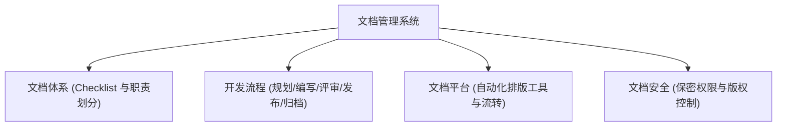
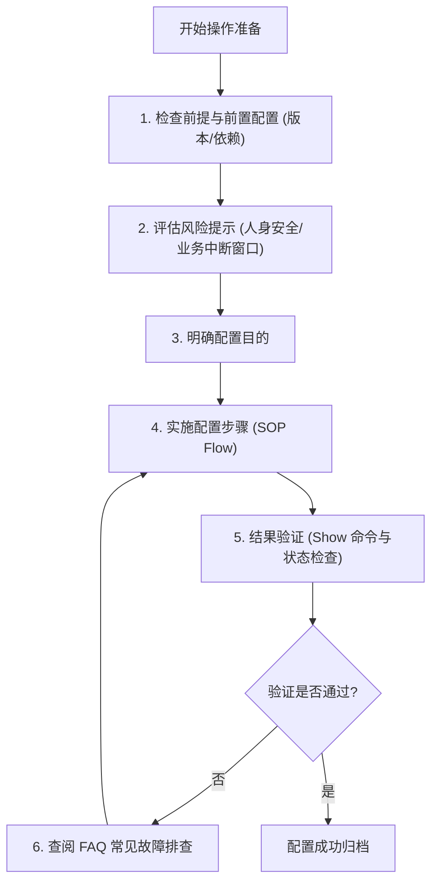

# 1. 技术文档的重要价值与宏观定位

在现代企业工程体系中，**文档绝非产品的附属品，文档本身就是产品的重要组成部分**。

## 1.1 技术文档的四重核心价值
1. **信息的载体与能力沉淀**：文档实现了知识的“一对多”快速复制与传递。它将个人脑海中的技术能力，永久沉淀为企业的无形资产。
2. **法律法规合规与免责**：
   * 在许多国家和地区，完备的说明书/文档是产品获批上市的必要准入条件。
   * 文档中的安全警告与极限操作说明起到法律免责作用，规避因用户不当操作引发的法律诉讼。
   * 在商业招标（如运营商招标）中，产品技术文档质量通常是强制性的评标扣分项。
3. **降本增效的运营工具**：
   * **分级服务支撑体系**：参照行业标杆（如华为的“七远八案，三免九字”服务体系），优秀的文档能引导客户或外包团队通过自主检索解决大部分常见售后问题。这极大地减轻了热线客服、现场工程师以及后端专家的研发支持工作量。
   * **降低一线人员能力门槛**：完备的文档具有“技能赋能”作用，使原本需要五年工作经验的资深工程师才能完成的调测工作，降低至一年经验的初级技术人员即可借助文档顺利开通。
   * **内部协同纽带**：在研发内部，需求说明书和设计说明书是开发、测试与支持团队的有效沟通桥梁，也是排查故障、划清职责的“契约证据”。
4. **提升品牌溢价与专业认可**：高质量的技术文档向客户传达出厂商的专业度与严谨作风，是企业品牌的一张亮丽名片。

---

# 2. 企业文档管理的顶层设计

文档质量的提升高度依赖于管理层的重视程度与资源投入。企业需要从以下四个维度构建体系：

## 2.1 完善的文档体系
明确定义产品交付所必需的文档清单（例如：硬件安装手册、软件配置指南、调试手册、验收指导书等）。每一篇文档必须具有规范的命名、清晰的定位、明确的使用对象，以及**明确的归属编写人（Owner）**，防止在研发、测试与售后部门之间出现资源推诿。

## 2.2 项目化的开发流程
文档写作本身就是项目。流程包括：
1. **规划与定义**：确定版本所需交付的文档清单。
2. **启动与分工**：下发任务，明确时间节点。
3. **跟踪与监督**：由专职文档经理（Document Manager）或文档管理员对编写进度进行项目化跟踪。
4. **评审与修订**：组织技术专家进行内容评审，确认无误后修订。
5. **发布与平台权限控制**：将文档归档并上传至发布平台，合理控制查阅权限。

## 2.3 平台工具的支撑
大公司通常摒弃繁琐的 Microsoft Word 手工排版，采用结构化的文档编写工具（如支持 XML/HTML 格式的专业写作软件），实现内容与排版的自动分离，支持一键目录生成、格式批量刷新和自动化导出，从而极大地提升内容复用性。

## 2.4 专职与兼职的权衡
* **矛盾点**：研发工程师对技术细节最为了解，但往往缺乏优秀的文字表达与语言组织能力；而纯专职文档工程师虽然写作水平高，但长期脱离一线研发容易导致技术理解脱节。
* **推荐架构 (专兼结合)**：
  * **日常编写**：由产品研发工程师兼职编写文档初稿，确保技术细节的准确度。
  * **管理与赋能**：设立专职**文档架构师 (Document Architect)** 与**文档经理 (Document Manager)**，负责梳理文档框架、定制模板、设计排版工具，并对兼职研发人员进行“文档思维”培训与宣贯。

---

# 3. 文档保密与版权保护原则

商业技术文档在发布时必须严格平衡“便捷性”与“安全性”：
* **版权保护 (Copyright)**：杜绝直接抄袭竞争对手的文档以防侵权诉讼。通过限制开放全权限和申请文档著作权来保护企业知识产权。
* **安全保密原则 (Confidentiality)**：**保密性永远高于便捷性**。大公司的机密文档必须通过强加密软件、身份验证介质（如 U-key、U 盾，例如大型设备商的 UDS 系统）进行保护。在文档中强制集成动态个人水印，严防文档外泄至竞争对手。

---

# 4. 标准 SOP 配置指导书的结构规范

针对涉及技术调测和数据配置的操作类文档，应当遵循标准作业程序（SOP，Standard Operating Procedure）进行板块规划，严禁一上手就直接写操作步骤。

## 4.1 前提条件 (Prerequisites)
说明适用的软件/硬件版本环境。防止用户在版本不兼容的生产环境上直接应用本操作指南。

## 4.2 前置配置 (Pre-configurations)
检查关联的依赖配置或底层开关是否已提前开启（如：确认某基础 VLAN 是否已创建、某系统中台接口是否通顺），避免中途报错。

## 4.3 风险提示 (Risk Warnings)
* **物理安全**：高电压操作警告、防静电手环佩戴提示等。
* **业务安全**：告知该配置是否会导致现网业务中断，并强调操作时间窗口（如：必须在凌晨 2:00 至 4:00 的系统割接窗口期进行）。

## 4.4 配置目的 (Objective)
一句话说明执行本项配置能达到何种系统效果。

## 4.5 配置步骤 (Procedure)
包含规范的流程图，并辅以第一步、第二步、第三步的文字指令和交互图示。

## 4.6 结果验证 (Verification)
告知用户配置完成后，如何通过输入检查命令（如 `show` 或查询探针告警）来验证数据是否生效。

## 4.7 FAQ 与故障排除
收集一线反馈的常见配置报错现象，提供原因分析及相应的规避解决方案。

---

# 5. 提升文档质量的八大写作心得

1. **彻底摒弃“我以为” (换位思考)**：作者虽是该领域的专家，但必须将阅读对象设想为刚毕业的应届生或跨专业技术人员，降低身段进行保姆式讲解。
2. **遵循产品打磨思维 (大声朗读法)**：写完一段话后反复进行自我朗读。凡是念着不通顺、绕口的地方必须改写。一句话通常不要超过 15 个字不加断句。
3. **丢到一线去打磨 (持续迭代)**：没有一篇文档天生完美。必须通过一线工程师和客户的实际使用反馈，挨骂后厚着脸皮反复修订，才能使文档走向成熟。
4. **言简意赅，多说白话**：杜绝空洞的公文套话与官腔，怎么说话就怎么写文档。
5. **字不如表，表不如图**：图片特别适合表现具象化的东西。设备外观、UI 界面、模块关系一律用截图或架构图表达，能节省千言万语。
6. **引入在线多媒体要素**：利用网页 HTML 在线文档的便捷性，引入 GIF 动图、视频教程或 CG 动画，提升信息传递效率。
7. **文档与产品设计相辅相成**：如果产品设计频繁变更（例如微小版本中随意移动按钮位置、更改确认按钮文案），文档编写质量就无法保障。优秀的文档与高利润的高端产品会形成正向良性循环。
8. **深入一线进行定制化调研**：面对大型定制化项目（如 Orange 运营商项目或特定的 LTE 项目），文档经理及产品经理必须深入客户现场面对面沟通，了解真实的交付文档诉求。

---

# 6. 本地开发与生产落地注意事项

在实际系统上线与企业知识体系建设中，应当注意以下落地考量：
* **智能语义检索系统 (LLM-based Search) 升级**：随着生成式 AI（如 ChatGPT、GPT-4）的普及，企业应当考虑将成熟的技术文档喂给大语言模型，构建内部企业知识库。这能彻底改变传统的文档检索模式，让一线人员通过自然语言对话快速定位操作细节和 FAQ 方案。
* **文档版本与代码交付版本强绑定**：必须在 CI/CD 流程中建立“代码变更 - 文档同步变更”的阻断性流水线关卡。如果新版本的 UI 发生变动（如按键名称从“确定”变更为“OK”），必须在发布前同步更新文档中的操作截图与说明，防止生产环境上的用户手册出现失真。
* **版权与保密双规检测**：在对外发布技术文档前，必须经过法务合规部门对代码、示例参数、配置模版进行审查，防止因文档中遗留敏感商业代码、客户真实 IP 地址或密码信息导致重大生产泄密事故。

---

# 7. 核心概念与术语速查小结 (Cheat Sheet)

| 核心术语 | 工程与设计作用 | 应用场景 | 安全与合规要求 |
| :--- | :--- | :--- | :--- |
| **SOP** | 标准作业程序，将复杂配置或操作拆解为标准化、免错的步骤结构。 | 调测手册、配置指南 | 必须包含前提、风险提示及验证章节 |
| **Document Architect** | 文档架构师，负责文档的顶层框架与读者诉求匹配设计。 | 体系建设初期 | 需深入理解产品技术与客户使用场景 |
| **Document Manager** | 文档经理，跟踪文档的全生命周期开发任务。 | 项目管理全过程 | 负责按时交付文档并监控合规性 |
| **U-key/UDS** | 硬件/软件身份验证机制，用于在访问机密文档时进行解密。 | 机密文档查阅 | 严禁考出，打开时强制添加水印 |
| **FAQ** | 常见问题解答，收集一线故障信息并给出快速定位指南。 | 交付指导与故障排除 | 根据一线反馈动态迭代更新 |
| **XML/HTML Editor** | 结构化文档编辑器，将样式与内容分离以实现批量发布。 | 大规模文档开发 | 提升复用率，减少排版冗余工作 |
