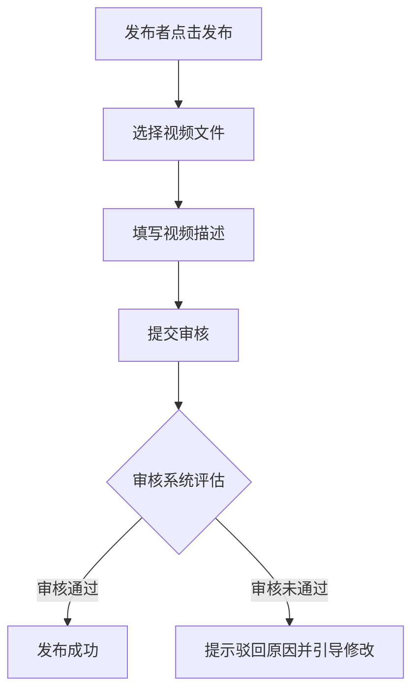

# 1. 产品设计中的宏观与微观划分

在产品设计的生命周期中，产品规划属于**宏观产品设计**，而产品需求文档（PRD，Product Requirement Document）则属于**微观产品设计**。

随着当前软件开发节奏的加快，并非所有的产品设计都需要通过独立的 PRD 文档来体现。根据复杂度的不同，微观产品设计通常可以划分为以下三种形式：

| 设计形式 | 适用场景 | 表达方式 | 交付目标 |
| :--- | :--- | :--- | :--- |
| **任务内设计 (In-task Design)** | 简单的需求修改（如：修改文字、图片、Logo、颜色等）。 | 直接写在项目管理、任务管理或迭代管理系统的 Task 详情中。 | 减少文档创建成本，提高研发团队的响应效率。 |
| **故事级设计 (Story-level PRD)** | 面向单个用户故事或用户场景的具体设计（最常见的 PRD 形式）。 | 包含版本说明、背景目标、场景分析、详细交互、交付设计等完整章节。 | 指导研发团队在单次迭代（Sprint）内完成具体业务闭环的开发。 |
| **版本级设计 (Version-level Design)** | 从无到有创建的大型产品或跨多个子系统的复杂大版本（如新建电商、短视频、社交平台等）。 | 采用总纲性质的顶层 PRD，不包含过于琐碎的细节设计，而是梳理子产品架构，并引导研发查阅各个细节 PRD。 | 协调多个产品经理共同编写的“产品家族”文档，确保技术架构的兼容性。 |

---

# 2. 用户故事级 PRD 的六大核心章节

一个合格的面向用户故事（User Story）的 PRD 文档，在结构上应当呈现金字塔式的循序渐进结构，主要包含以下六个部分：

## 2.1 版本说明 (Version History)
版本说明用于记录 PRD 文档的每一次修改记录。
* **记录原则**：版本说明不是“改一次写一次”，而是**跟随产品评审（Review）会议的节奏走**。
* **作用**：记录每次评审会后达成的修改共识，便于参与下一次评审的团队成员快速了解自上次会议以来发生的变化。

## 2.2 背景与目标 (Background & Goal)
阐明开发该功能的业务合理性与衡量指标。
* **业务背景**：说明公司为何需要此功能。例如，社区平台此前仅支持图文上传，导致视频博主流失，因此需要新增视频发布功能。
* **衡量目标**：明确产品上线后期望达到的业务指标。例如：上线后每天至少有 100 个用户发布视频内容，且视频浏览量占平台总浏览量的 25%。这些指标可作为评估产品上线后价值的印象基础。

## 2.3 故事介绍 (User Story Introduction)
介绍用户具体的行为场景与功能的业务价值。
* **场景梳理 (Scenario)**：以“一件事一行字”的列表形式，穷举用户会做的事情（通常在十几行以内）。这种梳理方式可帮助读者（研发、测试）在脑海中快速建立竞品对比与产品画面感。
* **价值分析 (Value Analysis)**：论证这些场景如何支撑前述业务目标的达成。例如：视频内容最长可支持 15 分钟，能吸引用户更长时间的停留，从而提升整个 APP 的用户访问时长。该部分通常需要产品经理与产品运营等团队协同分析，避免逻辑不通。

## 2.4 概要设计 (High-level Design)
概要设计是产品设计的核心索引，通常结合产品设计“五张图”中的前四张图进行表达：

### 2.4.1 用户核心路径 (User Core Path)
绘制用户在系统中的核心操作路径，明确关键环节。

### 2.4.2 漏斗目标 (Funnel Metrics)
针对核心路径中的每一个转化箭头，设定具体的产品漏斗目标（如：发布按钮点击到成功提交的比例、提交到过审的比例）。
* **预测能力培养**：漏斗指标直接反映产品经理的预测与设计水平。通过对比预测数据与实际数据，能够帮助产品经理积累经验，并协助运营团队提前准备流量和 KOL 资源（例如：若预测过审率为 50%，为确保每天上线 100 条视频，运营需提前准备 200 条初始素材）。
* **中长期路径规划 (Roadmap)**：在概要设计中，应视情况列出未来几个版本可能加入的兼容性功能。虽然当前版本不实现，但提前将此信号传递给技术经理，有助于技术经理在设计底层数据结构和代码架构时，预留兼容性与扩展空间。

### 2.4.3 三张核心结构图
* **模块图与功能清单图 (Feature List)**：穷举每个模块下发生的功能（使用 M 代表 Module，F 代表 Feature）。功能清单是详细设计的目录索引，技术 Leader 可据此为工程师分配开发任务，测试团队亦可据此编写测试用例（Test Case）。
* **页面结构图 (Page Structure)**：与功能清单相互呼应，确保自洽。若某个页面在功能清单中无对应功能，或者功能清单中的功能在页面中无法承载，则说明设计存在遗漏。在这一阶段，产品经理通常会与交互设计师（UI/UX）协作，使用 Axure、MasterGo、墨刀或蓝湖等工具输出 Mockup 甚至高保真原型。

## 2.5 详细设计 (Detailed Design)
详细设计负责将概要设计中的页面结构与功能清单进行具象化描述。产品经理需要一一对应地解释每个页面上的具体交互逻辑、极限情况及业务规则，并与概要设计的清单进行二次自洽校验。

## 2.6 交付设计 (Delivery Design)
交付设计是确保产品平稳落地、数据可度量的重要环节，主要包括以下三项：

### 2.6.1 数据分析与埋点设计 (Analytics & Tracking)
产品经理在研发介入之前，必须提前梳理数据分析诉求，明确关键的用户行为事件（Action）和页面展现（View），并设计埋点文档。这能有效防止产品上线后出现“无法统计关键指标”的现象。

### 2.6.2 数据报表设计 (Report Design)
在 PRD 中附带期望的报表样式（可使用 Excel 绘制草图），详细列出筛选条件与结果统计字段。数据分析师（Data Analyst）应在测试阶段介入，作为“用户”去校验埋点数据是否能正确生成对应报表。

### 2.6.3 上线筹备规划 (Launch Readiness)
评估技术上线前提与前置/后置条件。包括：
* 历史用户数据的备份与升级方案（防止数据覆盖风险）。
* 对公司其他中台功能或兄弟团队接口上线的依赖关系（防止因接口未就绪导致上线故障）。

---

# 3. 产品上线后的闭环更新机制

产品上线一到两周且数据稳定后，产品经理应在 PRD 文档中新增一节：**“来自产品上线后的更新”**。
* **内容**：填入真实的漏斗转化率、日发布量等实际运行数据。
* **目的**：通过“预测 - 实践 - 复盘”的循环，将数据转化为产品经理的个人知识库，不断校准后续设计的准确性。

---

# 4. 本地开发与生产落地注意事项

在工程设计与迭代落地的实践中，产品与技术团队需要重点考量以下工程事项：
* **数据迁移与备份**：上线前必须评估新版功能对历史数据的兼容性。如果新功能涉及对旧有数据结构的修改或覆盖，必须在上线筹备方案中制定历史数据备份与回滚策略。
* **依赖链校验**：如果新功能依赖于其他公共服务平台、中台接口或外部第三方 API 的升级，必须将其设为“前置上线条件”，避免由于上游未就绪导致生产环境故障。
* **埋点双重校验机制**：将埋点测试纳入项目验收范围。测试人员不仅要验证页面功能，数据分析师也需在测试环境中根据埋点设计说明书验证日志上报是否正常，保证上线后数据统计的准确性。
* **PRD 提前评审机制**：为了提升 Sprint 评审会（Review Meeting）的效率，应提前 1-2 天将 PRD 发送给研发与测试团队，让其提前阅读并带着技术可行性问题参加会议，避免在正式评审会上因为复杂的技术瓶颈而导致会议陷入僵局。

---

# 5. 核心概念与术语速查小结 (Cheat Sheet)

| 核心术语 | 工程与设计作用 | 适用阶段 | 协作对象 |
| :--- | :--- | :--- | :--- |
| **In-task Design** | 简单的UI或文本变更，直接写在任务卡片中，省去文档编写。 | 敏捷开发日常迭代 | 开发工程师、PM |
| **Version Design** | 顶层纲要PRD，统领子系统与多份细节PRD。 | 项目立项及宏观设计阶段 | 技术架构师、多名PM |
| **User Story** | 以用户场景出发的需求叙述，是 PRD 编写的基础。 | 需求分析阶段 | 业务方、PM、运营 |
| **Feature List** | 模块及功能清单（M/F），是任务分配与测试用例编写的索引。 | 概要设计阶段 | Tech Leader、测试工程师 |
| **Funnel Metrics** | 核心操作路径各环节的转化率预测与观测指标。 | 运营筹备与上线复盘 | PM、运营团队、分析师 |
| **Data Tracking** | 用户行为（Action）和页面视图（View）的埋点定义。 | 交付设计与测试阶段 | 开发工程师、数据分析师 |
| **Mockup/Prototype** | 页面原型，由交互设计工具生成，指导前端开发与评审。 | 详细设计阶段 | UI/UX、前端开发、测试 |
