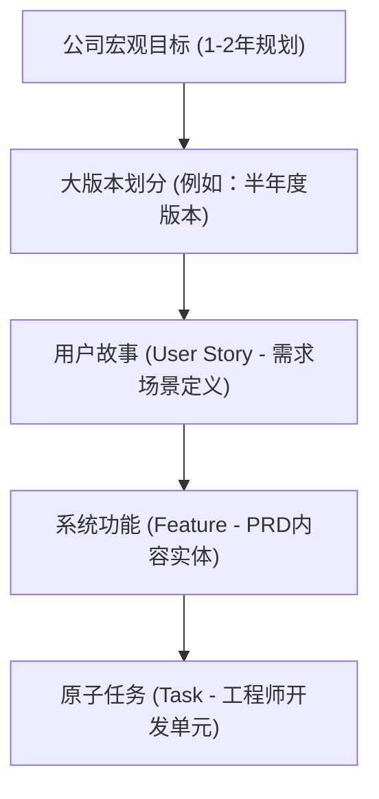
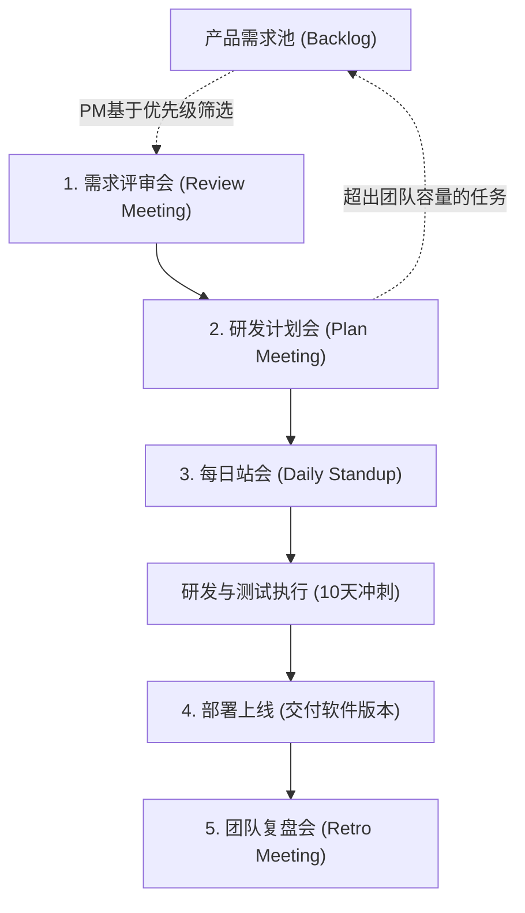

# 1. 传统瀑布流与敏捷迭代的演进

在互联网产品的生命周期管理中，研发流程经历了从“瀑布流方式”到“敏捷迭代（Scrum）”的演进。

## 1.1 瀑布流开发模式 (Waterfall Model)
在传统的软件工程中，产品发布通常遵循年度或跨年度的开发周期。
* **特点**：长周期发布（如操作系统、大型单机游戏等），用户在一年甚至数年内无法使用新功能。
* **弊端**：前期需要进行极其充分的市场调研以预测用户反应，一旦判断失误，整年的研发资源便付诸东流。

## 1.2 敏捷迭代模式 (Scrum)
随着互联网和移动应用商店（App Store）等分发渠道的发展，软件的分发与更新变得极为便捷。
* **特点**：快、小。快速向市场交付功能并根据用户反馈迅速调整，这与《精益创业》中倡导的 MVP（最小可行性产品）闭环高度契合。
* **开发资源与功能规模的平衡**：
  * 在团队人力有限的约束下，**迭代速度越快，单次交付的功能规模就越小**。例如两周一个版本，交付的功能点较少；如果放慢节奏至两个月一版，则可交付更多功能。
  * **三维扩展模型**：若要同时满足“快交付”与“多功能”的需求，企业必须进行横向的人力团队扩展。通过增加并行团队的数量（引入人力资源轴），使交付规模从传统的“速度-功能”二维平面扩展为“速度-功能-人力”的三维立方体。

---

# 2. 互联网需求的分层体系

在敏捷管理中，企业宏观大目标会被逐步拆解为工程师日常的原子开发任务，形成如下的金字塔式级联关系：

## 2.1 公司目标 (Goal)
公司制定的一至两年期的宏观战略发展目标。例如：“达到一亿活跃用户”或“成为国内最大的垂直社交平台”。

## 2.2 大版本 (Version)
为达成宏观目标而规划的阶段性战役，通常以半年度为单位进行迭代打磨（如版本一、版本二、版本三等）。

## 2.3 用户故事 (User Story)
用户故事是被整理过的业务需求场景，描述用户为了达成某种目的而需要发生的一系列操作行为。
* **示例**：在社区产品中，“支持 KOL 发布图文内容”、“支持普通用户发布短视频”、“支持商家开店售货”都是独立的用户故事。
* **归属**：用户故事池由产品经理统一管理。

## 2.4 系统功能 (Feature)
产品经理通过编写 PRD，将用户故事拆解为具体的产品功能。
* **示例**：为了满足“发布图文内容”这一 Story，产品经理需要规划出“上传相册图片”、“调用摄像头拍照”、“图片加标签”、“输入正文文本”、“添加地理位置”以及“艾特好友”等多个 Feature。

## 2.5 原子任务 (Task)
在研发计划会上，研发团队将 Feature 进一步拆解为技术实现层面的原子任务。
* **示例**：为了实现“上传图片”这一 Feature，工程师需要将其拆解为“读取用户相册权限”、“图片本地压缩”、“图片安全检测（防黄防非）”、“裁切与排序”等 Task。甚至可以细分为“支持 iOS 相册上传”与“支持 Android 相册上传”等子 Task。
* **管理原则**：每个 Task 必须有明确的负责人（Owner），并评估其所需花费的**点数（Point，相当于“人日”）**。每个 Task 的工作量建议控制在 **1-2 人日**以内，以便于监督、检查与及时调整。

---

# 3. Scrum 敏捷迭代生命周期与核心会议

一个典型的敏捷迭代期（称为 **Sprint**，直译为冲刺）通常为**两周**。在 MVP 快速验证阶段可缩短至一周，而在成熟软件或大功能开发时可延长至三周。

## 3.1 产品需求池 (Backlog)
产品经理收集到的所有业务需求、技术优化、缺陷修复等任务清单。
* **管理模式**：产品经理负责整理并细化这些 Backlog，将其场景化为一个个 Story，并排定优先级（P0/P1/P2...）。

## 3.2 Scrum 的五大核心会议

### 1. 需求评审会 (Review Meeting)
* **时机**：Sprint 的第一天。
* **内容**：产品经理从 Backlog 中挑选出优先级最高的若干个 Story（例如两周内预计能完成的 10 个需求），向全团队解读 PRD。全体成员共同理解并统一业务认知。

### 2. 研发计划会 (Plan Meeting)
* **时机**：需求评审完毕后紧接着召开。
* **内容**：研发团队根据 PRD 拆解 Feature 为 Task，进行点数评估与任务分配。
* **容量计算**：研发 Leader 计算团队的总工作量容量（Capacity）。例如：5 名研发工程师在 10 天的 Sprint 中，总容量为 50 人日。如果拆解出的 Task 总工作量超过 50 人日，研发 Leader 与产品经理协商，将多余的 Feature 退回到 Backlog 中，确保 Sprint 承诺的合理性。

### 3. 每日站会 (Daily Standup Meeting)
* **时机**：Sprint 中每个工作日的清晨，持续约 10 分钟。
* **内容**：团队成员站立开会，快速同步三个核心问题：昨天完成了什么 Task？今天计划做什么 Task？目前遇到了什么阻碍（Blocker）？通过高效的信息同步，确保问题在 24 小时内得到响应和解决。

### 4. 团队复盘会 (Retrospective Meeting)
* **时机**：Sprint 结束后（通常每 1-3 个迭代召开一次）。
* **内容**：不讨论具体的业务功能，而是对团队协作流程进行复盘。总结“做得好的地方”与“做得不好的地方”，并明确改善的具体行动点，以此凝聚团队战斗力。

### 5. 预评审会 (Pre-review Meeting)
* **适用场景**：对于架构复杂、涉及多方中台技术协调的产品需求。
* **内容**：产品经理提前邀请 Tech Leader 及架构专家对 PRD 进行小范围预审，评估技术可行性，避免在正式评审会上因为复杂的技术死锁或底层架构冲突导致会议陷入僵局。

---

# 4. 本地开发与生产落地注意事项

在敏捷流程落地及团队工程化管理中，应当遵循以下生产考量：
* **团队容量与资源锁死防范**：合理规划 Sprint 容量。必须在资源评估中为“紧急线上 Bug 修复”及“技术债务偿还”留出 10%-20% 的缓冲水位，防止团队资源在 Sprint 中期因意外情况陷入全线锁死，导致承诺的迭代目标跳票。
* **原子 Task 的生命周期跟踪**：必须确保每一个拆解后的 Task 都有且仅有一个确定的负责人（Owner）。所有 Task 均需挂载在看板工具中进行卡片状态流转。任务粒度保持在 1-2 天，严禁将一个耗时一周以上的庞大任务作为单一卡片挂载，以防进度黑盒。
* **研发分支与交付质量的隔离**：每次 Sprint 的上线对应一个软件小版本交付。在技术设计中，应当采用 Feature Branch 分支管理模式开发，并在上线前将其合并至 Release 分支。通过 Feature Flag（功能开关）等生产控制手段，确保未完成或未过审的功能即使合入主干也不会影响生产环境的稳定性。
* **双披萨团队 (Two-Pizza Team) 的模块化隔离**：遵循亚马逊倡导的 12 人以内小团队原则。在一个大产品线中，通过将系统拆分为若干独立的业务模块，让每个“双披萨团队”独立承包一个模块的交付，最大化减少跨团队的日常沟通摩擦成本。

---

# 5. 核心概念与术语速查小结 (Cheat Sheet)

| 核心术语 | 工程与管理作用 | 归属/负责人 | 核心特征与标准 |
| :--- | :--- | :--- | :--- |
| **Sprint** | 冲刺周期，是软件持续集成和持续交付（CI/CD）的敏捷容器。 | 全体敏捷小队 | 通常为 2 周（MVP 阶段可为 1 周） |
| **Backlog** | 待办需求池，以 User Story 为单位承载业务诉求。 | 产品经理 (PM) | 按 P0/P1/P2 排定优先级，持续动态调整 |
| **User Story** | 用户故事，代表一个从用户视角触发的完整需求场景。 | 产品经理 (PM) | 面向业务流程，在评审会（Review）上宣讲 |
| **Feature** | 系统功能，是 PRD 中的细化功能清单。 | 产品经理 (PM) | 在研发计划会上作为 Task 拆解的直接依据 |
| **Task** | 原子任务，是开发实现层面的最细颗粒度单元。 | 研发工程师 (Dev) | 具有唯一负责人，容量估算通常为 1-2 人日 |
| **Capacity** | 团队的生产力容量，用于计算 Sprint 能承载的任务量。 | 研发 Leader | 研发人数 * Sprint 实际工作天数 |
| **Daily Standup** | 每日站会，同步任务状态、暴露技术阻碍的短会。 | 全体敏捷小队 | 每日晨间站立进行，时间严格控制在 10 分钟内 |
| **Retro Meeting** | 回顾复盘会，优化流程以达成持续改进（Kaizen）。 | 全体敏捷小队 | 总结痛点与优势，输出并跟踪改进项 |
| **Two-Pizza Team** | 双披萨团队，亚马逊推行的高效、自治型独立团队规模。 | 团队负责人 | 规模在 6-12 人之间（通常包含开发、QA与PM） |
