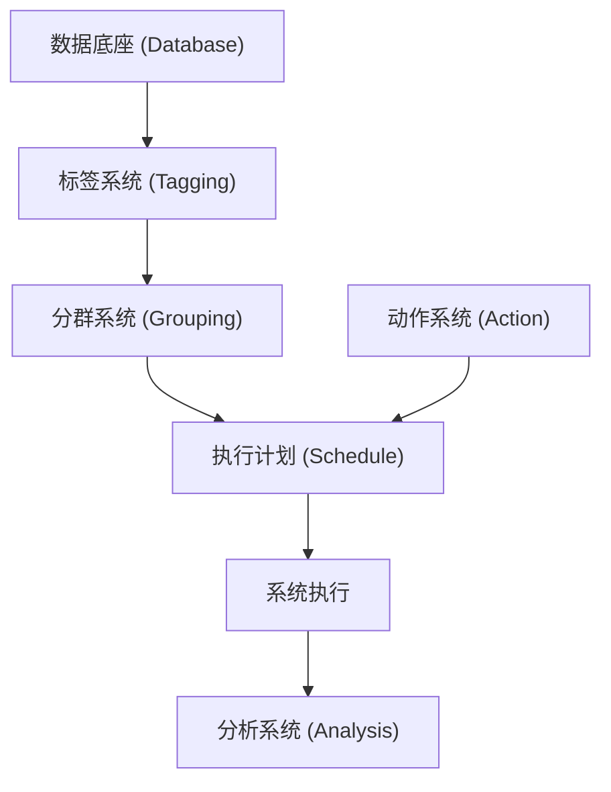

# 1. CRM系统概述与定位
CRM（客户关系管理）系统的核心目的在于管理好企业与客户的关系。在企业架构中，CRM系统属于企业用户运营战略的执行系统，是将运营战略转化为自动化、常态化触达的工程载体。

# 2. CRM系统核心架构设计
要构建一套完善的CRM系统，从技术到业务需要具备以下分层与模块：

## 2.1 数据底座 (Database)
数据底座是整个系统的基础，存储并掌握用户的所有基础属性、行为日志与交易数据。所有上层标签计算与画像分析均依赖该底层数据库。

## 2.2 标签系统 (Tagging)
- **定位**：对用户打标（Tagging）。标签应当是单维度的，且越简单越好用，应当避免将标签本身的计算逻辑设计得过于复杂。
- **标签属性示例**：最近一次下单天数、注册日期、性别、累计为公司创造的营收等。

## 2.3 分群系统 (Grouping)
- **定位**：分群（Grouping）是对多个单维度标签的组合使用。
- **组合示例**：筛选出“最近30天内下过单”且“性别为女性”且“购买过宠物用品”的用户群。
- **更新频率分类**：
  - **固定分群（静态快照型）**：在分群创建那一刻锁定用户名单，适合历史对比和静态统计。
  - **周期更新分群**：按固定周期（如每天凌晨、每周一）重新计算更新名单。计算压力小，能满足80%的常规运营场景。
  - **实时分群**：通过实时标签和行为事件触发计算（例如：“过去一分钟内打开App但未下单”的用户），系统能够瞬间捕获并对其进行干预（如实时下发Push），在用户认知最强烈时完成触达。

## 2.4 动作系统 (Action)
动作（Action）定义了“系统如何执行一件事”。动作的配置与具体的受众用户无关，它是独立的执行单元。动作由三部分相加组合而成：
1. **营销工具 (Tools)**：具体用来执行动作的营销功能，例如抽奖工具、秒杀工具、发券工具、发积分工具、MGM（Member Get Member，老带新/裂变）工具等。
2. **优惠策略 (Promotion)**：决定动作执行时的折扣与策略，如满100减50、无门槛5元券、赠送500积分等。
3. **触达渠道 (Channel)**：将营销内容推送给用户的通路，如短信、App Push、电子邮件、微信消息、公众号推送等。

$$\text{动作 (Action)} = \text{营销工具 (Tools)} + \text{优惠策略 (Promotion)} + \text{触达渠道 (Channel)}$$

## 2.5 执行计划 (Schedule)
- **定位**：执行计划（Schedule）是将 **受众分群 (Grouping)** 与 **动作 (Action)** 进行匹配绑定的策略级。
- **策略冲突排队（Slot优先级机制）**：
  当一个用户同时命中了多个执行计划（A、B、C）时，系统需要提供以下调度能力以防策略冲突：
  - **并记模式**：允许用户同时享受A、B、C三个计划的优惠（公司营销成本较高，但触达力度大）。
  - **顺序/互斥模式**：对执行计划进行Slot排序，用户一旦命中高优先级计划（如A），即终止后续计划（B、C）的下发，避免过度打扰。

### 运营实战：防流失执行计划 (Schedule) 示例

| 目标与执行计划名称 | 受众用户分组 (Group) | 优惠干预动作 (Action) | 触达通道 (Channel) | 策略设计逻辑 |
| :--- | :--- | :--- | :--- | :--- |
| **重度流失挽回计划** | 注册且最近一次下单天数 > 30天 | 无门槛5元券 | 短信 + App Push | 重度挽回，折扣力度最大，采用强触达通道（短信） |
| **轻度流失促活计划** | 最近一次下单天数在 14~30 天之间 | 满20减3元券 | App Push | 预防流失，折扣力度中等，以防流失干预为主 |
| **日常活跃关怀计划** | 最近一次下单天数在 7~14 天之间 | 丰富品类优惠券（低额） | App Push | 活跃维持，券额度低但品类多，促进跨品类消费 |

### 运营实战：GMV提升与老带新执行计划 示例
- **宠物品类GMV提升计划**：
  - **受众分组**：购买过宠物用品的用户。
  - **动作组合**：结合特价秒杀与满减策略，推送高转化商品。
- **MGM老带新计划 (Member Get Member)**：
  - **受众分组**：高忠诚度用户（如最近30天内下单数 $\ge 5$ 次）。
  - **动作组合**：提供裂变分享工具，当其成功邀请新用户下单时，获取积分或高额券奖励。

## 2.6 分析系统 (Analysis)
CRM系统的最后一环是效果评估与分析系统，涵盖：
1. **分群画像分析**：了解所选人群的用户画像和属性特征。
2. **动作效果对比**：分析某一Action在不同Groups中的效果，确认其普适价值（如验证MGM机制是否比直接发券更有用）。
3. **计划数据表现**：综合评估各个运营计划（如防流失计划、宠物品类计划）的整体运营结果。
4. **自动化A/B测试分析**：
   - 自动将一个Group按比例划分，例如：组一 (10%对照组/观察组，不做干预)、组二 (30%)、组三 (50%)、组四 (10%)。
   - 对不同的实验组执行不同的 Action，最终在报表端直观对比每用户平均GMV（ARPU）等指标的提升幅度（Uplift）。
   - *案例对照*：若策略三下人均GMV提升5元，但对照观察组同样提升5元，则说明策略三无效（大盘自然波动导致）；若策略二提升20元，则说明策略二有显著的干预效果。

---

# 3. 本地开发与生产落地注意事项
- **实时标签引擎选型**：引入实时标签（如用户浏览未下单瞬间触发Push）会极大增加系统的并发与流式计算压力。生产落地时需根据业务体量评估是否引入 Flink 等流处理框架，中小团队可先采用周期性跑批更新（日/周）以节省计算成本。
- **Slot路由与互斥并发设计**：执行计划（Schedule）的并发控制是核心技术难点。在分布式架构中下发Push时，必须设计合理的分布式锁与Slot优先级路由算法，避免高并发下多条策略同时命中同一用户，导致严重的预算超支或重复推送骚扰。
- **对照组（Control Group）的业务价值**：在落地分析系统时，必须在机制上强制或强烈建议保留不作干预的“空白对照组”，以此剔除大盘自然波动对运营效果的影响，确保Uplift数据的真实有效性。

---

# 4. 核心概念与速查小结 (Cheat Sheet)

| 核心参数/组件 | 概念/属性定位 | 工程作用 | 落地要点 |
| :--- | :--- | :--- | :--- |
| **Tagging** | 单维度标签 | 用户基础画像切片，属性输入 | 越简单越好，避免单标签计算过重 |
| **Grouping** | 标签组合分群 | 筛选高精度营销受众 | 可分为固定/周期/实时更新三种类型 |
| **Tools** | 营销工具组件 | 执行营销行为的载体工具 | 包括优惠券、秒杀、拼团、MGM裂变工具等 |
| **Promotion** | 折扣策略配置 | 定义运营核销成本与额度 | 配置满减、无门槛、加倍积分等促销策略 |
| **Channel** | 触达渠道组件 | 用户触达的物理通路 | 包括短信、APP Push、微信公众号、邮件等 |
| **Schedule** | 执行计划/策略级 | 绑定人群和动作，管理策略分发 | 需设计Slot优先级调度以处理路由互斥与并记 |
| **A/B Test Split** | 分流比例参数 | 衡量运营效果，评估真实提升 | 必须预留空白对照组（Control Group）进行对比 |
