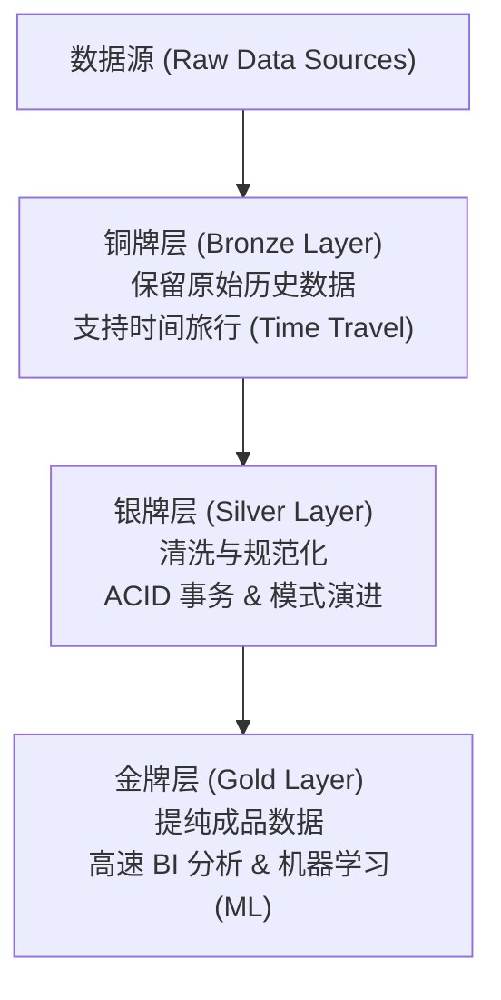

# 数仓不断进化：数据架构新形态

## 1. 数据架构的演变背景

随着企业数字化转型的深入，数据平台面临着双重核心需求的挑战：**现代商业智能（BI）**的高速报表分析，以及**机器学习（ML）/数据科学**的深度模型训练。

传统的数据平台架构通常由数据仓库和数据湖分别支撑这两类需求，但这带来了高昂的存储成本与严重的数据孤岛、数据不一致问题。
*   **数仓太贵**：传统的商业数据仓库虽然整洁，但随着数据量增长，其扩展和计算存储费用极高。
*   **湖太乱**：为了降低成本而构建的数据湖，若缺乏治理，极易变成杂乱无章、难以加工利用的“数据沼泽”。
为了解决上述痛点，**湖仓一体（Lakehouse）**架构应运而生，成为了现代统一数据平台演进的确定性方向。

---

## 2. 数据仓库与数据湖对比

为了理解湖仓一体，首先需要厘清数据仓库与数据湖这两个经典技术方案的核心差异。

*   **数据仓库 (Data Warehouse)**：
    *   *比喻*：高档、整洁的**数据超市**。
    *   *特征*：货架上的所有商品（数据）都经过了清洗、处理、打包，随时可以开箱即用。
    *   *结构定义*：**写入时定义 (Schema-on-Write)**。在数据存入数据库前，就必须定义好表结构和条条框框，从而保证了极高的数据质量，但牺牲了灵活性。
*   **数据湖 (Data Lake)**：
    *   *比喻*：巨大的**原材料仓库**。
    *   *特征*：无论是什么形态的原始数据，都可以直接“一股脑”先存进去，具有极高的灵活性。
    *   *结构定义*：**读取时定义 (Schema-on-Read)**。数据先存了再说，用的时候再根据需要定义结构。这导致数据检索、加工需要耗费大量人工，非常繁琐。

### 核心对比维度表格

| 对比维度 | 数据仓库 (Data Warehouse) | 数据湖 (Data Lake) | 湖仓一体 (Lakehouse) |
| :--- | :--- | :--- | :--- |
| **形象比喻** | 数据超市 | 原材料仓库 | 现代智能化仓储一体化平台 |
| **结构定义时机** | **写入时定义 (Schema-on-Write)** | **读取时定义 (Schema-on-Read)** | 写入时控制与读取时演进结合 |
| **数据质量** | 高（强制约束） | 低（无序堆放） | 高（ACID事务与模式约束） |
| **灵活性** | 低 | 高 | 高 |
| **存储成本 (以100TB为例)** | 较高（基准成本） | **便宜 60% 至 80%** | **便宜 60% 至 80%**（与数据湖相当） |
| **主要应用场景** | 传统 BI 报表、多维分析 | 数据科学、机器学习原始存储 | 统一 BI 报表与机器学习/数据科学 |

---

## 3. 湖仓一体（Lakehouse）的底层实现

湖仓一体的核心思想是：**将数据湖的低成本存储优势，与数据仓库强大的数据管理能力（尤其是保证数据绝对可靠的 ACID 事务特性）完美结合。**

### 3.1 奖牌架构 (Medallion Architecture)
在底层实现上，湖仓一体通常采用巧妙的三层渐进式结构对数据进行提纯和优化：

1.  **铜牌层 (Bronze Layer / Raw)**：
    *   *功能*：直接接入并保留所有最原始的历史数据。
    *   *超能力*：支持**时间旅行 (Time Travel)** 功能，可随时回溯到历史任一时间节点查看当时的数据状态。
2.  **银牌层 (Silver Layer / Cleansed)**：
    *   *功能*：对铜牌层数据进行清洗、转换和结构化。
    *   *超能力*：提供 **ACID 事务** 保证，并支持**模式演进 (Schema Evolution)**，使得数据结构随着业务变化自动安全适配，兼顾数据质量与易用性。
3.  **金牌层 (Gold Layer / Curated)**：
    *   *功能*：经过高度汇总、提纯的业务成品数据。
    *   *超能力*：针对性能进行了极致优化，随时可用于高速的 BI 分析报表展现以及机器学习模型训练。

### 3.2 开放表格式 (Open Table Format)
湖仓一体之所以能在普通的文件系统（如 HDFS、S3 等对象存储）之上实现类似数据库的数据管理能力，核心秘密武器在于**开放表格式**。
这是一种开源的魔法层，在原始存储文件之上构建了元数据索引和事务日志。

#### 四大主流开放表格式对比
1.  **Delta Lake**：在 Apache Spark 生态中支持最成熟，商业化支持强，底层与 Spark 的计算引擎深度绑定优化。
2.  **Apache Iceberg**：以出色的**跨计算引擎能力**而闻名，对 Spark、Flink、Trino、Presto 都有良好的中立支持，是当前很多大型企业建设中立数据平台的首选。
3.  **Apache Hudi**：以高效的 Upsert/Delete（更新与删除）写操作见长，适用于近实时数据流读写场景。
4.  **Apache Paimon** / **Hive ACID**：在流式计算（如 Flink）或特定历史遗留数仓升级中占有一席之地。

---

## 4. 业务选型决策指南

企业在面对底层数据架构选择时，可以通过以下两个核心问题进行清晰的评估：

### 问题 1：你的数据长什么样（数据形态）？
*   **结构化数据为主**：数据来源单一，格式固定且干干净净。
    *   *决策*：一个传统的**数据仓库**通常即可满足需求。
*   **多源异构数据混合**：包含结构化、半结构化（JSON 等），以及非结构化数据（图片、长文本、音频等）。
    *   *决策*：必须采用**湖仓一体**架构以统一存储和管理。

### 问题 2：你的业务目标想用这些数据做什么？
*   **纯传统商业智能分析**：目标仅为拉取静态财务/报表分析、历史BI数据呈现。
    *   *决策*：**数据仓库**依然是非常成熟且强力的选择。
    *   **BI 与 ML 复合需求**：业务既需要做传统报表展示，又需要开展数据科学实验与机器学习模型训练。
    *   *决策*：**湖仓一体**平台是唯一理想之选，能有效防止数据在湖与仓之间搬运导致的“数据孤岛”和“数据不一致”问题。

> [!NOTE]
> 行业共识已非常明确：预计到 2026 年，企业将不再纠结“选数仓还是选数据湖”，而会将核心讨论转移至“何时迁移到湖仓一体”。

---

## 5. 本地开发与生产落地注意事项

*   **Schema 设计策略（写入时 vs 读取时）**：
    在实际落地中，选择 Schema-on-Write 还是 Schema-on-Read 必须结合业务变化的频率。高频变化的非结构化数据强行要求 Schema-on-Write 会导致上游数据对接频繁中断。
*   **ACID 事务与时间旅行 (Time Travel) 的存储代价**：
    虽然开放表格式（如 Delta Lake、Iceberg）提供了强大的时间旅行和 ACID 事务，但其底层通过保存多个历史版本的数据文件和元数据快照来实现。如果不定期进行垃圾回收（如 Spark 中的 `VACUUM` 命令），会导致底层存储空间急剧膨胀，存储成本优势被抵消。
*   **开放表格式的生态系统兼容性选择**：
    在多计算引擎（如 Spark、Flink、Trino、Presto 混合使用）的生产环境中，应优先选择 Apache Iceberg 等跨引擎能力强、标准开放的表格式，避免被单一引擎（如 Delta Lake 与 Spark 的高度绑定）深度绑定。

---

## 6. 数据架构核心参数与概念速查小结 (Cheat Sheet)

| 架构形态/关键技术 | 存储机制与成本 | 核心特性 | 工程作用与检索说明 |
| :--- | :--- | :--- | :--- |
| **数据仓库 (Warehouse)** | 高昂专有存储 (写入时定义) | 高质量、高性能、低灵活性 | 用于高一致性的静态财务报表与核心 BI 分析。 |
| **数据湖 (Data Lake)** | 便宜 60%-80% (读取时定义) | 高灵活性、零事务、容易失控 | 用于存储低频访问的原始日志、海量多媒体文件。 |
| **湖仓一体 (Lakehouse)** | 便宜 60%-80% (基于湖存储) | **ACID 事务、时间旅行、模式演进** | 统一数据底座，消除湖仓搬运，兼顾 BI 与 ML。 |
| **Delta Lake** | 文件 + Delta Log | Spark生态高度优化 | Spark 为核心引擎的企业首选开放表格式。 |
| **Apache Iceberg** | 元数据 Manifest 结构 | **中立跨引擎支持 (Spark/Flink/Trino)** | 混合引擎计算、去中心化数据架构平台的首选。 |
| **Apache Hudi** | 文件 + Timeline 索引 | 快速 Upsert/Delete 写入 | 适用于需要快速进行行级数据增量更新的流式场景。 |
| **奖牌架构 (Medallion)** | Bronze $\rightarrow$ Silver $\rightarrow$ Gold | 数据提纯管道 | 规范湖仓一体内部数据处理阶段的标准流向设计。 |
