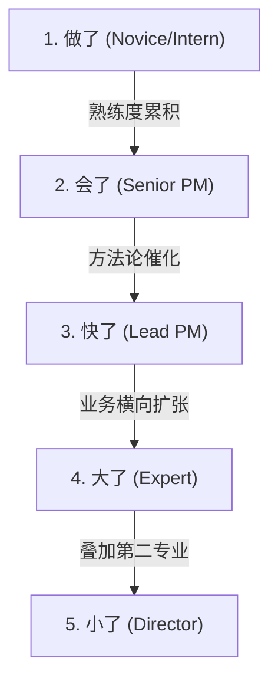
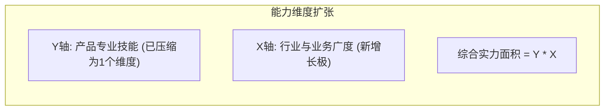

# 1. 产品经理职业发展的五个阶段
产品经理（及产品运营）的职业发展是一个纵向提升与横向跨界的过程。从刚入行的小白到高级、资深、专家，再到总监级别，其核心能力演变和面临的挑战可以抽象为五个关键成长阶段：“做了”、“会了”、“快了”、“大了”、“小了”。

---

# 2. 五大成长阶段详解

## 2.1 第一阶段：做了 (Novice/Intern)
- **对应职级**：小白阶段、实习生、应届毕业生。
- **现状与痛点**：对产品经理和产品运营工作的全貌缺乏认知，对具体工作一知半解。每天都会面对全新的工作挑战，难以判断自身接下来的职业走向与高度。
- **提升策略 (累积法)**：
  - 建立属于自己的“技能列表”（Skill List），每日记录并学习新的事务。
  - 在这个阶段必须保持耐心，通过重复基础工作逐步培养工作的熟练度。
- **核心执行任务**：
  - 数据分析（学习使用数据报表系统、分析工具，理解基础分析理论）。
  - UAT测试（功能及软件测试）。
  - 编写微小功能PRD（主要用于修复Bug、优化细节）。
  - 部署A/B测试。
  - 学习撰写高质量的工作周报。

## 2.2 第二阶段：会了 (Senior PM)
- **对应职级**：高级产品经理 / 高级产品运营。
- **现状与痛点**：从“做过几次”上升到“真正会做”。在互联网招聘中，对应着从“了解某项工作”向“掌握/精通该项工作”的跨越。
- **提升策略 (矩阵化)**：
  - 将单维度的技能列表纵向与横向延伸，演变成“二维技能矩阵”。
  - 深入掌握核心任务的子技能。以写PRD为例，其下包含：埋点设计、状态图绘制、交互设计说明等多个子技能。
  - 不断滚大知识密度，扩大自身的技能图谱。

| 核心维度 | 子技能/要求 | 从“做过”到“会做”的标准 |
| :--- | :--- | :--- |
| **PRD撰写** | 埋点设计、状态图绘制、业务流程梳理 | 能够独立输出逻辑闭环、无边界遗漏的需求文档 |
| **数据分析** | AB测试部署、漏斗分析、归因分析 | 能够自主发现异常数据并下钻定位问题根因 |
| **项目管理** | 沟通协调、进度控制、UAT验收测试 | 能够独立推进中小型项目按时上线 |

## 2.3 第三阶段：快了 (Lead PM)
- **对应职级**：资深产品经理 / 资深产品运营。
- **现状与痛点**：与高级阶段相比，核心差异在于能够以更快的速度、更高的质量完成相同的事情。
- **提升策略 (方法论催化)**：
  - 技能结构从二维矩阵升级为“三维立体结构”。
  - **引入方法论作为催化剂**：将工作时间的比例进行调整。从初期的“80%时间做事情，20%时间写周报时才思考”，调整为“60%时间思考原则与方法论，40%时间具体执行”。
  - **借假修真**：不盲目空想，必须在日常工作中寻找锻炼机会，通过解决实际业务问题来沉淀和修正自身的方法论。

## 2.4 第四阶段：大了 (Expert)
- **对应职级**：产品专家。
- **“大”的两层含义**：
  1. **管辖范围变大 (Scope)**：开始带领团队，负责的范围从单一产品线扩展到两三个产品，甚至管理整个产品家族（Product Family）。
  2. **发展方向变大 (横向业务开拓)**：纯粹的产品设计技能提升曲线在此阶段会逐渐变缓。此时需将三维的产品能力压缩为Y轴，横向开拓X轴，即“业务与行业”（Business & Industry）。
- **能力乘数效应**：
  - 了解更多、更深的主流业务逻辑（例如：不仅清楚投放系统如何对接，更明白市场部做素材、做广告投放决策的底层商业逻辑）。
  - 产品专业技能与业务深度的乘积面积，决定了产品专家的综合实力。
    $$\text{综合实力} = \text{产品专业技能} \times \text{业务与行业广度}$$

## 2.5 第五阶段：小了 (Director)
- **对应职级**：产品总监 / 资深专家及以上。
- **现状与痛点**：
  - **性价比变小**：虽然能力仍在增长，但相比于高额的薪资成本，能力增速已经变慢；后辈年轻人的追赶速度极快。
  - 这种性价比的降低是产生“33岁/35岁职场焦虑”的底层原因。
- **提升策略 (第二专业叠加)**：
  - 职业焦虑通常出现在个人发展曲线进入瓶颈期。必须在瓶颈到来前1~2年提前做好求变准备。
  - 主动学习并叠加“第二专业”（如产品转运营、运营转产品/市场/商务等），以契合时代与公司发展的新需求。
  - 通过第二专业的学习，开启第二条能力增长曲线，新老能力叠加从而大幅度推高个人的商业综合实力，重新恢复高性价比优势。

---

# 3. 本地开发与生产落地注意事项
- **数字化团队技能矩阵映射**：在专家或总监级进行团队管理时，应对团队成员建立数字化的能力矩阵模型，针对性分配任务。例如将探索性项目分配给具备“方法论”沉淀的资深PM，将执行类BUG修复交由初级PM，实现人效比最大化。
- **以方法论指导数据闭环**：在推进业务研发时，资深PM需主导“数据底座”的指标设计。任何产品功能的上线，必须伴随数据归因与AB测试体系的闭环，以方法论指导数据，以数据验证方法。
- **提前布局第二专业规避转型锁死**：PM在转型第二专业（如学习商务或市场）时，需防范“空转”风险，需结合现有产品线找寻跨部门轮岗或联合项目的切入点，避免因无实际业务场景导致转型失败和职业锁死。

---

# 4. 核心阶段与提升建议速查 (Cheat Sheet)

| 成长阶段 | 对应职级 | 核心阶段标志与能力特征 | 破局与提升动作建议 |
| :--- | :--- | :--- | :--- |
| **1. 做了** | 初级/应届/实习 | 应对日常具体挑战，缺乏全局视角 | 建立个人技能清单，重复执行以培养熟练度与耐心 |
| **2. 会了** | 高级产品经理 | 从做过到会做，形成二维技能矩阵 | 拆解子技能（如埋点、状态机），沉淀深度知识 |
| **3. 快了** | 资深产品经理 | 引入方法论，做事效率与品质大幅提升 | 调整时间比例（60%思考/40%执行），提炼方法论 |
| **4. 大了** | 产品专家 | 范围变大，横向理解业务与行业决策 | 将产品力转为Y轴，横向学习业务决策，做乘法 |
| **5. 小了** | 产品总监/资深专家 | 增长放缓，性价比降低，产生职业焦虑 | 提前1-2年布局第二专业（转商务/运营等），叠起双曲线 |
