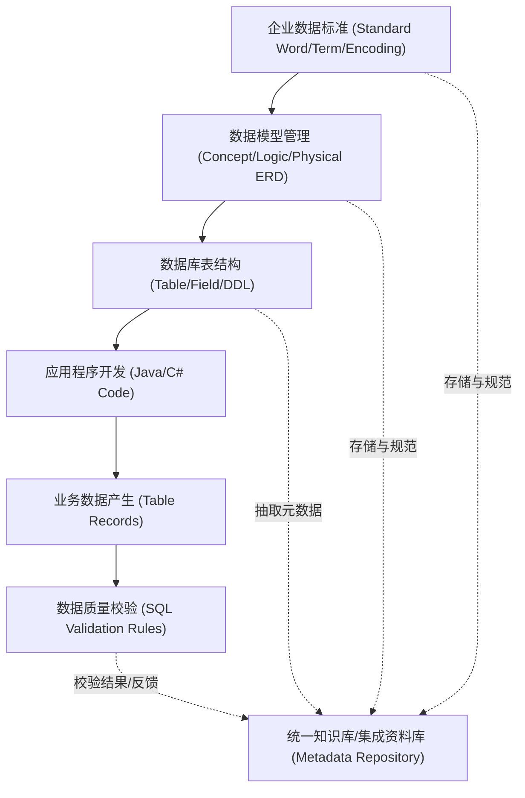
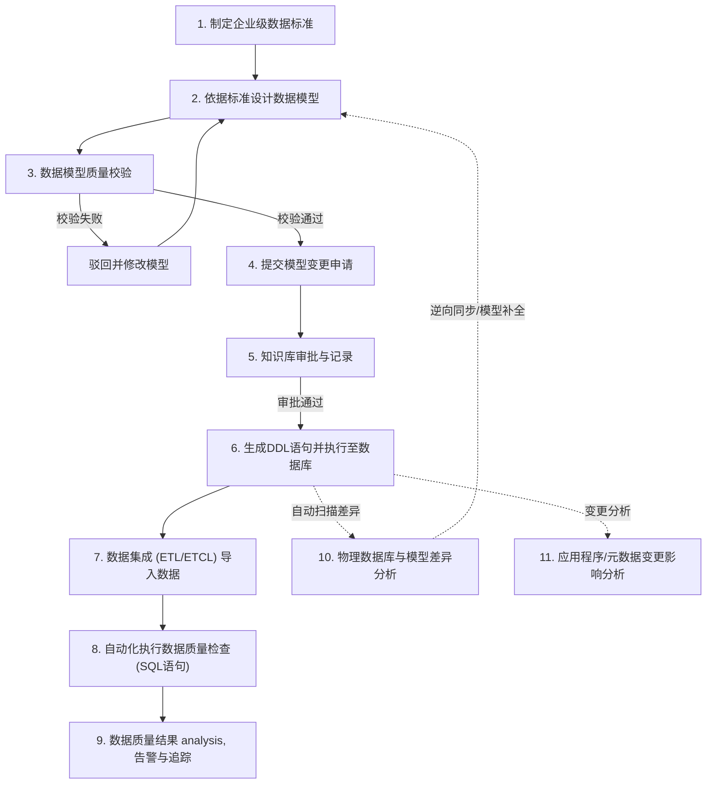
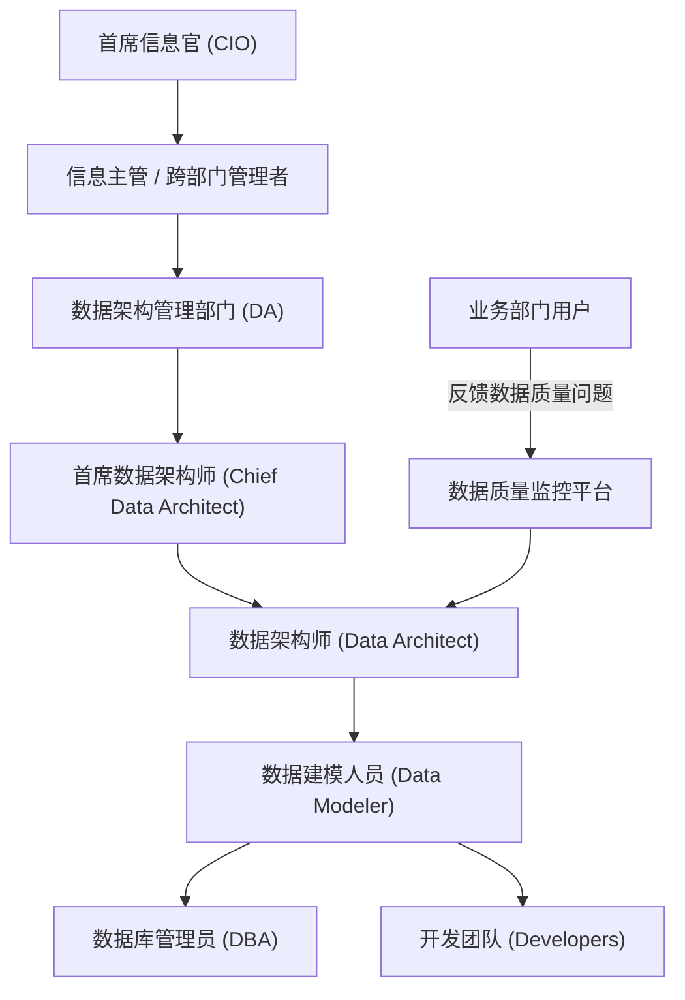

# 数据治理基本概念与标准质量体系

## 1. 课程概述与系统定位

在企业级IT系统建设中，数据治理与数据仓库模型设计处于宏观规划与管控的顶层地位。

### 1.1 课程结构与讲师分工
本课程整体分为两部分：
*   **前五周（第1周至第5周）**：由孙斌老师负责，主要讲解数据治理的方法论、管理流程体系、技术模块及平台落地实施。
*   **后半部分（第6周至第10周）**：由郑宝卫博士负责，主要讲解数据仓库模型设计的逻辑与物理模型设计方法。

### 1.2 数据治理与模型设计在IT系统中的地位
数据治理并不是负责具体业务功能模块的编码实现，而是站在整个企业或大型系统的宏观视角，进行数据规划与管理。
*   **全局覆盖**：数据治理面向企业内所有的IT系统，负责定义数据标准、数据规则、构建管理组织体系、设计流程审批机制，并管理数据从设计、产生、应用、质量校验直至消亡的全生命周期。
*   **逆向推导的弊端**：在传统系统开发中，许多开发团队跳过模型设计直接编码，或者在数据库结构频繁变更上线后，为了补全概要设计/详细设计文档，从数据库表结构逆向生成ER关系图（ERD）。这种“反推的模型”仅是应付文档的摆设，失去了模型指导业务与规范数据库设计的实际意义。
*   **大数据的热潮推动**：近年来，随着国家大数据中心及大数据平台建设的兴起，跨系统的数据整合与共享需求剧增。在大数据平台建设中，数据仓库的升级不仅需要存储更多海量数据，更需要规范的数据模型设计和配套的变更管理流程，以元数据、数据质量、数据标准为代表的宏观资产管理技术成为核心基础。

---

## 2. 数据治理的核心概念与定义

### 2.1 什么是数据治理
**数据治理（Data Governance）**：由企业的数据治理部门发起并推行的，关于如何制定和实施对整个企业内部数据的商业应用和技术管理的一系列政策 and 流程。
数据治理是一个**持续改善**的机制，旨在发现当前的数据现状问题，通过各项技术细节实施解决并消除数据问题，进而预防未来问题的产生。

### 2.2 知识库/集成资料库（Repository）的作用
在数据治理的技术体系中，元数据管理、数据质量管理、数据标准管理等模块可以通过同一个**知识库/集成资料库**打通。
*   **底层共享**：所有元数据、标准和质量规则信息共同存储于同一个集成数据库中。
*   **自动校验**：在设计数据模型或检查数据模型设计时，可以直接调用知识库中存储的企业标准进行自动比对校验。

### 2.3 核心术语概念对照

| 术语名称 | 概念解释与工程作用 | 课程关联章节 |
| :--- | :--- | :--- |
| **元数据 (Metadata)** | 描述数据的数据。记录企业数据标准、模型、表结构及环境的描述性信息。 | 第五课详解 |
| **主数据 (Master Data)** | 跨系统共用的核心业务对象数据（如人、财、物等关键实体），确保全局唯一。 | 本课概述 |
| **数据标准化 (Data Standardization)** | 制定企业级定制化的数据标准与规范，建立申请、变更、废止的管理流程。 | 第二课、第三课详解 |
| **数据质量 (Data Quality)** | 评估与监控数据好坏的体系，包括完整性、规范性、一致性、准确性等维度。 | 本课及后续详解 |
| **数据集成 (Data Integration)** | 对应国内通用的 ETL/ETCL 流程，负责数据的抽取、转换、清洗与加载。 | 本课概述 |
| **数据字典 (Data Dictionary)** | 数据标准化的核心产出物，作为数据标准的统一承载媒介。 | 本课及第二课详解 |

---

## 3. 核心技术模块详解

### 3.1 元数据管理 (Metadata Management)
*   **本质**：几乎所有与企业IT系统相关的描述性信息（非具体行记录值）都是元数据。
*   **管理范围**：
    *   数据标准与设计好的数据模型。
    *   数据库对象：表结构、字段、视图、存储过程、数据库作业（Jobs）等。
    *   环境与硬件信息：系统使用的服务器CPU、内存、IP地址等。
    *   应用程序源代码（如 Java, C#, C++ 等源代码）。
*   **非元数据范围**：数据库表中具体的每一行记录值（Record Value）。
*   **核心应用功能**：**变更影响度分析**。当系统数据库表结构需要改造（如修改、删除字段）时，通过元数据解析，可以自动分析出该变化会影响哪些应用程序源代码和程序模块，减少人工文本扫描的耗时与遗漏。

### 3.2 主数据管理 (Master Data Management)
*   **本质**：抽取各个业务系统之间共用的、对企业极其重要的基础信息，通常集中在“人、财、物”三个方向：
    *   **人**：如员工数据、CRM系统中的客户基本信息（手机号、证件号、住址等）。
    *   **财**：财务系统中的敏感财务金额、科目等。
    *   **物**：制造行业尤为重视的生产物料、物资、产品信息等。
*   **实施模式**：设计一个独立的主数据系统。强制要求主数据字段只能在主数据系统里登录和更新，周边系统（如财务、CRM、HR等）不再自行存储和修改主数据，而是在需要时读取主数据系统的共享数据。
*   **工程难点（伤筋动骨风险）**：主数据项目在落地时，需要对现有所有周边系统的数据库结构、接口和程序进行彻底改造，以剥离本地主数据，调用统一源头。改动工作量和风险极大，因此很多项目在启动和推行时难以落地（相较而言，自主权高、对物料精度要求严的制造企业落地成功率略高）。

### 3.3 数据标准化 (Data Standardization)
*   **本质**：基于企业现有的业务术语，制定出企业级定制化的数据标准，并定义其生命周期流程（创建、申请、审批、变更、废止），同时构建管理组织分工。
*   **典型规范缺失问题**：
    *   **同义不同名（同中文对应多英文）**：同一个中文业务含义在数据库中对应多个不同的英文字段名（如不同开发人员编写的 `cust_id`、`customer_number`、`c_no` 等）。
    *   **同名不同义（同英文对应多中文）**：同一个英文名称对应不同的中文业务含义。例如字段 `account`，在某些表中指“账户”（名词），在某些表中指“结账/结算”（动词）；或者 `number` 和 `count` 对应的中文翻译混乱无序。
*   **同义词处理**：在制定标准时，将词义相同的中文（如“起始”与“开始”）归为一组，选定其中一个作为标准用语，另一个作为非标准同义词，将来由工具对非标准用语的使用进行合规预警。

### 3.4 数据质量管理 (Data Quality Management)
数据质量的管理覆盖了数据生命周期（规划、产生、获取、共享、维护、消亡）的每一个环节。

#### 数据质量考核的六大核心维度

1.  **完整性 (Completeness)**：检查必填业务字段是否有值。
    *   *示例*：非空属性校验。
2.  **规范性 (Specification)**：检查数据值是否符合规定的格式。
    *   *示例*：用字符型 `VARCHAR` 14位存储日期时，格式必须为 `YYYYMMDDHHMMSS`。若表示小时（第9-10位）的数值出现大于23或含有字母，则不符合规范。
3.  **一致性 (Consistency)**：同一个业务对象在不同表中的字段属性和对照关系必须保持一致，如事实表对参数表的引用保持同步。
4.  **准确性 (Accuracy)**：验证数值是否符合既定的业务公式和计算逻辑。
    *   *示例*：业务表中存在列 `A`、`B`、`C`，业务规则为 $A \times B = C$。检查时需校验 $C$ 的取值是否等于 $A \times B$ 的计算结果。
5.  **唯一性 (Uniqueness)**：检查逻辑主键或数据库物理主键 the 唯一性。
    *   *示例*：某些表没有物理主键约束，而是靠后台存储过程/应用程序代码来保证联合逻辑主键的唯一性。一旦代码失效或手工数据导入，就会产生重复行，可通过唯一性作业检查排除。
6.  **及时性与关联性 (Timeliness & Association)**：在对时效性要求严格的系统中，检查数据抽取、加载的时效是否达标。
    *   *示例*：夜间从OLTP系统采集数据到OLAP数据仓库的ODS层，设定在凌晨 00:00 至 02:00 完成。若 02:01 扫描时目标表未加载完成，则视为及时性校验不达标。

---

## 4. 数据治理架构与实施流程

### 4.1 技术互通与CRUD关联
在设计完善的数据治理平台中，技术、业务与数据是环环相扣的。通过制定数据标准，约束数据模型中“实体”和“属性”的命名；物理模型通过建模工具生成 DDL 语句并一一映射执行至数据库；应用程序代码调用数据库表和字段，并在读写过程中产生业务数据，最后由数据质量模块进行规则校验。



#### SQL 规则检查示例
以小时字段规范性检查为例，以下为数据质量检查作业在后台生成并执行的 SQL 逻辑示意：

```sql
-- 检查目标表中的时间字段格式，筛选出小时部分不符合00-23规范的异常数据
SELECT 
    record_id, 
    time_char_field, 
    SUBSTR(time_char_field, 9, 2) AS hour_part
FROM 
    dw_ods_raw_table
WHERE 
    SUBSTR(time_char_field, 9, 2) NOT IN (
        '00','01','02','03','04','05','06','07','08','09','10','11',
        '12','13','14','15','16','17','18','19','20','21','22','23'
    );
```
通过统计符合规则与不符合规则的数据行数，可计算出数据质量指标的达标率。

### 4.2 整体实施流程
一个标准的数据治理项目，其宏观实施流程如下：



### 4.3 组织架构与角色职责



#### 核心角色职责说明
1.  **首席数据架构师与首席信息官 (CIO)**：负责顶层设计，商定企业级数据治理的宏观管理政策与理念。
2.  **数据架构师 (DA)**：属于企业专门的数据架构管理部门。负责全企业数据模型的统一管理与评估审批，掌握宏观全局，评估新建子系统模型的合理性。
3.  **数据建模人员 (DM)**：配备在各项目开发团队中，负责具体子系统/功能模块的物理模型与逻辑模型设计，并向 DA 部门提交模型变更与审批申请。
4.  **数据库管理员 (DBA)**：负责数据库运维，将建模人员设计好并经过 DA 审批通过的 DDL 语句执行部署到物理数据库中。
5.  **业务部门用户**：系统最终使用者，不参与标准与模型设计，但往往能在最前端直观发现数据异常，通过数据质量平台向数据架构团队反馈质量问题。

---

## 5. 本地开发与生产落地注意事项

*   **模型管理流程中的敏捷性折中（差异分析机制）**：
    在实际生产运维中，项目团队往往需要在极短时间内响应业务紧急开发需求，无法等待漫长的模型审批流。此时允许在数据库后台先行修改物理表、添加字段并发布上线。事后，必须通过数据治理平台自动扫描物理库与逻辑模型的结构差异，人工判定差异合理性，并反向同步补全模型，实现逆向维护，防止模型与物理库长期失联。
*   **主数据管理的高风险与改造成本（伤筋动骨风险）**：
    主数据系统是一项典型的“伤筋动骨”工程。它的引入伴随着业务系统的重构，要求剥离原有业务系统的核心写入逻辑并重构接口。在评估主数据实施方案时，需特别关注企业高层的决策支持力度及预算充裕度，在跨系统改动协调能力不足的环境下，避免盲目上马主数据项目。
*   **数据治理项目的自上而下推动机制（高层协调瓶颈）**：
    数据治理是涉及开发、运维、数据中心等多个职能部门的跨系统宏观协调工作。单纯由底层技术团队“自下而上”推动数据治理极不现实，容易遭遇跨系统壁垒和部门利益阻碍。项目启动阶段必须获取首席信息官（CIO）或跨部门信息主管的顶层授权与资源保障。
*   **数据质量问题的根源追溯与模型设计关联**：
    当系统面临严重性能瓶颈（如优化 SQL 索引仍无法提高效率）或严重数据冲突时，其根本成因通常是早期上游模型设计缺陷（如表结构冗余、物理拷贝表滥用、字段同名异义）。对于数据质量的监控应从上游建模阶段做起，严格执行模型命名标准与实体校验，从源头降低后期治理成本。

---

## 6. 核心参数与概念速查小结 (Cheat Sheet)

| 核心类库/组件/概念 | 关键参数/维度 | 适用阶段 | 工程作用与检索说明 |
| :--- | :--- | :--- | :--- |
| **元数据 (Metadata)** | 数据结构、配置、硬件、源码 | 运维与系统变更 | 执行**变更影响度分析**，快速定位物理结构调整涉及的代码段。 |
| **主数据 (Master Data)** | 人、财、物等全局核心共享数据 | 系统重构与设计 | 建立全局单一源头，通过多系统间只读调用，消除数据不一致。 |
| **数据字典 (Data Dictionary)** | 标准用语、编码、映射规则 | 开发与建模 | 作为企业标准化规范的物理媒介，供开发人员进行术语和规范速查。 |
| **数据剖析 (Data Profiling)** | 规律、分布、异常值统计 | 质量评估 | 分析现有数据分布状态，提取业务特征，导出为数据质量规则。 |
| **数据质量规则 (SQL Validation)** | 完整、规范、一致、准确、唯一、及时 | 数据质量监控 | 生成规则 SQL 进行全表扫描，输出异常明细并计算指标得分。 |
| **CRUD 矩阵** | Create, Read, Update, Delete | 元数据影响分析 | 描述应用程序模块与数据表实体之间的增删改查矩阵依赖关系。 |

---

## 7. 推荐阅读与学习资源
*   **《大数据治理》(Big Data Governance)**：美国原版已翻译为中文。主要讲解大数据治理的宏观框架设计，并结合 Hadoop 等开源生态进行理念阐述。
*   **主数据相关专业文献**：可在各大主流电商或学术数据库中检索主数据架构的相关设计指南，作为主数据落地时的参考。
