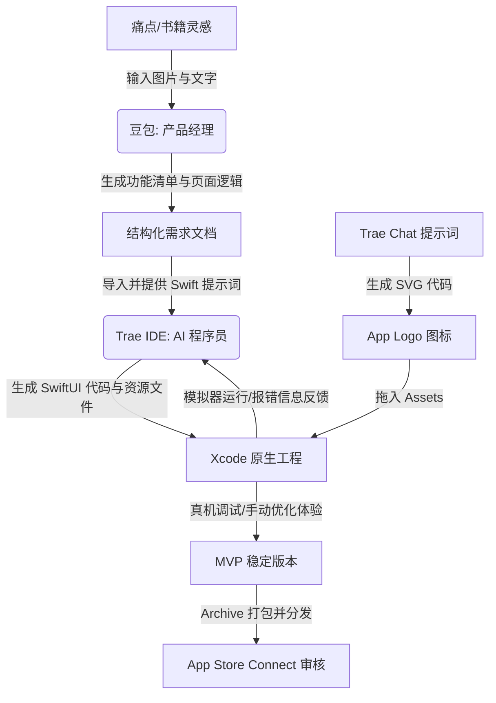

> [!NOTE] 关联笔记
> - 原始口语转写整理版：[[0_AI开发APP全流程-原始整理]]
> - iOS 原生与跨平台开发对比：[[4-Flutter_与_Swift_原生开发对比_2026版]]
> - Xcode 原生与跨平台对比教程：[[3-Flutter_SwiftUI_Xcode_对比教程_2026版]]

# AI时代个人独立开发：从需求、原型到Xcode编译与App Store上架全流程实战

在传统软件开发中，独立开发一款 iOS App 并上架需要跨越“需求分析、UI设计、代码编写、编译调试、商店合规”等多重门槛。随着大模型和 AI IDE 的爆发，个人开发者可以通过大模型和工具链的协同，在几小时内低成本交付一款符合苹果审核规范的原生 App。

本文将以一款**番茄工作法（番茄钟）App**为例，为您拆解一套全新的 **“AI 驱动的原生 iOS 开发与分发”** 工作流。

---

## 1. AI 辅助开发的核心架构与工具链

本套工作流的核心在于 **“大模型作为产品与架构顾问 + AI IDE 负责代码生成 + 人类进行质量卡点与编译分发”**。



### 开发工具矩阵对比

| 开发阶段 | 核心工具 | 工具职责 | AI 介入方式 |
| :--- | :--- | :--- | :--- |
| **需求定义** | **豆包 (Doubao)** | 归纳定位，丰富功能，输出结构化页面及跳转逻辑。 | 图像 OCR 解析（聊天截图/书页截图） + 逻辑完整性校验。 |
| **界面原型** | **Trae IDE (AI Builder)** | 自动规划 Slide 界面，生成高保真静态 HTML/CSS 样式。 | 推理模型（如 Gemini 3 / Claude 3.5）自主创建文件。 |
| **代码编写** | **Trae IDE (Chat/Inline)** | 编写 SwiftUI 原生代码，自动修复编译报错。 | 一键接收（Accept）修改 + 根据错误日志定位 Bug。 |
| **打包编译** | **Xcode** | 原生运行环境，编译调试，配置签名与证书，Archive 打包。 | 提供模拟器预览 + 生成构建产物（Build Archive）。 |
| **图标设计** | **Trae (SVG Renderer)** | 自动绘制矢量 Logo 图标。 | Prompt 生成 SVG 代码并直接在编辑器中预览和导出。 |
| **发布推广** | **App Store Connect** | 苹果商店元数据配置、TestFlight 测试分发及提审发布。 | 手动提交（可参考小红书等平台防风控/防退回经验）。 |

---

## 2. 核心步骤详解

### 2.1 步骤一：需求分析与规划（豆包扮演 PM）
大模型能够快速把日常零散的想法结构化。
1. **痛点输入**：将微信聊天截图（痛点：不希望先建任务再计时，而是先计时再关联任务）和《软技能》书页截图（灵感：预估每天 10 个番茄钟，做完即可去享受生活）发送给**豆包**。
2. **生成功能点**：命令豆包总结核心定位，提供“预估番茄钟”与“实际番茄钟”对比。
3. **输出页面逻辑**：
   - 首页：倒计时、重置、关联任务、开始。
   - 任务模块：新建任务、预估番茄数、实际完成数。
   - 日历与统计：展示每日专注情况及效率分析。
   - 设置：关于我们、反馈（省去个人中心与登录逻辑）。

### 2.2 步骤二：界面高保真原型生成（Trae IDE）
1. 在本地创建一个空项目文件夹并在 **Trae IDE** 中打开。
2. 切换模型为 **Gemini 3**，在 Chat 栏中粘贴需求文件，并追加以下提示词：
   ```text
   请根据上述需求文档，为我设计一套高保真的 App 原型界面。
   包含首页、任务页、日历和统计页。
   请自动创建相关的 HTML/CSS/JS 文件，确保配色高级、排版整洁。
   ```
3. 在 Trae 逐个审查生成的 Slide 页面，确认后点击勾选接收。
4. 使用浏览器插件捕捉网页截图，并将其保存到 `Assets` 中作为后续代码参考。

### 2.3 步骤三：iOS 原生工程初始化与配置（Xcode）
1. 打开 **Xcode**，新建一个 iOS App 项目，选择 SwiftUI 界面，命名为 `TomatoEfficiency`。
2. 解决常见的配置报错：
   - 如果遇到 Provisioning Profile 报错，点击项目属性 `Signing & Capabilities`。
   - 移除非个人账号支持的 `iCloud`、`Push Notifications` 等功能，以让苹果自动生成签名证书。
   - （有关 iOS 证书与工具链的基础说明，请参考 [[1-现代_iOS_开发知识地图_2026版]] 与 [[8-TestFlight_与_iOS_开发工具链_总结]]）。

### 2.4 步骤四：代码生成与循环调试（Trae + Xcode 协同）
1. 在 Trae IDE 中打开刚刚创建的 Xcode 项目目录。
2. 在 Chat 中选择较强的模型，输入以下指令：
   ```text
   请帮我将刚才的 HTML 原型图完全重构为 SwiftUI 原生代码。
   - 首页使用 ZStack 和环形进度条展示倒计时。
   - 任务页支持新建任务并记录“预估番茄数”与“实际番茄数”。
   - 所有的状态数据在本地使用 SwiftData 或 AppStorage 进行持久化。
   ```
3. **改 Bug 循环**：
   - 在 Xcode 中点击编译。如果报错，直接将 Xcode 的报错信息复制，粘贴给 Trae。
   - Trae 会根据报错重构问题代码，直至 Xcode 成功编译通过。
4. **细节打磨**：
   - 要求 AI 对界面文字进行“全中文汉化”。
   - 简化个人中心：取消不必要的登录机制，将“设置”与“反馈”合并到首页抽屉。

### 2.5 步骤五：利用 AI 快速生成 Logo 图标
1. 在 Trae 中输入：
   ```text
   请使用 SVG 格式为我绘制一个番茄钟 App 的 Logo。
   要求使用高级渐变色（番茄红到珊瑚粉），风格扁平现代化，包含倒计时刻度。
   ```
2. 预览生成的 SVG 并保存为 PNG。
3. 拖入 Xcode 的 `Assets.xcassets/AppIcon` 中自动匹配多分辨率尺寸。

### 2.6 步骤六：打包与 App Store 上架提审
1. **打包（Archive）**：
   - 将 Xcode 的目标设备选为 `Any iOS Device (arm64)`。
   - 点击顶部菜单栏 `Product -> Archive` 编译出分发包。
   - 点击 `Distribute App` 上传至 App Store Connect。
2. **开发者账号申请注意事项**（关键避坑，建议重点关注）：
   - **通过 iOS App 申请**：在 iPhone 上下载 **Apple Developer** 应用进行年费支付（688 元/年）。
   - **环境防风控**：注册和支付时，必须**关闭 VPN / 翻墙工具**，并全程在一台设备上操作。
   - **地址信息绝对一致**：所填写的地址必须与**身份证地址逐字一致**，否则会被拒并被要求补充水电费账单等居住证明。
   - **查阅避坑案例**：在注册前，前往小红书等平台搜索“苹果开发者注册失败/退款”，吸收最新风控经验。
   - （上架后的 TestFlight 内测分发流程可详细参考 [[8-TestFlight_与_iOS_开发工具链_总结]] 进行配置）。

---

## 3. 核心 SwiftUI 代码模版参考

以下为 Trae 自动生成的倒计时页面核心 SwiftUI 结构，可作为构建番茄钟应用的基础骨架：

```swift
import SwiftUI

struct TimerView: View {
    @State private var timeRemaining: CGFloat = 1500 // 25分钟
    @State private var timerActive = false
    let timer = Timer.publish(every: 1, on: .main, in: .common).autoconnect()
    
    var body: some View {
        VStack(spacing: 30) {
            // 环形进度条
            ZStack {
                Circle()
                    .stroke(Color.gray.opacity(0.2), lineWidth: 15)
                    .frame(width: 250, height: 250)
                
                Circle()
                    .trim(from: 0.0, to: timeRemaining / 1500.0)
                    .stroke(
                        LinearGradient(colors: [.orange, .red], startPoint: .top, endPoint: .bottom),
                        style: StrokeStyle(lineWidth: 15, lineCap: .round)
                    )
                    .rotationEffect(.degrees(-90))
                    .frame(width: 250, height: 250)
                    .animation(.linear(duration: 1.0), value: timeRemaining)
                
                Text(timeString(from: timeRemaining))
                    .font(.system(size: 48, weight: .bold, design: .monospaced))
            }
            
            // 控制按钮
            HStack(spacing: 40) {
                Button(action: {
                    self.timerActive.toggle()
                }) {
                    Text(timerActive ? "暂停" : "开始")
                        .font(.title2)
                        .padding(.horizontal, 30)
                        .padding(.vertical, 10)
                        .background(timerActive ? Color.orange : Color.green)
                        .foregroundColor(.white)
                        .cornerRadius(10)
                }
                
                Button(action: {
                    self.timerActive = false
                    self.timeRemaining = 1500
                }) {
                    Text("重置")
                        .font(.title2)
                        .padding(.horizontal, 30)
                        .padding(.vertical, 10)
                        .background(Color.red)
                        .foregroundColor(.white)
                        .cornerRadius(10)
                }
            }
        }
        .onReceive(timer) { _ in
            guard self.timerActive else { return }
            if self.timeRemaining > 0 {
                self.timeRemaining -= 1
            } else {
                self.timerActive = false
            }
        }
    }
    
    private func timeString(from time: CGFloat) -> String {
        let minutes = Int(time) / 60
        let seconds = Int(time) % 60
        return String(format: "%02d:%02d", minutes, seconds)
    }
}
```

---

## 4. 独立开发的敏捷迭代（MVP）思维

借助 AI 开发应用，核心方法论已转变为**敏捷开发与快速验证**：

1. **先做 MVP（最小可行性产品）**：不要在第一个版本中塞满诸如“换肤、社交分享、数据同步”等花哨功能。确保“核心倒计时 + 预估数据复盘”能够跑通即可。
2. **快速发布以验证市场**：将应用推向市场是最好的试金石。如果发现用户数量增长较快，可按天迭代，反之可快速转换赛道（请参考 [[3-Flutter_SwiftUI_Xcode_对比教程_2026版]] 评估跨平台重构的可能）。
3. **痛点发掘重于代码实现**：AI 时代，人类的核心护城河是**寻找痛点和发现创意**的能力。代码编写已经彻底平民化，谁能更快抓准用户核心诉求并交付，谁就能抢占先机。
