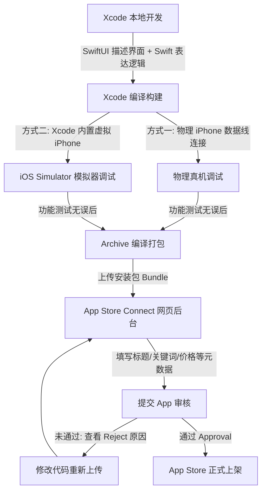

> [!NOTE] 关联笔记
> - 原始口语转写整理版：[[1_App开发概述与2_Xcode教程-原始整理]]
> - iOS 开发基础知识地图：[[1-现代_iOS_开发知识地图_2026版]]
> - iOS 提审与分发工具链：[[8-TestFlight_与_iOS_开发工具链_总结]]

# iOS App 独立开发起步：从架构认知到 Xcode 26 与首个 SwiftUI 应用开发实战

在生成式 AI 快速演进的时代，利用 AI 辅助编写代码已成为现代开发者的标配。然而，仅仅依靠 AI 盲目拼装代码（俗称 Vibe Coding）容易让人陷入由于缺乏基础知识而产生的高频卡点与无谓挣扎。掌握基本的编程概念和工具链的使用，依然是高效交付高品质原生 App 的关键。

本文将基于 2026 年苹果最新的 **Xcode 26** 开发平台，为您系统性地梳理 iOS App 开发的生命周期，详解 Xcode 界面构造，并带您动手构建并调试您的第一个 SwiftUI 应用。

---

## 1. iOS App 开发与发布全景生命周期

要将一个创意最终打包为可以在全球 App Store 下载的应用程序，需要经过 **“本地编写 -> 本地模拟测试 -> 编译打包 -> 云端后台配置 -> 提交审核发布”** 五个核心阶段。



### 1.1 核心开发与发布组件对比

| 组件 / 平台 | 核心职责 | 开发者考量 |
| :--- | :--- | :--- |
| **Xcode 26** | 官方唯一集成开发环境 (IDE)，支持代码编写、静态预览、真机运行及打包上传。 | 只能运行在 macOS 操作系统中。 |
| **Swift** | 苹果官方原生编程语言，负责表达应用的业务逻辑和算法（大脑）。 | 静态类型安全语言，学习曲线平缓。 |
| **SwiftUI** | 原生声明式 UI 框架，用极其精简的代码描述用户界面（皮肤）。 | 相比于旧版的 Storyboard/UIKit 更加现代且高效。 |
| **iOS Simulator** | Xcode 内置的虚拟 iPhone 设备，可在 Mac 屏幕上直接运行并交互。 | 支持模拟不同型号、不同 iOS 版本的运行状态，免去物理设备依赖。 |
| **App Store Connect** | 苹果的网页端后台管理 portal，负责管理 App 元数据和提审发布。 | 上传包体后，需手动在此页面配置商品信息并点击提交。 |
| **Apple Developer Program** | 苹果开发者计划。加入后方可获取分发证书并使用 App Store Connect。 | 年费为 **100 美元 (USD)**，只要维持付费，App 即可在商店保持在线。 |

### 1.2 硬件门槛及 Mac 替代方案

对于没有 Mac 电脑的初学者，建议使用“云 Mac”方案降低试错成本，确定长期开发后再行添置物理硬件：

| 方案类别 | 具体实施路径 | 优缺点分析 | 适用场景 |
| :--- | :--- | :--- | :--- |
| **云 Mac 服务 (推荐)** | 使用 `rentamac.io` 等远程桌面对接云端 Mac 开发机。 | **优点**：按日/月收费，成本低；<br>**缺点**：受网络延迟影响，体验依赖网速。 | 零基础探索阶段，用于快速确认是否要深入学习。 |
| **二手/翻新 Mac** | 购买苹果近两年内发布的二手/翻新 Mac 电脑。 | **优点**：性价比极高，能流畅运行 Xcode；<br>**缺点**：需自行鉴别二手硬件质量。 | 预算有限但决心长期学习 iOS 开发的个人。 |
| **全新 Mac** | 购买搭载 Apple Silicon（M系列芯片）的全新 Mac。 | **优点**：性能强劲，屏幕优秀，可提供 4~5 年以上的超长服役期；<br>**缺点**：前期投入成本较高。 | 职业移动开发者，或预算充足的独立开发者。 |

---

## 2. Xcode 26 环境安装与第一个项目配置

### 2.1 安装建议
1.  **存储空间保障**：从 Mac App Store 下载安装 Xcode 时，虽然本体显示十几个 GB，但在安装、启动以及后续下载 iOS 系统 SDK 时，会占用大量的临时和永久空间。建议系统盘至少腾出 **20GB~30GB 的可用空间**。
2.  **SDK 选择**：首次启动 Xcode 时，它会提示勾选需要安装的额外平台支持，**必须确保勾选 iOS**。

### 2.2 项目初始化步骤
1.  启动 Xcode，在欢迎页选择 **"Create a new Xcode project"**（或在菜单栏中选择 `File -> New -> Project`）。
2.  在弹出的模板中，顶部选择 **iOS**，应用类别选择 **App**，点击 Next。
3.  按如下规则配置项目基本参数：

    | 参数项 | 填写规范 / 选择建议 | 备注 |
    | :--- | :--- | :--- |
    | **Product Name** | `test` | 填入项目的 App 英文名称。 |
    | **Team** | `None` | 初学者本地开发和真机调试不需要立即配置开发者账号，选 None 即可。 |
    | **Organization Identifier** | `com.yourname` | 组织标识符，通常采用反向域名格式。 |
    | **Bundle Identifier** | *自动生成* | 由标识符与 Product Name 组合而成（例如：`com.yourname.test`）。 |
    | **Interface** | **SwiftUI** | **核心卡点**：切勿选择 Storyboard，SwiftUI 是现代 iOS 开发的绝对主干。 |
    | **Language** | **Swift** | 苹果官方标准语言。 |
    | **Tests / Storage** | **None** | 初学阶段暂不需要测试套件和本地持久化存储，选 None。 |

4.  点击 Next，选择一个本地文件夹（如桌面）保存项目，并**取消勾选** Git 仓库创建选项，点击 **Create**。

---

## 3. Xcode 26 界面六大核心区域解析

Xcode 的界面看似繁杂，但本质上是由六个服务于不同职责的模块组成的。了解这六个区域的布局，能极大地提升您的编码效率。

```
+----------------------------------------------------------------------------------------------+
|                                        1. Toolbar                                            |
+---------------------+---------------------------------------------------------+--------------+
|                     |                                                         |              |
|                     |                       3. Editor                         |              |
|                     |   +--------------------------+-----------------------+  |              |
|                     |   |                          |                       |  |  4. Utility  |
|    2. Navigator     |   |                          |                       |  |              |
|                     |   |     Code Editor          |       Canvas          |  |  (Inspector) |
| (Project Navigator) |   |                          |                       |  |              |
|                     |   +--------------------------+-----------------------+  |              |
|                     |                                                         |              |
+---------------------+---------------------------------------------------------+--------------+
|                                5. Debug Area (Console)                                       |
+----------------------------------------------------------------------------------------------+
|                                6. Xcode AI Assistant                                         |
+----------------------------------------------------------------------------------------------+
```

| 区域名称 | 功能与作用 | 常用技巧与快捷键 |
| :--- | :--- | :--- |
| **1. Toolbar (工具栏)** | 位于顶部。包含 **Run**（Play 按钮）和 **Stop**（方块按钮）、运行目标设备选择器、项目构建状态提示以及面包屑导航。 | 随时点击 Run 可以在选定的模拟器上启动你的 App。 |
| **2. Navigator (导航区)** | 位于左侧。包含多个导航页签。最常用的是 **Project Navigator**（文件夹图标），展示项目的所有文件。 | 快捷键 `Cmd + 1` 快速切回文件导航视图。点击顶部按钮可隐藏导航栏。 |
| **3. Editor (编辑器)** | 位于中部。根据左侧选中的文件动态切换。对于带有 View 的 Swift 文件，它会分栏显示 **Code Editor** 和 **Canvas (预览画布)**。 | Canvas 能实时反映你的界面代码修改，当 Canvas 提示 "Paused" 时，需点击右上角 Resume 重新启动实时预览。 |
| **4. Utility (实用工具区)** | 位于右侧。显示属性检查器（Inspector）。其中的 **Quick Help** 会根据当前光标所在的 Swift 关键字显示其文档释义。 | 选中某个视图组件（如 Text），在 Utility 的属性栏里可快速配置其字体、颜色等。 |
| **5. Debug Area (调试区)** | 位于底部（默认隐藏）。包含控制台，用于输出 `print()` 日志和系统报错、崩溃信息。 | 编译失败或 App 行为不符合预期时，需在此区域排查日志。 |
| **6. AI Assistant (AI助手)** | Xcode 26 新增功能。通过配置 ChatGPT 等模型，可以进行项目上下文相关的对话。 | **核心配置**：Xcode 26 提供了内置的 ChatGPT Token，前往配置页面一键开启即可。 |

---

## 4. 首个 SwiftUI 应用的创建与代码剖析

### 4.1 项目关键文件结构

```bash
test/
├── testApp.swift             # App 生命周期的起点 (入口)
├── ContentView.swift         # App 默认的主界面 (UI视图)
└── Assets.xcassets           # 图片、Logo、配色等资源管理目录
```

### 4.2 @main 入口代码：`testApp.swift`

```swift
import SwiftUI

@main
struct testApp: App {
    var body: some Scene {
        WindowGroup {
            ContentView() // 实例化并加载 ContentView
        }
    }
}
```
*   `@main`：标识此结构体是整个 App 的启动入口。
*   `WindowGroup`：提供一个窗口容器，在 iOS 上代表整个屏幕空间。
*   `ContentView()`：指定首屏要渲染的 UI 视图。

### 4.3 视图代码解析：`ContentView.swift`

```swift
import SwiftUI // 导入 SwiftUI 框架

struct ContentView: View { // 声明一个遵循 View 协议的结构体
    var body: some View { // body 属性用于描述界面结构
        VStack {
            Image(systemName: "globe") // 系统矢量图标
                .imageScale(.large)
                .foregroundStyle(.tint)
            Text("Hello, world!") // 文本组件
        }
        .padding() // 边距修饰器
    }
}
```

#### 实战练习：修改文本内容并测试

1.  在 `ContentView.swift` 中定位到：`Text("Hello, world!")`。
2.  将其修改为你自己的名字：
    ```swift
    Text("Cooper")
    ```
3.  确保右侧 Canvas 处于 Resume 状态。你会观察到预览界面中央的文本立刻更新为 "Cooper"。

---

## 5. 模拟器运行与调试

除了使用 Canvas 预览，在真实的 iOS 模拟器上运行是验证 App 交互完整性的标准流程。

### 5.1 运行 App
1.  在顶部 Toolbar 的设备选择器中选择一个具体的模拟器（如 `iPhone 17 Pro`）。
2.  点击 **Run** 按钮。
3.  此时 Xcode 会在后台对代码进行编译打包（Status Bar 会显示 `Building test`）。
4.  如果是首次启动模拟器，系统会自动唤起 iOS 虚拟手机并进行冷启动，通常需要 1~2 分钟。
5.  启动成功后，模拟器屏幕上会展现带有你修改后文本的应用程序。

### 5.2 停止运行
点击 Toolbar 上的 **Stop**（正方形）按钮，模拟器中的 App 将退回后台并终止运行。

---

## 6. Xcode 26 AI 助手的学习策略

大模型能提供极强的上下文支持，但其核心价值在于**启发式学习**而非“替你打工”。

### 6.1 避免低效的“Vibe Coding”
*   ❌ **低效做法**：直接让 AI “帮我写一个复杂的计算器 App”，然后无脑粘贴代码。一旦遇到编译报错或界面布局错乱，由于不懂 Swift 基本概念，调试将难以为继。
*   ::lh:: **高效做法**：将 AI 视为坐在你身边的**专属助教**，多询问代码含义、最佳实践以及错误成因。

### 6.2 推荐的 AI 助手学习 Prompts

在 Xcode 26 的 AI 对话面板中，您可以输入以下提示词来加深对基础知识的理解：

*   **询问文件职责**：
    > “请问在 Xcode 创建的项目中，`testApp.swift` 和 `ContentView.swift` 两个文件的核心职责分别是什么？它们是如何发生关联的？”
*   **询问语法概念**：
    > “为什么在 `ContentView` 里面要写 `var body: some View`？这里的 `some` 关键字代表什么含义？”
*   **询问操作方式**：
    > “如果我想隐藏 Xcode 右侧的 Inspector 面板以便腾出屏幕空间，在 Xcode 中有什么快捷键或最快的操作方式？”
*   **分析报错原因**：
    > “（复制 Xcode 控制台报错信息）我的代码出现了这个编译错误，请帮我分析原因并告诉我如何手动修改代码来修复它。”

### 6.3 为什么 Xcode AI 强于浏览器 AI
浏览器中的 ChatGPT 无法感知你当前 Xcode 的项目结构和正在编辑的文件。而 **Xcode 26 的内置 Assistant 具备深度的上下文感知能力**。它知道你正在开发什么平台、写到哪一行代码，并能直接针对你当前编辑的文件给出精准的代码重构建议和问题解释。

---

## 7. 结语与后续进阶路线

通过本教程，你已经理清了 iOS 开发的核心生命周期，熟悉了 Xcode 26 的工作面板，并成功运行了你的第一个应用。

**建议的后续进阶路径**：
1.  **SwiftUI 语法基础**：学习 `VStack`、`HStack`、`ZStack` 等基础布局组件。
2.  **Swift 基础语法**：掌握变量、常量、函数、条件判断和循环结构。
3.  **数据流管理**：理解 `@State` 和 `@Binding`，让用户交互能够真正改变界面上的数据。
4.  **AI 深入协同**：在 Trae 中配合 Xcode 进行多页面的小迭代，从一个简单的记事本或番茄钟应用开始，走通独立开发的闭环。
