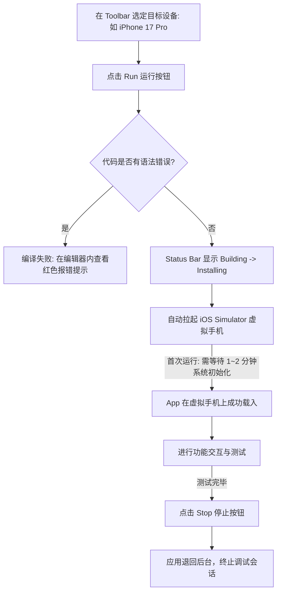

> [!NOTE] 关联笔记
> - 原始口语转写整理版：[[2_Xcode教程-原始整理]]
> - 前序架构与全景概述：[[1_App开发概述与2_Xcode教程-实战教程]]

# iOS 独立开发实战：Xcode 26 基础使用、项目结构解析与首个 SwiftUI 应用调试

在进入具体的 Swift 语法或复杂的 UI 编码之前，熟练掌握你的生产工具——**Xcode** 是重中之重。尤其在 2026 年，苹果在 **Xcode 26** 中深度集成了 AI 编码助手，为初学者提供了前所未有的学习便利。

本文将以实战为导向，带你完成开发环境的准备、第一个 SwiftUI 项目的初始化、Xcode 界面布局的剖析，并完成首屏文本修改及模拟器调试，最后分享如何利用 AI 助教攻克学习卡点。

---

## 1. 开发硬件准备与 Mac 替代方案

Xcode 是苹果官方唯一指定的 iOS App 集成开发环境（IDE），**仅支持在 macOS 操作系统中运行**。如果你目前没有 Mac 电脑，或者想在投资硬件前先进行低成本尝试，可以通过以下三种方案进行环境搭建：

### 1.1 软硬件搭建方案对比

| 方案类别 | 具体实施路径 | 估算成本 | 优缺点分析 | 适用场景 |
| :--- | :--- | :--- | :--- | :--- |
| **云 Mac 服务 (Rent a Mac)** | 使用 `rentamac.io` 等平台，通过 Windows PC 远程桌面连接至云端 Mac 运行环境。 | 每天几美元 (约 ¥15~30/天) | **优点**：即开即用，零首付硬件门槛，直接提供最新版 Xcode。<br>**缺点**：需要稳定的宽带网络，存在细微的操作延迟。 | **零基础探索期**。适合用于快速验证自己对 iOS 开发是否感兴趣。 |
| **翻新/二手 Mac** | 购买苹果近两年内发布的 Apple Silicon（M系列芯片）二手或翻新设备（如 Mac mini M2 或 MacBook Air M2）。 | 约 ¥3000 ~ ¥5000 (一次性) | **优点**：本地运行，体验流畅，折旧率低，足够支持后续 4 年左右的开发工作。<br>**缺点**：需要具备一定的二手硬件鉴别能力。 | **确定要深入学习的开发者**。性价比最高的本地物理环境解决方案。 |
| **全新 Mac** | 购买官方搭载最新 M 系列芯片的 Mac 电脑。 | ¥5000+ (一次性) | **优点**：性能强劲，屏幕及售后有保障，开发效率最高。<br>**缺点**：前期资金投入较大。 | **预算充足的初学者**，或转型原生开发的专业工程师。 |

### 1.2 Xcode 26 安装前置检查

1.  **磁盘空间**：虽然 App Store 显示 Xcode 下载体积为十几 GB，但解压安装以及后续下载 iOS 模拟器平台 SDK 等组件会占用大量空间。请确保你的 Mac 硬盘保留 **20GB 以上（推荐 30GB+）的闲置空间**。
2.  **SDK 勾选**：首次打开 Xcode 时，系统会弹出组件安装对话框，请确保**勾选 iOS** 选项，并完成后续依赖项的下载。

---

## 2. 首个 iOS App 项目的初始化与配置

双击打开 Xcode 26，在欢迎界面点击 **"Create a new Xcode project"**（或点击菜单栏 `File -> New -> Project`），进入项目创建向导：

```
[选择平台: iOS] ──> [选择模板: App] ──> [配置项目元数据] ──> [保存到本地并创建]
```

### 2.1 项目创建参数配置表

| 参数名称 | 填写数值 / 选项选择 | 核心设计意图 / 避坑指南 |
| :--- | :--- | :--- |
| **Product Name** | `test` | 填入你的项目名称（通常使用英文小写或驼峰命名法）。 |
| **Team** | `None` | 本地开发及模拟器测试无需绑定开发者账号。后续提审上架时才需要选择付费的 Apple ID。 |
| **Organization Identifier** | `com.yourname` | 组织标识符，推荐采用“反向域名”格式。 |
| **Bundle Identifier** | *（自动生成）* | 由标识符与 Product Name 拼接而成的全球唯一 App 包名（如 `com.yourname.test`）。 |
| **Interface** | **SwiftUI** | **核心卡点**：请务必选择 **SwiftUI**。不要选择老旧的 Storyboard，SwiftUI 是苹果现代开发的中流砥柱。 |
| **Language** | **Swift** | 苹果官方原生标准编程语言。 |
| **Storage / Tests** | 均选 **None** | 初学者阶段无需引入本地数据库（SwiftData/CoreData）及单元测试套件，保持项目轻量化。 |

> [!IMPORTANT]
> 在最后的保存步骤中，**取消勾选** "Create Git repository on my Mac"。在学习的第一课中，我们暂时不需要版本控制工具，避免增加不必要的复杂度。

---

## 3. Xcode 26 六大核心区域全景解析

新创建的项目界面通常会有许多面板，我们可以通过下图直观地理解 Xcode 26 的 workspace 布局结构：

```
+----------------------------------------------------------------------------------------------+
|                                        1. Toolbar                                            |
|  [Run/Stop] [运行设备: iPhone 17 Pro]                 [构建状态栏]                 [视图控制]   |
+---------------------+---------------------------------------------------------+--------------+
|                     |                                                         |              |
|                     |                       3. Editor Area                    |              |
|                     |   +--------------------------+-----------------------+  |              |
|                     |   |                          |                       |  |  4. Utility  |
|    2. Navigator     |   |                          |                       |  |  (Inspector) |
|    (导航器区域)      |   |     Code Editor          |       Canvas          |  |              |
|                     |   |     (代码编辑器)          |     (画布/预览)       |  |  [属性面板]   |
|   [Project Tree]    |   |                          |                       |  |  [快速帮助]   |
|                     |   +--------------------------+-----------------------+  |              |
|                     |                                                         |              |
+---------------------+---------------------------------------------------------+--------------+
|                                5. Debug / Console Area                                       |
|  [控制台输出 logs / 系统报错]                                                                 |
+----------------------------------------------------------------------------------------------+
|                                6. Xcode AI Assistant                                         |
|  [内置 AI 编码助手 / 对话面板]                                                                 |
+----------------------------------------------------------------------------------------------+
```

### 3.1 各区域职能与提效秘籍

| 序号 | 区域名称 (英文) | 核心职责 | 实用技巧 / 常用快捷键 |
| :---: | :--- | :--- | :--- |
| **1** | **Toolbar** | 启动与终止调试、选择模拟器设备、查看当前编译进度（如 Building/Running）。 | 快捷键 `Cmd + R` 可以快速执行运行（Run）。 |
| **2** | **Navigator** | 左侧边栏。展示项目所有的文件结构。默认在 **Project Navigator** 页签。 | 快捷键 `Cmd + 1` 快速切回项目导航。点击顶部折叠按钮可收起左侧栏。 |
| **3** | **Editor** | 中部编辑区。修改代码的主战场。在 View 文件中会分栏显示代码和 **Canvas (画布)**。 | 当 Canvas 预览因修改挂起时，点击右上角 **Resume** 或快捷键 `Cmd + Option + P` 恢复预览。 |
| **4** | **Utility** | 右侧边栏（检查器）。显示视图属性。其中的 **Quick Help** 可以即时显示光标所在 API 的官方文档。 | 选中代码中的 `Text`，可在右侧的 Attributes Inspector 中可视化地调整字号与字重。 |
| **5** | **Debug Area** | 底部调试栏。展示控制台日志输出。 | 快捷键 `Cmd + Shift + Y` 快速隐藏/显示底部调试区域。 |
| **6** | **AI Assistant** | Xcode 26 新增区域。提供上下文相关的 AI 编程问答。 | **前置配置**：前往 Xcode 设置的 AI Assistant 页面，一键启用内置的免费 ChatGPT 额度即可。 |

---

## 4. 项目文件结构与核心代码剖析

### 4.1 硬盘文件与 Xcode 导航器映射

在 Finder 中，项目由 `.xcodeproj` 配置文件和一个包含代码的同名文件夹组成：

*   **`test.xcodeproj`**：Xcode 的项目元数据配置文件，不包含具体代码，双击它即可用 Xcode 打开项目。
*   **代码及资源文件**：
    *   `testApp.swift`：应用的主入口。
    *   `ContentView.swift`：应用的首屏视图。
    *   `Assets.xcassets`：应用的资产目录，采用 Asset Catalog 可视化管理图片、图标和自定义色彩。

### 4.2 核心代码文件剖析

#### 4.2.1 生命周期入口：`testApp.swift`
```swift
import SwiftUI // 引入 SwiftUI 界面框架

@main // 告知编译器：这里是 App 的启动起点 (Main Entry Point)
struct testApp: App {
    var body: some Scene {
        WindowGroup { // 创建应用的窗口容器（在手机上代表全屏空间）
            ContentView() // 实例化并渲染 ContentView (即我们的首屏视图)
        }
    }
}
```

#### 4.2.2 首屏视图：`ContentView.swift`
```swift
import SwiftUI

struct ContentView: View { // 声明一个遵循 View 协议的 UI 结构体
    var body: some View { // 必须实现 body 属性来描述界面的排版结构
        VStack { // 垂直排列容器 (Vertical Stack)
            Image(systemName: "globe") // 展示一个名为 "globe" 的系统内置矢量图标
                .imageScale(.large)
                .foregroundStyle(.tint)
            Text("Hello, world!") // 文本视图组件，用于在屏幕上渲染字符串
        }
        .padding() // 边缘留白修饰器 (Modifier)，给容器四周加上默认边距
    }
}
```

---

## 5. 编译、运行与多模拟器调试实战

要验证你的 App 是否能正常运行，除了通过 Canvas 静态预览，最标准的方法是将其部署到虚拟 iPhone 模拟器上运行。

### 5.1 调试运行的标准工作流



> [!TIP]
> 模拟器首次启动会因为加载 iOS 系统内核而比较缓慢。测试完毕后，**不要主动关闭模拟器窗口**。保持模拟器常驻后台运行，下一次你再次点击 Run 按钮时，App 就可以在 5 秒钟内实现即时热重载。

---

## 6. 人机协同：如何利用内置 AI 助教进行高效学习

在 Xcode 26 中，你拥有了一个无缝集成在 IDE 内部的 AI 助手。我们强烈反对做一名“Vibe Coder”——即不动脑筋地让 AI 帮你写出所有代码然后一键粘贴，这会导致你一旦离开 AI 或遇到复杂的 Bug 时立刻瘫痪。

我们应该把 AI 当作**贴身助教**，采用**探究性的学习姿态**进行提问。

### 6.1 推荐的探究性提问模板（可以直接拷贝使用）

*   **提问代码原理**：
    > “请帮我详细分析我当前选中的这一段 SwiftUI 代码。其中的 `VStack` 和修饰器 `.padding()` 分别起到了什么作用？它们背后的底层排版逻辑是怎样的？”
*   **探索技术方案**：
    > “我想在当前页面实现一个可以横向滑动的卡片列表，在 SwiftUI 中通常有哪几种实现方案？各自的优缺点和适用场景是什么？”
*   **排查工具使用**：
    > “我刚刚不小心隐藏了底部的 Debug Console 面板，请告诉我如何在 Xcode 26 中通过快捷键或菜单栏将它重新呼唤出来？”
*   **重温工程结构**：
    > “请向我解释 `Assets.xcassets` 的作用。为什么在 Finder 中它是一个普通的文件夹，而在 Xcode 的编辑器中却能提供可视化的图片管理界面？”

利用 Xcode 26 AI 助手的上下文感知能力，你不需要复制粘贴任何代码，直接在面板中提问，它就能结合你当前项目的文件结构，给出最精准、最自然的解释。多问“为什么”，而不是只问“怎么做”，这能让你的开发学习速度提升数倍。
