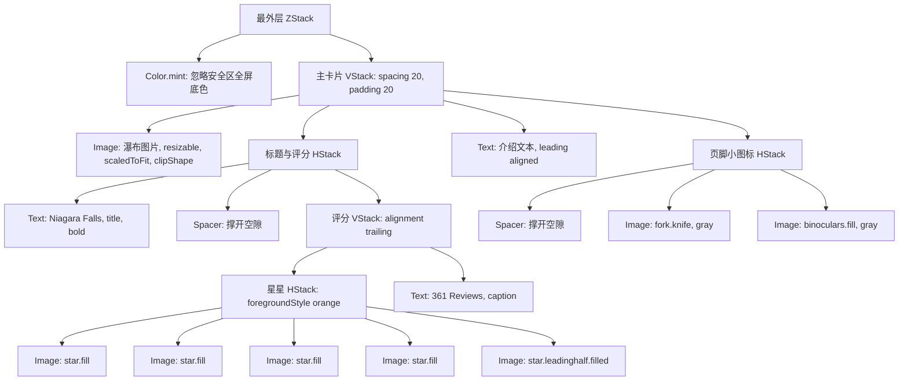

> [!NOTE] 关联笔记
> - 原始口语转写整理版：[[3_SwiftUI教程-原始整理]]
> - 前序课程教程：[[1_App开发概述与2_Xcode教程-实战教程]]
> - iOS 开发基础知识地图：[[1-现代_iOS_开发知识地图_2026版]]

# SwiftUI 声明式 UI 开发入门：布局容器嵌套与高保真卡片界面实战

在苹果生态的现代移动开发中，**SwiftUI** 以声明式（Declarative）语法彻底颠覆了传统的 UIKit 布局模型。编写 SwiftUI 的核心思维可以被看作是**用代码声明一块块“乐高积木”（基础视图 Views）并为其涂上“外观油漆”（修饰符 Modifiers），最后将它们装入“组装盒”（布局容器 Layout Stacks）中**。

本文将为您拆解 SwiftUI 的核心概念，并手把手带您利用嵌套布局与修饰符重构，实现一个具备全屏背景色和微立体投影的“尼亚加拉大瀑布 (Niagara Falls)”景点展示卡片。

---

## 1. SwiftUI 基础基石：Views 与 Modifiers

在 SwiftUI 中，屏幕上的每一个元素（文字、图片、按钮、甚至间距和容器）都是一个 **View (视图)**。

### 1.1 基础视图 (Base Views)

#### 文本视图 (Text View)
`Text` 组件用于在界面中呈现纯文本内容。
*   **基础语法**：`Text("文本内容")`
*   **多行换行**：在引号内使用标准换行符 `\n`：
    ```swift
    Text("Niagara Falls\nOntario, Canada")
    ```

#### 图像视图 (Image View)
`Image` 组件用于显示矢量图标或本地图片资产。
*   **加载系统矢量库 (SF Symbols)**：使用 `systemName` 加载苹果内置的数千种高品质图标。
    ```swift
    Image(systemName: "star.fill") // 实心星星
    Image(systemName: "star.leadinghalf.filled") // 半实心星星
    ```
*   **加载自定义图像资源**：将图片拖入项目 `Assets.xcassets`，并在代码中直接引用名称。
    ```swift
    Image("niagarafalls") // 加载导入的瀑布图片
    ```

### 1.2 视图修饰符 (View Modifiers)
修饰符以点（`.`）语法链式拼接在视图下方，用以修改该视图的尺寸、颜色、字体及剪裁逻辑等。**修饰符的链式调用顺序会直接影响渲染结果。**

```swift
Text("Chris")
    .font(.title)          // 调整字体为标题大小
    .bold()                // 文字加粗
    .foregroundStyle(.red) // 颜色改为红色
```

---

## 2. 界面排版核心：三大布局容器与 Spacer 弹簧

单纯罗列视图会使它们挤在屏幕中心。SwiftUI 提供了三大布局容器来管理空间分布。

### 2.1 布局容器矩阵对比

| 容器名称 | 轴向与排布规则 | 视觉概念图 | 常用属性与配置参数 |
| :--- | :--- | :--- | :--- |
| **`VStack`** | **垂直轴向**：内容从上至下依次排开。 | `[ 元素 1 ]`<br>`[ 元素 2 ]`<br>`[ 元素 3 ]` | `VStack(alignment: .leading, spacing: 20)`：<br>· `alignment`：内部横向对齐（如靠左对齐）。<br>· `spacing`：元素间的垂直间距。 |
| **`HStack`** | **水平轴向**：内容从左至右依次排开。 | `[ 元素1 ] [ 元素2 ] [ 元素3 ]` | `HStack(alignment: .bottom)`：<br>· 内部视图按照垂直底部对齐。 |
| **`ZStack`** | **深度轴向**：内容在 Z 轴上前后层叠。 | `[ 最底层 (背景) ]`<br>`↳ [ 中间层 ]`<br>`  ↳ [ 最上层 (卡片) ]` | `ZStack(alignment: .center)`：<br>· 层叠视图统一居中对齐。 |

### 2.2 辅助定位神器：Spacer
`Spacer()` 是一个在布局轴向上**无限延展**的隐形垫片。
*   在 `HStack` 中放置 `Spacer()`，会将左右两侧的组件推向屏幕的两极。
*   在 `VStack` 中放置 `Spacer()`，会上下撑满富余空间。

---

## 3. 实战案例：Niagara Falls 景点卡片架构设计

为了实现高保真卡片界面，我们需要对视图进行深度嵌套。

### 3.1 视图层级树状图 (View Hierarchy)



### 3.2 布局核心技巧：双重外边距与修饰符链顺序

在给卡片添加白底和阴影时，初学者经常遇到**阴影被截断**或**文字紧贴白底边缘**的问题。这是由于 padding 和 background 的顺序错误导致的。正确的解决方式是使用 **“双重内/外边距 (Double Padding)”**：

```swift
VStack(alignment: .leading, spacing: 20) { ... }
    .padding() // 1. 内边距：撑开卡片内容与白底边缘的空隙 (20pt)
    .background(
        RoundedRectangle(cornerRadius: 16)
            .foregroundStyle(.white) // 2. 背景：绘制圆角白色底板
    )
    .shadow(radius: 15) // 3. 阴影：对带有白色底板的卡片生成投影
    .padding() // 4. 外边距：撑开卡片外边缘与屏幕侧壁的间距
```

---

## 4. 高保真界面完整代码实现

请将 `ContentView.swift` 内的代码替换为以下实现，并在 `Assets` 中确保有一张命名为 `niagarafalls` 的瀑布图片：

```swift
import SwiftUI

struct ContentView: View {
    var body: some View {
        ZStack {
            // 底层：填充整屏薄荷绿背景色，并忽略系统安全区域
            Color.mint
                .ignoresSafeArea()
            
            // 顶层：卡片主容器
            VStack(alignment: .leading, spacing: 20) {
                // 1. 景点配图
                Image("niagarafalls")
                    .resizable()
                    .scaledToFit()
                    .clipShape(RoundedRectangle(cornerRadius: 16))
                
                // 2. 标题与星级评分行
                HStack {
                    Text("Niagara Falls")
                        .font(.title)
                        .bold()
                    
                    Spacer() // 将标题推向左侧，将评分推向右侧
                    
                    // 评分与评论数垂直堆叠
                    VStack(alignment: .trailing, spacing: 4) {
                        HStack(spacing: 2) {
                            Image(systemName: "star.fill")
                            Image(systemName: "star.fill")
                            Image(systemName: "star.fill")
                            Image(systemName: "star.fill")
                            Image(systemName: "star.leadinghalf.filled")
                        }
                        Text("361 Reviews")
                    }
                    .foregroundStyle(.orange)
                    .font(.caption)
                }
                
                // 3. 介绍性文本
                Text("Come visit Niagara Falls for an experience of a lifetime! Enjoy the breathtaking views, thrilling boat tours, and beautiful natural scenery surrounding the falls.")
                    .font(.body)
                
                // 4. 页脚动作图标行
                HStack {
                    Spacer() // 将图标推向最右侧
                    Image(systemName: "fork.knife")
                    Image(systemName: "binoculars.fill")
                }
                .foregroundStyle(.gray)
                .font(.caption)
            }
            // 5. 卡片样式修饰符链 (顺序敏感)
            .padding() // 第一层 padding：卡片内边距
            .background(
                RoundedRectangle(cornerRadius: 16)
                    .foregroundStyle(.white) // 白色卡片底板
            )
            .shadow(radius: 15) // 生成卡片软阴影
            .padding() // 第二层 padding：卡片外边距，避免卡片贴合手机边缘
        }
    }
}

// 预览容器（Xcode 26 会自动渲染）
#Preview {
    ContentView()
}
```

---

## 5. Xcode 实用技巧：代码折叠 (Code Folding)
随着页面层级的嵌套加深，代码行数会迅速增加。在 Xcode 中合理利用**代码折叠**能保持工作区的清爽：
*   **方法一 (快捷键)**：
    *   折叠当前代码块：`Cmd + Option + Left Arrow (左方向键)`
    *   展开当前代码块：`Cmd + Option + Right Arrow (右方向键)`
*   **方法二 (菜单栏操作)**：
    *   在顶部菜单选择 `Editor -> Code Folding -> Fold / Unfold`。
*   被折叠的代码在编辑器中会显示为 `...`，您可以通过双击 `...` 快速展开。

---

## 6. AI 辅助 SwiftUI 学习提效 Prompts

在 Xcode 内置的 AI Assistant 中，使用**探索启发式提示词**来学习，能让您更快地将基础属性烂熟于心：

*   **探索特定视图选项**：
    > “请问除了 `.ignoresSafeArea()` 之外，在 ZStack 或者 Color 视图上，还有哪些可以控制布局与边界的安全区域修饰符？”
*   **搞懂废弃 API 替代方案**：
    > “SwiftUI 的 `.cornerRadius()` 为什么会被废弃？为什么苹果推荐使用 `.clipShape(RoundedRectangle())`？两者的渲染机制有什么区别？”
*   **界面排布求助**：
    > “我想将 Niagara Falls 标题下的 Text 文本行间距变大，并且限制其最多显示 3 行，超出显示省略号，我应该使用哪些 SwiftUI 修饰符？”
