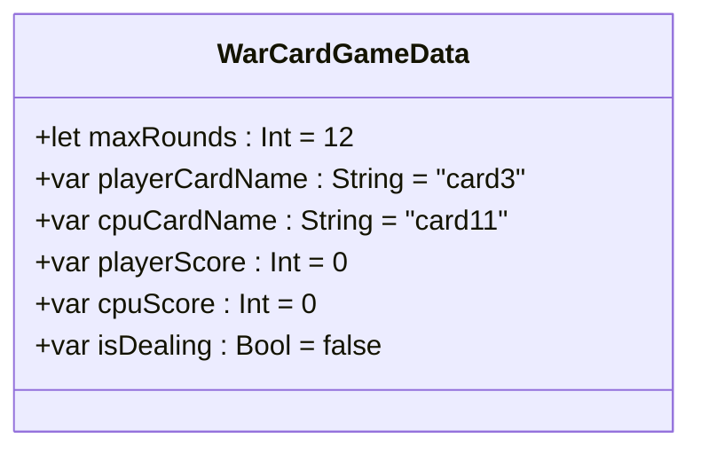

> [!NOTE] 关联笔记
> - 前序卡牌游戏界面篇：[[4_WarCardGameUI-实战教程]]

# Swift 编程起步：Playground 使用、变量常量声明与数据类型建模实战

构建出静态的 SwiftUI 用户界面只是完成了应用开发的第一步。要让应用具有真正的灵魂，能对用户的交互（如点击按钮）做出正确的响应并处理后台数据，我们必须编写 **Swift 逻辑代码**。

本教程将基于苹果最新的 Swift 语言规范，详解如何利用轻量级工具 **Xcode Playground** 快速实验，剖析变量与常量的底层区别，掌握核心数据类型，并为我们的卡牌游戏进行数据建模。

---

## 1. 轻量级实验场：Xcode Playground 使用指南

在学习核心语法时，如果每次都编译整个 App 工程并启动模拟器，开发效率会非常低下。Xcode Playground 专为此类快速实验而设计，无需模拟器，即可在一秒钟内完成编译并输出结果。

### 1.1 创建与界面布局
1.  **创建路径**：打开 Xcode，在顶部菜单中选择 `File -> New -> Playground`。选择 **iOS -> Blank**，保存至本地。
2.  **三大核心面板**：

```
+-------------------------------------------------------------------+
|                        1. Code Editor                             |
|  import UIKit                                                     |
|  var greeting = "Hello, playground"                               |
|                                                                   |
|  [悬停行号显示三角 Play 运行按钮]                                    |
+-------------------------------------------------------------------+
|                        2. Console (底部控制台)                     |
|  (运行结果输出 logs / 打印 / 语法报错显示在此区域)                   |
|  快捷键: Cmd + Shift + Y 快速隐藏/显示此区域                        |
+-------------------------------------------------------------------+
|                        3. AI Assistant (右侧侧边栏)               |
|  快捷键: 点击 Toolbar 对应按钮，提供实时上下文 AI 助手答疑            |
+-------------------------------------------------------------------+
```

### 1.2 编译运行机制
*   在编辑器中，将鼠标悬停在某一行号上，会出现一个**蓝色三角运行 (Play) 按钮**。
*   点击该按钮，Xcode 会编译并运行**从第一行到当前行**的所有代码，并在底部 Console 中即时打印出结果。
*   在调试区左侧，**必须确保 Console 是展开状态**，因为它是我们读取 `print()` 函数输出日志的最主要窗口。

---

## 2. 内存中的数据容器：变量 (var) 与常量 (let)

在 Swift 中，变量与常量是我们在内存中暂存、标识并修改数据的基本工具。

### 2.1 语法规范对比

| 关键字 | 数据类型 | 可否重新赋值 (Re-assignable) | 底层内存特性 | 游戏开发实战场景举例 |
| :---: | :--- | :--- | :--- | :--- |
| **`var`** | **变量** (Variable) | **可以** | 声明后在内存中开辟了一块可变空间，支持多次覆盖写入新数据。 | 玩家得分 (`playerScore`)、CPU得分 (`cpuScore`)。它们会随游戏进程不断变化。 |
| **`let`** | **常量** (Constant) | **绝对不可以** | 一旦写入初始值，编译器会将该内存地址标记为“只读”（Read-only）。任何尝试修改的动作都会在编译期报错。 | 游戏单局的总轮数 (`let maxRounds = 12`)，或者用户的固定昵称。保证核心规则不被篡改。 |

### 2.2 核心书写规范与避坑原则

#### 规则一：禁止重复声明（Redeclaration）
在同一个作用域中，一个标识符（变量名）**只能被声明一次**。一旦声明，后续的读取和修改只需直接书写变量名，**禁止再次添加 `var` 或 `let` 关键字**。
```swift
// ❌ 错误示范：
var playerScore = 0
var playerScore = 1 // 报错：Invalid redeclaration of 'playerScore'

//  正确示范：
var playerScore = 0
playerScore = 1 // 直接覆盖赋值
```

#### 规则二：常量优先原则（Constant First）
在实际项目开发中，应该**默认将所有变量声明为 `let` 常量**。只有当你明确知道这个变量在后续代码中需要被改变（例如累加积分）时，才将其修改为 `var` 变量。这能最大程度防止因为多线程修改或逻辑混乱导致的隐式 Bug。

---

## 3. 核心数据类型与 Swift 类型安全机制

Swift 是一门**类型安全 (Type Safe)** 的语言。一旦某个变量被分配了类型，它就不能再接受其他任何类型的值。

### 3.1 四大核心基础数据类型

| 类型名称 | 职责与含义 | 关键字 (Swift) | 声明与赋值示例 | 适用开发场景 |
| :--- | :--- | :---: | :--- | :--- |
| **字符串** | 用于存储人类可读的纯文本。 | **`String`** | `let title = "War Card Game"` | 显示卡牌名称、玩家名称、状态提示。 |
| **整型** | 用于存储不带小数点的正负整数。 | **`Int`** | `var score = 0` | 积分累加、轮数计算、发牌张数。 |
| **双精度浮点数** | 用于存储高精度的十进制小数点数字。 | **`Double`** | `let pi = 3.14159` | 坐标偏移量、比率计算、游戏倒计时。 |
| **布尔值** | 逻辑开关状态，仅有 true/false 两个值。| **`Bool`** | `var isGameOver = false` | 判定胜负、动画开关、是否允许发牌。 |

### 3.2 显式类型标注与隐式类型推断

Swift 拥有强大的**类型推断 (Type Inference)** 引擎。通常情况下你不需要写明类型，Swift 会根据你初始赋值的类型，自动锁定变量的类型。

```swift
// 1. 隐式类型推断 (简洁，推荐)：
var rounds = 12 // 自动被识别为 Int
var username = "Cooper" // 自动被识别为 String

// 2. 显式类型标注 (长格式，用于类型明确或提前占位)：
var scores: Int = 0
var cputitle: String = "CPU"
```

### 3.3 类型安全报错分析
如果你试图将一个 `String` 装进已经确定为 `Int` 的变量里，Xcode 编译器会在你点击运行前，抛出红色报错，保护程序安全：

```swift
var currentCard = 3 // 自动推断为 Int
currentCard = "card_jack" // ❌ 编译报错：Cannot assign value of type 'String' to 'Int'
```
> [!IMPORTANT]
> 字符串 `"3"` 与整型 `3` 是完全不同的数据。前者是文本资产，无法参与算术运算；后者是数值，可执行数学操作。因此，在卡牌游戏中，**分数值必须存为 `Int` 数值**，但在 UI 显示时需要转换为 `String`。

---

## 4. 实战代码演练：变量生命周期与递增计算

在 Playground 中输入以下代码，体验变量的内存覆盖、常量只读限制以及变量自增的底层逻辑：

```swift
import UIKit

// 1. 常量定义与测试
let gameTitle = "War Card Game"
print(gameTitle) // 控制台输出: War Card Game
// gameTitle = "New Game" // ❌ 报错：Cannot assign to value: 'gameTitle' is a 'let' constant

// 2. 变量定义与显式类型声明
var playerScore: Int = 0
var cpuScore: Int = 0

// 3. 模拟玩家赢了第一局：传统增加与自增赋值
playerScore = playerScore + 1 // 原来的 0 加上 1，再写回 playerScore，此时为 1
playerScore += 1             // 简写赋值运算符：等价于 playerScore = playerScore + 1，此时为 2

print("当前 Player 分数: \(playerScore)") // 控制台输出: 当前 Player 分数: 2

// 4. 模拟电脑赢了第一局：
cpuScore += 1
print("当前 CPU 分数: \(cpuScore)") // 控制台输出: 当前 CPU 分数: 1
```

---

## 5. War Card Game 游戏场景的逻辑建模

结合我们在上一课中设计的卡牌游戏 UI，我们可以用变量和常量把游戏的**核心数据状态 (State)** 抽象出来，这就是数据建模的起步：



*   `maxRounds`：用 `let` 声明，常量，数值恒为 `12`。
*   `playerCardName` / `cpuCardName`：用 `var` 声明，字符串类型。因为我们要根据随机出的数字动态拼装出诸如 `"card3"`, `"card11"` 的图片名称来更新 UI 画面。
*   `playerScore` / `cpuScore`：用 `var` 声明，整型。用于累加得分。

---

## 6. 人机协同学习卡片

遇到类型安全或 Playground 报错时，合理使用 AI 助手能让你快速摆脱“黑盒摸索”状态。

### 推荐的探究性提问模板

*   **提问类型推断与内存**：
    > “请帮我解释 Swift 的类型安全机制。当我不写 `: Int` 时，编译器是如何通过 `var score = 0` 推断出变量类型的？这在内存分配上与动态类型语言（如 JavaScript / Python）有什么本质的区别？”
*   **提问自增运算符号**：
    > “请帮我解释 `playerScore += 1` 和 `playerScore = playerScore + 1` 两者之间的关系。在底层的 CPU 执行效率上，这两种写法是否有差异？在 Swift 里是否支持类似 C 语言的 `playerScore++` 写法？”
*   **提问常量安全性**：
    > “在开发 iOS App 时，为什么苹果强烈建议尽量把数据声明为 `let` 常量？使用 `let` 除了能防止数据被篡改，对编译器的性能优化和内存管理有什么好处？”
*   **模拟报错解析**：
    > “如果我在 Playground 里遇到了报错 `Cannot assign value of type 'Double' to type 'Int'`，请帮我分析我是在哪个赋值步骤违反了类型安全规则？我该如何将一个十进制小数（Double）安全地转换为整型（Int）？”
