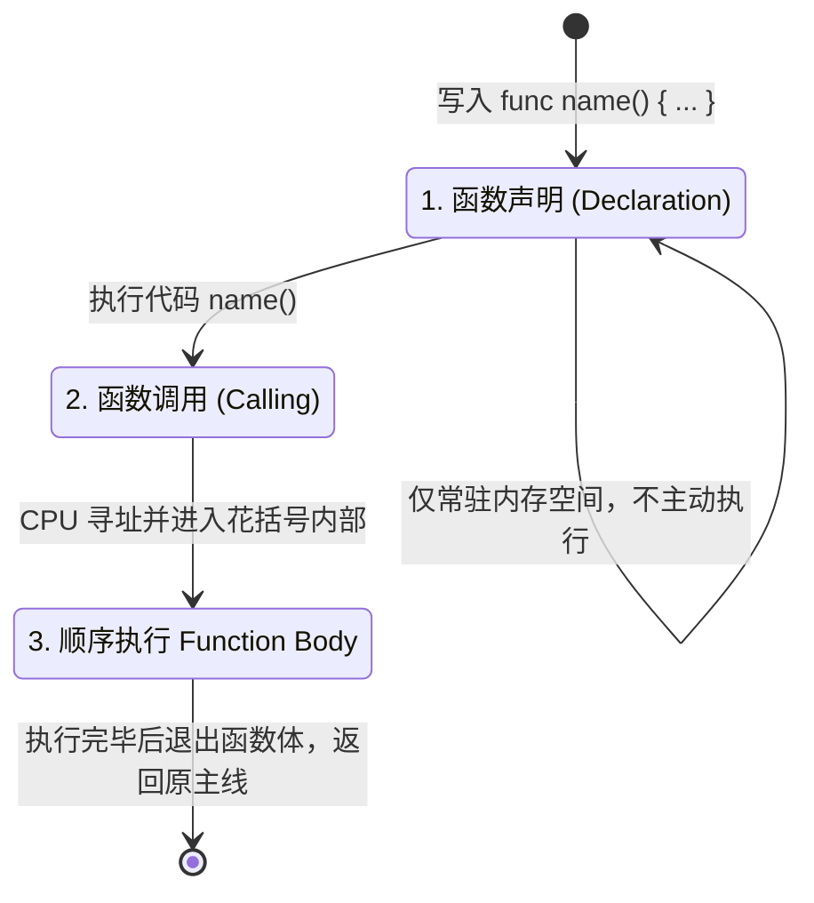

> [!NOTE] 关联笔记
> - 前序变量与常量篇：[[5_Swift基础-变量与常量-实战教程]]

# Swift 编程进阶：函数的声明与调用、代码块封装与发牌逻辑建模实战

在掌握了如何使用变量（Variable）和常量（Constant）进行数据存储后，我们必须面对更复杂的开发场景：当用户触发了某个操作时，应用需要顺次执行一系列的复杂步骤。

如果我们把所有的步骤代码零散地堆放在一起，不仅代码极难维护，也无法实现逻辑的重用。Swift 的**函数（Function）**机制正是为了将离散的代码指令打包成一个协同运作的“动作盒”而诞生的。

---

## 1. 为什么需要函数？——以发牌按钮为例

以我们在第四课构建的 **War Card Game** 为例，当用户轻触屏幕中央的 **“Deal”** 按钮时，后台实际上需要以极快的速度完成以下动作链：

```
[用户点击 Deal]
      │
      ├──> ① 生成玩家卡牌的随机数 ──> 更新左卡牌图片 UI
      ├──> ② 生成 CPU 卡牌的随机数 ──> 更新右卡牌图片 UI
      └──> ③ 比对两张牌的大小 ──> 判定胜负 ──> 获胜方积分 +1 ──> 更新得分 UI
```

在 Swift 中，这六个动作每一行都对应着一条特定的代码指令。如果直接写在按钮的触发体里，代码会变得臃肿不堪。
通过声明一个名为 `deal()` 的**函数**，我们可以把这 6 行代码“打包”封入函数体中，在按钮被点击时，直接调用 `deal()` 这一行函数名即可，实现了**高内聚、低耦合**的代码设计。

---

## 2. Swift 函数的语法结构设计 (func)

在 Swift 中，一个标准函数的声明（Declaration）结构由四个核心要素构成：

```
关键字    函数名称       参数列表          函数体 (代码块范围)
 ↓         ↓            ↓                ↓
func  myFunction   (        )   {  print("Hello World")  }
```

### 2.1 函数声明结构对照表

| 组成要素 | 语法标记 / 符号 | 核心职责 | 开发规范与技巧 |
| :--- | :--- | :--- | :--- |
| **1. 声明关键字** | **`func`** | 告知编译器：此结构体是一个可执行的动作函数。 | 必须小写。输入 `func` 后 Xcode 会将其高亮为粉色。 |
| **2. 函数名** | 自定义 (如 `deal`) | 该代码包的唯一标识，用于后续的读取和执行调用。 | 遵循驼峰命名法（lowerCamelCase），以动词开头（如 `dealCard`, `resetScore`）。 |
| **3. 参数列表** | 圆括号 **`()`** | 用于声明从外部传入函数内部进行处理的变量名及类型。 | 即使没有参数，**圆括号也必须保留**。空圆括号代表该函数不需要外部信息即可自主运行。 |
| **4. 函数体** | 花括号 **`{ }`** | 定义该函数被触发时，内部执行的代码块范围。 | 在左花括号后按回车，Xcode 会自动补齐右花括号，并进行规范的向内缩进。 |

---

## 3. 函数的生命周期：定义 (Declaration) 与执行 (Calling)

这是初学者最容易踩中的卡点：**写了函数代码，但运行后控制台无任何反应**。我们需要分清函数的两个核心生命周期阶段。

### 3.1 声明阶段与调用阶段对比



*   **声明阶段**：
    > `func deal() { ... }` 只是在内存中注册了这一段代码块，相当于“设计图纸”。此时代码并不会运转，因此 Console 不会有任何输出。
*   **调用阶段**：
    > `deal()` 才是真正向 CPU 下达“立即执行该打包代码”的指令。只有执行了调用，花括号内部的代码才会被顺序读取并打印结果。

---

## 4. Playground 实战代码与生命周期演练

在 Playground 中输入以下代码，观察函数的定义、顺序调用以及代码控制流的跳转过程：

```swift
import UIKit

// 1. 声明函数：打包打印任务
func displayWelcomeMessage() {
    print("-------------------------")
    print(" 欢迎进入 War Card Game ")
    print("-------------------------")
}

func logTurnStart() {
    print("[系统通知] 新回合开始，准备发牌...")
}

// ---- 此时点击运行，控制台没有任何输出，因为函数尚未被调用 ----

// 2. 顺序调用函数
displayWelcomeMessage() // 触发第一个函数，控制台输出欢迎信息
logTurnStart()          // 触发第二个函数，控制台输出回合开始通知

print("玩家点击了 Deal 按钮") // 主干程序顺序执行

// 3. 再次重复调用，体现代码的复用性
logTurnStart()
```

---

## 5. War Card Game 游戏发牌函数的行为建模

我们可以先用**伪代码（Pseudo-code）**，在大脑和设计文档中为第四课构建的游戏项目设计它的发牌行为函数 `deal()`：

```swift
// 声明发牌动作函数
func deal() {
    // 步骤1. 随机生成 2~14 之间的整数，代表扑克牌的值
    // 玩家卡牌值 = 随机数 (2...14)
    // CPU卡牌值 = 随机数 (2...14)
    
    // 步骤2. 根据随机值拼装图片名称，改变 UI 视图中显示的图片
    // 玩家卡牌图片名 = "card" + 玩家卡牌值 (例如: "card3")
    // CPU卡牌图片名 = "card" + CPU卡牌值
    
    // 步骤3. 进行逻辑大小比对，判定获胜方
    // 如果 玩家卡牌值 > CPU卡牌值 {
    //     玩家积分自增 1
    // } 否则如果 玩家卡牌值 < CPU卡牌值 {
    //     CPU积分自增 1
    // }
}
```

通过将这一长段复杂的逻辑打包在 `deal()` 函数中，在 SwiftUI 的 Button 触发事件里，我们只需要简单地写一行：
`deal()`，即可驱动整个复杂的发牌计算，保证了界面的清洁与逻辑的可控性。

---

## 6. 人机协同学习卡片

要进一步探索函数的深层能力，可以利用 Xcode 26 的 AI 编码助手，发送以下探究性问题进行进阶学习：

### 推荐的探究性提问模板

*   **提问函数参数 (Input Parameters)**：
    > “请帮我解释 Swift 函数中参数的用法。如果我想写一个函数来根据传入的玩家名字输出问候语，比如 `sayHello(to: "Cooper")`，我应该如何在圆括号里定义参数？其中的 `to` 和内部变量有什么区别？”
*   **提问函数返回值 (Return Values)**：
    > “在 Swift 中，如何让函数在执行完后向外返回一个结果（比如计算两个分数的和并返回 Int 结果）？我应该如何使用 `->` 符号和 `return` 关键字？”
*   **提问代码封装设计**：
    > “在开发 iOS App 时，如何判断一段代码应该独立抽取写成一个函数，还是直接写在主流程里？在软件工程中，有哪些常见的‘代码重构（Refactoring）’原则适用于函数的划分？”
*   **提问随机数生成（为下一课铺垫）**：
    > “我想在 Swift 函数内部生成一个 2 到 14 之间的随机整数，用来代表发牌点数，我应该使用什么内置的 Swift API 来最安全、随机地实现这一目的？”
