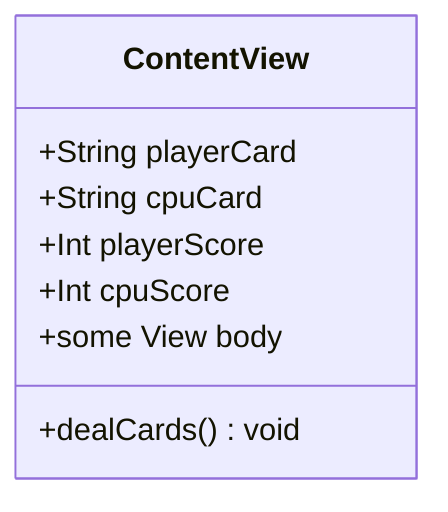
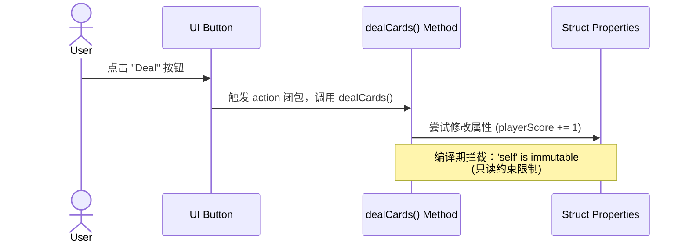

> [!NOTE] 关联笔记
> - 前序函数篇：[[6_Swift基础-函数-实战教程]]

# SwiftUI 交互基石：按钮事件闭包、数据强转绑定、结构体方法封装与可变性限制实战

在完成了 Swift 基础语法中变量与函数的学习后，我们将正式回归到 **War Card Game** 的项目开发中。本篇教程将指导你如何将静态的卡牌游戏界面改造为支持用户点击的交互式应用，掌握 Xcode 核心开发工具链，并深入理解 SwiftUI 视图属性绑定的底层逻辑与编译期报错机制。

---

## 1. SwiftUI Button 语法结构与自定义样式

SwiftUI 中的 `Button` 是最核心的交互组件之一。针对不同的设计需求，SwiftUI 提供了两种不同的语法结构。

### 1.1 两种 Button 语法结构对比

| 语法类型 | 代码示例 | 适用场景 | 核心特点 |
| :--- | :--- | :--- | :--- |
| **基础文字按钮** | `Button("Title") { ... }` | 表单提交、系统默认设置、简单文本操作。 | 样式由系统默认渲染（蓝色文字），无法放置复杂图标。 |
| **自定义视图按钮** | `Button { ... } label: { ... }` | 图片按钮、图文混排按钮、复杂的卡片式点击区域。 | 动作（Action）与外观（Label）完全分离，可嵌套任意 Swift 视图。 |

### 1.2 自定义图片按钮实现

在卡牌游戏中，我们需要使用设计师配置好的按钮图片资源 `Image("button")` 作为交互媒介，因此应采用**自定义视图按钮**结构：

```swift
Button {
    // 1. 动作闭包 (Action Closure)：当按钮被轻触时执行的 Swift 代码
    print("Deal 按钮被轻触")
} label: {
    // 2. 视图闭包 (Label Closure)：定义按钮的可视化外观
    Image("button")
}
```

> [!TIP] 调试技巧
> 在 Xcode 预览 Canvas 开启交互模式（Interactive Mode），点击 Deal 按钮，点击 Xcode 右下角展开 **Console 面板**，即可实时查看 `print` 输出，验证按钮交互通路是否正常。

---

## 2. Xcode 核心工具链深度掌握

为了提升开发效率，Xcode 提供了“组件库”与“代码折叠”两个高频辅助功能。

### 2.1 Xcode 组件库 (Library) 功能分区

通过快捷键 `Cmd + Shift + L` 可快速唤起组件库面板。该面板是开发者的“乐高积木盒”：

```
[Cmd + Shift + L]
      │
      ├──> ① Views Tab (视图库) ──> 提供 Button, Text, Image 等基础积木
      ├──> ② Modifiers Tab (修饰符库) ──> 提供 .padding(), .font() 等外观修饰
      ├──> ③ APIs Tab (系统接口) ──> 包含通讯录、网页浏览器等系统级联动
      └──> ④ Media Library (媒体库) ──> 项目中所有导入的图片资源与 SF Symbols
```

### 2.2 代码折叠 (Code Folding) 实战

随着 SwiftUI 布局层级的加深，`body` 属性中的代码会快速膨胀。
* **折叠路径**：将光标放在 `var body: some View` 后的左花括号 `{` 处，在顶部菜单选择 `Editor -> Code Folding -> Fold`。
* **效果**：整个 `body` 块会被折叠成一个简短的 `...` 占位符，极大地净化了视图，便于开发者专注于结构体中其他属性和方法的编写。双击 `...` 即可瞬间展开。

---

## 3. 属性绑定与数据类型转换 (Casting)

为了让卡牌和得分随游戏进程而变化，必须用 `ContentView` 的**属性 (Properties)** 代替硬编码的字面量。

### 3.1 属性声明与 UI 绑定

在 `ContentView` 顶部、`body` 属性上方声明四个游戏状态变量：

```swift
struct ContentView: View {
    // 存储卡牌图片资源名称
    var playerCard = "card13" // 默认为 K
    var cpuCard = "card13"
    
    // 存储数值得分
    var playerScore = 0
    var cpuScore = 0
    
    var body: some View {
        // ... 视图结构 ...
        Image(playerCard) // 绑定玩家卡牌图片数据
        Image(cpuCard)    // 绑定 CPU 卡牌图片数据
    }
}
```

### 3.2 解决 `Int` 转 `String` 编译报错

当我们尝试直接将 `playerScore` 传入 `Text` 视图时，Xcode 会抛出编译错误：

> ❌ **Error**: *No exact matches in call to initializer*

#### 报错成因分析
`Text` 初始化器预期接收一个字符串类型 `String`（或可本地化的字符串键值），而 `playerScore` 被声明为了 `Int` 整数类型（因为得分需要进行数学加法累加）。Swift 是**类型安全 (Type-Safe)** 语言，不支持隐式的类型转换。

#### 解决方案：显式类型转换 (Casting)
我们需要对 `Int` 进行显式强制转换，将其封装进 `String` 初始化器中，这在开发中常被称为“给整数套上字符串的外套 (Casting)”：

```swift
// 正确的绑定方式
Text(String(playerScore))
Text(String(cpuScore))
```

---

## 4. 架构设计：封装结构体方法

为了保持代码的**高内聚与低耦合**，避免将繁杂的发牌算法和比分判定代码直接堆叠在 `Button` 的 Action 块中，我们需要将这一组动作封装为结构体的方法。



### 4.1 声明发牌方法

> [!IMPORTANT] 作用域规整
> 声明方法时，必须确保其位于 `body` 的花括号外部，且在 `ContentView` 的花括号内部。可以通过点击花括号边缘，观察 Xcode 的**黄色高亮双向闪烁提示**来确认作用域嵌套是否正确。

在 `body` 闭括号下方，编写 `dealCards` 函数：

```swift
// 发牌与计分核心逻辑方法
func dealCards() {
    // 1. 随机生成玩家与 CPU 的卡牌数值 (待实现)
    // 2. 根据数值更新 playerCard 与 cpuCard 图片名称 (待实现)
    // 3. 比较卡牌大小计算得分 (待实现)
    // 4. 更新 playerScore 与 cpuScore 得分数值 (待实现)
}
```

### 4.2 按钮 Action 调用

在 `Button` 动作块中，我们只需极其简洁地调用该方法即可：

```swift
Button {
    dealCards() // 一行代码调用，结构清晰清晰
} label: {
    Image("button")
}
```

---

## 5. 编译期瓶颈：结构体的只读约束 (Immutable Constraint)

当我们试图在 `dealCards()` 方法或 Button 的 Action 中修改这些属性（例如进行计分自增 `playerScore += 1`）时，编译器会给出一个非常严重的警告：

> ❌ **Error**: *Cannot assign to property: 'self' is immutable*

### 5.1 为什么 Struct 是只读的？

在 Swift 中，`ContentView` 是一个 **`struct`（结构体）**，属于**值类型 (Value Type)**。
根据 Swift 的设计规范，值类型的实例属性在其实例方法中默认是不可修改的（除非方法被显式标记为 `mutating`）。
然而，SwiftUI 的 `body` 属性是一个**计算属性 (Computed Property)**，它本身是只读的，且底层运行在非 mutating 的上下文中。因此，我们无法在 `body` 或其内部的方法中直接对 `ContentView` 的成员变量进行写操作。



### 5.2 展望：使用 `@State` 突破限制

在下一课中，我们将引入 SwiftUI 的核心状态解决方案——**`@State` 属性包装器**。
通过在属性前加上 `@State`，SwiftUI 将把这些变量的存储管理权限移交给框架底层的一个特殊内存区域。这样不仅能避开结构体只读的限制，还能在变量数值发生改变时，**自动重新触发 `body` 的渲染**，更新屏幕上的图片和分数。

---

## 6. 本课完整参考代码

以下是完成第七课后，`ContentView.swift` 的完整代码结构参考：

```swift
import SwiftUI

struct ContentView: View {
    // MARK: - 游戏状态属性 (已绑定 UI)
    var playerCard = "card13" // 默认显示 K (King)
    var cpuCard = "card13"
    
    var playerScore = 0
    var cpuScore = 0
    
    var body: some View {
        ZStack {
            // 背景底图
            Image("background-plain")
                .resizable()
                .ignoresSafeArea()
            
            VStack {
                Spacer()
                
                // 游戏 Logo
                Image("logo")
                
                Spacer()
                
                // 卡牌对决区
                HStack(spacing: 20.0) {
                    Spacer()
                    Image(playerCard)
                    Spacer()
                    Image(cpuCard)
                    Spacer()
                }
                
                Spacer()
                
                // 交互发牌按钮
                Button {
                    // 调用逻辑封装函数
                    dealCards()
                } label: {
                    Image("button")
                }
                
                Spacer()
                
                // 记分板区域
                HStack {
                    Spacer()
                    VStack {
                        Text("Player")
                            .font(.headline)
                            .foregroundColor(.white)
                            .padding(.bottom, 10.0)
                        // 将 Int 类型得分强转为 String
                        Text(String(playerScore))
                            .font(.largeTitle)
                            .foregroundColor(.white)
                    }
                    Spacer()
                    VStack {
                        Text("CPU")
                            .font(.headline)
                            .foregroundColor(.white)
                            .padding(.bottom, 10.0)
                        // 将 Int 类型得分强转为 String
                        Text(String(cpuScore))
                            .font(.largeTitle)
                            .foregroundColor(.white)
                    }
                    Spacer()
                }
                
                Spacer()
            }
        }
    }
    
    // MARK: - 核心业务逻辑封装
    /// 处理发牌、比分比对及得分计算的方法
    func dealCards() {
        // FIXME: 目前直接修改以下属性会引发 'self is immutable' 编译报错
        // 需在下节课引入 @State 状态包装器解决此问题
        
        // 1. 随机生成卡牌图片名称 (如 "card" + 2~14 的随机数)
        // playerCard = "card" + String(Int.random(in: 2...14))
        
        // 2. 累加计算得分
        // playerScore += 1
    }
}

#Preview {
    ContentView()
}
```
