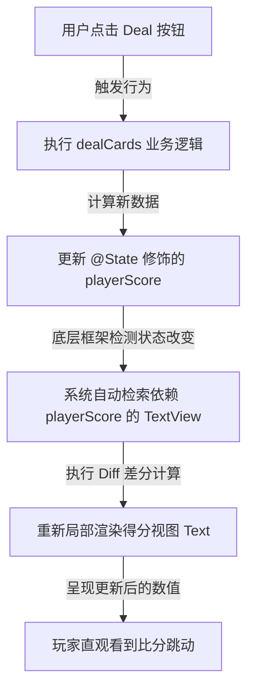

> [!NOTE] 关联笔记
> - 原始口语转写整理版：[[8_游戏逻辑与真机调试-原始整理]]
> - SwiftUI 基础卡片教程：[[3_SwiftUI教程-实战教程]]
> - iOS 开发基础知识地图：[[1-现代_iOS_开发知识地图_2026版]]
> - iOS 提审与分发工具链：[[8-TestFlight_与_iOS_开发工具链_总结]]

# SwiftUI 逻辑绑定与 iOS 真机部署联调：完成你的首款卡牌对战 App

在前序的 SwiftUI 界面排版学习中，我们构建了静态的用户界面。在开发一个真正可交互的 App 时，我们需要引入**业务逻辑**并将**界面元素与底层数据进行动态绑定**。

本文将以经典的 **War Card (卡牌对战) 游戏**为例，带您掌握 Swift 的变量作用域规则、`@State` 响应式数据绑定机制、核心对战算法，并详解如何绕过苹果的 100 美元年费，用个人免费开发者账户将 App 部署到 iPhone 真机上联调测试。

---

## 1. 响应式核心：变量作用域与状态管理

在 SwiftUI 中，结构体（Struct）默认是不可变（Immutable）的。要改变视图内部的属性值并通知界面重新刷新，必须理解 Swift 的**作用域**与**状态管理**。

### 1.1 变量作用域 (Scope)

作用域决定了一个变量的**可见性生命周期**，通常由其被声明时所处的花括号 `{}` 范围决定。

```swift
struct ContentView: View {
    // 属性作用域 (Property Scope): ContentView 内的所有函数都可以访问此变量
    var gameName = "War Card Game" 

    var body: some View {
        Button("Deal") {
            // 局部变量作用域 (Local Scope): 变量 a 仅在此闭包/函数括号内有效
            var a = 1 
            a += 1
        }
        // 此处访问 a 会引发编译错误: a 已经失效出界
    }
}
```

### 1.2 变量属性分类与 @State 机制

| 属性修饰类型 | 声明作用域 | 是否允许在函数中修改 | 数据变化是否驱动 UI 重新渲染 | 典型适用场景 |
| :--- | :--- | :--- | :--- | :--- |
| **局部变量 (Local)** | 函数/闭包花括号内部 | 是 | 否 | 仅用作中途计算的临时中转数值（如：产生的临时随机数）。 |
| **普通属性 (Property)** | 结构体顶层，函数外部 | 否 (Struct 只读限制) | 否 | 静态配置数据，或只读参数（如：景点的固定介绍文本）。 |
| **状态属性 (`@State`)** | 结构体顶层，函数外部 | **是** (托管给系统底层) | **是** (自动差分更新) | 动态变化的交互式数据（如：卡牌名、双方实时得分）。 |

### 1.3 `@State` 数据驱动 UI 渲染环



---

## 2. 游戏核心逻辑实现

### 2.1 物理卡牌数值映射
App 包体内的卡牌资源包（`Assets.xcassets`）以 `"card2"` 到 `"card14"` 命名：
*   数字牌 `2 ~ 10` 直接对应文件名 `card2 ~ card10`。
*   人头牌进行数值化映射：`J = 11`, `Q = 12`, `K = 13`, `A = 14`。
*   这种**“文件名 = 前缀字符串 + 整数”**的命名设计能完美配合 `Int.random(in:)` 随机数生成，避免写繁琐的 `switch-case` 映射。

### 2.2 核心对战业务代码

在 `ContentView.swift` 中，当用户点击 `Deal` 按钮时，会触发调用如下逻辑函数：

```swift
// 1. 声明四个 @State 状态属性驱动界面渲染
@State var playerCard = "back" // 初始背面图
@State var cpuCard = "back"
@State var playerScore = 0
@State var cpuScore = 0

// 2. 编写发牌与结算判定逻辑
func dealCards() {
    // A. 产生 2 到 14 之间的随机整数 (闭区间，含 2 和 14)
    let playerValue = Int.random(in: 2...14)
    let cpuValue = Int.random(in: 2...14)
    
    // B. 将 Int 值转为 String 并与前缀拼接，动态改变卡牌图片状态
    playerCard = "card" + String(playerValue)
    cpuCard = "card" + String(cpuValue)
    
    // C. 使用条件分支语句进行得分计算 (分支判定)
    if playerValue > cpuValue {
        playerScore += 1 // 玩家牌面大，玩家分数累加 1
    } else if cpuValue > playerValue {
        cpuScore += 1    // CPU 牌面大，CPU 分数累加 1
    }
    // 平局情况下，我们在此规则中不做任何积分变更，直接略过
}
```

---

## 3. iOS 物理真机部署联调与签名避坑指南

无需付费加入 100 美元/年的 Apple Developer 计划，个人持免费 Apple ID 也能利用 Xcode 自动签名实现真机部署。

### 3.1 物理联调 5 步曲

```
  [ iPhone / iPad ] --- (1. 数据线连接 Mac) ---> [ Xcode IDE ]
                                                      |
  [ VPN与设备管理 ] <--- (3. 打包传输 App) <--- (2. 设置 Apple ID 签名)
         |
  (4. 证书授权“信任”) 
         |
  (5. 开启“开发者模式”) ---> [ 真机桌面成功运行 App ]
```

1.  **物理连接**：使用数据线将 iOS 设备连接至 Mac。解锁屏幕，在设备弹窗中点击**“信任此电脑”**并输入解锁密码。
2.  **解决部署目标版本报错**：
    *   **现象**：真机设备旁显示 `The OS on this device is lower than minimum deployment target`。
    *   **解决**：在左侧导航栏点击最顶部的项目文件，选择 General 标签，在 **Minimum Deployment Target** 中，把项目允许运行的最低 iOS 版本降低（例如降到 `iOS 17.0`）以适配你的测试手机。
3.  **配置个人免签 Team 账户**：
    *   打开 Xcode 设置菜单（`Cmd + ,`），选择 **Accounts** 标签，点击左下角 `+` 号添加你的个人 Apple ID。
    *   回到项目设置，切换到 **Signing & Capabilities** 页面。
    *   勾选 **"Automatically manage signing"**。
    *   在 **Team** 下拉框中，选择你刚刚添加的个人 Apple 账号。
4.  **证书受信任授权**：
    *   点击 Run 部署到真机上，此时手机上会出现 App 图标，但点击会提示“不受信任的开发者”而闪退。
    *   在手机上打开 `设置 -> 通用 -> VPN与设备管理`，找到你的 Apple ID 开发者签名，点击并选择 **“信任”**。
5.  **开启 iOS 开发者模式 (iOS 16+ 必需)**：
    *   在手机上打开 `设置 -> 隐私与安全`，下拉到最底部找到 **开发者模式 (Developer Mode)**。
    *   将其开启，并根据手机提示进行设备重启。重启后再次在弹窗中确认开启。

> [!WARNING] 免费签名时效限制
> 个人免费开发者证书签名的 App 在物理设备上只有 **7 天有效期**。7 天后打开 App 会出现闪退。
> **解决方法**：只需重新将手机通过数据线连上 Mac，使用 Xcode 重新点击一次 Run（编译部署）即可一键续签，重新获得 7 天的使用时效。

---

## 4. SwiftUI 完整结构代码参考

请参考以下完整代码，将其覆盖在您的项目中，核对变量命名与逻辑嵌套关系：

```swift
import SwiftUI

struct ContentView: View {
    
    // 绑定至界面的状态属性
    @State var playerCard = "back"
    @State var cpuCard = "back"
    @State var playerScore = 0
    @State var cpuScore = 0
    
    var body: some View {
        ZStack {
            // 背景底图
            Image("background-plain")
                .resizable()
                .ignoresSafeArea()
            
            VStack {
                Spacer()
                
                // 游戏 Logo
                Image("logo")
                
                Spacer()
                
                // 左右卡牌展示区
                HStack(spacing: 20) {
                    Spacer()
                    Image(playerCard)
                    Spacer()
                    Image(cpuCard)
                    Spacer()
                }
                
                Spacer()
                
                // Deal 操作按钮
                Button(action: {
                    dealCards() // 调用判定函数
                }, label: {
                    Image("button")
                })
                
                Spacer()
                
                // 实时比分展示区
                HStack {
                    Spacer()
                    VStack {
                        Text("Player")
                            .font(.headline)
                            .padding(.bottom, 10.0)
                        Text(String(playerScore))
                            .font(.largeTitle)
                    }
                    Spacer()
                    VStack {
                        Text("CPU")
                            .font(.headline)
                            .padding(.bottom, 10.0)
                        Text(String(cpuScore))
                            .font(.largeTitle)
                    }
                    Spacer()
                }
                .foregroundStyle(.white)
                
                Spacer()
            }
        }
    }
    
    // 判定业务逻辑
    func dealCards() {
        let playerValue = Int.random(in: 2...14)
        let cpuValue = Int.random(in: 2...14)
        
        playerCard = "card" + String(playerValue)
        cpuCard = "card" + String(cpuValue)
        
        if playerValue > cpuValue {
            playerScore += 1
        } else if cpuValue > playerValue {
            cpuScore += 1
        }
    }
}

#Preview {
    ContentView()
}
```

---

## 5. 独立开发者技能进阶方向

完成首款 War Card 游戏标志着您跨越了 iOS 开发的最初门槛。若要继续扩大您的“积木库”，应优先学习以下三大 SwiftUI 高级视图：

```
                    ┌────────────────────────┐
                    │  独立开发进阶技能树    │
                    └───────────┬────────────┘
                                │
         ┌──────────────────────┼──────────────────────┐
         ▼                      ▼                      ▼
  ┌──────────────┐       ┌──────────────┐       ┌──────────────┐
  │  List 列表   │       │ TabView 标签 │       │  Grid 网格   │
  └──────┬───────┘       └──────┬───────┘       └──────┬───────┘
         │                      │                      │
  ┌──────┴───────┐       ┌──────┴───────┐       ┌──────┴───────┐
  │ 纵向大量滚动 │       │ 多页面导航栏 │       │ 相册/瀑布流  │
  │ 数据渲染能力 │       │ 切换组织结构 │       │ 密集九宫格  │
  └──────────────┘       └──────────────┘       └──────────────┘
```

1.  **列表视图 (`List`)**：
    处理动态海量数据的纵向排列，具备内置的单元格复用机制。这是构建资讯、通讯录和任务管理应用的基础。
2.  **标签页容器 (`TabView`)**：
    用于建立 App 底部多标签切换的顶级骨架，让用户可以在不同业务页面间自由跳转。
3.  **网格容器 (`LazyVGrid`)**：
    可配置动态列数的复杂网格容器，常用于构建电商商品页、多媒体展示板和相册瀑布流。
