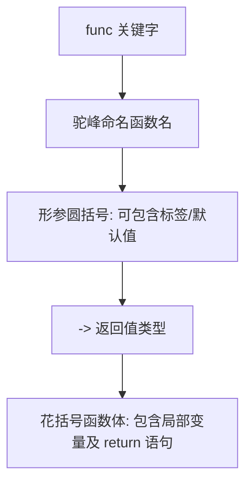

> [!NOTE] 关联笔记
> - 原始转写整理版：[[技术视野/01 第一周：全局认知 · Swift基础 · 开发环境/3_iOS零基础教程/11.函数-原始整理]]
> - 前序可选值篇：[[10.可选值]]

# Swift 基础实战教程：函数 (Functions)

在 Swift 开发中，**函数（Functions）** 是组织、复用和封装代码逻辑的核心构建块。在面向对象编程（OOP）中，定义在类、结构体或枚举内部的函数通常被称为**方法（Methods）**。

---

## 一、 函数的定义与基本语法

函数本质上是一个**命名的独立代码块**。通过将一段逻辑打包并赋予其名称，我们可以提高代码的可读性，并实现高效的代码复用。

### 1. 语法结构

Swift 声明函数使用关键字 `func`。一个标准函数的定义结构如下：

```swift
func 函数名(参数列表) -> 返回值类型 {
    // 函数体：执行的逻辑代码
    return 返回值
}
```

*   **`func` 关键字**：声明这是一个函数。
*   **函数名**：遵循驼峰命名法（CamelCase），首字母小写。
*   **参数列表**：位于圆括号 `()` 中，用于定义外部传入的数据类型，若无参数则留空。
*   **`->` 箭头**：指示返回值类型，若无返回值则可省略。
*   **大括号 `{}`**：包围函数体，内部为该函数被调用时要执行的代码。

### 2. 声明与调用 (Declaration & Calling)

> [!IMPORTANT]
> 声明函数只是定义了其逻辑并将其载入内存，并不会立即执行。要运行函数体内的代码，必须进行**显式调用**。

```swift
// 1. 声明函数
func greet() {
    print("Welcome to iOS development!")
}

// 2. 调用函数
greet() // 输出: Welcome to iOS development!
```

---

## 二、 参数传递：形参与实参

为了使函数更具通用性，我们可以使用**参数（Parameters）**将外部数据传递到函数内部。

### 1. 概念区分

| 概念 | 英文名称 | 定义 | 示例 |
| :--- | :--- | :--- | :--- |
| **形式参数（形参）** | Formal Parameters | 在函数定义中声明的占位变量，指定参数名与类型。 | `a` 和 `b` 在 `func add(a: Int, b: Int)` 中 |
| **实际参数（实参）** | Actual Parameters | 在调用函数时，实际传递给函数的具体数值。 | `5` 和 `6` 在 `add(a: 5, b: 6)` 中 |

### 2. 代码示例

```swift
// 声明带有两个形参的函数
func add(a: Int, b: Int) {
    let result = a + b
    print("计算结果: \(result)")
}

// 调用函数时传入实参
add(a: 10, b: 20) // 输出: 计算结果: 30
add(a: 100, b: 5) // 输出: 计算结果: 105
```

---

## 三、 默认参数值 (Default Parameter Values)

Swift 允许为参数设置**默认值**。在调用函数时，如果未提供该参数的值，函数将自动使用默认值。这被称为**缺省值**。

```swift
// 为 a 和 b 设置默认值 1
func multiply(a: Int = 1, b: Int = 1) {
    print("乘积: \(a * b)")
}

// 情况 1: 完全不传参，使用全部默认值
multiply() // 输出: 乘积: 1

// 情况 2: 只传入部分实参
multiply(a: 5) // b 使用默认值 1，输出: 乘积: 5

// 情况 3: 传入全部实参，覆盖默认值
multiply(a: 4, b: 5) // 输出: 乘积: 20
```

---

## 四、 返回值与变量作用域

### 1. 函数返回值

若希望函数在处理完毕后向调用者输出结果，可以通过 `->` 设定返回值类型，并在内部使用 `return` 语句返回。

```swift
// 声明带返回值的函数
func calculateSum(a: Int, b: Int) -> Int {
    return a + b
}

// 接收并使用返回值
let total = calculateSum(a: 8, b: 12)
print("外界获取的总和: \(total)") // 输出: 外界获取的总和: 20
```

### 2. 局部变量作用域 (Scope)

> [!WARNING]
> 在函数体内部定义的常量、变量以及参数，都是**局部变量**。它们的生命周期仅存在于函数体大括号 `{}` 的执行期间。一旦函数执行完毕，这些变量将被系统销毁，在函数外部无法直接访问。

```swift
func doSomething() {
    let internalMessage = "Hello" // 局部变量
    print(internalMessage)
}
// print(internalMessage) // 编译报错！无法访问局部变量
```

---

## 五、 参数标签与参数名称 (Argument Labels & Parameter Names)

Swift 提供了一种优雅的参数命名机制，支持分别为参数设置**外部标签（Argument Label）**和**内部名称（Parameter Name）**。

*   **外部标签 (Argument Label)**：外界调用函数时填写的名称，用于提高代码可读性，符合自然语言习惯。
*   **内部名称 (Parameter Name)**：在函数体内部写代码时使用的变量名。

### 1. 语法格式

```swift
func 函数名(外部标签 内部名称: 类型) {
    // 内部使用 “内部名称”
}
```

### 2. 代码示例

```swift
// number1 和 number2 是外部标签；a 和 b 是内部名称
func subtract(number1 a: Int, number2 b: Int) -> Int {
    return a - b // 内部只能使用 a 和 b
}

// 外界调用时必须使用外部标签 number1 和 number2
let result = subtract(number1: 20, number2: 5) 
print(result) // 输出: 15
```

### 3. 省略外部标签 `_`

如果不希望在调用函数时书写参数标签，可以使用下划线 `_` 代替外部标签：

```swift
func divide(_ a: Double, by b: Double) -> Double {
    return a / b
}

// 调用时，第一个参数省略标签，第二个参数使用标签 'by'
let answer = divide(10.0, by: 2.0)
print(answer) // 输出: 5.0
```

---

## 六、 章节总结与要点速查



*   **关键字**：使用 `func` 声明函数。
*   **执行方式**：声明不等于执行，必须使用 `函数名()` 进行调用。
*   **形参与实参**：形参是函数定义时的占位符，实参是调用时传入的实际数据。
*   **参数配置**：形参可以设置默认值；支持通过 `外部标签 内部名称` 的形式来兼顾外部语意与内部简洁性。
*   **返回值**：使用 `->` 设定类型，用 `return` 返回数据。
*   **作用域**：函数内定义的变量只在 `{}` 范围内有效。
