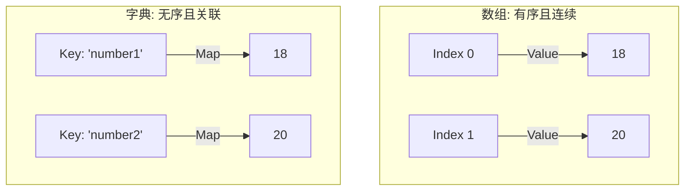

> [!NOTE] 关联笔记
> - 原始转写整理版：[[技术视野/01 第一周：全局认知 · Swift基础 · 开发环境/3_iOS零基础教程/12.字典-原始整理]]
> - 前序函数篇：[[11.函数-实战教程]]

# Swift 基础实战教程：字典 (Dictionaries)

在 Swift 中，**字典（Dictionary）** 是一种非常实用的无序集合类型，它使用 **键值对（Key-Value Pairs）** 的形式存储相同类型的数据。每个值（Value）都关联着一个唯一的键（Key），键作为查找该值的标识符。

---

## 一、 字典与数组的对比

| 特性 | 数组 (Array) | 字典 (Dictionary) |
| :--- | :--- | :--- |
| **元素组织** | 有序的集合 | 无序的集合 |
| **存储物理结构**| 内存空间连续 | 内存空间不连续 |
| **访问方式** | 通过数值索引（Index，从 0 开始） | 通过唯一的键（Key/标签） |
| **重复性限制** | 元素值可以重复 | 键（Key）必须唯一，值（Value）可以重复 |



---

## 二、 字典的声明与初始化

在声明字典时，必须同时显式指定或隐式推断**键的类型**和**值的类型**，写作 `[KeyType: ValueType]`。

### 1. 声明并创建一个空字典

```swift
// 方法 1: 使用初始化语法
var emptyDict1 = [String: Int]()

// 方法 2: 声明类型后赋空字典字面量
var emptyDict2: [String: Int] = [:]
```

### 3. 字面量初始化（类型推断）

若在创建时直接提供初始键值对，Swift 编译器能自动推断出字典的键值类型：

```swift
// 自动推断为 [String: Int] 类型的字典
var scores = ["Chinese": 95, "Math": 98, "English": 90]
```

---

## 三、 字典的 CRUD (增删改查) 操作

### 1. 读取数据（下标访问）

> [!WARNING] 核心考点：可选值 (Optionals)
> 当使用下标访问字典中的键时，如 `scores["Math"]`，其返回的值是**可选值类型（Optional）**。这是因为该键可能并不存在于字典中，若不存在则会返回 `nil`。
> 因此，获取到的值在使用前必须经过**可选绑定（Optional Binding）**或**提供默认值**。

```swift
// 错误示范：不能直接把 scores["Math"] 赋给非可选类型的变量
// let mathScore: Int = scores["Math"] // 编译报错！

// 正确示范 1: 使用 if-let 可选绑定
if let mathScore = scores["Math"] {
    print("数学成绩是: \(mathScore)")
} else {
    print("未找到该科目的成绩")
}

// 正确示范 2: 使用空合运算符 (??) 提供兜底值
let historyScore = scores["History"] ?? 0 // 若不存在则返回 0
```

### 2. 添加与修改数据

添加新元素与修改已存在元素的语法格式完全相同：`dictionary[key] = value`。

```swift
// 1. 添加新键值对（若键不存在）
scores["Science"] = 88 // 字典中新增一项 Science

// 2. 修改键值对（若键已存在）
scores["Chinese"] = 100 // 键 Chinese 对应的值由 95 更新为 100
```

### 3. 删除数据

可以通过将对应键的值设为 `nil`，或者调用 `removeValue(forKey:)` 方法来删除对应的键值对。

```swift
// 方法 1: 将值赋为 nil 自动移除该项
scores["English"] = nil

// 方法 2: 使用 removeValue 方法（会返回被删除的值的可选类型）
if let removedValue = scores.removeValue(forKey: "Science") {
    print("成功删除了 Science 成绩: \(removedValue)")
}
```

---

## 四、 字典的常用属性

*   **`count`**：返回字典中键值对的个数。
*   **`isEmpty`**：判断字典是否为空，当且仅当 `count == 0` 时返回 `true`。

```swift
print(scores.count)   // 输出剩余的键值对个数
if scores.isEmpty {
    print("字典已空")
}
```

---

## 五、 字典的遍历 (Iteration)

使用 `for-in` 循环可以轻松地对字典进行遍历。在循环中，每一项会以 `(key, value)` 的元组形式被解构出来。

### 1. 同时遍历键与值

```swift
for (subject, score) in scores {
    print("科目: \(subject), 成绩: \(score)")
}
```

### 2. 仅遍历键 (Keys)

使用 `.keys` 属性只获取字典中所有的键：

```swift
for subject in scores.keys {
    print("已录入成绩的科目: \(subject)")
}
```

### 3. 仅遍历值 (Values)

使用 `.values` 属性只获取字典中所有的值：

```swift
for score in scores.values {
    print("分数线: \(score)")
}
```

---

## 六、 章节总结与要点速查

*   **声明语法**：`[Key: Value]`，键和值类型必须在声明时明确。
*   **无序性**：字典中的元素没有固定物理顺序，每次运行或打印的顺序都可能不同。
*   **安全访问**：使用下标检索值返回的是 `ValueType?`（可选值），必须进行安全解包（`if-let` 或 `??`）以防崩溃。
*   **增/改**：`dict[key] = newValue`
*   **删**：`dict[key] = nil` 或 `dict.removeValue(forKey: key)`
*   **遍历解构**：`for (key, value) in dict`
