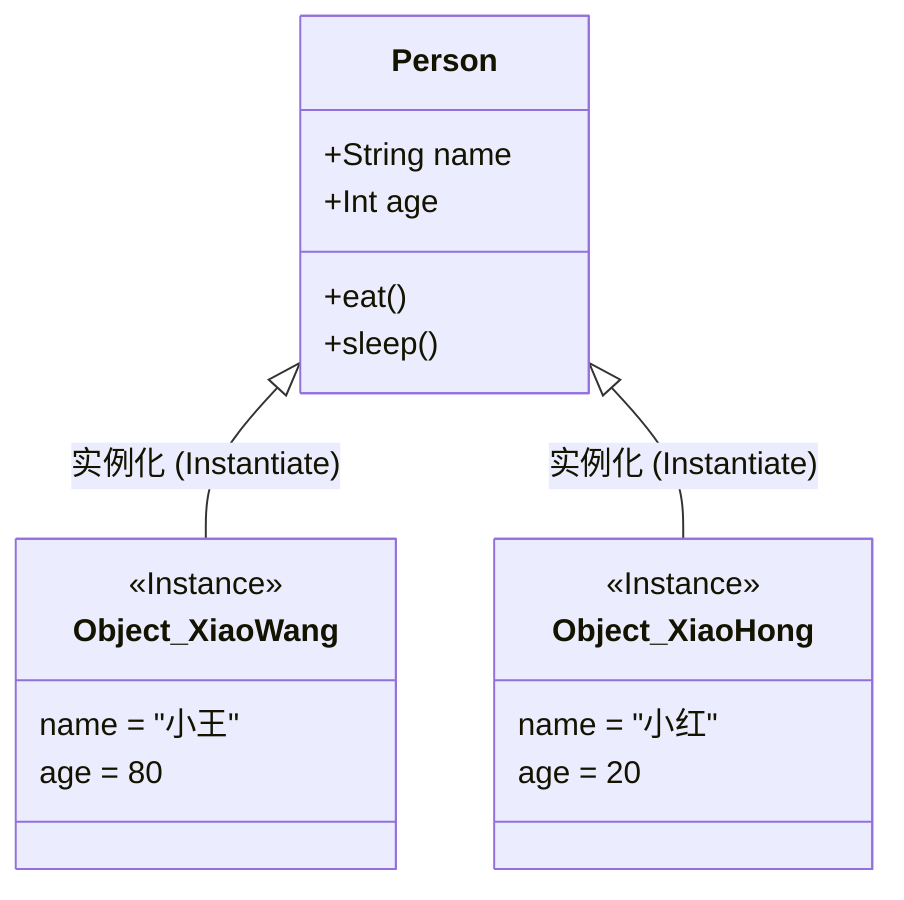

> [!NOTE] 关联笔记
> - 原始转写整理版：[[技术视野/01 第一周：全局认知 · Swift基础 · 开发环境/3_iOS零基础教程/13.面向对象-原始整理]]
> - 前序字典篇：[[12.字典-实战教程]]

# Swift 基础实战教程：面向对象编程 (OOP)

面向对象编程（Object-Oriented Programming, OOP）是 Swift 语言中构建复杂应用的核心编程思想。与传统的“面向过程”逐行顺序执行代码不同，面向对象主张通过模拟现实世界中的具体实体来设计程序。

---

## 一、 面向对象核心概念

### 1. 万物皆对象 (Everything is an Object)

在程序设计中，**对象（Object）** 指的是一个具体存在的、可交互的**实体（Instance）**。它可以是物理存在的（如一部 iPhone、一只猫），也可以是抽象存在的虚拟概念（如一个订单、一个用户账户）。

### 2. 类与对象的关系

*   **类 (Class)**：对一组具有相同**状态（特征）**和**行为（功能）**的对象的**抽象模板**（如“人类”）。它是不占具体内存的虚指。
*   **对象 (Object) / 实例 (Instance)**：根据“类”这个模板创建出来的**具体实体**（如“小王”）。它在内存中占有独立的存储空间。



---

## 二、 类的结构与声明语法

在 Swift 中，类通过关键字 `class` 进行声明，其主要由**状态（属性）**和**行为（方法）**两部分构成。

```swift
class 类名 {
    // 1. 状态 (属性/成员变量): 描述类具有的特征
    var 属性名: 数据类型 = 默认值
    
    // 2. 行为 (方法/函数): 描述类能执行的操作
    func 方法名() {
        // 方法体
    }
}
```

> [!IMPORTANT]
> **关于默认值（存储属性的初始化）**：
> Swift 要求类中所有非可选（Non-Optional）类型的存储属性在声明时必须赋予初始值，或者在构造器（Initializer）中进行初始化，否则会导致编译报错。

---

## 三、 代码实战：声明与实例化

下面我们以设计一个“汽车（Car）”类为例，演示面向对象的基本代码实践。

### 1. 编写汽车类 (Car Class)

```swift
class Car {
    // 成员属性 (存储属性) - 描述状态
    var brand: String = "未命名品牌"
    var color: String = "白色"
    var speed: Double = 0.0
    
    // 成员方法 - 描述行为
    func startEngine() {
        print("\(color)的\(brand)引擎已启动！")
    }
    
    func accelerate(to targetSpeed: Double) {
        speed = targetSpeed
        print("汽车加速至 \(speed) km/h。")
    }
    
    func brake() {
        speed = 0.0
        print("紧急刹车！汽车已停止运转。")
    }
}
```

### 2. 实例化对象与属性访问

使用类名加括号 `()` 实例化对象，并使用 **点语法（Dot Syntax）** 读写属性和调用方法。

```swift
// 1. 实例化产生两个相互独立的实体对象
let myCar = Car()
let dreamCar = Car()

// 2. 使用点语法为 myCar 属性赋值
myCar.brand = "Tesla Model 3"
myCar.color = "红色"

// 3. 调用 myCar 的行为
myCar.startEngine()          // 输出: 红色的Tesla Model 3引擎已启动！
myCar.accelerate(to: 120.0) // 输出: 汽车加速至 120.0 km/h。

// 4. dreamCar 依旧保持默认属性，独立互不干扰
dreamCar.startEngine()       // 输出: 白色的未命名品牌引擎已启动！
```

---

## 四、 章节总结与要点速查

*   **关键字**：使用 `class` 关键字声明自定义类。
*   **命名规范**：类名使用大驼峰命名（UpperCamelCase），方法名和属性名使用小驼峰命名（lowerCamelCase）。
*   **状态与行为**：属性（`var`/`let`）描述对象的状态特征，方法（`func`）描述对象的行为动作。
*   **实例化**：`let instance = ClassName()` 创建在内存中存储的独立实体。
*   **访问机制**：通过点操作符 `.`（点语法）来读写对象的内部变量和触发其方法。
