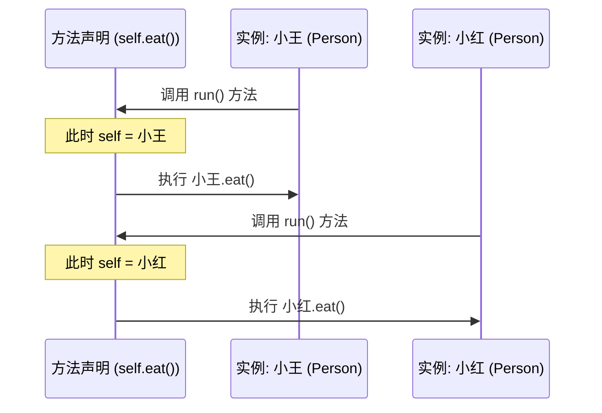

> [!NOTE] 关联笔记
> - 前序面向对象篇：[[13.面向对象-实战教程]]

# Swift 基础实战教程：`self` 关键字与计算属性

在面向对象编程中，维护类内部数据的安全性以及理清各实例对象之间的边界，是高级软件开发的重要内容。本教程将深入解析 Swift 中的实例指针 `self` 与**计算属性（Computed Properties）**的控制机制。

---

## 一、 `self` 关键字的原理与工作流

在 Swift 中，**`self`** 是一个特殊的动态指针，指代**当前方法正在操作的那个实例对象（Instance）本身**。

### 1. self 动态绑定工作流



### 2. 必须显式声明 `self` 的命名冲突场景

当方法参数（局部变量）与类的属性（成员变量）同名时，Swift 会根据“就近原则”将变量名解析为方法参数。此时必须用 `self.` 来明确指示类成员属性。

```swift
class Person {
    var name: String = "婴儿"
    
    // 参数与属性同名: name
    func updateName(name: String) {
        // name = name       // 错误：两者都会被当做形参 name
        self.name = name     // 正确：将形参赋值给当前实例的存储属性 name
    }
}
```

---

## 二、 属性保护与计算属性 (Computed Properties)

直接暴露成员变量允许外界任意读写可能会造成数据污染（例如：将年龄设为负数）。通过**计算属性**的 `get` 和 `set` 拦截器，可以为数据建立安全屏障。

### 1. 存储属性 vs 计算属性

*   **存储属性 (Stored Property)**：在内存中占用空间，实际存储具体数值的变量（如普通的成员变量）。
*   **计算属性 (Computed Property)**：不占用内存物理空间。它提供 `get`（取值）和 `set`（赋值）逻辑块，用来间接获取和更新底层存储属性的值。

```mermaid
flowchart LR
    A[外部调用: instance.Age = 160] -->|Set 拦截| B{是否 > 150 ?}
    B -->|Yes| C[存储属性 age = 150]
    B -->|No| D[存储属性 age = 160]
    
    E[外部调用: print(instance.Age)] -->|Get 拦截| F[读取 age 的数值]
    F -->|Return| G[显示在终端]
```

### 2. 计算属性开发模版

```swift
class Person {
    // 1. 私有化底层存储属性，避免外部直接访问
    private var age: Int = 0
    
    // 2. 声明同名的计算属性，大写首字母，内部实现读写拦截
    var Age: Int {
        get {
            // 外部读取 instance.Age 时触发，必须使用 return 返回对应值
            return self.age
        }
        set(newValue) {
            // 外部对 instance.Age = 值 进行赋值时触发
            // newValue 代表传入的新值，若省略括号，默认参数名为 newValue
            if newValue > 150 {
                self.age = 150
            } else if newValue < 0 {
                self.age = 0
            } else {
                self.age = newValue
            }
        }
    }
}
```

---

## 三、 只读计算属性 (Read-Only Computed Properties)

若某个属性的值完全依赖于其他属性的计算结果，且不允许被外界强行写入，我们可以将其声明为**只读计算属性**。

### 1. 声明语法

只读计算属性**只有 `get` 块，没有 `set` 块**。由于只有读取逻辑，我们可以省略 `get` 关键字和大括号，直接编写返回逻辑。

```swift
class Rectangle {
    var width: Double = 0.0
    var height: Double = 0.0
    
    // 声明只读计算属性 area（面积）
    var area: Double {
        return width * height // 隐式省略了 get 声明
    }
}

let rect = Rectangle()
rect.width = 10.0
rect.height = 5.0
print(rect.area) // 输出: 50.0
// rect.area = 100.0 // 编译报错！只读属性不可被赋值。
```

---

## 四、 章节总结与要点速查

*   **self 含义**：类方法中的 `self` 动态绑定至当前正在操作的那个内存对象实体。
*   **命名防冲突**：方法形参和存储属性同名时，存储属性必须冠以 `self.` 前缀。
*   **安全拦截器 (get/set)**：
    *   `get`：定义属性被读取时的中转逻辑，必须有 `return` 返回。
    *   `set(newValue)`：定义属性被赋值时的校验逻辑，内置新值变量 `newValue`（可自定义别名）。
*   **只读设计**：只保留 `get` 块即为只读属性，在 Swift 中可以用极简语法 `var name: Type { return expression }` 快速构建。
