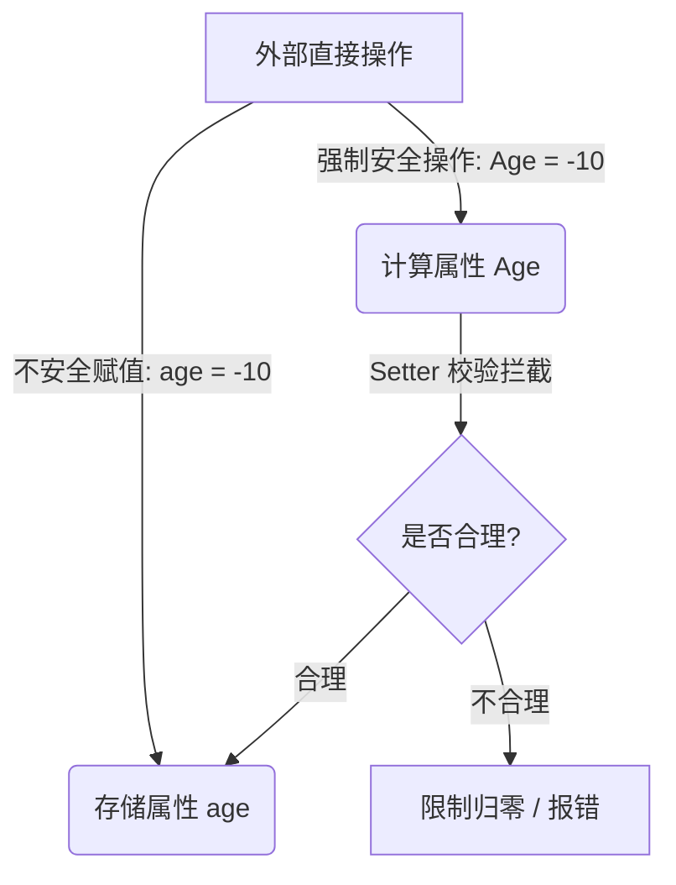
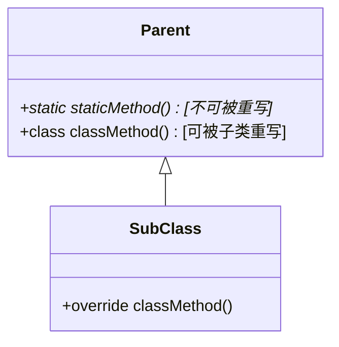

> [!NOTE] 关联笔记
> - 前序属性篇：[[14.属性-实战教程]]

# Swift 基础实战教程：访问控制与类方法

在面向对象架构设计中，数据安全和合理的继承边界至关重要。本教程将介绍如何通过访问控制修饰符（Access Control）来实现数据封装，以及如何使用类变量和类方法为类型本身定义属性与行为。

---

## 一、 数据封装：隐藏底层存储属性

在 Swift 开发中，若不显式设定访问控制权限，外部使用者可以通过点语法直接读写底层的存储变量，从而轻易绕过我们在外部计算属性（如 `Age`）中建立的数据校验和安全屏障。



为了强制外部仅通过我们的计算属性接口，我们必须将底层变量声明为 **`private`（私有访问级别）**。

```swift
class Person {
    // 1. private 关键字修饰，外部无法直接通过 instance.age 访问
    private var age: Int = 0 
    
    // 2. 默认权限 (internal)，外界必须通过此计算属性访问底层 age
    var Age: Int {
        get { return self.age }
        set {
            if newValue > 150 { self.age = 150 }
            else if newValue < 0 { self.age = 0 }
            else { self.age = newValue }
        }
    }
}
```

---

## 二、 Swift 访问控制级别速查表

Swift 共提供了五种访问控制级别（本节聚焦最常用的四种）。以下为按范围从大到小排列的对比表：

| 修饰符 | 级别名称 | 访问控制范围说明 |
| :--- | :--- | :--- |
| **`public`** | 公开级别 | 权限最大，项目内及其他导入了该模块/框架的外部代码均可访问。 |
| **`internal`** | 模块级别 | **Swift 默认级别**。在同一个项目/组件模块内自由访问，外部模块不可见。 |
| **`fileprivate`** | 文件私有 | 访问范围被限定在**声明它的那个 `.swift` 文件内部**。 |
| **`private`** | 类私有级别 | 权限最小，仅在**声明它的类的大括号 `{}` 内部**可见，外部完全不可见。 |

---

## 三、 类变量（类型属性）与成员变量（实例属性）

*   **成员属性（Instance Properties）**：属于具体的对象个体。每个实例持有一份独立内存，必须实例化产生对象后方能使用。
*   **类变量（Type Properties）**：直接属于**类本身**。不论创建多少个实例，该变量在内存中永远只有一份共享的数据。

在 Swift 中使用 **`static`** 声明类变量：

```swift
class Person {
    static var species: String = "智人" // 类变量
    var name: String = "未起名"           // 成员变量
}

// 1. 访问类变量：直接使用类名访问，无需实例化
print(Person.species) // 输出: 智人

// 2. 访问成员变量：必须实例化对象
let p = Person()
print(p.name)         // 输出: 未起名
```

---

## 四、 类方法中的 `static` 与 `class`

类方法（类型方法）可以直接通过类名触发。Swift 提供了两种方式来声明类方法，它们在**子类继承和覆写（Override）**时的表现各不相同。



### 1. static 方法（不能被重写）
使用 `static` 修饰的类方法，相当于在语言级别被隐式声明为 `final class`，**禁止任何子类对其进行重写**：

```swift
class Calculator {
    static func add(_ a: Int, _ b: Int) -> Int {
        return a + b
    }
}
```

### 2. class 方法（可被子类重写）
使用 `class` 修饰的类方法，**允许子类通过 `override` 关键字进行重写**以提供差异化的功能：

```swift
class Logger {
    class func logMessage(_ msg: String) {
        print("[Log]: \(msg)")
    }
}

class DetailedLogger: Logger {
    // 重写父类的 class 方法
    override class func logMessage(_ msg: String) {
        print("[Detailed-Log @ \(Date())]: \(msg)")
    }
}

DetailedLogger.logMessage("系统启动") // 输出重写后的复杂日志信息
```

> [!NOTE] Final 关键字的妙用
> 在常规成员变量或成员方法声明前加上 `final` 关键字，可以直接锁定该成员，阻止子类对其进行覆写。而 `static` 修饰的类变量和类方法等同于内置了 `final` 限制。
