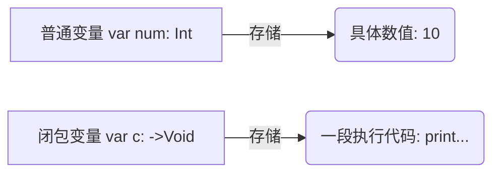

> [!NOTE] 关联笔记
> - 原始转写整理版：[[技术视野/01 第一周：全局认知 · Swift基础 · 开发环境/3_iOS零基础教程/16.闭包与泛型-原始整理]]
> - 前序访问控制篇：[[15.访问控制和类方法-实战教程]]

# Swift 基础实战教程：闭包、输入输出参数与泛型

在 Swift 开发（尤其是未来的 iOS 页面开发与网络请求）中，**闭包**与**泛型**是极其核心的语言特性。本教程将通过逻辑架构拆解与代码实战，带你彻底攻克这两个高级语法的难关。

---

## 一、 闭包：以变量形式存储的函数代码块

**闭包（Closure）** 是自包含的函数代码块，可以在代码中被传递和使用。你可以将其通俗理解为 **“函数类型的变量”**。



### 1. 闭包类型声明与普通变量对比
在 Swift 中声明闭包变量，需要使用 `(形参列表) -> 返回值类型` 的方式定义其函数签名。

*   **声明普通变量**：`var 变量名: 类型 = 初始值`
*   **声明闭包变量**：`var 闭包名: (参数类型列表) -> 返回值类型`

### 2. 闭包的实战语法

#### 场景 A：无参无返回值的极简闭包
```swift
// 1. 声明函数类型为 (无参) -> (无返回值)
var simpleClosure: () -> Void

// 2. 将大括号代码块直接赋值给闭包变量
simpleClosure = {
    print("这是一个简单的闭包执行逻辑。")
}

// 3. 执行闭包
simpleClosure() // 输出: 这是一个简单的闭包执行逻辑。
```

#### 场景 B：带参数与返回值的标准闭包
当闭包包含参数时，必须在赋值大括号的开头定义局部变量名，并用关键字 **`in`** 与闭包执行体进行分割。

```swift
// 1. 声明闭包接收两个参数 (String, Int) 并返回一个 String
var formatClosure: (String, Int) -> String

// 2. 使用 'in' 关键字将形参与方法体隔离
formatClosure = { (name: String, count: Int) -> String in
    return "用户 \(name) 连续签到了 \(count) 天。"
}

// 3. 调用并获取结果
let message = formatClosure("Cooper", 7)
print(message) // 输出: 用户 Cooper 连续签到了 7 天。
```

---

## 二、 双向值引用参数：`inout` 关键字

Swift 函数的参数默认是不可变的局部常量（`let` 属性）。如果希望在函数内部直接修改传入实参的值，我们需要将形参声明为 **`inout`（输入输出参数）**。

### 1. `inout` 交换变量实战
```swift
// 声明参数为可读写引用的 inout 属性
func swapTwoInts(a: inout Int, b: inout Int) {
    let temp = a
    a = b
    b = temp
}
```

### 2. 实参的前缀标记限制
调用带有 `inout` 参数的函数时，必须在传入的变量名前添加 **`&` 符号（表示传址引用/取地址操作）**，且被传入的实参必须是用 `var` 声明的变量，不能是 `let` 常量。

```swift
var firstScore = 80
var secondScore = 95

// 传入地址引用
swapTwoInts(a: &firstScore, b: &secondScore)
print("First: \(firstScore), Second: \(secondScore)") // 输出: First: 95, Second: 80
```

---

## 三、 泛型：构建高重用性的类型无关架构

当遇到“执行逻辑完全相同，但处理的数据类型不同”的场景时，频繁编写重载函数会导致代码冗余。**泛型（Generics）** 允许你使用**占位符**来编写灵活且可重用的通用方法。

### 1. 泛型函数的声明结构

```swift
func 函数名<T>(形参1: inout T, 形参2: inout T) {
    // 方法体可以直接使用 T 类型的变量
}
```

### 2. 泛型交换函数实战

我们将上面仅支持 `Int` 的交换方法，升级为支持全类型的泛型方法：

```swift
// T 代表任意待推断的类型占位符
func swapAnyValues<T>(a: inout T, b: inout T) {
    let temp = a
    a = b
    b = temp
}
```

### 3. 类型推断与运行机制
泛型在被调用时，Swift 编译器会根据实际传入的参数类型，自动进行类型绑定推断：

```swift
// 1. 传入 Double 变量，T 自动推断为 Double
var val1 = 12.5
var val2 = 99.8
swapAnyValues(a: &val1, b: &val2) // 正常交换 Double

// 2. 传入 String 变量，T 自动推断为 String
var str1 = "哈"
var str2 = "嘿"
swapAnyValues(a: &str1, b: &str2) // 正常交换 String
```

---

## 四、 章节总结与要点速查

*   **闭包**：
    - 闭包是可以在代码中传递的函数块。
    - 赋值时内部第一行用 `(局部参数名列表) in` 隔开形参和执行体代码。
*   **`inout` 参数**：
    - 默认形参为常量不可改；使用 `inout` 修饰后可改。
    - 调用时传入参数前必须冠以 `&` 符号，且必须传入 `var` 变量。
*   **泛型**：
    - 用 `<T>` 占位符定义泛型，在调用时由编译器自动推断其具体实际类型。
    - 极大地提高了方法的复用性，避免了重复编写类似逻辑。
