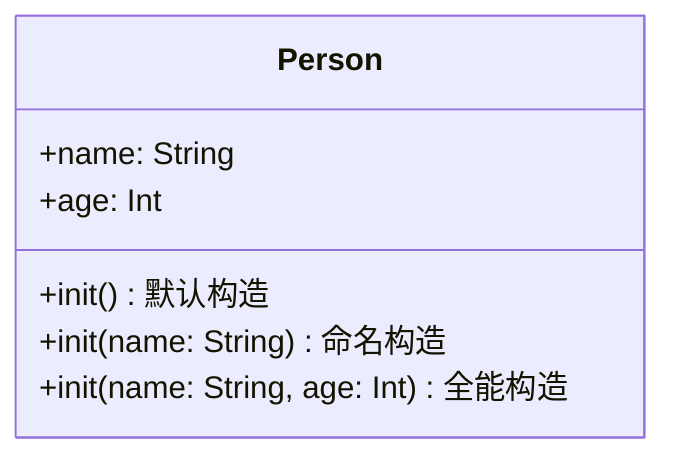

> [!NOTE] 关联笔记
> - 前序闭包与泛型篇：[[16.闭包与泛型-实战教程]]

# Swift 基础实战教程：构造器 `init` 与重载

Swift 是一门强类型安全语言。在类（Class）被实例化为内存对象的时刻，它内部所有的存储属性（Stored Properties）必须有确定的值。本教程将深入剖析 Swift 中的**初始化构造器（Initializers）**的实现与重载设计。

---

## 一、 初始化安全规则 (Initialization Safety Rules)

在 Swift 中，如果一个存储属性被声明为非可选类型（Non-Optional），且没有在定义时直接给出默认值，编译器就会抛出报错：
`Class 'ClassName' has no initializers`

```swift
// ❌ 错误声明：属性未初始化，会导致编译报错
class Person {
    var name: String
    var age: Int
}
```

要解决这个报错，我们有两个方案：
1.  **声明时赋默认值**：`var age: Int = 0`
2.  **在构造器中完成赋初值**：使用 `init` 方法进行延迟设置。

---

## 二、 声明构造器：`init` 关键字

在实例化一个类时（例如：`let p = Person()`），类名后紧跟的圆括号代表**调用该类的构造器方法**。

```swift
class Person {
    var name: String
    var age: Int
    
    // 构造器声明 (没有 func 关键字)
    init() {
        self.name = "新生儿"
        self.age = 0
        print("Person 构造函数已成功触发！")
    }
}

// 实例化时自动调用上述构造器
let baby = Person() // 控制台打印: Person 构造函数已成功触发！
print(baby.name)   // 输出: 新生儿
```

---

## 三、 构造器重载 (Initializer Overloading)

**方法重载（Method Overloading）** 指在同一范围内，方法名相同，但**参数列表（包括参数标签、参数类型、参数数量）**不同的设计模式。

我们可以通过重载 `init` 方法，为类设计多样化的初始化入口。



### 1. 构造器重载代码实现
```swift
class Person {
    var name: String
    var age: Int
    
    // 构造器 A：无参默认构造
    init() {
        self.name = "未命名"
        self.age = 0
    }
    
    // 构造器 B：带参数的重载构造（使用 self 做命名冲突处理）
    init(name: String, age: Int) {
        self.name = name
        self.age = age
    }
}
```

### 2. 实例化匹配
编译器在编译阶段会根据传入的实参标签，自动匹配对应的重载构造器：
```swift
// 调用构造器 A
let someone = Person()
print(someone.name) // 输出: 未命名

// 调用构造器 B
let manager = Person(name: "Cooper", age: 30)
print(manager.name) // 输出: Cooper
```

---

## 四、 析构方法 `deinit` 与生命周期

### 1. deinit 的作用与自动调用
**析构方法（Deinitializer）** 对应 `deinit` 关键字，在类对象实例被系统销毁释放前的那一刹那自动调用，用于释放外部资源（如关闭文件流、注销通知）。

```swift
class Session {
    init() {
        print("Session 开始")
    }
    
    deinit {
        print("Session 结束，资源自动释放")
    }
}
```

### 2. 生命周期与大括号作用域限制
在 Swift 中，局部变量的生命周期被限定在它最近的那个大括号作用域 `{}`（Scope）之内：

```swift
func runDemo() {
    print("--- 步骤 1 ---")
    if true {
        let activeSession = Session() // 构造器触发，输出: Session 开始
        print("--- 步骤 2 ---")
    } // 出了 if 的大括号作用域，activeSession 的引用计数归零被销毁
      // deinit 被自动调用，输出: Session 结束，资源自动释放
    print("--- 步骤 3 ---")
}

runDemo()
```

---

## 五、 章节总结与要点速查

*   **构造机制**：使用 `init` 声明构造器。初始化方法必须保证所有非可选存储属性被赋予初值。
*   **方法重载**：构造器 `init` 的函数签名（标签、数量、类型）只要不同，即构成重载，可声明多个。
*   **析构机制**：`deinit` 没有括号和参数，由 ARC 自动调用，不可手动触发。
*   **局部变量生存期**：变量的作用域取决于其所在的代码大括号 `{}`，离开大括号时引用断开。
