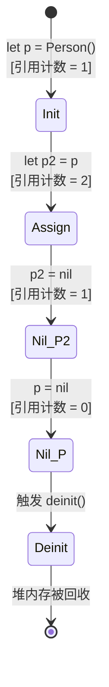

> [!NOTE] 关联笔记
> - 原始转写整理版：[[技术视野/01 第一周：全局认知 · Swift基础 · 开发环境/3_iOS零基础教程/18.内存管理-原始整理]]
> - 前序初始化篇：[[17.初始化-实战教程]]

# Swift 基础实战教程：堆栈内存与 ARC 机制

在 Swift 开发中，深入理解变量在内存中的存储机制（栈区与堆区）以及内存自动回收的底层原理，能帮助我们写出高性能、无内存泄漏的代码。

---

## 一、 值类型与引用类型的拷贝机制

Swift 将数据类型划分为**值类型（Value Type）**与**引用类型（Reference Type）**。

### 1. 值类型与深拷贝 (Deep Copy)
值类型（如 `struct`、`Int`、`String`、`Array`、`Dictionary`）在进行赋值或函数传参时，执行的是**深拷贝**：系统会在内存中复制一份完全独立的数据副本。

```swift
var a = 3
var b = a // 深拷贝：在内存中创建另一个独立的 3
a = 4
print(b)  // 输出: 3 (a 的改变完全不影响 b)
```

### 2. 引用类型与浅拷贝 (Shallow Copy)
引用类型（如 `class`）在赋值或传参时，执行的是**浅拷贝**：系统仅拷贝指向该对象实体的内存地址指针，两个变量指向相同的内存区块。

```swift
let car1 = Car()
car1.speed = 100

let car2 = car1 // 浅拷贝：共享同一个物理汽车对象
car2.speed = 200
print(car1.speed) // 输出: 200 (修改 car2 导致 car1 的值也发生变化)
```

---

## 二、 栈区与堆区内存模型

Swift 运行时的内存分配主要分为**栈区（Stack）**与**堆区（Heap）**协作模型。

```mermaid
flowchart TD
    subgraph Stack [栈内存 (Stack)]
        direction TB
        V1[变量: car1] -->|存储内存指针| P1[0x00FF88]
        V2[变量: car2] -->|复制指针| P1
    end
    subgraph Heap [堆内存 (Heap)]
        direction TB
        Instance[Car 物理对象 <br> speed = 200]
    end
    P1 -->|寻址访问| Instance
```

### 1. 栈区 (Stack)
*   **特性**：系统自动分配和释放，内存连续，读写极其高效。
*   **存放内容**：局部变量、常量以及指向堆区对象的**内存指针（地址）**。值类型的数据往往直接存放在栈区。

### 2. 堆区 (Heap)
*   **特性**：动态分配，空间大，但内存不连续，读写速度略慢。
*   **存放内容**：通过 `class` 实例化产生的**对象实体**。堆区内存的生命周期不能依靠大括号作用域自动释放，需要专门的内存管理机制。

---

## 三、 ARC（自动引用计数）回收原理

为了自动回收堆区内存中的废弃对象，Swift 引入了 **ARC（Automatic Reference Counting）** 机制。

### 1. 引用计数工作流
堆内存中的每个类实例都维护一个**引用计数器（Reference Count）**，用来记录当前有多少个强引用指针指向该实例。



### 2. 代码实战验证 ARC 与 `deinit`
我们可以通过可选类型（Optional）的置空操作，人为降低引用计数，来观察对象的回收。

```swift
class Monitor {
    var deviceId: String
    
    init(id: String) {
        self.deviceId = id
        print("设备 \(deviceId) 已上线")
    }
    
    deinit {
        print("设备 \(deviceId) 已下线并释放内存！")
    }
}

// 1. 实例化可选类型变量（引用计数 = 1）
var activeMonitor: Monitor? = Monitor(id: "A-101") // 输出: 设备 A-101 已上线

// 2. 新增指针引用（引用计数 = 2）
var backupMonitor = activeMonitor 

// 3. 断开第一个指针（引用计数变为 1，不触发销毁）
activeMonitor = nil 
print("主监控已关闭，备份监控依然存活")

// 4. 断开最后一个强引用指针（引用计数归零，触发 deinit）
backupMonitor = nil // 输出: 设备 A-101 已下线并释放内存！
```

---

## 四、 章节总结与要点速查

*   **值类型**：存储在栈区，赋值进行深拷贝，修改时相互隔离（如 `struct`）。
*   **引用类型**：实体存储在堆区，栈区只存指针；赋值进行浅拷贝，修改时数据联动（如 `class`）。
*   **ARC 回收**：系统通过实时增减引用计数来管理堆内存；当计数降为 0 时，自动调用 `deinit` 并回收内存。
*   **置空销毁**：通过将可选类型变量设为 `nil`，可以断开其对堆区对象的指针引用。
