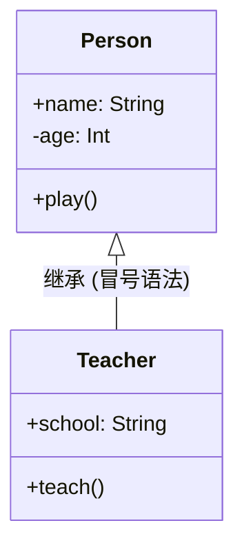

> [!NOTE] 关联笔记
> - 原始转写整理版：[[技术视野/01 第一周：全局认知 · Swift基础 · 开发环境/3_iOS零基础教程/19.继承-原始整理]]
> - 前序初始化篇：[[17.初始化-实战教程]]

# Swift 基础实战教程：继承、重写与多态性

在面向对象编程（OOP）中，封装、继承与多态是构建大型复杂软件系统的基石。本教程将通过 Swift 语言对这三大核心特征进行深度的实战解析。

---

## 一、 面向对象三大特征之：封装 (Encapsulation)

**封装**的本质是“信息隐藏”：将数据（属性）和操作数据的逻辑（方法）合并在一个类中，并通过**访问控制修饰符**限制外界对内部状态的直接访问。

```swift
class Account {
    // 隐藏敏感余额，防止被外部代码绕过规则直接篡改
    private var balance: Double = 0.0
    
    // 仅对外暴露有限的安全接口
    func deposit(amount: Double) {
        if amount > 0 {
            balance += amount
        }
    }
    
    func showBalance() {
        print("当前余额为: \(balance)")
    }
}
```

---

## 二、 继承语法与成员访问控制 (Inheritance)

子类（Subclass）可以继承父类（Superclass）的非私有属性和方法，从而实现代码的复用与派生。



### 1. 继承语法实现
```swift
class Person {
    var name: String = "未命名"
    private var age: Int = 18 // 私有变量，子类无法直接修改
    
    func play() {
        print("我是 \(name)，年龄 \(age)")
    }
}

// Teacher 继承自 Person
class Teacher: Person {
    var school: String = "光明小学"
    
    func teach() {
        // 可以直接访问父类的公开属性 name
        print("教师 \(name) 正在 \(school) 授课") 
    }
}
```

### 2. 私有成员的“隐式存在”
尽管子类 `Teacher` 内部无法直接读写 `age` 属性，但该属性依然包含在 `Teacher` 实例的堆内存中。在外部调用继承自父类的 `play()` 方法时，它仍会正常访问并打印这个隐藏的私有变量。

---

## 三、 重写构造器：两阶段初始化顺序

当子类中新增了需要初始化的属性时，我们必须在构造器中处理子类属性并配合父类的初始化。重写构造器需要使用 `override` 关键字，并显式调用 `super.init()`。

### 🚨 Swift 初始化安全顺序准则：
1.  **第一阶段**：先初始化子类自己独有的存储属性。
2.  **第二阶段**：调用 `super.init()`，由父类完成父类属性的初始化。

```swift
class Teacher: Person {
    var school: String
    
    // 重写父类的默认无参构造器
    override init() {
        // ❌ 错误做法：不能在自己属性赋初值前调用 super.init()
        // super.init()
        
        self.school = "希望小学" // 1. 先初始化子类属性
        
        super.init()            // 2. 再调用父类构造器完成继承部分的初始化
    }
}
```

---

## 四、 方法重写 (Method Overriding)

子类可以通过重写父类的方法来定制自己的行为。

*   **完全覆盖**：不调用 `super`，直接编写全新的逻辑。
*   **功能扩展**：在重写的方法内首先或最后调用 `super.method()`，以保留并追加父类的原生行为。

```swift
class Teacher: Person {
    override func play() {
        // 先调用父类的原方法，输出基本信息
        super.play() 
        // 追加教师特有的扩展打印
        print("备课是我的日常休闲")
    }
}
```

---

## 五、 多态 (Polymorphism) 与动态绑定

**多态性**是指“父类的变量/指针可以指向子类的实例对象，并在运行时根据所指对象的真实类型来执行不同的方法”。

### 多态经典案例实现
```swift
class Animal {
    func makeNoise() {
        print("动物发出叫声")
    }
}

class Dog: Animal {
    override func makeNoise() {
        print("🐶 汪汪汪！")
    }
}

class Cat: Animal {
    override func makeNoise() {
        print("🐱 喵喵喵～")
    }
}
```

### 运行时测试
```swift
// 声明一个父类类型的容器变量
var pet: Animal

pet = Dog()
pet.makeNoise() // 运行期动态绑定，输出: 🐶 汪汪汪！

pet = Cat()
pet.makeNoise() // 运行期动态绑定，输出: 🐱 喵喵喵～
```

---

## 六、 章节总结与要点速查

| 面向对象概念 | Swift 关键字 | 核心规范与物理行为 |
| :--- | :--- | :--- |
| **封装** | `private` / 无修饰符 | 私有化成员不对外暴露，确保类的内部状态安全。 |
| **继承** | `:` (冒号语法) | 子类继承父类除私有成员外的全部成员。 |
| **构造重写** | `override init` | 初始化必须先己后人：先 `self.属性 =`，后 `super.init()`。 |
| **方法重写** | `override func` | 子类修改父类方法逻辑。使用 `super.方法` 实现无损扩展。 |
| **多态** | 父类类型声明 | 父类变量容器装载子类实例，执行重写方法时产生多态行为。 |
