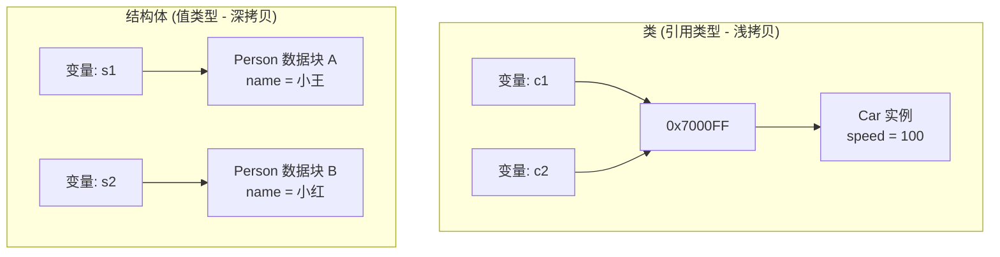
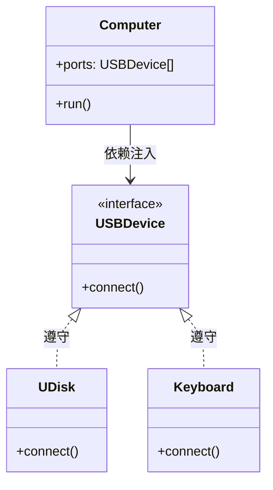

> [!NOTE] 关联笔记
> - 前序继承与多态篇：[[19.继承-实战教程]]

# Swift 基础实战教程：结构体 `struct` 与协议 `protocol`

本教程将详细剖析 Swift 中两大核心构建块：作为值类型的**结构体（Struct）**，以及作为抽象契约的**协议（Protocol）**，并解析它们在架构设计中的具体应用。

---

## 一、 结构体 (Struct) 与类 (Class)

结构体使用关键字 `struct` 声明，其成员变量和方法定义与 `class` 高度相似。但它们在**内存分配**与**拷贝行为**上有着本质区别。

### 1. 类与结构体的内存拷贝行为对比
*   **类 (Class)**：引用类型（Reference Type），存储于堆区，传递时为**浅拷贝（指针复制）**。
*   **结构体 (Struct)**：值类型（Value Type），通常存储于栈区，传递时为**深拷贝（数据完整复制）**。



### 2. 代码对比实战
```swift
// 1. 定义类
class ClassPerson {
    var name: String = "小王"
}

// 2. 定义结构体
struct StructPerson {
    var name: String = "小王"
}

// --- 引用拷贝测试 ---
let cp1 = ClassPerson()
let cp2 = cp1
cp2.name = "小红"
print(cp1.name) // 输出: 小红 (数据共享联动)

// --- 值拷贝测试 ---
var sp1 = StructPerson()
var sp2 = sp1
sp2.name = "小红"
print(sp1.name) // 输出: 小王 (sp1 保持独立，不受修改影响)
```

---

## 二、 协议 (Protocol) 契约声明与遵守

**协议**定义了一套规范（属性和方法签名），它只规定契约要求，不提供具体实现代码。

### 1. 协议定义语法
```swift
protocol USBDevice {
    // 声明方法签名，不带大括号方法体
    func connect()
    func transferData()
}
```

### 2. 类/结构体遵守并实现协议
当一个类型采纳（Conform）了某个协议，就必须提供该协议中所有成员的具体实现：
```swift
class Mouse: USBDevice {
    func connect() {
        print("鼠标：无线接收器已连接。")
    }
    
    func transferData() {
        print("鼠标：正在发送光标位移数据。")
    }
}
```
*   **继承与协议多重采纳格式**：
    在 Swift 中，如果一个子类既有父类又遵守了协议，**父类名称必须写在冒号后面的第一位**，后面用逗号拼接各个协议：
    ```swift
    class WirelessMouse: BaseDevice, USBDevice, Chargeable {
        // 实现父类重写与各协议方法...
    }
    ```

---

## 三、 面向协议多态与松耦合架构 (面向接口编程)

协议可以作为一个独立的类型使用。**任何遵守了该协议的类实例，都可以赋值给该协议类型的变量**。

### 实战：电脑外接设备多态调度


```swift
class Computer {
    // 槽位仅限 USBDevice 协议类型设备接入，实现松耦合
    var slot1: USBDevice?
    var slot2: USBDevice?
    
    func boot() {
        print("电脑启动中...")
        slot1?.connect()
        slot2?.connect()
    }
}

// 遵守协议的不同类
class UDisk: USBDevice {
    func connect() { print("U盘 已挂载，读取文件系统中...") }
    func transferData() {}
}

class Keyboard: USBDevice {
    func connect() { print("键盘 灯效已点亮，准备输入...") }
    func transferData() {}
}

// 组装连接
let macbook = Computer()
macbook.slot1 = UDisk()     // 注入 U盘
macbook.slot2 = Keyboard()  // 注入 键盘

macbook.boot()
// 输出:
// 电脑启动中...
// U盘 已挂载，读取文件系统中...
// 键盘 灯效已点亮，准备输入...
```

---

## 四、 协议在委托代理模式 (Delegation) 中的应用

在接下来的 iOS 界面开发中，协议的最经典实操场景是**代理模式（Delegate）**，用于处理页面间的**反向回调传值**。

```swift
// 1. 定义代理契约
protocol EditViewDelegate: AnyObject {
    func didFinishEditing(text: String)
}

// 2. 被委托页面 (子页面 B)
class DetailViewController {
    // 使用 weak 防止强引用循环，Delegate 类型定义为协议
    weak var delegate: EditViewDelegate?
    
    func userClickedSave(content: String) {
        // 触发代理回调
        delegate?.didFinishEditing(text: content)
    }
}

// 3. 委托人页面 (主页面 A)
class HomeViewController: EditViewDelegate {
    func showDetailPage() {
        let detailVC = DetailViewController()
        detailVC.delegate = self // 主页面将自己设为代理人
    }
    
    // 4. 实现协议方法，接收从子页面传递过来的值
    func didFinishEditing(text: String) {
        print("Home 页面接收到修改后的文字: \(text)")
    }
}
```

---

## 五、 章节总结与要点速查

*   **结构体 struct**：值类型，深拷贝，存储在栈区，适用于轻量级纯数据封装。
*   **类 class**：引用类型，浅拷贝，存储在堆区，支持继承、多态，适用于复杂业务逻辑对象。
*   **协议 protocol**：声明契约的规范接口，采纳后必须实现所有声明的方法。
*   **多协议格式**：`class Sub: Parent, Prot1, Prot2`，父类必须放在第一位。
*   **松耦合多态**：协议类型变量可作为容器容纳任何符合契约的对象，为代理设计（Delegation）提供基础。
