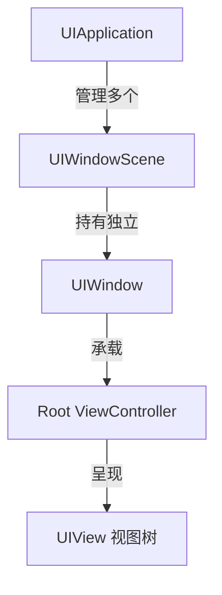
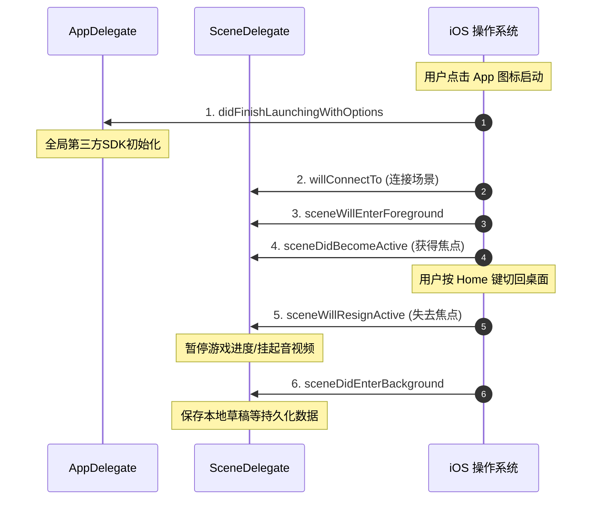

> [!NOTE] 关联笔记
> - 前序结构体与协议篇：[[20.结构体与协议-实战教程]]

# iOS 基础实战教程：Xcode 项目构建与应用生命周期

从本章开始，我们将离开 Swift 命令行环境，正式进入 iOS 原生应用开发的世界。本文将指导你建立第一个 iOS 项目工程，并深度解析苹果的生命周期架构模型。

---

## 一、 Xcode 创建 iOS 工程与参数配置

使用 macOS 下的 **Xcode** 建立工程是 iOS 开发的第一步：

1.  **模板选择**：`File -> New -> Project -> iOS -> App`。
2.  **关键参数配置说明**：

| 参数项 (Option) | 填充规范 | 作用与物理意义 |
| :--- | :--- | :--- |
| **Product Name** | `MyFirstApp` | App 在商店与手机桌面上显示的产品名称。 |
| **Organization Identifier**| `com.cooper` | 组织反向域名，与 Product Name 组合成 Bundle Identifier 唯一标识符。 |
| **Interface** | **Storyboard** | 可视化布局方案，本章采用此方式进行目录解析。 |
| **Language** | **Swift** | 开发语言，原生编译执行。 |

---

## 二、 iOS 项目物理文件清单与职责分工

创建工程后，Xcode 会自动生成一组默认的工程架构文件：

*   **AppDelegate.swift**：控制 App 级别的核心事件（如进程启动、进程终止、推送接收回调）。
*   **SceneDelegate.swift**：控制 Scene 窗口级别的生命周期（如 App 的前后台切换、窗口激活与聚焦）。
*   **ViewController.swift**：当前默认界面的主视图控制器，用于通过代码编写具体的页面逻辑。
*   **Main.storyboard**：用于可视化拖拽编写 App UI 页面的画板。
*   **LaunchScreen.storyboard**：App 的启动闪屏页，应用打开时展示，直到主页面加载完后淡出消失。
*   **Assets.xcassets**：图像等媒体资源的资产目录，包括桌面应用图标（AppIcon）。
*   **Info.plist**：以键值对形式存储的项目配置清单，控制隐私权限声明、方向锁定等全局信息。

---

## 三、 iOS 13 之后的新型 SceneDelegate 场景架构

自 iOS 13 起，为了适配 iPadOS 的多窗口分屏分身特性，苹果将原有的 Window 管理从 `AppDelegate` 剥离，交由 **Scene（场景）** 架构负责。

*   **iPhone 平台表现**：iPhone 通常始终只有一个活动场景（Scene）和窗口（Window），因此生命周期的管理变得更加层次分明。

---

## 四、 核心生命周期函数回调链

掌握前后台切换时生命周期的回调顺序，是进行全局配置、内存释放及状态保存的前提。

### 1. 核心回调说明
*   **`application(_:didFinishLaunchingWithOptions:)`**
    App 启动入口，只执行一次。常用来初始化数据库、网络底层框架、第三方分享/推送等 SDK 的配置。
*   **`sceneWillEnterForeground(_:)`**
    场景即将从后台进入前台，常用于从服务器拉取最新数据。
*   **`sceneDidBecomeActive(_:)`**
    场景变成活跃聚焦状态。此时界面渲染完毕，键盘可以响应，游戏可以继续运行。
*   **`sceneWillResignActive(_:)`**
    场景即将失去焦点（如顶部弹出电话拦截窗口、下拉通知栏）。此时应暂停定时器、游戏渲染和视频播放。
*   **`sceneDidEnterBackground(_:)`**
    场景已经进入后台。应用将被系统挂起，此时应该抓紧执行关键的数据持久化落盘操作，以防被系统强杀导致数据丢失。

---

## 五、 章节总结与要点速查

*   **项目入口**：App 启动时由系统引导，先调 `AppDelegate` 再调 `SceneDelegate`。
*   **开发流派**：在商业实战中，我们大部分情况下不会使用 Storyboard 拖拽，而是采用纯代码编写。
*   **状态处理**：
    *   **进入前台状态刷新**：写在 `sceneDidBecomeActive` 里面。
    *   **切后台数据落盘**：写在 `sceneDidEnterBackground` 里面。
