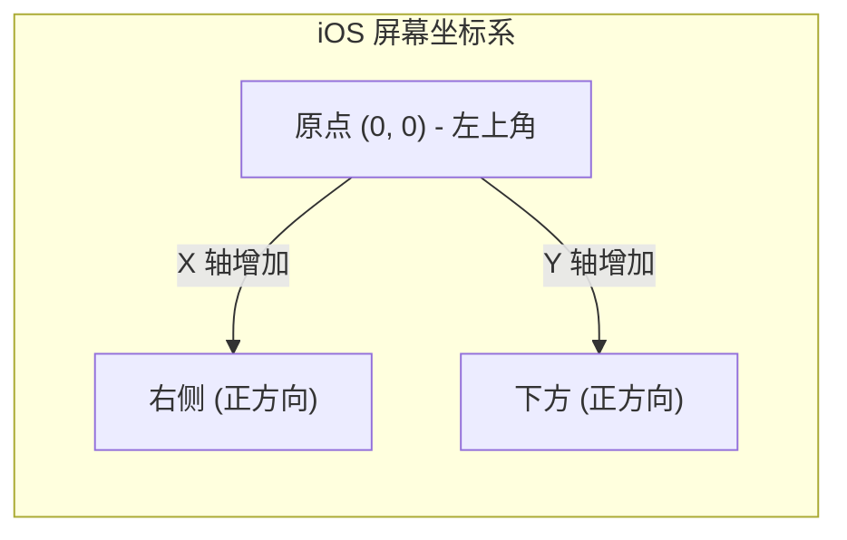

> [!NOTE] 关联笔记
> - 原始转写整理版：[[技术视野/01 第一周：全局认知 · Swift基础 · 开发环境/3_iOS零基础教程/22.第一个iOS应用-原始整理]]
> - 前序项目准备篇：[[21.iOS开发准备-实战教程]]

# iOS 基础实战教程：UIView 视图构建与层级控制

在 iOS 应用开发中，所有的用户界面控件（如 Label 文本、Button 按钮、ImageView 图片视图）都继承自 **`UIView`**。`UIView` 是承载所有视觉呈现与交互事件的画布容器。本教程将介绍如何使用**纯代码（Programmatic UI）**的方式创建、定位并管理 `UIView`。

---

## 一、 UIView 与画布层级关系

每一个 `UIViewController`（视图控制器）在加载时，其底层都自带一个全局的基画布——**`self.view`**。我们可以在 `viewDidLoad()` 生命周期中对这块基画布进行直接操作。

```swift
class ViewController: UIViewController {
    override func viewDidLoad() {
        super.viewDidLoad()
        
        // UIColor 提供系统预设的静态颜色对象
        self.view.backgroundColor = UIColor.systemBackground
    }
}
```

---

## 二、 纯代码构建与添加子视图

在 iOS 纯代码开发中，创建一个可见的视图需要经历四个核心步骤：

```swift
override func viewDidLoad() {
    super.viewDidLoad()
    
    // 1. 实例化 UIView 视图实例
    let redBox = UIView()
    
    // 2. 利用 CGRect 设置视图的 frame (位置与尺寸)
    redBox.frame = CGRect(x: 50, y: 150, width: 200, height: 200)
    
    // 3. 设置背景颜色以便于视觉观察
    redBox.backgroundColor = UIColor.systemRed
    
    // 4. 将子视图添加到控制器的主视图画布上（不可漏掉！）
    self.view.addSubview(redBox)
}
```

---

## 三、 屏幕坐标系与几何定位：Frame 与 Center

Swift 使用 `CGRect`、`CGSize`、`CGPoint` 结构体来精确定义界面的空间排布。



### 1. 属性解析
*   **`frame`**：类型为 `CGRect`，定义了视图的**左上角起点 `(x, y)`** 和 **尺寸 `(width, height)`**，其参照坐标系是其**直属父视图**。
*   **`center`**：类型为 `CGPoint`，定义了视图的**中心点 `(x, y)`**，其参照坐标系同样是父视图。

### 2. 通过 center 移动视图
```swift
// 保持原有的宽高尺寸，将该视图的几何中心点重合在父视图的 (100, 100) 位置上
redBox.center = CGPoint(x: 100, y: 100)
```

---

## 四、 子视图层级深度操控

当多个子视图叠加在同一个父视图上时，iOS 会维护一个有序的子视图数组 `subviews: [UIView]`。后添加的视图默认被压入数组尾部，渲染在最上层。

```mermaid
graph TD
    subgraph RenderLayers [渲染层级 (越往右越靠上层)]
        BaseView[self.view] -->|1. addSubview| Sub1[view1: 红色]
        BaseView -->|2. addSubview| Sub2[view2: 蓝色]
        Sub2 -->|覆盖| Sub1
    end
```

我们可以通过 `self.view.subviews` 对子视图进行计数：
```swift
print("子视图数量: \(self.view.subviews.count)") // 输出当前已装载的子视图个数
```

### 图层顺序重排 API：

### 1. 强力层级重排 (置顶 / 置底)
```swift
// 将 view1 强行提到最上层展示，覆盖重合区域内的 view2
self.view.bringSubviewToFront(view1)

// 将 view1 强行沉入最底层（但仍保持在 self.view 的背景之上）
self.view.sendSubviewToBack(view1)
```

### 2. 精确位置重排 (交换 / 插入)
```swift
// 1. 交换子视图数组中指定索引的两个视图的层级
self.view.exchangeSubview(at: 0, withSubviewAt: 1)

// 2. 将新视图插入到指定的渲染图层索引处
self.view.insertSubview(newView, at: 0)

// 3. 将新视图插入到现有特定视图的上方或下方 (建立相对层级关系)
self.view.insertSubview(blueBox, aboveSubview: redBox)
self.view.insertSubview(blueBox, belowSubview: redBox)
```

---

## 五、 章节总结与要点速查

*   **画布挂载**：代码实例化的 `UIView` 必须调用 `addSubview(_:)` 挂载到父视图中，否则它在内存中存活但不会被渲染。
*   **左上角对齐**：iOS 默认坐标系的起点 `(0, 0)` 为屏幕（或容器）的左上角。
*   **层级叠加**：默认后加入的子视图会覆盖先加入的子视图。可以通过 `bringSubviewToFront` 和 `insertSubview` 等方法在运行时任意修改渲染层级。
