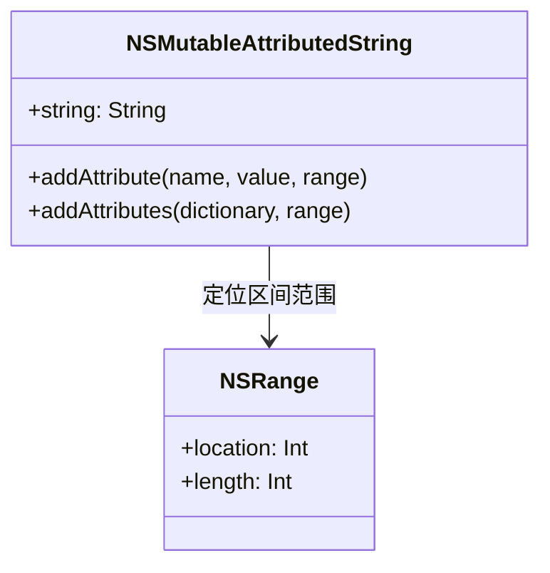

> [!NOTE] 关联笔记
> - 前序应用第一个视图篇：[[22.第一个iOS应用-实战教程]]

# iOS 基础实战教程：UILabel 与可变富文本排版

`UILabel` 是 iOS 原生应用中用于呈现只读文本的界面控件。本教程将深入介绍 `UILabel` 的排版属性配置，以及如何利用属性化字符串进行文本的局部样式细化排版（富文本技术）。

---

## 一、 UILabel 的物理继承与基本装载

`UILabel` 继承自 `UIView`，它天然具备 UIView 的所有几何定位和绘制特性（如 `frame`、`center`、`backgroundColor` 等）。

```swift
override func viewDidLoad() {
    super.viewDidLoad()
    
    // 实例化并定位 UILabel
    let textLabel = UILabel(frame: CGRect(x: 20, y: 100, width: 350, height: 150))
    textLabel.backgroundColor = UIColor.secondarySystemBackground
    
    // UIView 提供的 addSubview 挂载机制
    self.view.addSubview(textLabel)
}
```

---

## 二、 文本属性与换行对齐配置

`UILabel` 提供了一组直观的属性用来配置文本内容及整体折行、对齐样式：

```swift
// 1. 设置展示的明文字符串
textLabel.text = "Swift 是苹果推出的现代编程语言。我是一段需要被折行显示的超长测试文本。"

// 2. 文本前景色（字体颜色）
textLabel.textColor = UIColor.label

// 3. 对齐方式：NSTextAlignment 包含 .left (左对齐)、.center (居中)、.right (右对齐)
textLabel.textAlignment = .left

// 4. 换行行数控制 (numberOfLines)
// 默认值为 1（单行超出显示省略号 ...）
// 设为 0 代表自适应折行显示，折成多少行由文本内容长度与高度限制自动计算决定
textLabel.numberOfLines = 0
```

---

## 三、 字体 `UIFont` 与阴影投影控制

使用 `UIFont` 可以控制字体的尺寸与字重；使用 `CGSize` 结构体可以精准控制字体的物理阴影：

```swift
// 1. 字体大小与字重控制
// 方案 A：系统标准字体大小
textLabel.font = UIFont.systemFont(ofSize: 18)
// 方案 B：系统加粗粗体字体
textLabel.font = UIFont.boldSystemFont(ofSize: 18)
// 方案 C：字重级别控制字宽 (Weight 级别涵盖 .light, .regular, .medium, .bold, .heavy)
textLabel.font = UIFont.systemFont(ofSize: 18, weight: .medium)

// 2. 阴影投影效果
textLabel.shadowColor = UIColor.systemGray3       // 投影颜色
textLabel.shadowOffset = CGSize(width: 1.5, height: 1.5) // 向右下角各偏移 1.5 像素
```

---

## 四、 核心技术：可变富文本与区域区间样式编辑

如果需要在同一行文本中对不同位置的字符使用不同的字号、颜色和下划线，就必须用到**属性化字符串（NSAttributedString）**。



### 1. 动态富文本控制代码模板
```swift
// A. 声明可变属性化字符串实例 (NSMutableAttributedString)
let richText = NSMutableAttributedString(string: "小王 正在使用 Swift 开发 iOS 应用程序。")

// B. NSRange 定位物理区间 (注意：NSRange 使用 Objective-C 的 C-struct 物理格式，0 索引开始)
// 示例 1: 定位“小王”这前三个字 (location: 0, length: 3)
let nameRange = NSRange(location: 0, length: 3)
richText.addAttribute(.font, value: UIFont.systemFont(ofSize: 22, weight: .bold), range: nameRange)
richText.addAttribute(.foregroundColor, value: UIColor.systemRed, range: nameRange)

// 示例 2: 定位“Swift”这一英文单词 (第 9 个字符开始，长度为 5)
let swiftRange = NSRange(location: 9, length: 5)
// 一次性添加多个属性 (字典映射法)
let swiftAttributes: [NSAttributedString.Key: Any] = [
    .foregroundColor: UIColor.systemBlue,
    .backgroundColor: UIColor.systemYellow.withAlphaComponent(0.3),
    .underlineStyle: NSUnderlineStyle.single.rawValue, // 下划线样式
    .underlineColor: UIColor.systemBlue                // 下划线颜色
]
richText.addAttributes(swiftAttributes, range: swiftRange)

// C. 将富文本赋予 UILabel
// ⚠️ 必须给 attributedText 赋值，不能赋值给 text
textLabel.attributedText = richText
```

---

## 五、 章节总结与要点速查

*   **换行秘籍**：多行展示必须满足 `numberOfLines = 0`，且当前标签的高（Height）要大于一行所需的物理高度。
*   **富文本结构**：
    *   动态追加属性：使用 `NSMutableAttributedString`。
    *   只读显示：必须写入 `attributedText` 属性。
*   **区间定位**：`NSRange(location: X, length: Y)` 中，`X` 是起始点，`Y` 是要染色的字符数。
