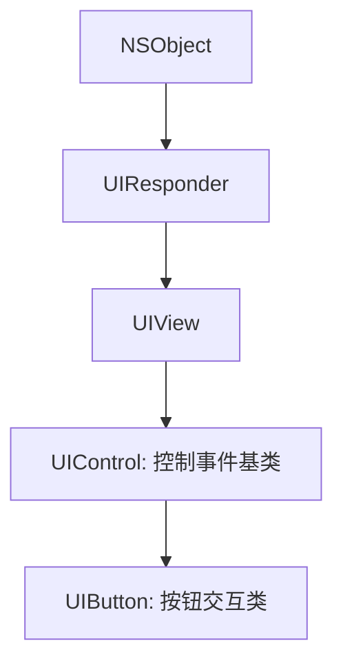
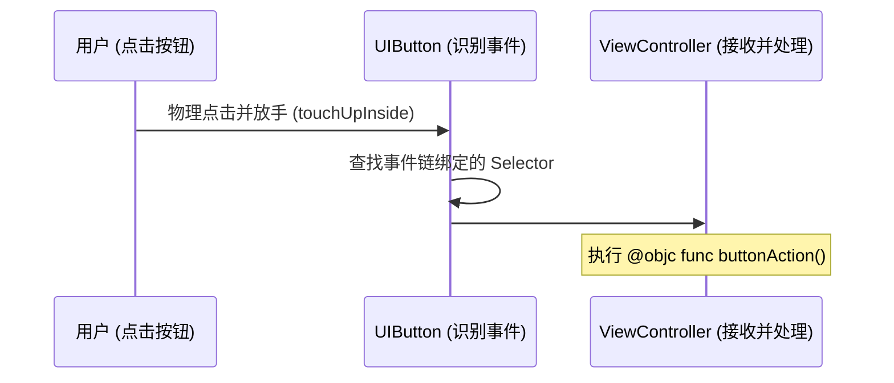

> [!NOTE] 关联笔记
> - 原始转写整理版：[[技术视野/01 第一周：全局认知 · Swift基础 · 开发环境/3_iOS零基础教程/25.创建一个按钮-原始整理]]
> - 前序图像控件篇：[[24.显示一副图像-实战教程]]

# iOS 基础实战教程：UIButton 状态管理与 Target-Action 绑定

`UIButton` 是 iOS 原生 UI 框架中最常用、最核心的交互控件之一。由于其高度可交互的本质，`UIButton` 具备丰富的**状态机模型**，且其事件绑定采用经典的 **Target-Action（目标-动作）** 设计模式。

---

## 一、 UIButton 的继承关系与控制基类

在 UIKit 中，`UIButton` 并未直接继承自 `UIView`，其完整的继承树如下：



*   **`UIControl` 职责**：提供对用户点击手势和各种交互状态（正常、高亮、禁用等）的底层封装和派发。

---

## 二、 按钮初始化与ButtonType选择

创建 `UIButton` 时，一般建议使用苹果提供的类工厂初始化方法，传入按钮类型：

```swift
// Factory initializer
let customBtn = UIButton(type: .custom)
```

| ButtonType 类型 | UI 表现与渲染特性 | 适用开发场景 |
| :--- | :--- | :--- |
| **`.custom`** (推荐) | 完全空白，没有任何系统默认字体或点击微调。 | 商业项目（配合 UI 专属切图定制）。 |
| **`.system`** | 默认蓝色前景色，点击时自带微弱淡出效果。 | 简单的调试或原生后台管理页面。 |
| **`.close`** | 原生圆形带叉按钮。 | 弹窗右上角的物理关闭键。 |

---

## 三、 UIButton 核心状态机与内容装载

因为按钮存在状态切换，我们在设置文字、颜色和图片时，**必须指定特定的状态**，而不能直接对普通属性赋值。

### 1. 核心状态 enum (`UIControl.State`)
*   **`.normal`**：默认状态。
*   **`.highlighted`**：用户手指按下并未松开的物理高亮状态。
*   **`.disabled`**：禁用状态（当控件 `isEnabled = false` 时触发）。

### 2. 状态装载代码实现
```swift
// A. 设置不同状态下的文本标题 (setTitle(_:for:))
customBtn.setTitle("提交订单", for: .normal)
customBtn.setTitle("处理中...", for: .highlighted)
customBtn.setTitle("订单已锁", for: .disabled)

// B. 设置标题的字体大小 (通过 titleLabel 访问内置的 UILabel)
customBtn.titleLabel?.font = UIFont.systemFont(ofSize: 18, weight: .semibold)

// C. 文字与图片的前景并排装载 (setImage(_:for:))
customBtn.setImage(UIImage(named: "icon_submit"), for: .normal)

// D. 整图拉伸作为按钮底色背景装载 (setBackgroundImage(_:for:))
customBtn.setBackgroundImage(UIImage(named: "btn_blue_bg"), for: .normal)
customBtn.setBackgroundImage(UIImage(named: "btn_grey_bg"), for: .disabled)
```

---

## 四、 控制交互禁用状态

可以通过 `isEnabled` 动态对按钮进行交互锁死：
```swift
// 禁用按钮交互，并触发 .disabled 状态下的 UI 样式变化
customBtn.isEnabled = false 
```

---

## 五、 事件绑定机制：Target-Action 模式

iOS 采用目标-动作模式将用户的交互事件映射为控制器的代码逻辑。



### 绑定代码模板：
```swift
class OrderViewController: UIViewController {
    
    override func viewDidLoad() {
        super.viewDidLoad()
        
        let payButton = UIButton(type: .custom)
        payButton.frame = CGRect(x: 100, y: 300, width: 200, height: 50)
        payButton.setTitle("立即支付", for: .normal)
        payButton.backgroundColor = UIColor.systemBlue
        
        // 核心事件绑定
        payButton.addTarget(self, action: #selector(handlePayment), for: .touchUpInside)
        
        self.view.addSubview(payButton)
    }
    
    // 🚨 必须使用 @objc 声明以暴露给 Objective-C Runtime 消息派发系统
    @objc private func handlePayment() {
        print("订单支付成功！")
    }
}
```

### 触发事件 (`UIControl.Event`) 选择依据：
*   **`.touchUpInside` (最常用)**：用户在按钮界区内按下并在此区域内抬起。这是标准的“确认点击”。它为用户提供了**反悔的机会**：在按住的情况下将手指滑出按钮的物理框范围，随后松开，则不会触发 handle 动作。
*   **`.touchDown`**：手指只要触碰到按钮的一瞬间就会立刻执行动作（无反悔余地）。

---

## 六、 章节总结与要点速查

*   **按钮类型**：除非简单验证，一律在初始化时调用 `UIButton(type: .custom)`。
*   **富文本/修改字体**：UIButton 的文本渲染依托内部 `titleLabel` 属性，修改字号需通过 `button.titleLabel?.font` 这一可选链实现。
*   **方法注解**：所有 Target-Action 事件绑定的动作方法都必须带 `@objc` 前缀。
*   **安全点击**：触发选项优选 `.touchUpInside` 以支持极佳的用户退回/撤销手势操作。
