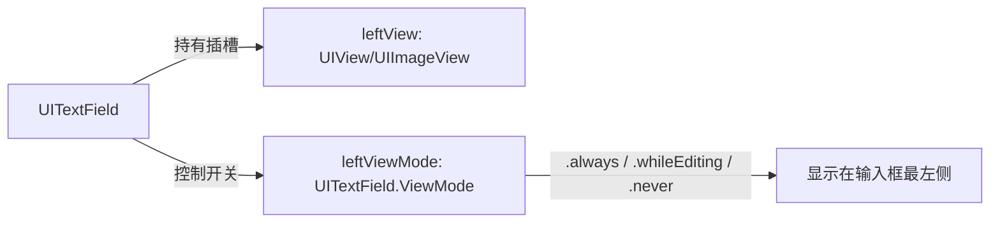
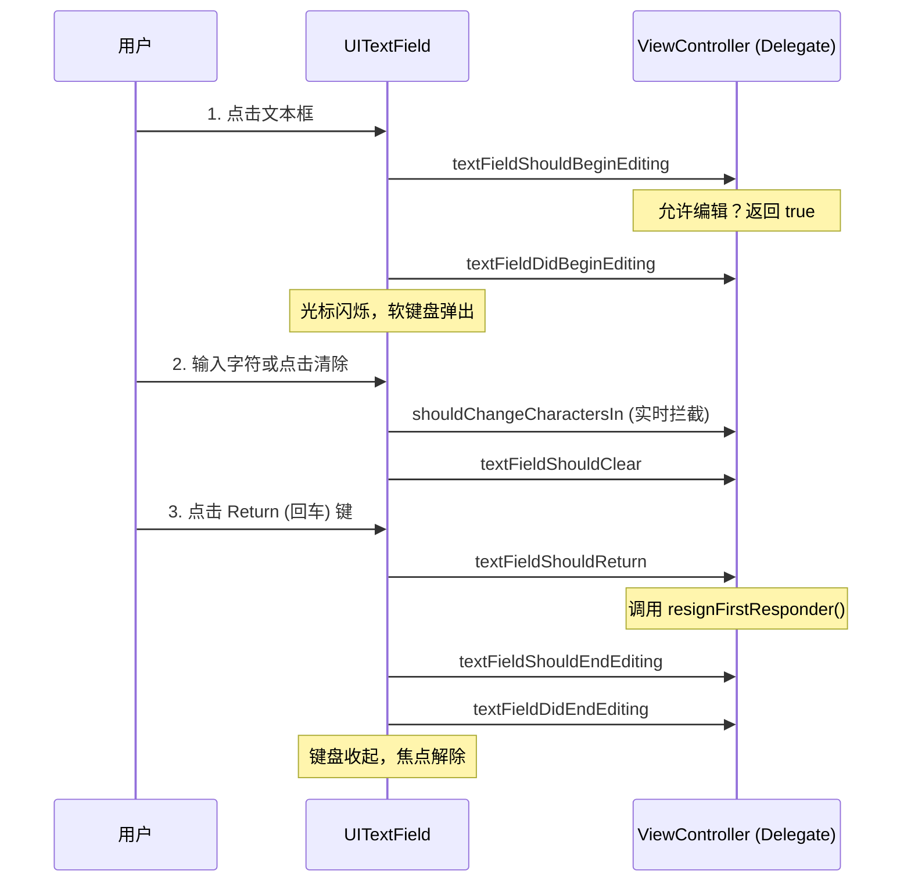

> [!NOTE] 关联笔记
> - 前序按钮控件篇：[[25.创建一个按钮-实战教程]]

# iOS 基础实战教程：UITextField 单行输入与键盘焦点的代理控制

在开发 iOS 登录、注册、搜索等表单界面时，`UITextField` 是最核心的输入媒介。由于涉及系统虚拟软键盘的弹出与收回，以及用户输入的实时校验，对 `UITextField` 的控制极度依赖 **Delegate（代理）设计模式**。

---

## 一、 UITextField 核心属性与样式控制

`UITextField` 同样间接继承自 `UIView`，在初始化后需指定边框样式以防隐形：

```swift
override func viewDidLoad() {
    super.viewDidLoad()
    
    let usernameField = UITextField(frame: CGRect(x: 30, y: 100, width: 300, height: 40))
    
    // 1. 设置边框类型 (UITextField.BorderStyle)
    // .none (默认，无边框); .roundedRect (最常用，浅灰色圆角矩形); .line (直角黑细线边框)
    usernameField.borderStyle = .roundedRect
    
    // 2. 占位提示语 (Placeholder)
    usernameField.placeholder = "请输入手机号/邮箱"
    
    // 3. 字体颜色与大小
    usernameField.textColor = UIColor.label
    usernameField.font = UIFont.systemFont(ofSize: 16)
    
    // 4. 输入文字排列对齐
    usernameField.textAlignment = .left
    
    // 5. 内置的一键清空小叉按钮 (clearButtonMode)
    // 涵盖 .never, .always, .whileEditing (只有在处于编辑输入状态且有内容时才显示)
    usernameField.clearButtonMode = .whileEditing
    
    self.view.addSubview(usernameField)
}
```

---

## 二、 植入自定义 LeftView / RightView

`UITextField` 提供左右两个特殊的视图插槽，可用于扩展前端 UI 表现（如账号小图标、搜索放大镜、或者右侧的图形验证码、发送按钮）。



### 实现左侧小图标的挂载：
```swift
// 1. 实例化小图标容器 (可以是 UIImageView)
let userIcon = UIImageView(image: UIImage(named: "icon_user"))
userIcon.frame = CGRect(x: 0, y: 0, width: 30, height: 30)
userIcon.contentMode = .center

// 2. 装载至 UITextField 左侧插槽
usernameField.leftView = userIcon

// 3. 🚨 必须修改显示模式（系统默认值为 .never）
usernameField.leftViewMode = .always
```

---

## 三、 键盘焦点管理与收回机制

当 `UITextField` 获得焦点后，会自动成为 **First Responder（第一响应者）**，系统进而弹出软键盘。若要关闭键盘，必须切断这一第一响应者链接。

### 第一响应者焦点 API：
*   **`becomeFirstResponder()`**：强制文本框激活并弹出虚拟键盘。
*   **`resignFirstResponder()`**：强制文本框失去激活焦点并自动收回键盘。

---

## 四、 UITextFieldDelegate 协议与生命周期拦截

输入框在发生重要时机节点（如打字、清除、按下回车）时，会触发代理方法。



### 完整表单代理实现代码：
```swift
import UIKit

class LoginViewController: UIViewController, UITextFieldDelegate {
    
    private let passwordField = UITextField()
    
    override func viewDidLoad() {
        super.viewDidLoad()
        
        passwordField.frame = CGRect(x: 30, y: 160, width: 300, height: 40)
        passwordField.borderStyle = .roundedRect
        passwordField.placeholder = "请输入密码"
        passwordField.isSecureTextEntry = true // 密码框，自动转为密文圆点
        
        // 🚨 绑定代理
        passwordField.delegate = self
        
        self.view.addSubview(passwordField)
    }
    
    // MARK: - UITextFieldDelegate
    
    // 1. 用户点击虚拟键盘右下角“确认/完成/回车”键回调
    func textFieldShouldReturn(_ textField: UITextField) -> Bool {
        // 解除第一响应者身份，强制收起软键盘
        textField.resignFirstResponder()
        return true
    }
    
    // 2. 实时输入拦截回调（可在此控制字数限制或过滤特殊字符）
    func textField(_ textField: UITextField, shouldChangeCharactersIn range: NSRange, replacementString string: String) -> Bool {
        // 如果返回 false，用户的击键输入将被系统废弃（写不进文本框）
        print("用户试图输入字符: \(string)")
        return true 
    }
    
    // 3. 点击一键清除小叉号回调
    func textFieldShouldClear(_ textField: UITextField) -> Bool {
        print("点击清空按钮")
        return true // 返回 false 则无法清空
    }
}
```

---

## 五、 章节总结与要点速查

*   **看不见边框**：初始化后，必须明确给 `borderStyle` 设置为 `.roundedRect`，否则输入框无边框，极易在屏幕上找不到。
*   **键盘收不起**：软键盘默认不能自动收起。必须在 ViewController 中实现 `UITextFieldDelegate`，并在 `textFieldShouldReturn` 中显式调用 `textField.resignFirstResponder()`。
*   **辅助插槽**：设置 `leftView` 或 `rightView` 之后，切记必须配置 `leftViewMode / rightViewMode = .always`，否则辅助视图不会显示。
