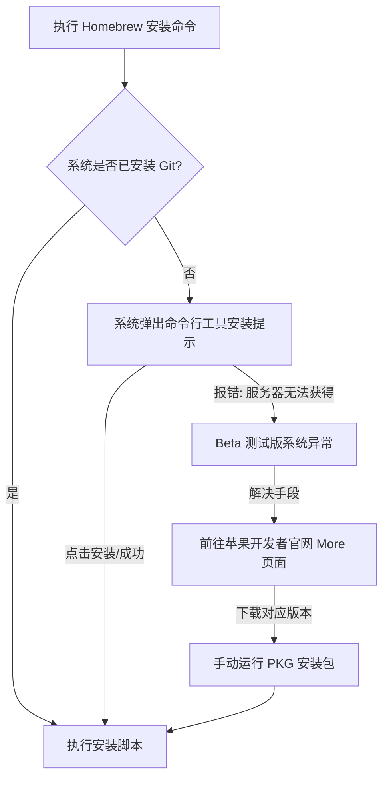
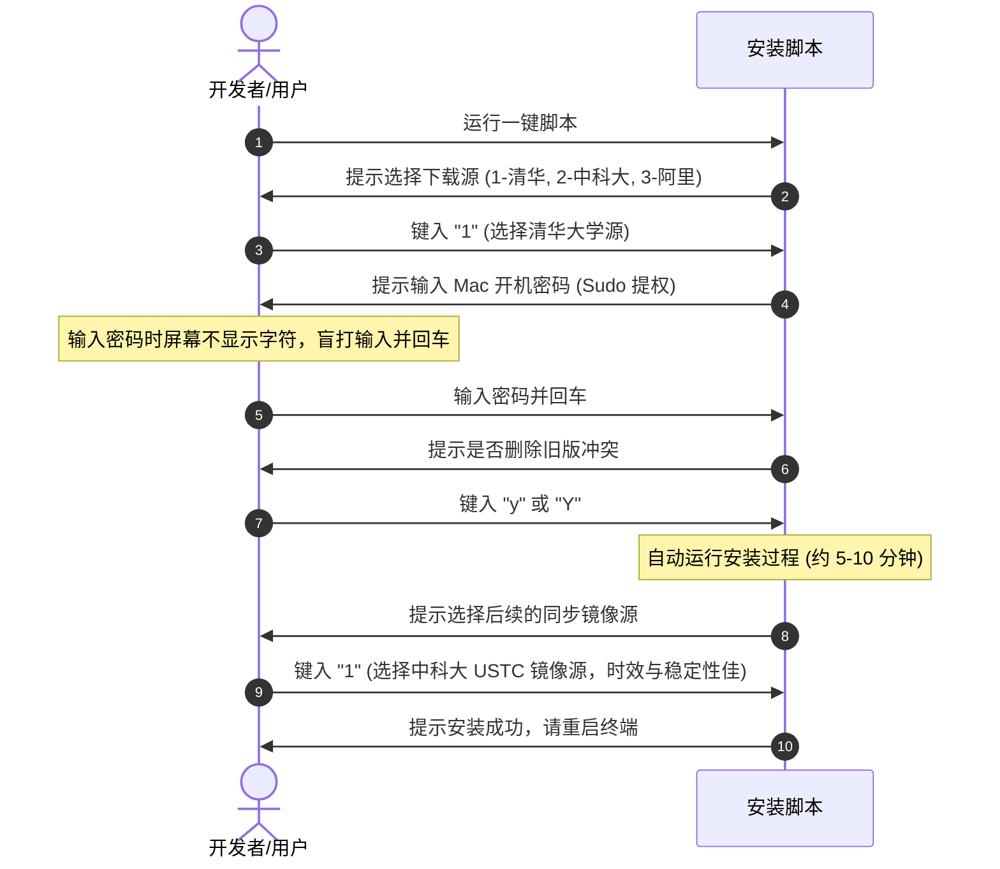

> [!NOTE] 关联笔记
> - 原始转写整理版：[[Mac隐藏的App Store-Homebrew全方位入门指南-原始整理]]
> - 协作生态篇：[[homebrew-vibecoding时代必装命令行工具-实战教程]]

# Mac 极客必读：Homebrew 全方位包管理安装与实战教程

**Homebrew** 是 macOS 平台上无可争议的包管理标准。通过声明式的一行命令，它可以完成软件的获取、依赖解析、升级与绿色卸载，被称为 Mac 的“命令行 App Store”。

---

## 一、 安装前的基石：Command Line Tools 异常排查

在部署 Homebrew 之前，macOS 系统必须具备基础的编译调试组件——**Xcode 命令行开发者工具 (Command Line Tools)**。



### Beta 版本手动修复步骤：
1. 前往 [Apple Developer Downloads Portal](https://developer.apple.com/download/all/)。
2. 检索：`Command Line Tools for Xcode (对应系统测试版本号)`。
3. 下载 `.dmg` 文件后双击挂载，运行其中的 `.pkg` 文件进行覆盖升级安装。

---

## 二、 国内镜像源部署 Homebrew 流程

官方源在国内受限于网络连接，极易发生握手超时。推荐使用国内知名高校维护的同步镜像源。

### 1. 执行国内一键脚本安装命令
在终端输入并回车：
```bash
/bin/zsh -c "$(curl -fsSL https://gitee.com/cunkai/HomebrewCN/raw/master/Homebrew.sh)"
```

### 2. 交互式选择配置



### 3. 环境校验
关闭终端重新开启，输入以下命令确认：
```bash
brew --version
# 输出示例：
# Homebrew 4.x.x
# Homebrew/homebrew-core (git revision ...)
```

---

## 三、 Homebrew 核心物理分类：Formula 与 Cask

Homebrew 将所有的软件管理对象划分为两类：

```
                    ┌────────────────────────┐
                    │     Homebrew 软件库     │
                    └───────────┬────────────┘
                                │
               ┌────────────────┴────────────────┐
               ▼                                 ▼
   ┌───────────────────────┐         ┌───────────────────────┐
   │  Formulae (命令行工具)  │         │   Casks (GUI应用)     │
   ├───────────────────────┤         ├───────────────────────┤
   │ 示例: git, node, wget │         │ 示例: chrome, iina    │
   │ 物理结构: 只有执行文件 │         │ 物理结构: 包含.app包   │
   │ 安装位置: /opt/homebrew│         │ 安装位置: /Applications│
   └───────────────────────┘         └───────────────────────┘
```

---

## 四、 命令行语法及高频指令速查

Homebrew 命令结构：`brew <command> <package>`。

```bash
# 1. 检索软件 (支持正则与模糊匹配)
brew search google

# 2. 安装非图形化命令行工具 (Formula)
brew install wget

# 3. 安装图形化应用程序 (Cask)
brew install --cask google-chrome

# 4. 彻底卸载应用并移除残留依赖与配置文件
brew uninstall --cask iina

# 5. 查看本地已安装的所有软件列表
brew list

# 6. 获取某一特定软件的元数据详情
brew info qq

# 7. 更新 Homebrew 本地索引和核心代码
brew update

# 8. 升级特定软件至社区最新版本
brew upgrade google-chrome

# 9. 清理陈旧的下载缓存文件和历史冗余版本
brew cleanup
```

---

## 五、 第三方图形化管理器：Applite 实践

对于不习惯终端操作的用户，开源项目 **Applite** 提供了无命令界面的“应用商店”模式：

1. **项目获取**：前往 [Applite Releases GitHub](https://github.com/milanvarady/Applite/releases) 下载 `.dmg` 文件并安装。
2. **加速优化**：
   * 打开 Applite，前往 `Applite -> Settings -> Mirrors`。
   * 选择 **USTC** (中科大源) 并启用。这会同步将 Applite 内部的拉取索引指向国内镜像站，避免卡死在 Loading 界面。
3. **功能支持**：Applite 支持一键安装、批量多选、软件备份以及在 Intel/Apple Silicon 架构间无缝切换配置。

---

## 六、 总结与最佳实践

* **安全提权**：在终端输入密码时，密码是完全隐形的，这是 UNIX 的默认安全设计，切勿以为系统卡死。
* **干净卸载**：使用 `brew uninstall <cask_name>` 可以将 `/Applications` 文件夹和 `~/Library/Application Support/` 下的部分相关偏好设置一次性全路径删除，比物理拖动到废纸篓更加干净卫生。
* **批量洗牌**：日常可通过 `brew update && brew upgrade` 维护系统内全部开发环境和图形应用的更新。
