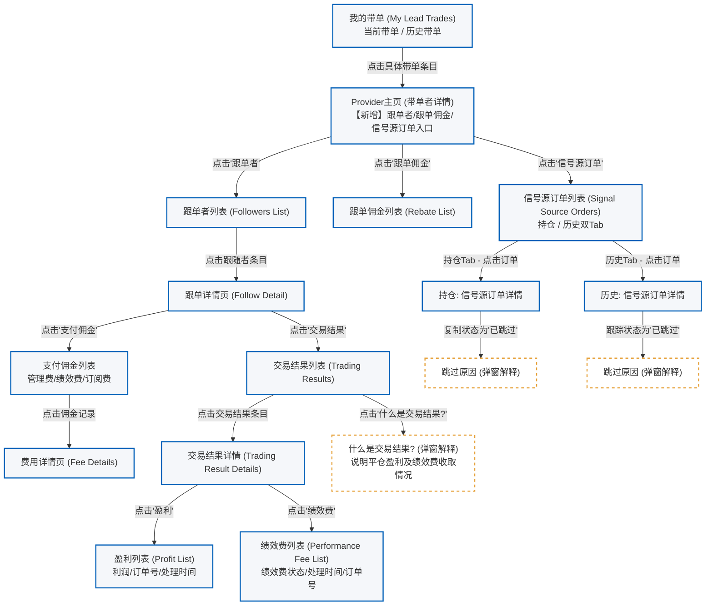
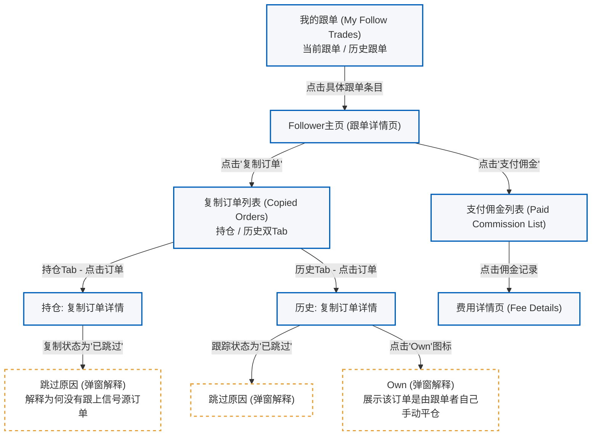

## 💡 产品经理必学的“五张图”知识总结

在产品研发的生命周期中，合理运用以下五张图示表达工具，可以辅助PRD文档，帮助团队达成高效的理解与共识：

1. **核心体验图 (Core Experience Diagram)**：
    
    - **定义**：描绘主干业务流转路径。
    - **工程作用**：各连接线直接对应系统的核心转化率（如详情页转化、下单支付转化等），作为优化业务的数据北极星。
2. **产品模块图 (Product Module Diagram)**：
    
    - **定义**：展示系统顶层的业务板块组成。
    - **工程作用**：宏观指导系统架构解耦，界定不同团队负责的业务边界与数据指标。
3. **产品功能树 (Product Function Tree)**：
    
    - **定义**：是模块图的下钻细化，通常以思维导图穷举所有二/三级功能。
    - **工程作用**：梳理逻辑细节，明确开发边界，作为研发任务拆解与测试用例（Test Cases）编写的依据。
4. **页面关系图 (Page Relationship Diagram)**：
    
    - **定义**：描述系统页面之间的流转路由与跳转拓扑。
    - **工程作用**：与功能树进行自洽比对（功能树中每个功能必须在对应页面承载），用以排除“孤岛页面”与逻辑漏洞，也是技术团队评估工期的核心依据。
5. **交互图 (Demo/Mockup/Wireframe)**：
    
    - **定义**：页面内的元素排布与交互反馈。
    - **工程作用**：属于底层实现细节，要求具有“自解释性”，辅助 UI/UX 视觉设计师和前端开发准确落地。

# 实践内容 

> 根据 RTC-185 Copy Trading 复制订单来源明细展示 - 产品设计图

---

## 1. 带单端 (Provider-Side) 页面流转图

带单端（提供商端）优化的核心是让 Provider 能够清晰地查看到自己发出的信号订单被哪些 Follower 复制、费用计算详情，以及佣金（Rebate）明细。

---

## 2. 跟单端 (Follower-Side) 页面流转图

跟单端优化的核心是让 Follower 清晰地核对自己的跟单行为，并理解每一笔订单的收益归因。

---

## 3. 复制订单状态与“跳过原因”逻辑映射表

在页面详情设计中，当复制状态或跟踪状态为 `已跳过 (Skipped)` 时，用户（特别是 Follower）点击状态会调起**跳过原因弹窗**。这极大减少了客服解释成本。以下为 Brokeree API Key 与前台多语言展示的逻辑映射（Cheat Sheet）：

| Brokeree API Key (后端) | 英文界面提示 (en) | 中文界面提示 (zh-CN) | 业务触发逻辑说明 |
| :--- | :--- | :--- | :--- |
| `SkipByMinVolumeFilter` `SkipByMaxVolumeFilter` | The source position doesn’t meet the *Subscription strategy* $\rightarrow$ *Filters* $\rightarrow$ *Min volume* or *Max volume* filters | 源持仓不符合订阅策略 $\rightarrow$ 筛选条件 $\rightarrow$ 最小交易量或最大交易量的设置。 | 信号源单笔交易量超出了跟单设置的上下限 |
| `SkipByLotThreshold` | The copy position’s calculated volume is too low to be copied: lower than the *Copy module* $\rightarrow$ *Rounding* $\rightarrow$ *Lot threshold* value | 复制持仓的计算交易量过低，低于复制模块 $\rightarrow$ 舍入设置 $\rightarrow$ 手数阈值，因此未复制。 | 缩放计算后的手数低于设置的跟单起步阈值 |
| `SkipByRiskFactor` | The symbol’s Lot Minimum to the copy position’s calculated volume ratio is higher than it is allowed by the *Copy module* $\rightarrow$ *Rounding* $\rightarrow$ *Risk factor*. | 该交易品种的最小手数与复制持仓计算交易量之间的比例，超过了复制模块 $\rightarrow$ 舍入设置 $\rightarrow$ 风险系数允许的范围。 | 交易量偏离允许的风险配比范围 |
| `SkipByVolumeLimit` | Position is skipped because its amount on the copy is less than the minimum allowed by trading platform settings. | 复制后的交易量低于交易平台设置允许的最小交易量，因此该持仓被跳过。 | 计算出的开仓手数未达平台允许的最低开仓量 |
| `SkipByVolume` | The copy’s volume is less than 0. | 复制交易量小于 0，因此无法开仓。 | 计算所得手数异常（$\le 0$） |
| `TradeDisabled` | Trading on the provider’s or follower’s account is disabled due to the trading platform’s settings... | 由于交易平台设置，提供商或跟随者账户的交易功能已被禁用；或账户为只读/非交易账户... | 账户被限制交易或设置为只读模式 |
| `SkipByMode` | Position is skipped because the subscription is not active (suspended). | 由于订阅未处于活动状态，或已暂停，该持仓被跳过。 | 订阅状态非 Active（暂停或未激活） |
| `BeforeActivation` | Position is skipped because the subscription has not been activated yet (for the first time). | 由于订阅尚未首次激活，该持仓被跳过。 | 信号源开仓时间早于跟单者订阅生效时间 |
| `SkipByInvalidFunds` | Position is skipped, because the follower has balance or equity $\le 0$. | 由于跟随者账户余额或权益小于等于 0，该持仓被跳过。 | 跟随者账户净值为 0 或负数（爆仓或未入金） |
| `NotFoundSymbol` | NotFoundSymbol The symbol of the position is not found on the trading server. | 交易服务器上未找到该持仓对应的交易品种。 | 提供商和跟随者处于不同服务器，未做品种映射或找不到该代码 |
| `SkipByMapping` | Couldn’t map the provider’s symbol to a follower’s one. | 无法将提供商的交易品种映射到跟随者账户中的对应交易品种。 | 品种对照配置缺失 |
| `FullClosing` | Skipping opening new position order when partial-closing the source position in MT4. | 在 MT4 中对源持仓进行部分平仓时，系统会跳过新开仓订单。 | MT4 部分平仓特有逻辑，跳过因部分平仓衍生出的新开仓动作 |
| `No copy success` | No position was copied successfully. | 没有任何持仓被成功复制。 | 其他兜底异常原因导致无法复制 |

---

## 4. 注意事项

*   **数据一致性校验**：跟单佣金页显示的本月佣金总额，必须与跟单佣金列表（Rebate List）中各笔账目汇总后一致，以防用户在多处页面核对账单时产生财务分歧。
*   **「Own」状态的特殊逻辑**：如果 Follower 复制订单详情中标记了 `Own`，这代表用户自己介入了跟单管理并实施了手动平仓。在收益率（ROI）或亏损归因计算中，此订单应做特殊标明，以帮助客服快速定责（即非 Provider 带单导致亏损，而是用户自行操作）。
*   **异常拦截与埋点设计**：围绕“跳过原因”的触发，在后端进行 API 拦截时同步记录埋点（如：某一段时间内 `SkipByInvalidFunds` 异常高，说明需要引导用户入金）。
