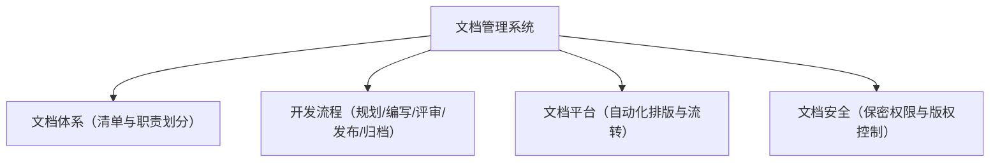
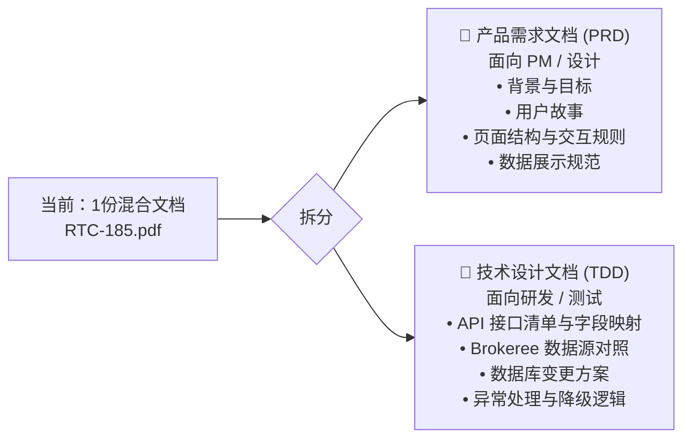

## 💡 产品技术文档怎么写 — 知识总结

### 1. 技术文档的四重核心价值
文档不是产品的附属品，而是产品本身的组成部分：
1. **信息载体与能力沉淀**：把个人脑中的技术能力，转化为企业可复制、可传递的无形资产。
2. **合规与免责**：很多国家/地区，完备说明书是产品准入的必要条件；安全警告起法律免责作用；招标场景中文档质量常是强制扣分项。
3. **降本增效**：
   - 分级服务体系（参照华为"七远八案，三免九字"）：让客户/外包通过自助检索解决大部分售后问题，减轻热线、现场工程师、后端专家的支持压力。
   - 降低一线人员门槛：原本需要5年经验才能完成的调测，靠文档赋能1年经验的人员即可上手。
   - 内部协同纽带：需求/设计说明书是研发、测试、支持团队沟通的桥梁，也是划清职责的"契约证据"。
4. **品牌溢价**：高质量文档体现厂商专业度，是企业的名片。

### 2. 企业文档管理的顶层设计

- **文档体系**：明确产品交付所需文档清单，每篇文档要有规范命名、清晰定位、明确读者和归属 Owner，避免部门间推诿。
- **开发流程**：规划定义 → 启动分工 → 跟踪监督（由 Document Manager 专职跟踪）→ 评审修订 → 发布与权限控制。
- **平台工具**：大公司多用结构化 XML/HTML 写作工具替代 Word 手工排版，支持一键目录、批量刷新、自动化导出。
- **专兼职权衡**：研发工程师懂技术但不擅长表达；专职文档人员会写但易脱离一线。推荐架构——研发兼职写初稿保证准确度，设立专职 **文档架构师**（搭框架、定模板）与 **文档经理**（项目化跟踪+培训宣贯）。

### 3. 文档保密与版权
- **版权保护**：杜绝抄袭竞品文档，限制权限并申请著作权保护自身知识产权。
- **保密原则**：保密性永远高于便捷性。机密文档需强加密、身份验证介质（U-key/UDS），并强制加动态个人水印防泄露。

### 4. SOP 配置指导书的标准结构（七步）
针对涉及技术调测和数据配置的操作文档，禁止直接上手写步骤，须遵循以下结构：

![Mermaid diagram](data:image/svg+xml;base64,PHN2ZyB4bWxucz0iaHR0cDovL3d3dy53My5vcmcvMjAwMC9zdmciIHZpZXdCb3g9IjAgMCA5ODIuNTEyIDYyNi4zIiB3aWR0aD0iOTgyLjUxMiIgaGVpZ2h0PSI2MjYuMyIgc3R5bGU9Ii0tYmc6I0ZGRkZGRjstLWZnOiMzQjNCM0I7LS1saW5lOiMzQjNCM0I7LS1hY2NlbnQ6IzAwNUZCODstLW11dGVkOiMzQjNCM0JDQzstLXN1cmZhY2U6I0Y4RjhGODstLWJvcmRlcjojM0IzQjNCO2JhY2tncm91bmQ6dmFyKC0tYmcpIj4KPHN0eWxlPgogIEBpbXBvcnQgdXJsKCdodHRwczovL2ZvbnRzLmdvb2dsZWFwaXMuY29tL2NzczI/ZmFtaWx5PUludGVyOndnaHRANDAwOzUwMDs2MDA7NzAwJmFtcDtkaXNwbGF5PXN3YXAnKTsKICB0ZXh0IHsgZm9udC1mYW1pbHk6ICdJbnRlcicsIHN5c3RlbS11aSwgc2Fucy1zZXJpZjsgfQogIHN2ZyB7CiAgICAvKiBEZXJpdmVkIGZyb20gLS1iZyBhbmQgLS1mZyAob3ZlcnJpZGFibGUgdmlhIC0tbGluZSwgLS1hY2NlbnQsIGV0Yy4pICovCiAgICAtLV90ZXh0OiAgICAgICAgICB2YXIoLS1mZyk7CiAgICAtLV90ZXh0LXNlYzogICAgICB2YXIoLS1tdXRlZCwgY29sb3ItbWl4KGluIHNyZ2IsIHZhcigtLWZnKSA2MCUsIHZhcigtLWJnKSkpOwogICAgLS1fdGV4dC1tdXRlZDogICAgdmFyKC0tbXV0ZWQsIGNvbG9yLW1peChpbiBzcmdiLCB2YXIoLS1mZykgNDAlLCB2YXIoLS1iZykpKTsKICAgIC0tX3RleHQtZmFpbnQ6ICAgIGNvbG9yLW1peChpbiBzcmdiLCB2YXIoLS1mZykgMjUlLCB2YXIoLS1iZykpOwogICAgLS1fbGluZTogICAgICAgICAgdmFyKC0tbGluZSwgY29sb3ItbWl4KGluIHNyZ2IsIHZhcigtLWZnKSA1MCUsIHZhcigtLWJnKSkpOwogICAgLS1fYXJyb3c6ICAgICAgICAgdmFyKC0tYWNjZW50LCBjb2xvci1taXgoaW4gc3JnYiwgdmFyKC0tZmcpIDg1JSwgdmFyKC0tYmcpKSk7CiAgICAtLV9ub2RlLWZpbGw6ICAgICB2YXIoLS1zdXJmYWNlLCBjb2xvci1taXgoaW4gc3JnYiwgdmFyKC0tZmcpIDMlLCB2YXIoLS1iZykpKTsKICAgIC0tX25vZGUtc3Ryb2tlOiAgIHZhcigtLWJvcmRlciwgY29sb3ItbWl4KGluIHNyZ2IsIHZhcigtLWZnKSAyMCUsIHZhcigtLWJnKSkpOwogICAgLS1fZ3JvdXAtZmlsbDogICAgdmFyKC0tYmcpOwogICAgLS1fZ3JvdXAtaGRyOiAgICAgY29sb3ItbWl4KGluIHNyZ2IsIHZhcigtLWZnKSA1JSwgdmFyKC0tYmcpKTsKICAgIC0tX2lubmVyLXN0cm9rZTogIGNvbG9yLW1peChpbiBzcmdiLCB2YXIoLS1mZykgMTIlLCB2YXIoLS1iZykpOwogICAgLS1fa2V5LWJhZGdlOiAgICAgY29sb3ItbWl4KGluIHNyZ2IsIHZhcigtLWZnKSAxMCUsIHZhcigtLWJnKSk7CiAgfQo8L3N0eWxlPgo8ZGVmcz4KICA8bWFya2VyIGlkPSJhcnJvd2hlYWQiIG1hcmtlcldpZHRoPSI4IiBtYXJrZXJIZWlnaHQ9IjUiIHJlZlg9IjciIHJlZlk9IjIuNSIgb3JpZW50PSJhdXRvIj4KICAgIDxwb2x5Z29uIHBvaW50cz0iMCAwLCA4IDIuNSwgMCA1IiBmaWxsPSJ2YXIoLS1fYXJyb3cpIiBzdHJva2U9InZhcigtLV9hcnJvdykiIHN0cm9rZS13aWR0aD0iMC43NSIgc3Ryb2tlLWxpbmVqb2luPSJyb3VuZCIgLz4KICA8L21hcmtlcj4KICA8bWFya2VyIGlkPSJhcnJvd2hlYWQtc3RhcnQiIG1hcmtlcldpZHRoPSI4IiBtYXJrZXJIZWlnaHQ9IjUiIHJlZlg9IjEiIHJlZlk9IjIuNSIgb3JpZW50PSJhdXRvLXN0YXJ0LXJldmVyc2UiPgogICAgPHBvbHlnb24gcG9pbnRzPSI4IDAsIDAgMi41LCA4IDUiIGZpbGw9InZhcigtLV9hcnJvdykiIHN0cm9rZT0idmFyKC0tX2Fycm93KSIgc3Ryb2tlLXdpZHRoPSIwLjc1IiBzdHJva2UtbGluZWpvaW49InJvdW5kIiAvPgogIDwvbWFya2VyPgo8L2RlZnM+Cjxwb2x5bGluZSBjbGFzcz0iZWRnZSIgZGF0YS1mcm9tPSJTdGFydCIgZGF0YS10bz0iU3RlcDEiIGRhdGEtc3R5bGU9InNvbGlkIiBkYXRhLWFycm93LXN0YXJ0PSJmYWxzZSIgZGF0YS1hcnJvdy1lbmQ9InRydWUiIHBvaW50cz0iNzM3LjM5ODUsNzYuOSA3MzcuMzk4NSwxMjQuOSIgZmlsbD0ibm9uZSIgc3Ryb2tlPSJ2YXIoLS1fbGluZSkiIHN0cm9rZS13aWR0aD0iMSIgbWFya2VyLWVuZD0idXJsKCNhcnJvd2hlYWQpIiAvPgo8cG9seWxpbmUgY2xhc3M9ImVkZ2UiIGRhdGEtZnJvbT0iU3RlcDEiIGRhdGEtdG89IlN0ZXAyIiBkYXRhLXN0eWxlPSJzb2xpZCIgZGF0YS1hcnJvdy1zdGFydD0iZmFsc2UiIGRhdGEtYXJyb3ctZW5kPSJ0cnVlIiBwb2ludHM9IjczNy4zOTg1LDE2MS44IDczNy4zOTg1LDIwOS44IiBmaWxsPSJub25lIiBzdHJva2U9InZhcigtLV9saW5lKSIgc3Ryb2tlLXdpZHRoPSIxIiBtYXJrZXItZW5kPSJ1cmwoI2Fycm93aGVhZCkiIC8+Cjxwb2x5bGluZSBjbGFzcz0iZWRnZSIgZGF0YS1mcm9tPSJTdGVwMiIgZGF0YS10bz0iU3RlcDMiIGRhdGEtc3R5bGU9InNvbGlkIiBkYXRhLWFycm93LXN0YXJ0PSJmYWxzZSIgZGF0YS1hcnJvdy1lbmQ9InRydWUiIHBvaW50cz0iNzM3LjM5ODUsMjQ2LjcwMDAwMDAwMDAwMDAyIDczNy4zOTg1LDMwNi42NDAwMDAwMDAwMDAwNCIgZmlsbD0ibm9uZSIgc3Ryb2tlPSJ2YXIoLS1fbGluZSkiIHN0cm9rZS13aWR0aD0iMSIgbWFya2VyLWVuZD0idXJsKCNhcnJvd2hlYWQpIiAvPgo8cG9seWxpbmUgY2xhc3M9ImVkZ2UiIGRhdGEtZnJvbT0iU3RlcDMiIGRhdGEtdG89IlN0ZXA0IiBkYXRhLXN0eWxlPSJzb2xpZCIgZGF0YS1hcnJvdy1zdGFydD0iZmFsc2UiIGRhdGEtYXJyb3ctZW5kPSJ0cnVlIiBwb2ludHM9IjczNy4zOTg1LDM0My41NCA3MzcuMzk4NSwzNzkuNiIgZmlsbD0ibm9uZSIgc3Ryb2tlPSJ2YXIoLS1fbGluZSkiIHN0cm9rZS13aWR0aD0iMSIgbWFya2VyLWVuZD0idXJsKCNhcnJvd2hlYWQpIiAvPgo8cG9seWxpbmUgY2xhc3M9ImVkZ2UiIGRhdGEtZnJvbT0iU3RlcDQiIGRhdGEtdG89IlN0ZXA1IiBkYXRhLXN0eWxlPSJzb2xpZCIgZGF0YS1hcnJvdy1zdGFydD0iZmFsc2UiIGRhdGEtYXJyb3ctZW5kPSJ0cnVlIiBwb2ludHM9IjczNy4zOTg1LDQxNi41IDczNy4zOTg1LDQ0MC41IDU1Mi4xODU3NSw0NDAuNSA1NTIuMTg1NzUsNDY0LjUiIGZpbGw9Im5vbmUiIHN0cm9rZT0idmFyKC0tX2xpbmUpIiBzdHJva2Utd2lkdGg9IjEiIG1hcmtlci1lbmQ9InVybCgjYXJyb3doZWFkKSIgLz4KPHBvbHlsaW5lIGNsYXNzPSJlZGdlIiBkYXRhLWZyb209IlN0ZXA1IiBkYXRhLXRvPSJTdGVwNiIgZGF0YS1zdHlsZT0ic29saWQiIGRhdGEtYXJyb3ctc3RhcnQ9ImZhbHNlIiBkYXRhLWFycm93LWVuZD0idHJ1ZSIgcG9pbnRzPSI1NTIuMTg1NzUsNTAxLjQgNTUyLjE4NTc1LDUzNy40IDQ4OC4zNzk4MzMzMzMzMzMzLDUzNy40IDQ4OC4zNzk4MzMzMzMzMzMzLDU0OS40IiBmaWxsPSJub25lIiBzdHJva2U9InZhcigtLV9saW5lKSIgc3Ryb2tlLXdpZHRoPSIxIiBtYXJrZXItZW5kPSJ1cmwoI2Fycm93aGVhZCkiIC8+Cjxwb2x5bGluZSBjbGFzcz0iZWRnZSIgZGF0YS1mcm9tPSJTdGVwNiIgZGF0YS10bz0iUUEiIGRhdGEtc3R5bGU9InNvbGlkIiBkYXRhLWFycm93LXN0YXJ0PSJmYWxzZSIgZGF0YS1hcnJvdy1lbmQ9InRydWUiIHBvaW50cz0iMzY3LjQ0NTUwMDAwMDAwMDA0LDU0OS40IDM2Ny40NDU1MDAwMDAwMDAwNCw1MzcuNCAxODAuODcsNTM3LjQgMTgwLjg3LDIwMi4yODAwMDAwMDAwMDAwMyIgZmlsbD0ibm9uZSIgc3Ryb2tlPSJ2YXIoLS1fbGluZSkiIHN0cm9rZS13aWR0aD0iMSIgbWFya2VyLWVuZD0idXJsKCNhcnJvd2hlYWQpIiAvPgo8cG9seWxpbmUgY2xhc3M9ImVkZ2UiIGRhdGEtZnJvbT0iUUEiIGRhdGEtdG89IlN0ZXA3IiBkYXRhLXN0eWxlPSJzb2xpZCIgZGF0YS1hcnJvdy1zdGFydD0iZmFsc2UiIGRhdGEtYXJyb3ctZW5kPSJ0cnVlIiBkYXRhLWxhYmVsPSLlkKYiIHBvaW50cz0iMjIxLjQ0MDAwMDAwMDAwMDAzLDE2MS43MSAyMjEuNDQwMDAwMDAwMDAwMDMsMjk5LjMgMzY2Ljk3Mjk5OTk5OTk5OTk2LDI5OS4zIDM2Ni45NzI5OTk5OTk5OTk5NiwzNzkuNiIgZmlsbD0ibm9uZSIgc3Ryb2tlPSJ2YXIoLS1fbGluZSkiIHN0cm9rZS13aWR0aD0iMSIgbWFya2VyLWVuZD0idXJsKCNhcnJvd2hlYWQpIiAvPgo8cG9seWxpbmUgY2xhc3M9ImVkZ2UiIGRhdGEtZnJvbT0iU3RlcDciIGRhdGEtdG89IlN0ZXA1IiBkYXRhLXN0eWxlPSJzb2xpZCIgZGF0YS1hcnJvdy1zdGFydD0iZmFsc2UiIGRhdGEtYXJyb3ctZW5kPSJ0cnVlIiBwb2ludHM9IjM2Ni45NzI5OTk5OTk5OTk5Niw0MTYuNSAzNjYuOTcyOTk5OTk5OTk5OTYsNDQwLjUgNTUyLjE4NTc1LDQ0MC41IDU1Mi4xODU3NSw0NjQuNSIgZmlsbD0ibm9uZSIgc3Ryb2tlPSJ2YXIoLS1fbGluZSkiIHN0cm9rZS13aWR0aD0iMSIgbWFya2VyLWVuZD0idXJsKCNhcnJvd2hlYWQpIiAvPgo8cG9seWxpbmUgY2xhc3M9ImVkZ2UiIGRhdGEtZnJvbT0iUUEiIGRhdGEtdG89IkVuZCIgZGF0YS1zdHlsZT0ic29saWQiIGRhdGEtYXJyb3ctc3RhcnQ9ImZhbHNlIiBkYXRhLWFycm93LWVuZD0idHJ1ZSIgZGF0YS1sYWJlbD0i5pivIiBwb2ludHM9IjE0MC4zLDE2MS43MTAwMDAwMDAwMDAwNCAxNDAuMywyMzguMjgwMDAwMDAwMDAwMDMgMTA1LjQzNSwyMzguMjgwMDAwMDAwMDAwMDMgMTA1LjQzNSwzMDYuNjQwMDAwMDAwMDAwMDQiIGZpbGw9Im5vbmUiIHN0cm9rZT0idmFyKC0tX2xpbmUpIiBzdHJva2Utd2lkdGg9IjEiIG1hcmtlci1lbmQ9InVybCgjYXJyb3doZWFkKSIgLz4KPGcgY2xhc3M9ImVkZ2UtbGFiZWwiIGRhdGEtZnJvbT0iUUEiIGRhdGEtdG89IlN0ZXA3IiBkYXRhLWxhYmVsPSLlkKYiPgogIDxyZWN0IHg9IjM1MS45NzI5OTk5OTk5OTk5NiIgeT0iMzA2LjMiIHdpZHRoPSIyOS41MyIgaGVpZ2h0PSIzMC4zIiByeD0iMiIgcnk9IjIiIGZpbGw9InZhcigtLWJnKSIgc3Ryb2tlPSJ2YXIoLS1faW5uZXItc3Ryb2tlKSIgc3Ryb2tlLXdpZHRoPSIxIiAvPgogIDx0ZXh0IHg9IjM2Ni43Mzc5OTk5OTk5OTk5NCIgeT0iMzIxLjQ1IiB0ZXh0LWFuY2hvcj0ibWlkZGxlIiBmb250LXNpemU9IjExIiBmb250LXdlaWdodD0iNDAwIiBmaWxsPSJ2YXIoLS1fdGV4dC1zZWMpIiBkeT0iMy44NDk5OTk5OTk5OTk5OTk2Ij7lkKY8L3RleHQ+CjwvZz4KPGcgY2xhc3M9ImVkZ2UtbGFiZWwiIGRhdGEtZnJvbT0iUUEiIGRhdGEtdG89IkVuZCIgZGF0YS1sYWJlbD0i5pivIj4KICA8cmVjdCB4PSI5MC40MzUiIHk9IjI0NS4yOCIgd2lkdGg9IjI5LjUzIiBoZWlnaHQ9IjMwLjMiIHJ4PSIyIiByeT0iMiIgZmlsbD0idmFyKC0tYmcpIiBzdHJva2U9InZhcigtLV9pbm5lci1zdHJva2UpIiBzdHJva2Utd2lkdGg9IjEiIC8+CiAgPHRleHQgeD0iMTA1LjIiIHk9IjI2MC40MyIgdGV4dC1hbmNob3I9Im1pZGRsZSIgZm9udC1zaXplPSIxMSIgZm9udC13ZWlnaHQ9IjQwMCIgZmlsbD0idmFyKC0tX3RleHQtc2VjKSIgZHk9IjMuODQ5OTk5OTk5OTk5OTk5NiI+5pivPC90ZXh0Pgo8L2c+CjxnIGNsYXNzPSJub2RlIiBkYXRhLWlkPSJTdGFydCIgZGF0YS1sYWJlbD0i5byA5aeL5pON5L2c5YeG5aSHIiBkYXRhLXNoYXBlPSJyZWN0YW5nbGUiPgogIDxyZWN0IHg9IjY3MS45NjM1MDAwMDAwMDAxIiB5PSI0MCIgd2lkdGg9IjEzMC44NyIgaGVpZ2h0PSIzNi45MDAwMDAwMDAwMDAwMDYiIHJ4PSIwIiByeT0iMCIgZmlsbD0idmFyKC0tX25vZGUtZmlsbCkiIHN0cm9rZT0idmFyKC0tX25vZGUtc3Ryb2tlKSIgc3Ryb2tlLXdpZHRoPSIwLjc1IiAvPgogIDx0ZXh0IHg9IjczNy4zOTg1IiB5PSI1OC40NSIgdGV4dC1hbmNob3I9Im1pZGRsZSIgZm9udC1zaXplPSIxMyIgZm9udC13ZWlnaHQ9IjUwMCIgZmlsbD0idmFyKC0tX3RleHQpIiBkeT0iNC41NSI+5byA5aeL5pON5L2c5YeG5aSHPC90ZXh0Pgo8L2c+CjxnIGNsYXNzPSJub2RlIiBkYXRhLWlkPSJTdGVwMSIgZGF0YS1sYWJlbD0iMS4g5qOA5p+l5YmN5o+Q5p2h5Lu2IChQcmVyZXF1aXNpdGVzIC0g54mI5pys5LiO546v5aKD5YW85a655oCnKSIgZGF0YS1zaGFwZT0icmVjdGFuZ2xlIj4KICA8cmVjdCB4PSI1NTguOTYxIiB5PSIxMjQuOSIgd2lkdGg9IjM1Ni44NzQ5OTk5OTk5OTk5NCIgaGVpZ2h0PSIzNi45MDAwMDAwMDAwMDAwMDYiIHJ4PSIwIiByeT0iMCIgZmlsbD0idmFyKC0tX25vZGUtZmlsbCkiIHN0cm9rZT0idmFyKC0tX25vZGUtc3Ryb2tlKSIgc3Ryb2tlLXdpZHRoPSIwLjc1IiAvPgogIDx0ZXh0IHg9IjczNy4zOTg1IiB5PSIxNDMuMzUwMDAwMDAwMDAwMDIiIHRleHQtYW5jaG9yPSJtaWRkbGUiIGZvbnQtc2l6ZT0iMTMiIGZvbnQtd2VpZ2h0PSI1MDAiIGZpbGw9InZhcigtLV90ZXh0KSIgZHk9IjQuNTUiPjEuIOajgOafpeWJjeaPkOadoeS7tiAoUHJlcmVxdWlzaXRlcyAtIOeJiOacrOS4jueOr+Wig+WFvOWuueaApyk8L3RleHQ+CjwvZz4KPGcgY2xhc3M9Im5vZGUiIGRhdGEtaWQ9IlN0ZXAyIiBkYXRhLWxhYmVsPSIyLiDmo4Dmn6XliY3nva7phY3nva4gKFByZS1jb25maWd1cmF0aW9ucyAtIOW6leWxguW8gOWFs+S4juWFs+iBlOS+nei1likiIGRhdGEtc2hhcGU9InJlY3RhbmdsZSI+CiAgPHJlY3QgeD0iNTM0Ljg3ODUiIHk9IjIwOS44IiB3aWR0aD0iNDA1LjAzOTk5OTk5OTk5OTk2IiBoZWlnaHQ9IjM2LjkwMDAwMDAwMDAwMDAwNiIgcng9IjAiIHJ5PSIwIiBmaWxsPSJ2YXIoLS1fbm9kZS1maWxsKSIgc3Ryb2tlPSJ2YXIoLS1fbm9kZS1zdHJva2UpIiBzdHJva2Utd2lkdGg9IjAuNzUiIC8+CiAgPHRleHQgeD0iNzM3LjM5ODUiIHk9IjIyOC4yNSIgdGV4dC1hbmNob3I9Im1pZGRsZSIgZm9udC1zaXplPSIxMyIgZm9udC13ZWlnaHQ9IjUwMCIgZmlsbD0idmFyKC0tX3RleHQpIiBkeT0iNC41NSI+Mi4g5qOA5p+l5YmN572u6YWN572uIChQcmUtY29uZmlndXJhdGlvbnMgLSDlupXlsYLlvIDlhbPkuI7lhbPogZTkvp3otZYpPC90ZXh0Pgo8L2c+CjxnIGNsYXNzPSJub2RlIiBkYXRhLWlkPSJTdGVwMyIgZGF0YS1sYWJlbD0iMy4g6K+E5Lyw6aOO6Zmp5o+Q56S6IChSaXNrIFdhcm5pbmdzIC0g5Lq66Lqr5a6J5YWo5LiO5Lia5Yqh5Lit5pat56qX5Y+jKSIgZGF0YS1zaGFwZT0icmVjdGFuZ2xlIj4KICA8cmVjdCB4PSI1MzIuMjg1IiB5PSIzMDYuNjQwMDAwMDAwMDAwMDQiIHdpZHRoPSI0MTAuMjI3IiBoZWlnaHQ9IjM2LjkwMDAwMDAwMDAwMDAwNiIgcng9IjAiIHJ5PSIwIiBmaWxsPSJ2YXIoLS1fbm9kZS1maWxsKSIgc3Ryb2tlPSJ2YXIoLS1fbm9kZS1zdHJva2UpIiBzdHJva2Utd2lkdGg9IjAuNzUiIC8+CiAgPHRleHQgeD0iNzM3LjM5ODUiIHk9IjMyNS4wOTAwMDAwMDAwMDAwMyIgdGV4dC1hbmNob3I9Im1pZGRsZSIgZm9udC1zaXplPSIxMyIgZm9udC13ZWlnaHQ9IjUwMCIgZmlsbD0idmFyKC0tX3RleHQpIiBkeT0iNC41NSI+My4g6K+E5Lyw6aOO6Zmp5o+Q56S6IChSaXNrIFdhcm5pbmdzIC0g5Lq66Lqr5a6J5YWo5LiO5Lia5Yqh5Lit5pat56qX5Y+jKTwvdGV4dD4KPC9nPgo8ZyBjbGFzcz0ibm9kZSIgZGF0YS1pZD0iU3RlcDQiIGRhdGEtbGFiZWw9IjQuIOaYjuehrumFjee9ruebrueahCAoT2JqZWN0aXZlIC0g5piO56Gu5pON5L2c6aKE5pyf5pWI5p6cKSIgZGF0YS1zaGFwZT0icmVjdGFuZ2xlIj4KICA8cmVjdCB4PSI1NzAuMDc2IiB5PSIzNzkuNiIgd2lkdGg9IjMzNC42NDUiIGhlaWdodD0iMzYuOTAwMDAwMDAwMDAwMDA2IiByeD0iMCIgcnk9IjAiIGZpbGw9InZhcigtLV9ub2RlLWZpbGwpIiBzdHJva2U9InZhcigtLV9ub2RlLXN0cm9rZSkiIHN0cm9rZS13aWR0aD0iMC43NSIgLz4KICA8dGV4dCB4PSI3MzcuMzk4NSIgeT0iMzk4LjA1IiB0ZXh0LWFuY2hvcj0ibWlkZGxlIiBmb250LXNpemU9IjEzIiBmb250LXdlaWdodD0iNTAwIiBmaWxsPSJ2YXIoLS1fdGV4dCkiIGR5PSI0LjU1Ij40LiDmmI7noa7phY3nva7nm67nmoQgKE9iamVjdGl2ZSAtIOaYjuehruaTjeS9nOmihOacn+aViOaenCk8L3RleHQ+CjwvZz4KPGcgY2xhc3M9Im5vZGUiIGRhdGEtaWQ9IlN0ZXA1IiBkYXRhLWxhYmVsPSI1LiDlrp7mlr3phY3nva7mraXpqqQgKFByb2NlZHVyZSAtIOS+neeFp+atpemqpOS4jua1geeoi+WbvuaTjeS9nCkiIGRhdGEtc2hhcGU9InJlY3RhbmdsZSI+CiAgPHJlY3QgeD0iMzY0Ljg1NjI1IiB5PSI0NjQuNSIgd2lkdGg9IjM3NC42NTkiIGhlaWdodD0iMzYuOTAwMDAwMDAwMDAwMDA2IiByeD0iMCIgcnk9IjAiIGZpbGw9InZhcigtLV9ub2RlLWZpbGwpIiBzdHJva2U9InZhcigtLV9ub2RlLXN0cm9rZSkiIHN0cm9rZS13aWR0aD0iMC43NSIgLz4KICA8dGV4dCB4PSI1NTIuMTg1NzUiIHk9IjQ4Mi45NSIgdGV4dC1hbmNob3I9Im1pZGRsZSIgZm9udC1zaXplPSIxMyIgZm9udC13ZWlnaHQ9IjUwMCIgZmlsbD0idmFyKC0tX3RleHQpIiBkeT0iNC41NSI+NS4g5a6e5pa96YWN572u5q2l6aqkIChQcm9jZWR1cmUgLSDkvp3nhafmraXpqqTkuI7mtYHnqIvlm77mk43kvZwpPC90ZXh0Pgo8L2c+CjxnIGNsYXNzPSJub2RlIiBkYXRhLWlkPSJTdGVwNiIgZGF0YS1sYWJlbD0iNi4g57uT5p6c6aqM6K+BIChWZXJpZmljYXRpb24gLSBzaG935ZG95Luk5LiO5o6i6ZKI5ZGK6K2m5qOA5p+lKSIgZGF0YS1zaGFwZT0icmVjdGFuZ2xlIj4KICA8cmVjdCB4PSIyNDYuNTExMTY2NjY2NjY2NyIgeT0iNTQ5LjQiIHdpZHRoPSIzNjIuODAyOTk5OTk5OTk5OTQiIGhlaWdodD0iMzYuOTAwMDAwMDAwMDAwMDA2IiByeD0iMCIgcnk9IjAiIGZpbGw9InZhcigtLV9ub2RlLWZpbGwpIiBzdHJva2U9InZhcigtLV9ub2RlLXN0cm9rZSkiIHN0cm9rZS13aWR0aD0iMC43NSIgLz4KICA8dGV4dCB4PSI0MjcuOTEyNjY2NjY2NjY2NjciIHk9IjU2Ny44NSIgdGV4dC1hbmNob3I9Im1pZGRsZSIgZm9udC1zaXplPSIxMyIgZm9udC13ZWlnaHQ9IjUwMCIgZmlsbD0idmFyKC0tX3RleHQpIiBkeT0iNC41NSI+Ni4g57uT5p6c6aqM6K+BIChWZXJpZmljYXRpb24gLSBzaG935ZG95Luk5LiO5o6i6ZKI5ZGK6K2m5qOA5p+lKTwvdGV4dD4KPC9nPgo8ZyBjbGFzcz0ibm9kZSIgZGF0YS1pZD0iUUEiIGRhdGEtbGFiZWw9IumqjOivgeaYr+WQpumAmui/hz8iIGRhdGEtc2hhcGU9ImRpYW1vbmQiPgogIDxwb2x5Z29uIHBvaW50cz0iMTgwLjg3LDQwLjAwMDAwMDAwMDAwMDAzIDI2Mi4wMSwxMjEuMTQwMDAwMDAwMDAwMDMgMTgwLjg3LDIwMi4yODAwMDAwMDAwMDAwMyA5OS43MywxMjEuMTQwMDAwMDAwMDAwMDMiIGZpbGw9InZhcigtLV9ub2RlLWZpbGwpIiBzdHJva2U9InZhcigtLV9ub2RlLXN0cm9rZSkiIHN0cm9rZS13aWR0aD0iMC43NSIgLz4KICA8dGV4dCB4PSIxODAuODciIHk9IjEyMS4xNDAwMDAwMDAwMDAwMyIgdGV4dC1hbmNob3I9Im1pZGRsZSIgZm9udC1zaXplPSIxMyIgZm9udC13ZWlnaHQ9IjUwMCIgZmlsbD0idmFyKC0tX3RleHQpIiBkeT0iNC41NSI+6aqM6K+B5piv5ZCm6YCa6L+HPzwvdGV4dD4KPC9nPgo8ZyBjbGFzcz0ibm9kZSIgZGF0YS1pZD0iU3RlcDciIGRhdGEtbGFiZWw9IjcuIEZBUSDkuI7mlYXpmpzmjpLpmaQgKEZBUSAtIOS4gOe6v+W4uOingeaKpemUmeino+WGs+aWueahiCkiIGRhdGEtc2hhcGU9InJlY3RhbmdsZSI+CiAgPHJlY3QgeD0iMTkxLjg3IiB5PSIzNzkuNiIgd2lkdGg9IjM1MC4yMDU5OTk5OTk5OTk5NiIgaGVpZ2h0PSIzNi45MDAwMDAwMDAwMDAwMDYiIHJ4PSIwIiByeT0iMCIgZmlsbD0idmFyKC0tX25vZGUtZmlsbCkiIHN0cm9rZT0idmFyKC0tX25vZGUtc3Ryb2tlKSIgc3Ryb2tlLXdpZHRoPSIwLjc1IiAvPgogIDx0ZXh0IHg9IjM2Ni45NzI5OTk5OTk5OTk5NiIgeT0iMzk4LjA1IiB0ZXh0LWFuY2hvcj0ibWlkZGxlIiBmb250LXNpemU9IjEzIiBmb250LXdlaWdodD0iNTAwIiBmaWxsPSJ2YXIoLS1fdGV4dCkiIGR5PSI0LjU1Ij43LiBGQVEg5LiO5pWF6Zqc5o6S6ZmkIChGQVEgLSDkuIDnur/luLjop4HmiqXplJnop6PlhrPmlrnmoYgpPC90ZXh0Pgo8L2c+CjxnIGNsYXNzPSJub2RlIiBkYXRhLWlkPSJFbmQiIGRhdGEtbGFiZWw9IumFjee9ruaIkOWKn+W9kuahoyIgZGF0YS1zaGFwZT0icmVjdGFuZ2xlIj4KICA8cmVjdCB4PSI0MCIgeT0iMzA2LjY0MDAwMDAwMDAwMDA0IiB3aWR0aD0iMTMwLjg3IiBoZWlnaHQ9IjM2LjkwMDAwMDAwMDAwMDAwNiIgcng9IjAiIHJ5PSIwIiBmaWxsPSJ2YXIoLS1fbm9kZS1maWxsKSIgc3Ryb2tlPSJ2YXIoLS1fbm9kZS1zdHJva2UpIiBzdHJva2Utd2lkdGg9IjAuNzUiIC8+CiAgPHRleHQgeD0iMTA1LjQzNSIgeT0iMzI1LjA5MDAwMDAwMDAwMDAzIiB0ZXh0LWFuY2hvcj0ibWlkZGxlIiBmb250LXNpemU9IjEzIiBmb250LXdlaWdodD0iNTAwIiBmaWxsPSJ2YXIoLS1fdGV4dCkiIGR5PSI0LjU1Ij7phY3nva7miJDlip/lvZLmoaM8L3RleHQ+CjwvZz4KPC9zdmc+)

- **前提条件**：说明适用软硬件版本，防止在不兼容环境上误操作。
- **前置配置**：检查关联依赖是否已开启（如某 VLAN 是否已创建），避免中途报错。
- **风险提示**：物理安全（高压警告、防静电）+ 业务安全（是否中断现网业务、操作时间窗口，如凌晨2:00-4:00割接窗口）。
- **配置目的**：一句话说明本次配置能达到的系统效果。
- **配置步骤**：规范流程图 + 第一步/第二步/第三步文字指令与交互图示。
- **结果验证**：告知用户如何用检查命令验证数据生效。
- **FAQ**：收集一线常见报错现象，给出原因分析和规避方案。

### 5. 提升文档质量的八大写作心得
1. **彻底摒弃"我以为"**：把读者设想为应届生或跨专业人员，做保姆式讲解。
2. **大声朗读法**：念着不通顺、绕口的地方必须改写，一句话通常不超过15字不加断句。
3. **持续迭代打磨**：没有文档天生完美，必须靠一线反馈反复修订。
4. **言简意赅，多说白话**：杜绝空洞公文腔。
5. **字不如表，表不如图**：设备外观、UI界面、模块关系一律用截图或架构图。
6. **引入在线多媒体**：用 GIF、视频、CG 动画提升信息传递效率。
7. **文档与产品设计相辅相成**：产品设计频繁变更（如按钮位置乱动）会拖垮文档质量；优秀文档与高端产品会形成正向循环。
8. **深入一线定制化调研**：大型定制项目（如运营商项目）必须面对面沟通真实交付诉求。

### 6. 落地注意事项
- **智能语义检索升级**：把成熟技术文档喂给大语言模型，构建企业内部知识库，让一线人员通过自然语言对话快速定位操作细节。
- **文档版本与代码交付强绑定**：CI/CD 流程中建立"代码变更-文档同步变更"的阻断性关卡，防止 UI 变更后文档截图失真。
- **版权与保密双规检测**：对外发布前须经法务审查，防止遗留敏感代码、真实IP或密码信息导致泄密。

### 7. 核心术语速查
| 术语                 | 作用                 | 应用场景      |
| :----------------- | :----------------- | :-------- |
| SOP                | 标准作业程序，拆解复杂配置为免错步骤 | 调测手册、配置指南 |
| Document Architect | 文档架构师，负责顶层框架设计     | 体系建设初期    |
| Document Manager   | 文档经理，跟踪全生命周期开发任务   | 项目管理全过程   |
| U-key/UDS          | 身份验证机制，用于机密文档解密    | 机密文档查阅    |
| FAQ                | 收集一线故障信息，给出定位指南    | 交付指导、故障排除 |


# 实践产出

> RTC-185 文档信息层级审计报告

依据 **模块 02（产品技术文档怎么写）** 的核心方法论，对现有的团队文档 [TechPMO-RTC-185：新增 Copy Trading 复制订单来源明细展示](file:///Users/cooper.fu/Downloads/TechPMO-RTC-185%EF%BC%9A%E6%96%B0%E5%A2%9E%20Copy%20Trading%20%E5%A4%8D%E5%88%B6%E8%AE%A2%E5%8D%95%E6%9D%A5%E6%BA%90%E6%98%8E%E7%BB%86%E5%B1%95%E7%A4%B8-140726-130946.pdf) 进行审计。核心目标：**区分技术文档与产品文档的定位，建立面向研发、设计的文档信息层级，标注缺失与冗余内容。**

---

## 1. 模块 02 核心方法论回顾

模块 02 强调以下关键原则：

| 原则              | 要求                                                        |
| :-------------- | :-------------------------------------------------------- |
| **文档即产品**       | 文档不是附属品，而是产品的重要组成部分                                       |
| **读者分层**        | 产品文档面向 PM/设计师（说明"做什么"），技术文档面向研发/测试（说明"怎么做"）。两者必须分离，禁止混为一谈 |
| **信息层级**        | 宏观概要在前，微观细节在后。金字塔式递进，读者在任何层级都能获取所需信息                      |
| **SOP 七步结构**    | 涉及操作类的文档需遵循：前提条件 → 前置配置 → 风险提示 → 目的 → 步骤 → 验证 → FAQ       |
| **"字不如表，表不如图"** | 优先使用图表表达，减少长段叙述                                           |
| **自解释性**        | 技术人员无需额外口头解释即可明确界面的动作逻辑                                   |

---

## 2. RTC-185 文档现状扫描

### 2.1 文档基本信息

| 维度 | 现状 |
| :--- | :--- |
| 文档名称 | TechPMO-RTC-185：新增 Copy Trading 复制订单来源明细展示 |
| 总篇幅 | 约 11,000 行文本（PDF 提取），内容量大 |
| 文档结构 | 需求背景 → 需求目的 → 产品原型/设计图（链接） → 文档内容（按页面逐一描述） → 多语言 |
| 当前读者定位 | 混合型——产品说明与技术实现细节交织在同一份文档中 |

### 2.2 文档目录结构扫描

```
RTC-185 当前文档结构
├── 需求背景 (2段)
├── 需求目的 (2条)
├── 产品原型 (App/Web 链接)
├── 设计图 (标注"待提供")
├── 文档内容
│   ├── 基础逻辑 (日期格式/金额格式/货币单位)
│   ├── 我的带单 (Provider 端)
│   │   ├── Provider 主页
│   │   ├── 跟单者-跟单列表
│   │   ├── 跟单详情-支付佣金
│   │   ├── 支付佣金-费用详情页
│   │   ├── 跟单详情-交易结果
│   │   ├── 交易结果详情-盈利/绩效费
│   │   ├── 跟单佣金-Rebate 列表
│   │   └── 信号源订单 (持仓/历史 Tab & 详情)
│   └── 我的跟单 (Follower 端)
│       ├── Follower 主页
│       ├── 复制订单 (持仓/历史 Tab & 详情)
│       ├── 支付佣金
│       └── 复制状态-已跳过原因 / 跟踪状态-已跳过原因
└── App 多语言
```

---

## 3. 审计结论：信息层级问题诊断

### 3.1 定位混乱：产品文档与技术文档未分离

> [!WARNING]
> **核心问题**：RTC-185 将"产品需求说明"和"技术实现细节"糅合在同一份文档中，违反了模块 02 的**文档分层原则**。

**具体表现**：

| 混合片段举例                          | 本应归属         | 问题                           |
| :------------------------------ | :----------- | :--------------------------- |
| "金额格式：保留2位小数，12.00"             | 产品文档（定义展示规则） | ✅ 归属正确                       |
| "取后端给的数值"                       | 技术文档（接口对接说明） | ❌ 多次出现，但未说明具体调哪个 API、哪个字段    |
| "这个订单号取 positions 中没有 # 的那个订单号" | 技术文档（数据映射规则） | ❌ 夹杂在产品 UI 描述中，研发容易遗漏        |
| "Brokeree 页面中的位置"（附截图占位）        | 技术文档（接口字段对照） | ❌ 以截图参考形式散落在各页面描述中，无统一的字段映射表 |

**建议**：将 RTC-185 拆分为两份独立文档：



---

### 3.2 缺失项清单 (Missing Information)

| #       | 缺失内容                                                                         | 严重程度  | 影响范围                     | 模块 02 对标规范        |
| :------ | :--------------------------------------------------------------------------- | :---- | :----------------------- | :---------------- |
| **M1**  | **版本修订记录 (Version History)** 完全缺失                                            | 🔴 严重 | 全团队——无法追溯需求的评审变更历史       | 模块 03 PRD 规范第 1 章 |
| **M2**  | **业务衡量目标** 缺失。仅有定性描述（"提升透明度"），无定量指标（如"客诉降低 X%"）                              | 🔴 严重 | PM/运营——上线后无法评估产品成功与否     | 模块 03 PRD 规范 2.2  |
| **M3**  | **设计图** 标注为"待提供"，文档发布时仍未补全                                                   | 🔴 严重 | 设计/前端——无法对齐视觉标准          | 模块 02 "字不如表，表不如图" |
| **M4**  | **API 接口清单** 完全缺失。全文反复出现"取后端给的数值"，但未列出具体的 API 端点、请求参数、响应字段                   | 🔴 严重 | 后端/前端——研发需要反向猜测数据来源      | 模块 02 技术文档 SOP    |
| **M5**  | **Brokeree 字段映射表** 缺失。虽然每个页面旁附有 Brokeree 截图，但无统一的"前台字段 → Brokeree API 字段"对照表 | 🟠 重要 | 后端开发——需逐页翻阅截图来手动比对字段     | 模块 02 "字不如表"      |
| **M6**  | **异常与边界处理** 几乎未涉及。例如：订单号为空时展示什么？Brokeree API 超时时如何降级？                        | 🟠 重要 | 前端/测试——无法编写边界测试用例        | 模块 02 SOP 风险提示    |
| **M7**  | **数据埋点设计** 完全缺失。无任何用户行为事件或页面曝光的埋点定义                                          | 🟠 重要 | 数据分析师——上线后无法统计功能使用率      | 模块 03 PRD 规范 6.1  |
| **M8**  | **上线筹备与依赖说明** 缺失。未说明对 Brokeree 组件版本的最低要求，未提及数据库 DDL 变更方案                     | 🟠 重要 | 运维/DBA——上线窗口期可能因环境不满足而失败 | 模块 03 PRD 规范 6.3  |
| **M9**  | **页面流转全景图** 缺失。虽然按页面逐一描述了内容，但缺少一张整体的页面关系拓扑图                                  | 🟡 建议 | 全团队——难以快速建立全局认知          | 模块 01 页面关系图       |
| **M10** | **多语言翻译的 Key-Value 对照表** 缺失。多语言章节仅以截图形式呈现，未提供可供开发直接使用的结构化数据                  | 🟡 建议 | 前端/国际化——需人工从截图中逐条抄录      | 模块 02 平台工具支撑      |

---

### 3.3 冗余项清单 (Redundant Information)

| # | 冗余内容 | 冗余类型 | 出现次数 | 优化建议 |
| :--- | :--- | :--- | :--- | :--- |
| **R1** | **"取后端给的数值"** 反复出现在几乎每个字段描述中 | 套话重复 | **30+ 次** | 在文档开头统一声明"除特别标注外，所有数据字段均取自后端 API"，消除逐字段重复 |
| **R2** | **分页逻辑描述** 在每个列表页面中完整重复（"默认加载5条，不足则显示全部，超过5条显示更多"） | 逻辑重复 | **8+ 次** | 抽取为文档开头的"全局交互规范"模块，各页面仅需引用"分页逻辑见全局规范" |
| **R3** | **排序说明** "排序：按 Brokeree 的数据排序"在每个列表中重复 | 逻辑重复 | **8+ 次** | 同上，纳入全局规范 |
| **R4** | **无数据状态** "缺省图+暂无数据"在每个列表中重复 | 逻辑重复 | **8+ 次** | 同上，纳入全局规范 |
| **R5** | **日期/金额格式说明** 虽已在"基础逻辑"章节定义，但仍在各页面中反复标注"格式：2025/09/25 18:20:28" | 覆盖冗余 | **10+ 次** | 严格执行"格式规范已在基础逻辑章节定义"的引用机制，各页面不再重复 |
| **R6** | **弹窗关闭方式** "点击知道了/X/页面空白区域关闭弹窗"在每个弹窗中完整重复 | 交互重复 | **5+ 次** | 在全局交互规范中统一定义"弹窗关闭标准交互"，各处引用 |
| **R7** | **App/Web 双端描述混排** 每个页面同时描述 App 和 Web 的差异，导致单一页面描述篇幅膨胀 | 结构冗余 | 全文 | 按端拆分：先完整描述 App 端全部页面，再统一描述 Web 端差异项，减少交叉阅读成本 |

---

## 4. 优化建议：重构后的文档信息层级

```
建议重构后的文档结构
│
├── 📄 产品需求文档 (PRD) — 面向 PM / 设计
│   ├── 1. 版本说明 (Version History) 【新增 M1】
│   ├── 2. 需求背景与衡量目标 【补充定量指标 M2】
│   ├── 3. 页面关系全景图 (Mermaid) 【新增 M9】
│   ├── 4. 全局交互规范 【消除 R2-R6 冗余】
│   │   ├── 日期/金额/货币格式
│   │   ├── 列表分页规范
│   │   ├── 排序规范
│   │   ├── 空数据缺省图规范
│   │   └── 弹窗关闭标准交互
│   ├── 5. Provider 端页面设计 (按页面逐一描述)
│   ├── 6. Follower 端页面设计 (按页面逐一描述)
│   ├── 7. 数据埋点设计 【新增 M7】
│   └── 8. 上线筹备规划 【新增 M8】
│
├── 📄 技术设计文档 (TDD) — 面向研发 / 测试
│   ├── 1. API 接口清单 【新增 M4】
│   ├── 2. Brokeree 字段映射表 【新增 M5】
│   ├── 3. 数据库 DDL 变更方案
│   ├── 4. 异常与降级处理 【新增 M6】
│   └── 5. 多语言 Key-Value 对照表 【新增 M10】
│
└── 📄 设计交付件 — 面向 UI/UX / 前端
    ├── App 高保真设计图
    └── Web 高保真设计图 【补全 M3】
```

---

## 5. 审计总结

| 维度 | 评分 | 说明 |
| :--- | :--- | :--- |
| **信息完整性** | ⭐⭐☆☆☆ (2/5) | 核心内容（页面描述与交互规则）较完整，但 API 接口、埋点、上线筹备、版本记录等关键章节完全缺失 |
| **信息层级** | ⭐⭐☆☆☆ (2/5) | 缺少全局规范抽取，大量通用逻辑（分页/排序/弹窗关闭）逐页重复，导致篇幅膨胀 |
| **读者分层** | ⭐☆☆☆☆ (1/5) | 产品文档与技术文档完全混排，"取后端给的数值"和"Brokeree截图"散落在产品描述中 |
| **可读性** | ⭐⭐⭐☆☆ (3/5) | 页面描述的颗粒度足够细致，但缺少"字不如表，表不如图"的图表化表达 |
| **自解释性** | ⭐⭐☆☆☆ (2/5) | 设计图标注"待提供"，多语言以截图呈现而非结构化数据，研发需额外沟通才能理解 |
