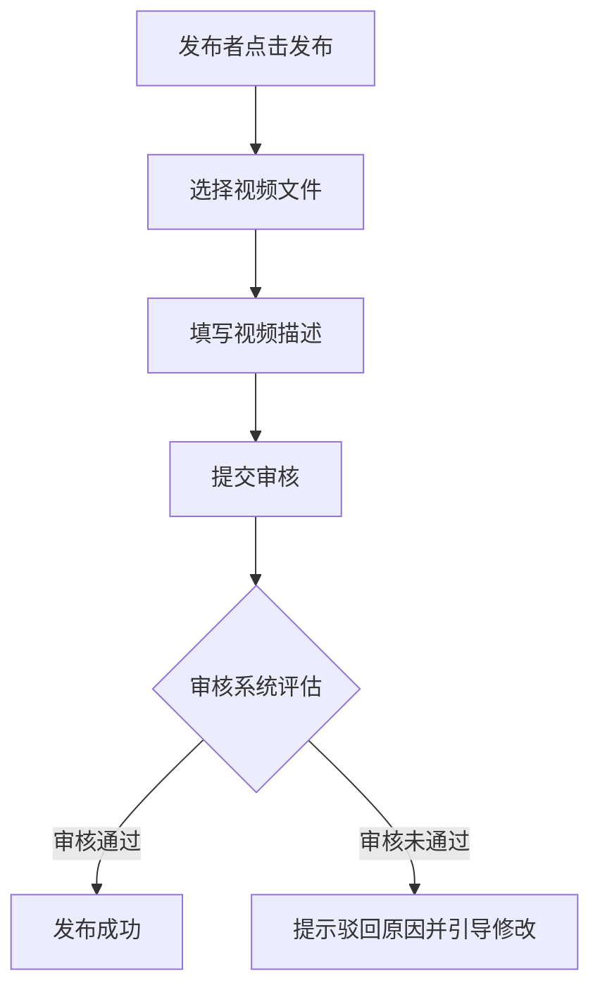
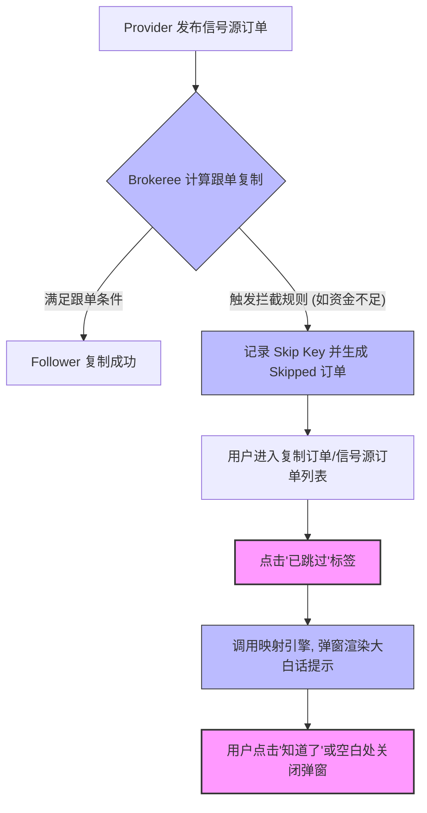

## 💡 PRD 产品设计文档怎么写 — 知识总结

### 1. 宏观设计 vs 微观设计
产品规划属于**宏观产品设计**，PRD（Product Requirement Document）属于**微观产品设计**。随着开发节奏加快，并非所有设计都需要独立 PRD，可按复杂度划分为三种形式：

| 设计形式 | 适用场景 | 表达方式 | 交付目标 |
| :--- | :--- | :--- | :--- |
| **任务内设计** | 简单需求修改（文字/图片/颜色等） | 直接写在 Task 详情中 | 降低文档成本，提高响应效率 |
| **故事级 PRD** | 单个用户故事/场景（最常见） | 完整章节：版本说明/背景目标/场景/交互/交付设计 | 指导团队在单次迭代内完成业务闭环 |
| **版本级设计** | 从0到1的大版本或跨系统复杂项目 | 总纲性顶层 PRD，梳理子产品架构，引导查阅细节 PRD | 协调多个PM共同编写"产品家族"文档 |

### 2. 故事级 PRD 的六大核心章节
呈金字塔式循序渐进结构：

**2.1 版本说明**：记录跟随评审会节奏的修改历史，便于团队快速了解自上次会议以来的变化（不是"改一次写一次"）。

**2.2 背景与目标**：
- 业务背景：说明为何需要此功能（如原平台只支持图文，导致视频博主流失）。
- 衡量目标：上线后期望达到的业务指标（如每天≥100用户发视频，视频浏览量占25%）。

**2.3 故事介绍**：
- 场景梳理：以"一件事一行字"穷举用户行为（通常十几行以内），帮助研发/测试建立画面感。
- 价值分析：论证场景如何支撑业务目标，需与运营协同分析避免逻辑不通。

**2.4 概要设计**（对应"五张图"前四张）：

- **用户核心路径**：绘制关键操作路径。
- **漏斗目标**：为每个转化箭头设定漏斗指标。预测能力体现PM水平（如预测过审率50%，运营需提前准备200条初始素材）；同时应视情况在概要设计中预留未来版本的兼容功能信号，供技术架构预留扩展空间。
- **模块图与功能清单图（M/F）**：穷举每模块下的功能，是任务分配与测试用例编写的目录索引。
- **页面结构图**：与功能清单相互呼应自洽校验，避免"孤岛功能"，产品经理通常与交互设计师用 Axure/MasterGo/墨刀等工具产出原型。

**2.5 详细设计**：把概要设计中的页面/功能清单具象化，逐一解释每页面交互逻辑、极限情况、业务规则，并与概要设计二次自洽校验。

**2.6 交付设计**：
- **数据分析与埋点设计**：研发介入前梳理清楚关键 Action/View 埋点，防止上线后"无法统计关键指标"。
- **数据报表设计**：PRD 中附带期望报表样式（可用 Excel 画草图），数据分析师需在测试阶段介入验证埋点。
- **上线筹备规划**：评估历史数据备份/升级方案，以及对其他中台或兄弟团队接口的依赖关系。

### 3. 产品上线后的闭环更新机制
上线1-2周数据稳定后，PRD 中新增一节 **"来自产品上线后的更新"**，填入真实漏斗转化率、日发布量等数据，通过"预测-实践-复盘"循环校准后续设计准确性，沉淀为个人知识库。

### 4. 落地注意事项
- **数据迁移与备份**：涉及旧数据结构修改/覆盖时，必须提前制定备份与回滚策略。
- **依赖链校验**：依赖其他中台/第三方 API 升级的功能，须设为"前置上线条件"，避免上游未就绪导致故障。
- **埋点双重校验**：测试人员验证页面功能的同时，数据分析师也需在测试环境验证日志上报是否正常。
- **PRD 提前评审机制**：提前1-2天将 PRD 发给研发/测试预读，避免评审会因技术瓶颈陷入僵局。

### 5. 核心术语速查
| 术语               | 作用                          | 适用阶段      | 协作对象           |
| :--------------- | :-------------------------- | :-------- | :------------- |
| In-task Design   | 简单变更直写任务卡，省去文档              | 敏捷日常迭代    | 开发、PM          |
| Version Design   | 顶层纲要PRD，统领多份细节PRD           | 立项及宏观设计阶段 | 技术架构师、多名PM     |
| User Story       | 用户场景需求叙述，PRD编写基础            | 需求分析阶段    | 业务方、PM、运营      |
| Feature List     | 模块/功能清单（M/F），任务分配与测试用例索引    | 概要设计阶段    | Tech Leader、测试 |
| Funnel Metrics   | 核心路径各环节转化率预测与观测指标           | 运营筹备与上线复盘 | PM、运营、分析师      |
| Data Tracking    | 用户行为(Action)与页面视图(View)埋点定义 | 交付设计与测试阶段 | 开发、数据分析师       |
| Mockup/Prototype | 页面原型，指导前端开发与评审              | 详细设计阶段    | UI/UX、前端、测试    |

# 实践产出

> RTC-185 Copy Trading 信号源订单复制状态与已跳过原因 (Skip Reason) 弹窗机制 - Mini-PRD

---

## 1. 版本说明 (Version History)

本版本说明跟随产品评审会议（Review Meeting）节奏更新，记录需求的变更与共识。

| 修改日期       | 文档版本 | 变更描述                        | 作者  | 评审状态 |
| :--------- | :--- | :-------------------------- | :-- | :--- |
| 2026-07-14 | V1.0 | 首次发布，定义“已跳过”状态的逻辑映射及多语言弹窗设计 | PM  | 待评审  |

---

## 2. 背景与目标 (Background & Goal)

### 2.1 业务背景
当前 Copy Trading 系统中，当跟随者（Follower）未成功复制信号源订单时，系统前台仅展示“已跳过”或无任何提示。用户在核对跟单行为时无法得知具体的跳过原因，这引发了大量用户向平台客服质疑“漏单/扣费异常”等问题。同样，带单者（Provider）也无法了解自身跟随者流失的具体技术原因。

### 2.2 衡量目标
*   **短期指标**：上线 1 个月内，因“跟单未复制/漏单”引发的客服工单数量**降低 40%**。
*   **体验指标**：跟单异常复制情况的客诉解决时长（MTTR）从平均 2 小时下降至 **0 分钟（用户自查即时解决）**。

---

## 3. 故事介绍 (User Story Introduction)

### 3.1 故事场景梳理 (User Scenarios)
以“一件事一行字”的列表形式穷举本需求涉及的用户场景：
1. Follower 打开“复制订单”持仓或历史列表，发现某笔黄金订单显示为红色状态字样“已跳过”。
2. Follower 点击该“已跳过”标签，界面弹出交互提示框。
3. 提示框中以多语言展示用户可理解的具体跳过原因（如“您的可用资金不足，无法复制开仓”）。
4. Follower 点击“知道了”关闭弹窗，知晓原委，未发起客诉。
5. Provider 打开“信号源订单”列表，查看持仓订单的被复制概况。
6. Provider 在列表中发现有 3 笔订单显示“已跳过”。
7. Provider 点击“已跳过”标签，弹窗显示“由于跟随者跟单策略限制，已跳过 3 笔复制”。
8. 客服在后台查询该笔订单的 Skip 状态，系统能够输出与前台用户所见完全一致的 Brokeree 原生 API 报错 Key。

### 3.2 价值分析 (Value Analysis)
*   **用户侧**：提供交易透明度，将“系统漏单（平台责任）”转化为“参数设置不合规/资金不足（用户责任）”，建立系统信任感。
*   **运营/客服侧**：将复杂的底层交易系统报错（Brokeree 状态码）翻译为大白话，消除客诉信息差，降低客服排障成本。

---

## 4. 概要设计 (High-level Design)

### 4.1 用户核心路径 (User Core Path)



### 4.2 漏斗目标 (Funnel Metrics)
*   **点击转化率预测**：预计列表页中所有显示“已跳过”的订单中，有 **70%** 的用户会点击该标签查看弹窗。
*   **客诉转化率预测**：在触发点击弹窗的用户中，直接发起工单/客诉的比例预计控制在 **$\le 2\%$**（大部分用户在看到提示如“资金不足”后会自行入金）。

### 4.3 中长期路径规划 (Roadmap 信号)
*   **V1.3 规划**：在跳过原因弹窗中增加“行动按钮（Call to Action）”。例如，若原因为“资金不足 (SkipByInvalidFunds)”，弹窗中将提供“立即入金”按钮；若原因为“品种不匹配 (NotFoundSymbol)”，提供“去配置品种映射”快捷入口。本次 V1.2 的 API 设计需预留 `action_link` 扩展字段。

### 4.4 核心 Feature 目录
*   **M-1: 前端 UI 展现**
    *   `F-1.1`：订单详情页/列表页的“已跳过 (Skipped)”状态标签及交互手势。
    *   `F-1.2`：多语言跳过原因提示弹窗组件（包含说明文案、免责提示、“知道了”行动按键）。
*   **M-2: 后端映射引擎**
    *   `F-2.1`：Brokeree `Results-ID` 中 skip reason 的解析提取与存储。
    *   `F-2.2`：多语言对照字典接口（API 输出 `skip_key`、`display_title`、`display_content`）。

### 4.5 页面结构设计草图 (Mockup Index)
```
+-------------------------------------------------+
|                     订单详情                     |
|                                                 |
|  * 基础信息                                      |
|    持仓单号: 127056230                          |
|    交易产品: XAUUSD                             |
|    复制状态: 已跳过 [?] <--- 点击调起弹窗          |
|                                                 |
+-------------------------------------------------+
|               [ 弹窗：跳过原因 ]                 |
|                                                 |
|   由于跟随者账户余额或权益小于等于 0，            |
|   系统在复制开仓时已跳过该笔订单。              |
|                                                 |
|   [ 知道了 ] <--- 点击关闭                       |
+-------------------------------------------------+
```

---

## 5. 详细设计 (Detailed Design)

### 5.1 业务规则
1.  **触发条件**：当跟单表（`follower_copied_orders`）中的 `copy_status` 字段值为 `Skipped` 时，状态文本渲染为红色，点击区域响应点击事件。
2.  **数据交互**：点击时，客户端向 API 请求 `/api/v1/copytrading/skip-reason` 并上传当前跟单 `order_id`。
3.  **多语言映射字典**：后端必须根据请求 Header 中的 `Accept-Language` 转换为对应文案。以下为核心映射标准（限举 3 例以示规范，完整列表见 [设计图文档](file:///Users/cooper.fu/.gemini/antigravity/brain/f9ea9355-d73a-4362-9cb1-e056727292e4/copy_trading_diagrams.md#3-%E5%A4%8D%E5%88%B6%E8%AE%A2%E5%8D%95%E7%8A%B6%E6%80%81%E4%B8%8E%E8%B7%B3%E8%BF%87%E5%8E%9F%E5%9B%A0%E9%80%BB%E8%BE%91%E6%98%A0%E5%B0%84%E8%A1%A8)）：
    *   `SkipByInvalidFunds` $\rightarrow$ 中文：“由于跟随者账户余额或权益小于等于 0，该持仓被跳过。”；英文：“Position is skipped because the follower has balance or equity ≤ 0.”
    *   `SkipByLotThreshold` $\rightarrow$ 中文：“复制持仓的计算交易量过低，低于手数阈值限制。”；英文：“The copy position's calculated volume is too low to be copied.”
    *   `TradeDisabled` $\rightarrow$ 中文：“由于交易平台设置，提供商或跟随者账户的交易功能已被禁用。”；英文：“Trading on the provider's or follower's account is disabled due to platform settings.”
4.  **降级展示**：若后端返回了未定义的 `skip_key` 或网络超时，弹窗内容做降级安全展示：“未复制成功 / No copy success”。

---

## 6. 交付设计 (Delivery Design)

### 6.1 数据分析与埋点设计 (Analytics & Tracking)
为观测产品上线后的漏斗表现，必须设计以下埋点：

| 事件分类 | 事件名称 (Event Name) | 触发时机 | 携带参数 (Parameters) |
| :--- | :--- | :--- | :--- |
| **页面展现** | `skip_reason_pop_view` | 跳过原因弹窗成功渲染呈现时 | `order_id`, `skip_reason_key`, `user_role` (provider/follower) |
| **交互事件** | `skip_reason_label_click` | 用户点击列表或详情页中的“已跳过”标签 | `order_id`, `source_page` (list/detail) |
| **交互事件** | `skip_reason_close_click` | 用户点击弹窗内的“知道了”或点击空白处关闭时 | `order_id`, `action_type` (got_it/blank_click) |

### 6.2 数据报表设计 (Report Design)
在运营后台的数据门户 (Data Portal) 中，新增“复制失败分析看板”，包含以下字段和统计：

*   **筛选条件**：时间区间、Provider 账号 ID、错误码类型 (`skip_key`)。
*   **报表字段明细草图**：

```
+------------+--------------------+------------+--------------+---------------+--------+
| 发生时间   | skip_reason_key    | 拦截订单数 | 平台占比 (%) | 涉及Follower数 | 责任归属 |
+------------+--------------------+------------+--------------+---------------+--------+
| 2026-07-14 | SkipByInvalidFunds | 1,245      | 45.2%        | 340           | 跟随者  |
| 2026-07-14 | NotFoundSymbol     | 412        | 15.0%        | 54            | 平台/TL|
+------------+--------------------+------------+--------------+---------------+--------+
```

### 6.3 上线筹备规划 (Launch Readiness)
*   **前置依赖链校验**：新接口的 skip reason 提取高频依赖于 Brokeree 服务器的版本。上线前技术团队需确认 MT4/MT5 目标服务器的 Brokeree 组件已升级至 `V5.6.2` 或以上，否则无法吐出 `SkipByRiskFactor` 等细分错误码。
*   **数据升级备份**：本次上线涉及历史跟单表新增字段 `skip_reason_raw_key VARCHAR(64)`。上线发布窗口期间，DBA 需对 `follower_copied_orders` 表进行在线 DDL 扩展并备份，防止锁表影响现网交易。

---

## 7. 来自产品上线后的更新 (Post-launch Updates)

*(本节为闭环更新保留。在产品上线一至两周数据稳定后，需在此补充填入真实的点击转化数据，与第四章的预测指标进行校准对齐)*
