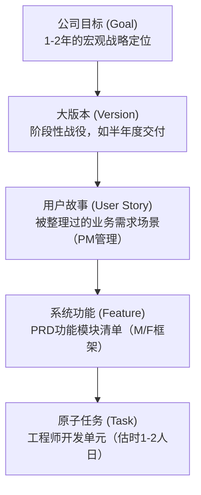
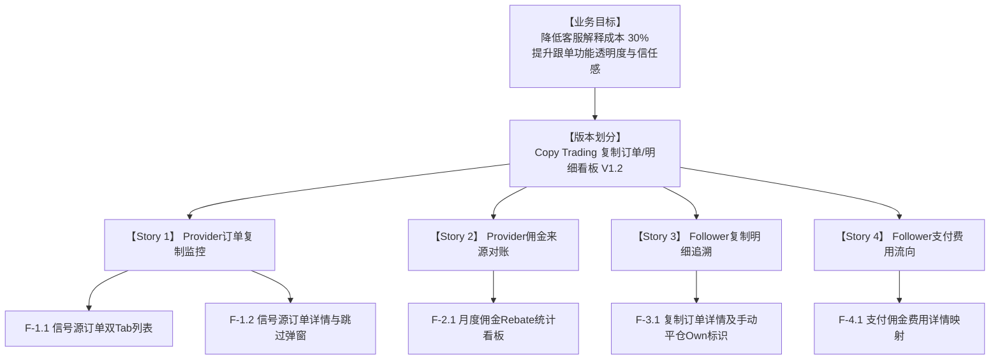

# 研发协作语言 — 知识总结

## 1. 敏捷开发模式 (Scrum) 的演进核心

*   **瀑布流模式**：长周期交付（按年/半年），前期预测成本极高，极易因为判断失误导致资源浪费。
*   **敏捷迭代 (Scrum) 模式**：通过快速度、小规模的冲刺（Sprint，通常为 **2周**）快速向市场交付 MVP（最小可行性产品），并根据真实反馈快速微调。
*   **速度、规模与人力的平衡**：
    *   在人力固定的情况下，**迭代速度越快，单次交付的 Feature 规模就越小**。
    *   若想同时兼顾“快速交付”与“大规模功能”，必须通过增加并行团队的数量进行横向团队扩展（三维立方体模型）。
    *   推荐采用 **“双披萨团队 (Two-Pizza Team)”**：团队规模控制在 6-12 人（通常包含开发、QA与PM），以最大化减少跨团队日常沟通的摩擦阻力。

---

## 2. 需求的分层体系 (Pyramid Hierarchy)

敏捷开发中，宏观目标会被自上而下层层翻译，形成如下的金字塔拆解链条：

*   **任务卡片管理原则**：每个 Task 必须有且仅有**唯一的负责人 (Owner)**，且估时应当控制在 **1-2 人日** 以内。粒度过大会导致开发过程成为“进度黑盒”，难以在站会上暴露阻碍。

---

## 3. Scrum 敏捷迭代的五大核心会议

1.  **预评审会 (Pre-review Meeting)**：
    *   *时机*：正式评审会前 1-2 天。
    *   *内容*：PM 邀请技术负责人及架构专家，对复杂、涉及跨团队接口的需求进行可行性预审，避免正式评审会卡死。
2.  **需求评审会 (Review Meeting)**：
    *   *时机*：Sprint 第一天。
    *   *内容*：PM 面对全团队宣讲 PRD，确保研发、测试、运营对业务场景和流转细节达成统一认知。
3.  **研发计划会 (Plan Meeting)**：
    *   *时机*：评审会后紧接召开。
    *   *内容*：研发团队把 Feature 拆解成 Task，进行点数（Points，人日）评估。
    *   *容量约束 (Capacity)*：计算 $\text{团队容量} = \text{研发人数} \times \text{冲刺工作日}$。若 Task 总工时超过容量，技术 Leader 与 PM 协商，将多余的 Story/Feature 退回 Backlog 需求池，防止团队过载。
4.  **每日站会 (Daily Standup)**：
    *   *时机*：冲刺期的每个工作日清晨，限时 **10 分钟**。
    *   *内容*：成员同步三件事：昨天完成了什么 Task？今天计划做什么 Task？遇到了什么阻碍 (Blocker)？
5.  **回顾复盘会 (Retrospective)**：
    *   *时机*：迭代结束/版本上线后。
    *   *内容*：对团队协作流程进行诊断，总结做得好的、做得差的，并输出具体的改进跟踪项（Kaizen 持续改进）。

---

## 4. 注意事项

*   **容量的水位控制 (Capacity Buffering)**：合理容量评估必须为“线上紧急故障修复”及“技术债务偿还”预留 **10%-20% 的安全缓冲水位**，防止意外情况导致迭代目标整体跳票。
*   **代码开发与发布隔离**：采用 Feature Branch（特性分支）进行敏捷交付。在代码合入主干前，利用 `Feature Flag` (功能开关) 对未交付或未测试完毕的功能进行线上物理隔离，保障生产环境的稳定性。

# 实践内容

> 依据 RTC-185 Copy Trading 复制订单来源明细展示 - 敏捷需求拆解方案，我们对该项目进行金字塔式需求拆解。

---

## 1. 团队容量评估与冲刺设定 (Sprint Capacity)

项目采用标准的 **2周迭代 (10个工作日)** 冲刺周期，组建 **“双披萨团队 (Two-Pizza Team)”** 进行模块化开发：

*   **团队角色配置**：
    *   1名 产品经理 (PM) — 需求把控与业务验收
    *   1名 后端/技术负责人 (Dev-BE) — 负责 Brokeree 接口对接与逻辑运算
    *   1名 App客户端开发 (Dev-App) — 负责 App 端 UI 与交互
    *   1名 Web前端开发 (Dev-Web) — 负责 Web 带单主页与后台数据呈现
    *   1名 测试工程师 (QA) — 负责质量保证与 UAT 校验
*   **Capacity 容量计算**：
    *   总容量容量 = 3名 开发 (Dev) * 10 天 = **30 点 (Points / 人日)**
    *   **安全缓冲水位 (Buffer)**：预留 **15% (约 4.5 点)** 用于处理突发线上紧急 Bug 或偿还技术债。
    *   **净容量容量 (Net Capacity)**：30 - 4.5 = **25.5 点**。所有拆解出的开发 Task 点数总和必须 $\le 25.5$ 点。

---

## 2. 金字塔需求层级拆解 (Pyramid Demand Hierarchy)

### 2.1 用户故事场景描述 (User Stories)
*   **Story 1 (Provider 订单端)**：作为带单者，我希望在带单详情中查看信号源持仓与历史订单的复制结果和失败原因，以便自排查跟单复制流失。
*   **Story 2 (Provider 费用端)**：作为带单者，我希望查看跟单佣金的月度明细账单，并能关联到具体的跟单者与跟单订单号，以便清晰对账。
*   **Story 3 (Follower 订单端)**：作为跟随者，我希望查看我实际复制的每一笔订单详情，并能清晰标识出我手动平仓（`Own`）的订单，以便核对收益归因。
*   **Story 4 (Follower 费用端)**：作为跟随者，我希望看到我支付出去的各项费用（管理费、绩效费、订阅费）的计算详情及对应订单，以便了解费用流向。

---

## 3. 原子开发任务清单 (Jira Kanban Card Drafts)

为防止进度变成“黑盒”，每个原子 Task 的估时均控制在 **2人日 (2 Points)** 以内，并指派唯一负责人。

### 3.1 后端任务 (BE Tasks) — 共计 6.5 点

| 任务 ID | 关联 Feature | 任务名称 / 描述 | Owner | 估时 (Points) | 验收标准 (Acceptance Criteria) |
| :--- | :--- | :--- | :--- | :--- | :--- |
| **BE-01** | F-1.2, F-3.1 | 对接 Brokeree API 提取复制状态及 `Skip reason` 字段，完成多语言字典映射路由 | Dev-BE | 2.0 | 提供标准 API，能根据跳过 Key 正确输出中/英文解释。 |
| **BE-02** | F-1.1 | 开发信号源订单列表（持仓/历史）分页查询及过滤接口，提供订单复制数/已处理数 | Dev-BE | 1.5 | 支持以订单号关联 positions 表中无 `#` 号的原单号。 |
| **BE-03** | F-2.1 | 开发带单者跟单佣金（Rebate）月度统计 API，支持按月份近6个月的数据归集查询 | Dev-BE | 1.5 | 统计结果数值需与单笔 Rebate 流水汇总值 100% 对齐。 |
| **BE-04** | F-4.1 | 扩展费用明细 API，支持读取收款账号所属交易服务器（如 `TMGM-Live12`）等属性 | Dev-BE | 1.5 | 费用详情页面字段能完整调取并渲染。 |

### 3.2 App 客户端任务 (App Tasks) — 共计 8.5 点

| 任务 ID | 关联 Feature | 任务名称 / 描述 | Owner | 估时 (Points) | 验收标准 (Acceptance Criteria) |
| :--- | :--- | :--- | :--- | :--- | :--- |
| **APP-01** | UI-Provider | 改造 Provider 主页，新增“跟单者/跟单佣金/信号源订单”三个入口 UI 布局 | Dev-App | 1.0 | UI 布局与 App 原型完全吻合，点击能正确跳转。 |
| **APP-02** | F-1.1, F-1.2 | 开发信号源持仓/历史列表页及订单详情页，展示复制手数等细节 | Dev-App | 2.0 | 页面支持分页，历史 Tab 展示平仓价格和平仓时间。 |
| **APP-03** | F-1.2 | 实现“跳过原因”提示窗 UI，支持读取后端跳过 Key 弹出对应提示 | Dev-App | 1.0 | 弹窗展示中英文对应文案无误，点击“知道了”能闭环关闭。 |
| **APP-04** | F-2.1 | 实现跟单佣金月统计页及日期选择弹窗（默认展示当前月，支持近6个月重置） | Dev-App | 1.5 | 选择月份后列表刷新，数据格式化为 `+0.00` 两位小数。 |
| **APP-05** | F-3.1 | 实现 Follower 复制订单详情，增加手动平仓的 `Own` 标识逻辑及弹窗 | Dev-App | 2.0 | 判断 `Deals` 数据属于 Follower 自行平仓时，显示 Own 图标，点击可弹窗解释。 |
| **APP-06** | F-4.1 | 改造跟单详情页及费用详情页（区分管理费/绩效费/订阅费，展示交易账号所属服务器） | Dev-App | 1.0 | 费用名称及处理状态与列表保持一致，多语言翻译无硬编码。 |

### 3.3 Web 前端任务 (Web Tasks) — 共计 3.5 点

| 任务 ID | 关联 Feature | 任务名称 / 描述 | Owner | 估时 (Points) | 验收标准 (Acceptance Criteria) |
| :--- | :--- | :--- | :--- | :--- | :--- |
| **WEB-01** | UI-Web | 在 Web 端带单主页右侧新增“信息源订单”入口，并兼容订阅计划展示限制 | Dev-Web | 1.0 | Web 右侧入口在不同分辨率下自适应排版，不出现遮挡。 |
| **WEB-02** | F-1.1 | 实现 Web 端信号源订单持仓列表表格（包含开仓时间、开仓价格、复制状态、手数） | Dev-Web | 1.5 | 实现列表分页逻辑，延用线上已有分页组件。 |
| **WEB-03** | F-2.1 | 改造 Web 端跟单佣金（Rebate）列表，新增订单号同步显示及月度统计切换 | Dev-Web | 1.0 | 订单号显示完整，支持一键复制，点击订单号可下钻。 |

### 3.4 敏捷容量平衡校验
*   **开发总估时** = 后端 (6.5) + App (8.5) + Web (3.5) = **18.5 点**。
*   **校验结论**：$18.5 \text{ 点} \le 25.5 \text{ 点 (Net Capacity)}$，团队在当前 Sprint 内有充足的容量交付此项目，无需裁剪 Backlog 需求，且留有充足的空间应对代码重构与 Bug 修复。

### 3.5 测试任务 (QA Tasks) — 共计 4.0 点 (并行/滞后执行)

| 任务 ID | 任务名称 / 描述 | Owner | 估时 (Points) | 验收标准 (Acceptance Criteria) |
| :--- | :--- | :--- | :--- | :--- | :--- |
| **QA-01** | 编写 `RTC-185` 测试用例，重点覆盖 18 种 Skip 跳过逻辑的边界测试 | QA | 1.0 | 用例覆盖所有 Brokeree 返回的 Skip Key，输出用例评审文档。 |
| **QA-02** | 执行 App & Web 双端订单复制状态验证（已发布/已跳过/未使用）及多语言验证 | QA | 2.0 | 验证从 Provider 信号原单到 Follower 复制单的数据一致性，确保无悬挂订单。 |
| **QA-03** | 验证手动平仓（Own）标识触发逻辑，核对账单月度汇总值是否 100% 对齐 | QA | 1.0 | 手动在 MT4/MT5 终端平仓，确认 App 订单上正确渲染 `Own` 标识并弹出说明。 |

---

## 4. 冲刺执行与 Scrum 会议管控规程

针对 `RTC-185` 涉及与底层 Brokeree 接口高频交互、状态复杂的特点，在迭代期间需严格执行以下 Scrum 规程：

1.  **预评审会 (Pre-review Meeting)**：
    *   在 Sprint 前 1-2 天，PM 与 Dev-BE 负责人针对 Brokeree 接口数据（尤其是 `positions` 与 `Deals` 中的订单号映射规则）进行预审，确认无技术死锁后方能进入评审。
2.  **每日站会 (Daily Standup)**：
    *   每日清晨 10 分钟，3 名开发与 1 名 QA 需严格同步是否有 MT4/MT5 服务器数据延迟引起的跟单状态更新 Block 风险，确保技术障碍在 24 小时内得到高层协调解决。
3.  **开发分支隔离 (Feature Branch)**：
    *   本需求涉及对现有跟单和费用计算系统的底层改造。开发需在独立的 `feature/rtc-185-copytrading` 分支上进行，测试环境通过后合并至 `release`。引入 `Feature Flag` (功能开关) 隔离线上环境，确保未彻底测试通过前不影响现网复制链路。
