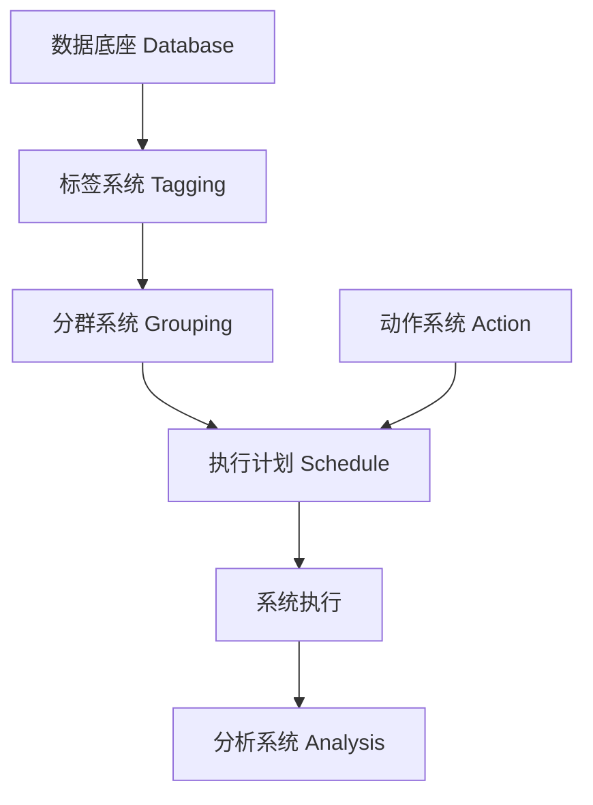
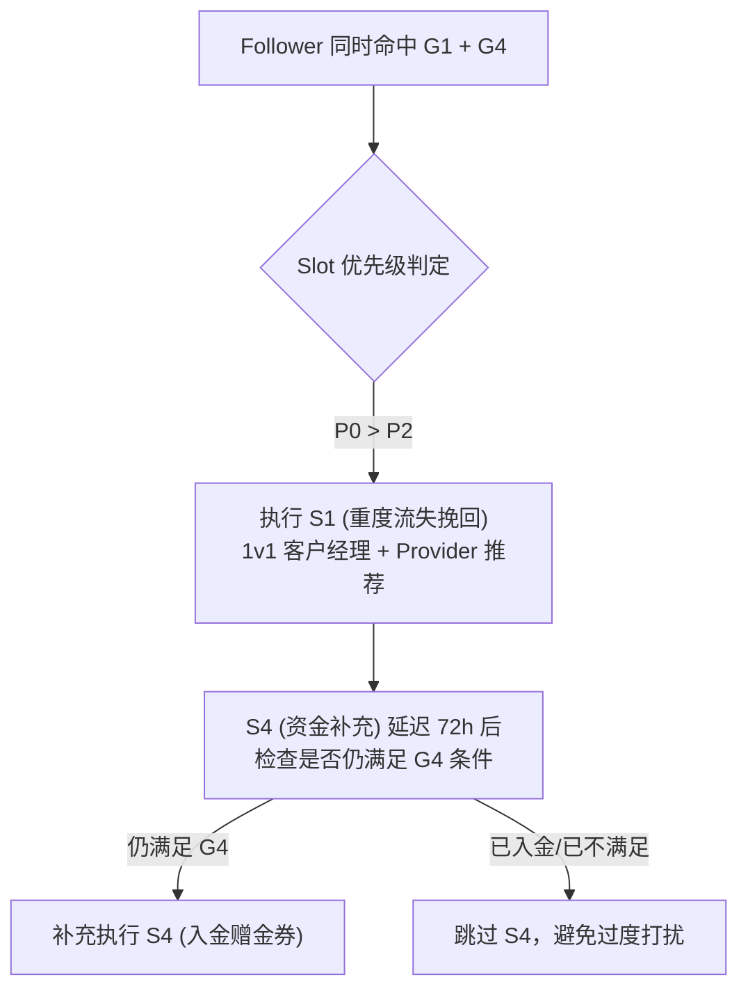

## 💡 从 0 到 1 设计 CRM 产品 — 知识总结

### 1. CRM 系统定位
CRM（客户关系管理）系统的核心目的是管理企业与客户的关系。它是企业用户运营战略的**执行系统**，将运营战略转化为自动化、常态化触达的工程载体。

### 2. 核心架构总览

**2.1 数据底座**：存储用户所有基础属性、行为日志与交易数据，是标签计算与画像分析的基础。

**2.2 标签系统**：对用户打标（Tagging），应为**单维度**且越简单越好，避免计算逻辑过重。示例：最近下单天数、注册日期、性别、累计营收。

**2.3 分群系统**：多个单维度标签的组合使用。示例：最近30天下过单 + 女性 + 买过宠物用品。
- **固定分群（静态快照）**：创建那一刻锁定名单，适合历史对比。
- **周期更新分群**：按固定周期重算（如每日凌晨），计算压力小，满足80%常规场景。
- **实时分群**：实时标签+行为事件触发（如"过去1分钟内打开App未下单"），可即时干预（实时Push），在认知最强烈时触达。

**2.4 动作系统**：定义"系统如何执行一件事"，与受众无关，是独立执行单元：
$$\text{动作 (Action)} = \text{营销工具 (Tools)} + \text{优惠策略 (Promotion)} + \text{触达渠道 (Channel)}$$
- 工具：抽奖、秒杀、发券、发积分、MGM（老带新裂变）等。
- 优惠策略：满100减50、无门槛5元券、赠500积分等。
- 触达渠道：短信、App Push、邮件、微信、公众号等。

**2.5 执行计划**：将**分群**与**动作**匹配绑定的策略级。当用户同时命中多个计划时需设计冲突调度：
- **并记模式**：同时享受多个计划优惠（成本高，触达力度大）。
- **顺序/互斥模式**：Slot 优先级排序，命中高优先级即终止后续下发，避免过度打扰。

运营实战示例（防流失体系）：

| 计划名称 | 受众分组 | 优惠动作 | 触达通道 | 逻辑 |
| :--- | :--- | :--- | :--- | :--- |
| 重度流失挽回 | 最近下单>30天 | 无门槛5元券 | 短信+Push | 折扣力度最大，强触达 |
| 轻度流失促活 | 14~30天 | 满20减3元券 | Push | 折扣中等，预防流失 |
| 日常活跃关怀 | 7~14天 | 低额多品类券 | Push | 促进跨品类消费 |

其他实战组合：宠物品类GMV提升计划（购买过宠物用品用户 + 秒杀/满减）；MGM老带新计划（高忠诚度用户≥5次下单 + 裂变分享奖励积分/券）。

**2.6 分析系统**：
1. 分群画像分析：了解人群属性特征。
2. 动作效果对比：验证同一Action在不同Group的普适价值。
3. 计划数据表现：综合评估各运营计划结果。
4. **自动化 A/B 测试**：将 Group 按比例分组（如10%对照/30%/50%/10%），对比各组人均GMV（ARPU）提升幅度（Uplift）。若某策略提升值与空白对照组一致，说明策略无效（大盘自然波动导致）；若显著高于对照组，说明有效。

### 3. 落地注意事项
- **实时标签引擎选型**：实时Push会大幅增加并发与流式计算压力，需评估是否引入 Flink，中小团队可先用周期跑批降本。
- **Slot路由与互斥并发设计**：分布式架构下发Push时须设计合理分布式锁与Slot优先级路由，避免多策略同时命中同一用户导致超支或骚扰。
- **对照组的业务价值**：必须制度化保留"空白对照组"，剔除大盘自然波动影响，确保Uplift数据真实有效。

### 4. 核心概念速查
| 组件 | 定位 | 落地要点 |
| :--- | :--- | :--- |
| Tagging | 单维度标签 | 越简单越好，避免单标签计算过重 |
| Grouping | 标签组合分群 | 分固定/周期/实时三种更新类型 |
| Tools | 营销工具组件 | 优惠券、秒杀、拼团、MGM裂变工具等 |
| Promotion | 折扣策略配置 | 满减、无门槛、加倍积分等 |
| Channel | 触达渠道组件 | 短信、Push、公众号、邮件等 |
| Schedule | 执行计划/策略级 | 需设计Slot优先级解决路由互斥 |
| A/B Test Split | 分流比例参数 | 必须预留空白对照组 |

# 实践产出

> Copy Trading Follower 防流失 CRM 分群策略与执行计划

依据 **模块 05（从 0 到 1 设计 CRM 产品）** 的核心方法论，将 CRM 系统六大模块（数据底座 → 标签系统 → 分群系统 → 动作系统 → 执行计划 → 分析系统）完整映射至 Copy Trading 的 Follower 跟单者运营场景，构建一套可落地的防流失自动化干预体系。

---

## 1. 数据底座 (Database)

Copy Trading Follower 防流失 CRM 的数据底座来源于以下三大核心数据表：

| 数据源                         | 核心字段                                                                      | 业务含义                              |
| :-------------------------- | :------------------------------------------------------------------------ | :-------------------------------- |
| **跟单订阅表** (`subscriptions`) | `subscription_id`, `status`, `created_at`, `suspended_at`, `provider_id`  | 记录 Follower 与 Provider 之间的订阅关系及状态 |
| **复制订单表** (`copied_orders`) | `order_id`, `copy_status`, `skip_reason`, `pnl`, `close_time`             | 记录每一笔被复制的订单详情、跳过原因及盈亏结果           |
| **账户资金表** (`accounts`)      | `account_id`, `balance`, `equity`, `last_deposit_time`, `last_trade_time` | 记录 Follower 的账户资金状态与最近活跃时间        |

---

## 2. 标签系统 (Tagging)

标签设计遵循模块 05 的核心原则：**单维度、越简单越好用**。每个标签只负责描述用户的一个切面属性。

| 标签名称                      | 标签类型 | 计算逻辑                                        | 更新频率 |
| :------------------------ | :--- | :------------------------------------------ | :--- |
| `days_since_last_copy`    | 数值型  | 当前日期 $-$ 最近一笔复制订单的开仓日期                      | 每日凌晨 |
| `total_pnl_30d`           | 数值型  | 近 30 天所有已平仓复制订单的累计盈亏 ($)                    | 每日凌晨 |
| `skip_rate_7d`            | 百分比  | 近 7 天内（已跳过订单数 $\div$ 信号源总订单数）$\times 100\%$ | 每日凌晨 |
| `subscription_status`     | 枚举型  | 当前订阅状态：`Active` / `Suspended` / `Cancelled` | 实时   |
| `account_equity`          | 数值型  | 当前账户净值 ($)                                  | 实时   |
| `days_since_last_deposit` | 数值型  | 当前日期 $-$ 最近一次入金时间                           | 每日凌晨 |
| `provider_win_rate`       | 百分比  | 所跟随 Provider 近 30 天的胜率                      | 每日凌晨 |
| `own_close_count_30d`     | 数值型  | 近 30 天手动平仓（Own）的订单笔数                        | 每日凌晨 |

---

## 3. 分群系统 (Grouping)

通过组合多个单维度标签，精确圈定不同流失风险层级的 Follower 人群：

### 3.1 防流失分群定义

| 分群名称 | 组合条件 (AND 逻辑) | 更新类型 | 业务含义 |
| :--- | :--- | :--- | :--- |
| **G1 - 重度流失风险** | `days_since_last_copy` > 14 天 **且** `subscription_status` = Active **且** `account_equity` > 0 | 周期更新（每日） | 订阅仍在，有钱但已长期不跟单，流失意愿极强 |
| **G2 - 亏损型流失预警** | `total_pnl_30d` < -$200 **且** `subscription_status` = Active | 周期更新（每日） | 持续亏损导致信心丧失，是取消订阅的高危信号 |
| **G3 - 跳单型沉默用户** | `skip_rate_7d` > 50% **且** `days_since_last_copy` > 7 天 | 周期更新（每日） | 信号源订单频繁被跳过，用户体验断裂，逐渐放弃 |
| **G4 - 资金枯竭型** | `account_equity` ≤ $50 **且** `subscription_status` = Active | 实时分群 | 账户净值过低，即将触发大面积 SkipByInvalidFunds |
| **G5 - 手动干预型** | `own_close_count_30d` ≥ 5 **且** `subscription_status` = Active | 周期更新（每日） | 频繁手动平仓，对 Provider 信号缺乏信任，随时可能退出 |

### 3.2 健康基线分群（对照组）

| 分群名称 | 组合条件 | 用途 |
| :--- | :--- | :--- |
| **G0 - 活跃健康用户** | `days_since_last_copy` ≤ 3 天 **且** `total_pnl_30d` ≥ 0 **且** `skip_rate_7d` < 10% | 作为 A/B 测试中的自然基准参照 |

---

## 4. 动作系统 (Action)

动作 = **营销工具 (Tools)** + **优惠策略 (Promotion)** + **触达渠道 (Channel)**

| 动作 ID | 营销工具 | 优惠策略 | 触达渠道 | 适用场景 |
| :--- | :--- | :--- | :--- | :--- |
| **A1** | 赠金券 (Bonus Coupon) | 入金 $500 赠 $50 交易赠金（10% 首充加码） | App Push + 站内信 | 资金枯竭用户引导入金 |
| **A2** | 跟单免佣卡 (Fee Waiver) | 下次跟单佣金减免 30 天（管理费豁免） | App Push + Email | 亏损用户降低持仓成本感知 |
| **A3** | Provider 推荐引擎 | 系统推荐近 30 天胜率 Top5 的 Provider | App Push + 弹窗 | 当前 Provider 表现不佳时引导切换 |
| **A4** | 跟单策略诊断报告 | 生成个性化诊断（跳过原因分析 + 参数优化建议） | 站内信 + Email | 跳单率高的用户引导优化设置 |
| **A5** | 1v1 客户经理触达 | 指派专属客服主动联系 | 电话/WhatsApp | 高价值但重度流失的 VIP 用户 |

---

## 5. 执行计划 (Schedule)

执行计划 = 将**受众分群 (Grouping)** 与**动作 (Action)** 进行策略级绑定。

### 5.1 防流失执行计划矩阵

| 计划名称 | 受众分群 | 执行动作 | 触达时机 | Slot 优先级 |
| :--- | :--- | :--- | :--- | :--- |
| **S1 - 重度流失挽回** | G1（长期未跟单） | A5（1v1 客户经理触达）+ A3（推荐优质 Provider） | 命中后 24h 内 | **P0（最高优先级）** |
| **S2 - 亏损信心修复** | G2（持续亏损） | A2（跟单免佣卡 30 天）+ A3（推荐高胜率 Provider） | 命中后 48h 内 | P1 |
| **S3 - 跳单参数修复** | G3（高跳单率） | A4（跟单策略诊断报告） | 命中后 24h 内 | P1 |
| **S4 - 资金补充引导** | G4（资金枯竭） | A1（入金赠金券 $50） | 实时命中即刻下发 | P2 |
| **S5 - 信任重建引导** | G5（频繁手动干预） | A4（诊断报告）+ A3（推荐 Provider） | 命中后 48h 内 | P2 |

### 5.2 策略冲突排队规则 (Slot 互斥/并记)

当一个 Follower 同时命中多个分群（例如既是 G1 又是 G4）时，执行以下调度：

*   **互斥规则**：同一自然日内，单个 Follower 最多接收 **1 条 App Push + 1 封 Email**，严禁多条策略同时轰炸。
*   **冷却期 (Cooldown)**：任何一条 Schedule 被触发后，对该用户设置 **72 小时冷却窗口**，冷却期内不再下发新策略。

---

## 6. 分析系统 (Analysis)

### 6.1 A/B 测试设计

以 **S2（亏损信心修复）** 为例，按比例拆分受众进行效果验证：

| 实验分组 | 比例 | 干预动作 | 观测指标 |
| :--- | :--- | :--- | :--- |
| **对照组 (Control)** | 10% | 不做任何干预 | 自然续订率、自然入金率 |
| **实验组 A** | 45% | 仅下发 A2（免佣卡 30 天） | 续订率、后续 30 天 PnL 变化 |
| **实验组 B** | 45% | A2（免佣卡）+ A3（推荐高胜率 Provider） | 续订率、Provider 切换率、后续 30 天 PnL 变化 |

### 6.2 核心分析维度

1.  **分群画像分析**：了解 G1–G5 各分群的用户地域、入金规模、跟随的 Provider 类型特征。
2.  **动作效果对比**：验证 A2（免佣卡）在 G2（亏损型）与 G4（资金型）中的续订提升效果是否有差异。
3.  **计划数据表现**：综合评估各 Schedule 的 **续订挽回率 (Retention Uplift)** 与 **人均入金增量 (Deposit Uplift per User)**。
4.  **Uplift 净效应计算**：

$$\text{Uplift} = \text{实验组续订率} - \text{对照组续订率}$$

> [!IMPORTANT]
> 必须保留 10% 的空白对照组（不做任何干预），以剔除大盘自然波动对运营效果的影响。若实验组与对照组续订率无显著差异，则说明该策略无效，需迭代优化。

---

## 7. 注意事项

*   **实时分群的计算成本控制**：G4（资金枯竭型）采用实时分群，会在每次账户净值变动时触发重新计算。在高交易量时段（如非农数据发布期间），需对实时分群引擎做流控限流（Rate Limiting），防止峰值并发冲垮标签计算集群。中小规模团队可先将 G4 降级为每 15 分钟跑批更新。
*   **Slot 冲突路由的分布式锁**：当多条 Schedule 在短时间内对同一 Follower 并发触发时，必须在消息队列（如 Kafka/RabbitMQ）的消费端引入分布式锁，按 Slot 优先级串行调度，防止同一用户在几秒内同时收到两条 Push。
*   **对照组的业务价值**：运营团队常常抗拒"浪费"10% 的用户不做干预。PM 需向运营方明确：没有对照组，所有策略效果都无法归因，可能导致长期投入大量营销预算却无法证明 ROI，最终被管理层砍掉预算。对照组是 CRM 系统的**生命线**。
