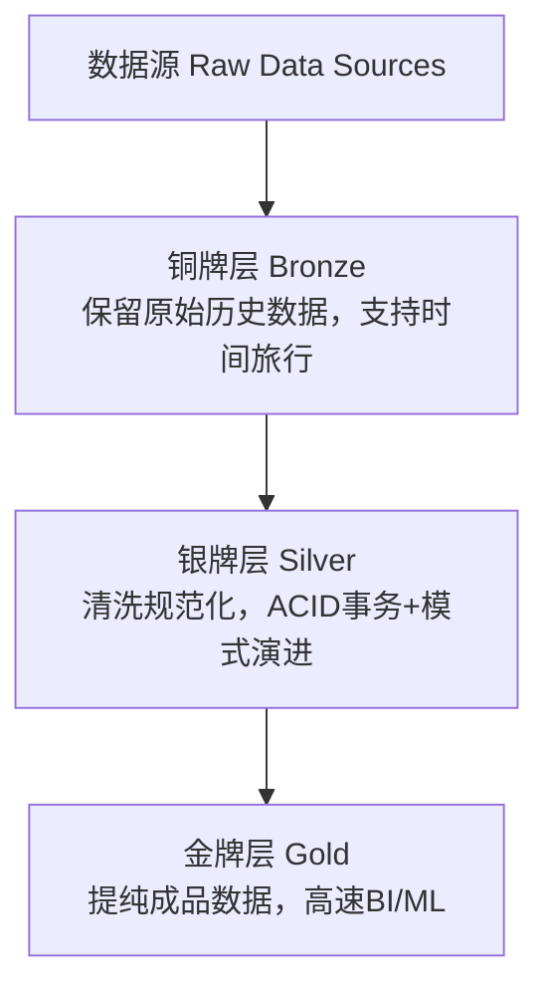
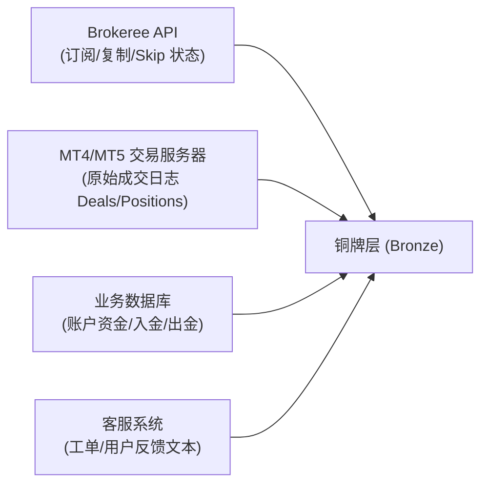
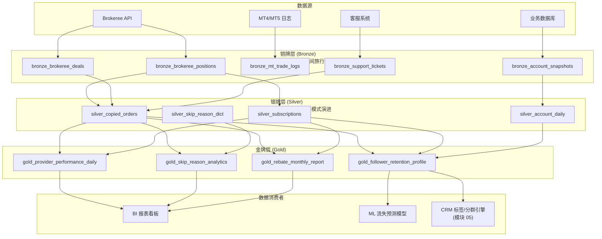

## 💡 数据架构的新形态（湖仓一体）— 知识总结

### 1. 演变背景
企业数据平台面临双重需求：现代 BI 的高速报表分析，与 ML/数据科学的深度模型训练。传统架构由数仓和数据湖分别支撑，带来高存储成本、数据孤岛、数据不一致问题——"数仓太贵，湖太乱"。**湖仓一体（Lakehouse）**为解决痛点而生，是现代统一数据平台的确定性演进方向。

### 2. 数据仓库 vs 数据湖 vs 湖仓一体

| 维度 | 数据仓库 | 数据湖 | 湖仓一体 |
| :--- | :--- | :--- | :--- |
| 比喻 | 数据超市 | 原材料仓库 | 现代智能化仓储一体化平台 |
| 结构定义 | **写入时定义** Schema-on-Write | **读取时定义** Schema-on-Read | 写入控制+读取演进结合 |
| 数据质量 | 高（强制约束） | 低（无序堆放） | 高（ACID事务+模式约束） |
| 灵活性 | 低 | 高 | 高 |
| 存储成本(100TB基准) | 较高 | 便宜60%~80% | 便宜60%~80%（与湖相当） |
| 应用场景 | 传统BI报表、多维分析 | 数据科学、ML原始存储 | 统一BI报表与ML/数据科学 |

### 3. 湖仓一体底层实现

**3.1 奖牌架构（Medallion Architecture）**：三层渐进提纯

- **铜牌层**：直接接入保留原始历史数据，支持**时间旅行**（Time Travel）回溯任意历史时点。
- **银牌层**：清洗转换结构化，提供 **ACID 事务**保证，支持**模式演进**（Schema Evolution）随业务变化自动安全适配。
- **金牌层**：高度汇总提纯的成品数据，针对性能极致优化，用于BI报表与ML训练。

**3.2 开放表格式（Open Table Format）**：在普通对象存储（HDFS/S3）之上构建元数据索引和事务日志的核心秘密武器。
- **Delta Lake**：Spark生态最成熟，商业化支持强，与Spark深度绑定。
- **Apache Iceberg**：跨计算引擎能力出色（Spark/Flink/Trino/Presto均支持），是中立数据平台首选。
- **Apache Hudi**：Upsert/Delete写操作高效，适用于近实时流读写。
- **Apache Paimon / Hive ACID**：流式计算或历史遗留数仓升级场景。

### 4. 业务选型决策指南
**问题1：数据长什么样？**
- 结构化数据为主、来源单一 → 传统数据仓库即可。
- 多源异构（结构化+半结构化+非结构化）→ 必须湖仓一体。

**问题2：业务目标想做什么？**
- 纯传统BI分析 → 数据仓库依然成熟强力。
- BI与ML复合需求 → 湖仓一体是唯一理想选择，避免数据在湖仓间搬运导致孤岛与不一致。

> 行业共识：预计到2026年，企业不再纠结"选数仓还是数据湖"，而转向"何时迁移到湖仓一体"。

### 5. 落地注意事项
- **Schema 设计策略**：高频变化的非结构化数据强行要求 Schema-on-Write，会导致上游对接频繁中断，需结合业务变化频率选择。
- **ACID事务与时间旅行的存储代价**：多版本数据文件和元数据快照会使存储膨胀，需定期执行垃圾回收（如 Spark 的 `VACUUM`），否则抵消成本优势。
- **开放表格式的生态兼容性**：多引擎混合生产环境优先选 Apache Iceberg，避免被单一引擎（如Delta Lake绑定Spark）深度锁定。

### 6. 核心概念速查
| 架构/技术 | 存储机制与成本 | 核心特性 | 工程作用 |
| :--- | :--- | :--- | :--- |
| 数据仓库 | 高昂专有存储(写入时定义) | 高质量、低灵活性 | 静态财务报表与核心BI分析 |
| 数据湖 | 便宜60%-80%(读取时定义) | 高灵活性、零事务、易失控 | 存储低频原始日志、多媒体文件 |
| 湖仓一体 | 便宜60%-80%(基于湖存储) | ACID事务、时间旅行、模式演进 | 统一数据底座，兼顾BI与ML |
| Delta Lake | 文件+Delta Log | Spark生态高度优化 | Spark为核心引擎企业首选 |
| Apache Iceberg | 元数据Manifest结构 | 中立跨引擎支持 | 混合引擎、去中心化平台首选 |
| Apache Hudi | 文件+Timeline索引 | 快速Upsert/Delete写入 | 行级增量更新流式场景 |
| 奖牌架构 | Bronze→Silver→Gold | 数据提纯管道 | 规范湖仓内部处理阶段流向 |


# 实践产出

> Copy Trading 数据报表 — 奖牌架构 (Medallion Architecture) 分层方案

依据 **模块 06（数据架构的新形态）** 的湖仓一体方法论，将奖牌架构（Bronze → Silver → Gold）三层渐进式数据提纯模型完整映射至 Copy Trading 的数据报表体系，构建一套兼顾 BI 分析与机器学习的统一数据底座。

---

## 1. 业务选型决策

在设计 Copy Trading 数据架构之前，依据模块 06 的两个核心选型问题进行评估：

| 决策问题 | Copy Trading 场景回答 | 结论 |
| :--- | :--- | :--- |
| **数据长什么样？** | 结构化数据（订单表、订阅表、账户资金表）+ 半结构化数据（Brokeree API JSON 响应、MT4/MT5 交易日志）+ 非结构化数据（客服工单文本、用户反馈） | **多源异构混合** → 需要湖仓一体 |
| **业务目标是什么？** | 既需要运营 BI 报表（跟单佣金月报、跳单率看板），又需要 ML 模型（Follower 流失预测、Provider 质量评分） | **BI + ML 复合需求** → 湖仓一体是唯一理想选择 |

---

## 2. 数据源清单 (Raw Data Sources)

Copy Trading 数据报表体系涉及以下四大数据源：



---

## 3. 奖牌架构三层设计

### 3.1 铜牌层 (Bronze Layer) — 原始历史数据保留

铜牌层直接接入并保留**最原始的、未经加工的**数据快照。核心超能力：**时间旅行 (Time Travel)**，可随时回溯到任意历史时间点查看数据状态。

| 铜牌表名 | 数据来源 | 存储格式 | 写入策略 | 保留策略 |
| :--- | :--- | :--- | :--- | :--- |
| `bronze_brokeree_positions` | Brokeree API `/positions` | JSON → Parquet（追加写入） | 每 15 分钟增量拉取 | 永久保留，支持 Time Travel 回溯 180 天 |
| `bronze_brokeree_deals` | Brokeree API `/deals` | JSON → Parquet | 每 15 分钟增量拉取 | 永久保留 |
| `bronze_brokeree_subscriptions` | Brokeree API `/subscriptions` | JSON → Parquet | 订阅状态变更时事件驱动写入 | 永久保留 |
| `bronze_mt_trade_logs` | MT4/MT5 交易服务器日志 | CSV/FIX Log → Parquet | 每日凌晨全量快照 + 日内增量 | 永久保留 |
| `bronze_account_snapshots` | 业务数据库 `accounts` 表 | 关系型 → Parquet | 每日凌晨全量快照 | 保留 365 天历史版本 |
| `bronze_support_tickets` | 客服系统 API | JSON（含非结构化文本） | 工单创建/更新时事件驱动 | 永久保留 |

> [!NOTE]
> **铜牌层绝不做任何清洗和转换**。即使 Brokeree API 返回了脏数据（如空字段、异常时间戳），也原样保留。这确保了出现数据争议时可以追溯到最原始的"事实真相"。

---

### 3.2 银牌层 (Silver Layer) — 清洗、规范化与 ACID 事务保障

银牌层对铜牌层数据进行清洗、去重、类型转换和关联拼接。核心超能力：**ACID 事务** 保证数据写入的原子性与一致性，以及 **模式演进 (Schema Evolution)** 支持字段安全扩展。

| 银牌表名 | 上游铜牌表 | 清洗与转换规则 | ACID 保障要点 |
| :--- | :--- | :--- | :--- |
| `silver_copied_orders` | `bronze_brokeree_positions` + `bronze_brokeree_deals` | ① 去除 `#` 号前缀的衍生订单号，关联回原单<br>② 时间戳统一为 UTC 格式<br>③ `copy_status` 枚举标准化 (`Published`/`Skipped`/`NotUsed`)<br>④ `skip_reason` 映射为标准 Key（如 `SkipByInvalidFunds`） | 单笔订单的 Position + Deal 必须在同一事务内原子写入，防止"有开仓无平仓"的半写入脏数据 |
| `silver_subscriptions` | `bronze_brokeree_subscriptions` | ① 枚举状态标准化 (`Active`/`Suspended`/`Cancelled`)<br>② 填充缺失的 `suspended_at` 时间戳（取事件写入时间兜底）<br>③ 关联 Provider 表获取 `provider_name` | 订阅状态变更必须幂等写入，防止事件重放导致重复记录 |
| `silver_account_daily` | `bronze_account_snapshots` | ① 计算每日净值变动 $\Delta\text{equity} = \text{equity}_t - \text{equity}_{t-1}$<br>② 标记入金/出金事件标签<br>③ NULL 余额填充为 0 并打异常标记 | 日快照表必须保证每个账户每天有且仅有一条记录（唯一性约束） |
| `silver_skip_reason_dict` | 静态配置 + 多语言翻译表 | ① 将 Brokeree API Key 与中英文展示文案进行标准化映射<br>② 新增 Key 时通过 Schema Evolution 自动扩展，无需停机 | 字典表变更需版本化，旧版本仍可通过 Time Travel 查询 |
| `silver_support_tickets` | `bronze_support_tickets` | ① 提取工单中的关键字段（订单号、账户 ID、问题分类）<br>② 非结构化文本进行分词与情感标注 | — |

**模式演进示例**：当 Brokeree 在后续版本新增了 `SkipByMaxPositions`（最大持仓数限制）这个全新的 Skip Key 时，银牌层的 `silver_skip_reason_dict` 表通过 Schema Evolution 自动新增该行记录，无需修改表结构或停机，下游金牌层的报表也自动兼容。

---

### 3.3 金牌层 (Gold Layer) — 高度聚合的业务成品数据

金牌层是面向最终消费者（BI 分析师、运营团队、ML 模型）的**开箱即用**的提纯数据。核心超能力：**极致的查询性能优化**。

| 金牌表名 | 上游银牌表 | 聚合逻辑 | 消费场景 |
| :--- | :--- | :--- | :--- |
| `gold_provider_performance_daily` | `silver_copied_orders` + `silver_subscriptions` | 按 Provider + 日期聚合：日信号订单数、被复制成功率、跟随者数、累计佣金 | **BI 报表**：Provider 排行榜、Provider 质量监控看板 |
| `gold_follower_retention_profile` | `silver_copied_orders` + `silver_account_daily` + `silver_subscriptions` | 按 Follower 聚合：近 7/30 天跟单频次、累计 PnL、跳单率、手动干预次数、账户净值区间 | **ML 模型**：Follower 流失预测模型特征输入；**CRM**：模块 05 标签系统的数据源 |
| `gold_skip_reason_analytics` | `silver_copied_orders` + `silver_skip_reason_dict` | 按 Skip Key + 日期聚合：每日各跳过原因的触发次数、占比、影响 Follower 数 | **BI 报表**：RTC-185 Mini-PRD 中设计的"复制失败分析看板" |
| `gold_rebate_monthly_report` | `silver_copied_orders` + `silver_subscriptions` | 按 Provider + 月份聚合：月佣金总额、佣金笔数、关联订单号列表 | **BI 报表**：Provider 月度佣金对账报表 |
| `gold_support_ticket_analytics` | `silver_support_tickets` + `silver_skip_reason_dict` | 按问题分类 + 日期聚合：工单数量、平均解决时长、Top 问题分类 | **BI 报表**：客服效率看板；验证 RTC-185 上线后客诉工单下降效果 |

---

## 4. 端到端数据流转全景图



---

## 5. 开放表格式选型建议

| 评估维度      | 推荐方案                                   | 理由                                                                    |
| :-------- | :------------------------------------- | :-------------------------------------------------------------------- |
| **计算引擎**  | Spark (批处理) + Flink (近实时 Brokeree 事件流) | Copy Trading 既有每日跑批需求（日报/月报），也有近实时需求（资金枯竭实时分群）                        |
| **开放表格式** | **Apache Iceberg**                     | 在 Spark + Flink 混合引擎场景下，Iceberg 的跨引擎中立性最强，不会被 Delta Lake 的 Spark 绑定锁死 |
| **存储层**   | 对象存储 (S3/MinIO)                        | 成本比传统数据仓库低 60%-80%，且天然支持 Iceberg 的元数据 Manifest 结构                     |

---

## 6. 注意事项

*   **Time Travel 的存储代价控制**：铜牌层开启了 180 天的时间旅行保留。在 Apache Iceberg 中，每次写入都会生成新的数据文件快照。必须配置定期的 **垃圾回收作业 (Expire Snapshots)**，清理超过 180 天的过期快照文件，防止对象存储空间无限膨胀。建议每周日凌晨执行：
    ```sql
    CALL catalog.system.expire_snapshots('bronze_brokeree_positions', TIMESTAMP '2026-01-14 00:00:00');
    ```

*   **银牌层 ACID 写入的性能瓶颈**：`silver_copied_orders` 表需要将 Positions 与 Deals 在同一事务内原子关联写入。在高交易量时段（如非农数据公布后），Brokeree API 可能在 15 分钟内返回上万条记录。应采用 **微批 (Micro-batch)** 模式（每 500 条提交一次事务），而非单条逐行写入，以平衡事务安全性与吞吐量。

*   **金牌层与模块 05 CRM 的数据联动**：`gold_follower_retention_profile` 是模块 05 CRM 标签系统（如 `days_since_last_copy`、`skip_rate_7d`）的核心数据源。CRM 标签引擎应直接读取金牌层的预聚合结果，**严禁跳过金牌层直接查询银牌层**，否则会因为大量实时 JOIN 操作拖垮银牌层的写入性能。
