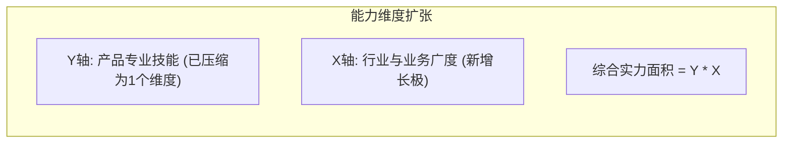

## 💡 产品经理职级差异与提升路径 — 知识总结

### 1. 五个关键成长阶段总览
从小白到总监，产品经理的核心能力演变可抽象为五个阶段："做了""会了""快了""大了""小了"：

![Mermaid diagram](data:image/svg+xml;base64,PHN2ZyB4bWxucz0iaHR0cDovL3d3dy53My5vcmcvMjAwMC9zdmciIHZpZXdCb3g9IjAgMCAzODcuMjI3OTk5OTk5OTk5OTUgODgyLjg5OTk5OTk5OTk5OTkiIHdpZHRoPSIzODcuMjI3OTk5OTk5OTk5OTUiIGhlaWdodD0iODgyLjg5OTk5OTk5OTk5OTkiIHN0eWxlPSItLWJnOiNGRkZGRkY7LS1mZzojM0IzQjNCOy0tbGluZTojM0IzQjNCOy0tYWNjZW50OiMwMDVGQjg7LS1tdXRlZDojM0IzQjNCQ0M7LS1zdXJmYWNlOiNGOEY4Rjg7LS1ib3JkZXI6IzNCM0IzQjtiYWNrZ3JvdW5kOnZhcigtLWJnKSI+CjxzdHlsZT4KICBAaW1wb3J0IHVybCgnaHR0cHM6Ly9mb250cy5nb29nbGVhcGlzLmNvbS9jc3MyP2ZhbWlseT1JbnRlcjp3Z2h0QDQwMDs1MDA7NjAwOzcwMCZhbXA7ZGlzcGxheT1zd2FwJyk7CiAgdGV4dCB7IGZvbnQtZmFtaWx5OiAnSW50ZXInLCBzeXN0ZW0tdWksIHNhbnMtc2VyaWY7IH0KICBzdmcgewogICAgLyogRGVyaXZlZCBmcm9tIC0tYmcgYW5kIC0tZmcgKG92ZXJyaWRhYmxlIHZpYSAtLWxpbmUsIC0tYWNjZW50LCBldGMuKSAqLwogICAgLS1fdGV4dDogICAgICAgICAgdmFyKC0tZmcpOwogICAgLS1fdGV4dC1zZWM6ICAgICAgdmFyKC0tbXV0ZWQsIGNvbG9yLW1peChpbiBzcmdiLCB2YXIoLS1mZykgNjAlLCB2YXIoLS1iZykpKTsKICAgIC0tX3RleHQtbXV0ZWQ6ICAgIHZhcigtLW11dGVkLCBjb2xvci1taXgoaW4gc3JnYiwgdmFyKC0tZmcpIDQwJSwgdmFyKC0tYmcpKSk7CiAgICAtLV90ZXh0LWZhaW50OiAgICBjb2xvci1taXgoaW4gc3JnYiwgdmFyKC0tZmcpIDI1JSwgdmFyKC0tYmcpKTsKICAgIC0tX2xpbmU6ICAgICAgICAgIHZhcigtLWxpbmUsIGNvbG9yLW1peChpbiBzcmdiLCB2YXIoLS1mZykgNTAlLCB2YXIoLS1iZykpKTsKICAgIC0tX2Fycm93OiAgICAgICAgIHZhcigtLWFjY2VudCwgY29sb3ItbWl4KGluIHNyZ2IsIHZhcigtLWZnKSA4NSUsIHZhcigtLWJnKSkpOwogICAgLS1fbm9kZS1maWxsOiAgICAgdmFyKC0tc3VyZmFjZSwgY29sb3ItbWl4KGluIHNyZ2IsIHZhcigtLWZnKSAzJSwgdmFyKC0tYmcpKSk7CiAgICAtLV9ub2RlLXN0cm9rZTogICB2YXIoLS1ib3JkZXIsIGNvbG9yLW1peChpbiBzcmdiLCB2YXIoLS1mZykgMjAlLCB2YXIoLS1iZykpKTsKICAgIC0tX2dyb3VwLWZpbGw6ICAgIHZhcigtLWJnKTsKICAgIC0tX2dyb3VwLWhkcjogICAgIGNvbG9yLW1peChpbiBzcmdiLCB2YXIoLS1mZykgNSUsIHZhcigtLWJnKSk7CiAgICAtLV9pbm5lci1zdHJva2U6ICBjb2xvci1taXgoaW4gc3JnYiwgdmFyKC0tZmcpIDEyJSwgdmFyKC0tYmcpKTsKICAgIC0tX2tleS1iYWRnZTogICAgIGNvbG9yLW1peChpbiBzcmdiLCB2YXIoLS1mZykgMTAlLCB2YXIoLS1iZykpOwogIH0KPC9zdHlsZT4KPGRlZnM+CiAgPG1hcmtlciBpZD0iYXJyb3doZWFkIiBtYXJrZXJXaWR0aD0iOCIgbWFya2VySGVpZ2h0PSI1IiByZWZYPSI3IiByZWZZPSIyLjUiIG9yaWVudD0iYXV0byI+CiAgICA8cG9seWdvbiBwb2ludHM9IjAgMCwgOCAyLjUsIDAgNSIgZmlsbD0idmFyKC0tX2Fycm93KSIgc3Ryb2tlPSJ2YXIoLS1fYXJyb3cpIiBzdHJva2Utd2lkdGg9IjAuNzUiIHN0cm9rZS1saW5lam9pbj0icm91bmQiIC8+CiAgPC9tYXJrZXI+CiAgPG1hcmtlciBpZD0iYXJyb3doZWFkLXN0YXJ0IiBtYXJrZXJXaWR0aD0iOCIgbWFya2VySGVpZ2h0PSI1IiByZWZYPSIxIiByZWZZPSIyLjUiIG9yaWVudD0iYXV0by1zdGFydC1yZXZlcnNlIj4KICAgIDxwb2x5Z29uIHBvaW50cz0iOCAwLCAwIDIuNSwgOCA1IiBmaWxsPSJ2YXIoLS1fYXJyb3cpIiBzdHJva2U9InZhcigtLV9hcnJvdykiIHN0cm9rZS13aWR0aD0iMC43NSIgc3Ryb2tlLWxpbmVqb2luPSJyb3VuZCIgLz4KICA8L21hcmtlcj4KPC9kZWZzPgo8cG9seWxpbmUgY2xhc3M9ImVkZ2UiIGRhdGEtZnJvbT0iU3RhZ2UxIiBkYXRhLXRvPSJTdGFnZTIiIGRhdGEtc3R5bGU9InNvbGlkIiBkYXRhLWFycm93LXN0YXJ0PSJmYWxzZSIgZGF0YS1hcnJvdy1lbmQ9InRydWUiIGRhdGEtbGFiZWw9IueGn+e7g+W6pue0r+enryAo5LuO5YGa6L+H5Yiw5Lya5YGaKSIgcG9pbnRzPSIxOTMuNjEzOTk5OTk5OTk5OTgsNzYuOSAxOTMuNjEzOTk5OTk5OTk5OTgsMTkzLjIiIGZpbGw9Im5vbmUiIHN0cm9rZT0idmFyKC0tX2xpbmUpIiBzdHJva2Utd2lkdGg9IjEiIG1hcmtlci1lbmQ9InVybCgjYXJyb3doZWFkKSIgLz4KPHBvbHlsaW5lIGNsYXNzPSJlZGdlIiBkYXRhLWZyb209IlN0YWdlMiIgZGF0YS10bz0iU3RhZ2UzIiBkYXRhLXN0eWxlPSJzb2xpZCIgZGF0YS1hcnJvdy1zdGFydD0iZmFsc2UiIGRhdGEtYXJyb3ctZW5kPSJ0cnVlIiBkYXRhLWxhYmVsPSLmlrnms5XorrrlgqzljJYgKOaWueazleiuuuayiea3gC/lgZrkuovmlYjnjofmj5DljYcpIiBwb2ludHM9IjE5My42MTM5OTk5OTk5OTk5OCwyMzAuMTAwMDAwMDAwMDAwMDIgMTkzLjYxMzk5OTk5OTk5OTk4LDM0Ni40MDAwMDAwMDAwMDAwMyIgZmlsbD0ibm9uZSIgc3Ryb2tlPSJ2YXIoLS1fbGluZSkiIHN0cm9rZS13aWR0aD0iMSIgbWFya2VyLWVuZD0idXJsKCNhcnJvd2hlYWQpIiAvPgo8cG9seWxpbmUgY2xhc3M9ImVkZ2UiIGRhdGEtZnJvbT0iU3RhZ2UzIiBkYXRhLXRvPSJTdGFnZTQiIGRhdGEtc3R5bGU9InNvbGlkIiBkYXRhLWFycm93LXN0YXJ0PSJmYWxzZSIgZGF0YS1hcnJvdy1lbmQ9InRydWUiIGRhdGEtbGFiZWw9IueuoeeQhlNjb3Bl5Y+Y5aSnL+aoquWQkeaJqeWxleaHguabtOWkmuS4muWKoSIgcG9pbnRzPSIxOTMuNjEzOTk5OTk5OTk5OTgsMzgzLjMgMTkzLjYxMzk5OTk5OTk5OTk4LDQ5OS42MDAwMDAwMDAwMDAxIiBmaWxsPSJub25lIiBzdHJva2U9InZhcigtLV9saW5lKSIgc3Ryb2tlLXdpZHRoPSIxIiBtYXJrZXItZW5kPSJ1cmwoI2Fycm93aGVhZCkiIC8+Cjxwb2x5bGluZSBjbGFzcz0iZWRnZSIgZGF0YS1mcm9tPSJTdGFnZTQiIGRhdGEtdG89IlN0YWdlNSIgZGF0YS1zdHlsZT0ic29saWQiIGRhdGEtYXJyb3ctc3RhcnQ9ImZhbHNlIiBkYXRhLWFycm93LWVuZD0idHJ1ZSIgZGF0YS1sYWJlbD0i5oqA6IO95aKe6YeP5bmz57yTL+WQjua1qui/vei1tuWvvOiHtOaAp+S7t+avlOS4i+ihjCIgcG9pbnRzPSIxOTMuNjEzOTk5OTk5OTk5OTgsNTM2LjUgMTkzLjYxMzk5OTk5OTk5OTk4LDY1Mi44IiBmaWxsPSJub25lIiBzdHJva2U9InZhcigtLV9saW5lKSIgc3Ryb2tlLXdpZHRoPSIxIiBtYXJrZXItZW5kPSJ1cmwoI2Fycm93aGVhZCkiIC8+Cjxwb2x5bGluZSBjbGFzcz0iZWRnZSIgZGF0YS1mcm9tPSJTdGFnZTUiIGRhdGEtdG89IkN1cnZlIiBkYXRhLXN0eWxlPSJzb2xpZCIgZGF0YS1hcnJvdy1zdGFydD0iZmFsc2UiIGRhdGEtYXJyb3ctZW5kPSJ0cnVlIiBkYXRhLWxhYmVsPSLlj6DliqDnrKzkuozkuJPkuJogKOWmgui9rOWyl+i/kOiQpS/llYbliqEv5biC5Zy6KSIgcG9pbnRzPSIxOTMuNjEzOTk5OTk5OTk5OTgsNjg5LjY5OTk5OTk5OTk5OTkgMTkzLjYxMzk5OTk5OTk5OTk4LDgwNS45OTk5OTk5OTk5OTk5IiBmaWxsPSJub25lIiBzdHJva2U9InZhcigtLV9saW5lKSIgc3Ryb2tlLXdpZHRoPSIxIiBtYXJrZXItZW5kPSJ1cmwoI2Fycm93aGVhZCkiIC8+CjxnIGNsYXNzPSJlZGdlLWxhYmVsIiBkYXRhLWZyb209IlN0YWdlMSIgZGF0YS10bz0iU3RhZ2UyIiBkYXRhLWxhYmVsPSLnhp/nu4PluqbntK/np68gKOS7juWBmui/h+WIsOS8muWBmikiPgogIDxyZWN0IHg9IjExNS4xMTM5OTk5OTk5OTk5OCIgeT0iMTE5LjkiIHdpZHRoPSIxNTYuMDUyMDAwMDAwMDAwMDIiIGhlaWdodD0iMzAuMyIgcng9IjIiIHJ5PSIyIiBmaWxsPSJ2YXIoLS1iZykiIHN0cm9rZT0idmFyKC0tX2lubmVyLXN0cm9rZSkiIHN0cm9rZS13aWR0aD0iMSIgLz4KICA8dGV4dCB4PSIxOTMuMTQiIHk9IjEzNS4wNSIgdGV4dC1hbmNob3I9Im1pZGRsZSIgZm9udC1zaXplPSIxMSIgZm9udC13ZWlnaHQ9IjQwMCIgZmlsbD0idmFyKC0tX3RleHQtc2VjKSIgZHk9IjMuODQ5OTk5OTk5OTk5OTk5NiI+54af57uD5bqm57Sv56evICjku47lgZrov4fliLDkvJrlgZopPC90ZXh0Pgo8L2c+CjxnIGNsYXNzPSJlZGdlLWxhYmVsIiBkYXRhLWZyb209IlN0YWdlMiIgZGF0YS10bz0iU3RhZ2UzIiBkYXRhLWxhYmVsPSLmlrnms5XorrrlgqzljJYgKOaWueazleiuuuayiea3gC/lgZrkuovmlYjnjofmj5DljYcpIj4KICA8cmVjdCB4PSI4NC4xMTM5OTk5OTk5OTk5OSIgeT0iMjczLjEiIHdpZHRoPSIyMTguNDIyIiBoZWlnaHQ9IjMwLjMiIHJ4PSIyIiByeT0iMiIgZmlsbD0idmFyKC0tYmcpIiBzdHJva2U9InZhcigtLV9pbm5lci1zdHJva2UpIiBzdHJva2Utd2lkdGg9IjEiIC8+CiAgPHRleHQgeD0iMTkzLjMyNSIgeT0iMjg4LjI1IiB0ZXh0LWFuY2hvcj0ibWlkZGxlIiBmb250LXNpemU9IjExIiBmb250LXdlaWdodD0iNDAwIiBmaWxsPSJ2YXIoLS1fdGV4dC1zZWMpIiBkeT0iMy44NDk5OTk5OTk5OTk5OTk2Ij7mlrnms5XorrrlgqzljJYgKOaWueazleiuuuayiea3gC/lgZrkuovmlYjnjofmj5DljYcpPC90ZXh0Pgo8L2c+CjxnIGNsYXNzPSJlZGdlLWxhYmVsIiBkYXRhLWZyb209IlN0YWdlMyIgZGF0YS10bz0iU3RhZ2U0IiBkYXRhLWxhYmVsPSLnrqHnkIZTY29wZeWPmOWkpy/mqKrlkJHmianlsZXmh4Lmm7TlpJrkuJrliqEiPgogIDxyZWN0IHg9IjkwLjYxMzk5OTk5OTk5OTk2IiB5PSI0MjYuMzAwMDAwMDAwMDAwMDciIHdpZHRoPSIyMDUuOTQ4IiBoZWlnaHQ9IjMwLjMiIHJ4PSIyIiByeT0iMiIgZmlsbD0idmFyKC0tYmcpIiBzdHJva2U9InZhcigtLV9pbm5lci1zdHJva2UpIiBzdHJva2Utd2lkdGg9IjEiIC8+CiAgPHRleHQgeD0iMTkzLjU4Nzk5OTk5OTk5OTk3IiB5PSI0NDEuNDUwMDAwMDAwMDAwMDUiIHRleHQtYW5jaG9yPSJtaWRkbGUiIGZvbnQtc2l6ZT0iMTEiIGZvbnQtd2VpZ2h0PSI0MDAiIGZpbGw9InZhcigtLV90ZXh0LXNlYykiIGR5PSIzLjg0OTk5OTk5OTk5OTk5OTYiPueuoeeQhlNjb3Bl5Y+Y5aSnL+aoquWQkeaJqeWxleaHguabtOWkmuS4muWKoTwvdGV4dD4KPC9nPgo8ZyBjbGFzcz0iZWRnZS1sYWJlbCIgZGF0YS1mcm9tPSJTdGFnZTQiIGRhdGEtdG89IlN0YWdlNSIgZGF0YS1sYWJlbD0i5oqA6IO95aKe6YeP5bmz57yTL+WQjua1qui/vei1tuWvvOiHtOaAp+S7t+avlOS4i+ihjCI+CiAgPHJlY3QgeD0iODIuMTEzOTk5OTk5OTk5OTkiIHk9IjU3OS41IiB3aWR0aD0iMjIyLjU4IiBoZWlnaHQ9IjMwLjMiIHJ4PSIyIiByeT0iMiIgZmlsbD0idmFyKC0tYmcpIiBzdHJva2U9InZhcigtLV9pbm5lci1zdHJva2UpIiBzdHJva2Utd2lkdGg9IjEiIC8+CiAgPHRleHQgeD0iMTkzLjQwNCIgeT0iNTk0LjY1IiB0ZXh0LWFuY2hvcj0ibWlkZGxlIiBmb250LXNpemU9IjExIiBmb250LXdlaWdodD0iNDAwIiBmaWxsPSJ2YXIoLS1fdGV4dC1zZWMpIiBkeT0iMy44NDk5OTk5OTk5OTk5OTk2Ij7mioDog73lop7ph4/lubPnvJMv5ZCO5rWq6L+96LW25a+86Ie05oCn5Lu35q+U5LiL6KGMPC90ZXh0Pgo8L2c+CjxnIGNsYXNzPSJlZGdlLWxhYmVsIiBkYXRhLWZyb209IlN0YWdlNSIgZGF0YS10bz0iQ3VydmUiIGRhdGEtbGFiZWw9IuWPoOWKoOesrOS6jOS4k+S4miAo5aaC6L2s5bKX6L+Q6JClL+WVhuWKoS/luILlnLopIj4KICA8cmVjdCB4PSI4OC42MTM5OTk5OTk5OTk5OCIgeT0iNzMyLjY5OTk5OTk5OTk5OTkiIHdpZHRoPSIyMDkuNTEyIiBoZWlnaHQ9IjMwLjMiIHJ4PSIyIiByeT0iMiIgZmlsbD0idmFyKC0tYmcpIiBzdHJva2U9InZhcigtLV9pbm5lci1zdHJva2UpIiBzdHJva2Utd2lkdGg9IjEiIC8+CiAgPHRleHQgeD0iMTkzLjM2OTk5OTk5OTk5OTk4IiB5PSI3NDcuODQ5OTk5OTk5OTk5OSIgdGV4dC1hbmNob3I9Im1pZGRsZSIgZm9udC1zaXplPSIxMSIgZm9udC13ZWlnaHQ9IjQwMCIgZmlsbD0idmFyKC0tX3RleHQtc2VjKSIgZHk9IjMuODQ5OTk5OTk5OTk5OTk5NiI+5Y+g5Yqg56ys5LqM5LiT5LiaICjlpoLovazlspfov5DokKUv5ZWG5YqhL+W4guWcuik8L3RleHQ+CjwvZz4KPGcgY2xhc3M9Im5vZGUiIGRhdGEtaWQ9IlN0YWdlMSIgZGF0YS1sYWJlbD0iMS4g5YGa5LqGIChOb3ZpY2Uv5bCP55m9IC0g5Z+656GA5oqA6IO95YiX6KGoKSIgZGF0YS1zaGFwZT0icmVjdGFuZ2xlIj4KICA8cmVjdCB4PSI2Mi45NzEwMDAwMDAwMDAwMDQiIHk9IjQwIiB3aWR0aD0iMjYxLjI4NTk5OTk5OTk5OTk0IiBoZWlnaHQ9IjM2LjkwMDAwMDAwMDAwMDAwNiIgcng9IjAiIHJ5PSIwIiBmaWxsPSJ2YXIoLS1fbm9kZS1maWxsKSIgc3Ryb2tlPSJ2YXIoLS1fbm9kZS1zdHJva2UpIiBzdHJva2Utd2lkdGg9IjAuNzUiIC8+CiAgPHRleHQgeD0iMTkzLjYxMzk5OTk5OTk5OTk4IiB5PSI1OC40NSIgdGV4dC1hbmNob3I9Im1pZGRsZSIgZm9udC1zaXplPSIxMyIgZm9udC13ZWlnaHQ9IjUwMCIgZmlsbD0idmFyKC0tX3RleHQpIiBkeT0iNC41NSI+MS4g5YGa5LqGIChOb3ZpY2Uv5bCP55m9IC0g5Z+656GA5oqA6IO95YiX6KGoKTwvdGV4dD4KPC9nPgo8ZyBjbGFzcz0ibm9kZSIgZGF0YS1pZD0iU3RhZ2UyIiBkYXRhLWxhYmVsPSIyLiDkvJrkuoYgKFNlbmlvci/pq5jnuqcgLSDmioDog73nn6npmLXljJYpIiBkYXRhLXNoYXBlPSJyZWN0YW5nbGUiPgogIDxyZWN0IHg9IjY4Ljg5ODk5OTk5OTk5OTk5IiB5PSIxOTMuMiIgd2lkdGg9IjI0OS40Mjk5OTk5OTk5OTk5OCIgaGVpZ2h0PSIzNi45MDAwMDAwMDAwMDAwMDYiIHJ4PSIwIiByeT0iMCIgZmlsbD0idmFyKC0tX25vZGUtZmlsbCkiIHN0cm9rZT0idmFyKC0tX25vZGUtc3Ryb2tlKSIgc3Ryb2tlLXdpZHRoPSIwLjc1IiAvPgogIDx0ZXh0IHg9IjE5My42MTM5OTk5OTk5OTk5OCIgeT0iMjExLjY0OTk5OTk5OTk5OTk4IiB0ZXh0LWFuY2hvcj0ibWlkZGxlIiBmb250LXNpemU9IjEzIiBmb250LXdlaWdodD0iNTAwIiBmaWxsPSJ2YXIoLS1fdGV4dCkiIGR5PSI0LjU1Ij4yLiDkvJrkuoYgKFNlbmlvci/pq5jnuqcgLSDmioDog73nn6npmLXljJYpPC90ZXh0Pgo8L2c+CjxnIGNsYXNzPSJub2RlIiBkYXRhLWlkPSJTdGFnZTMiIGRhdGEtbGFiZWw9IjMuIOW/q+S6hiAoTGVhZC/otYTmt7EgLSAzROeri+S9k+aWueazleiuuikiIGRhdGEtc2hhcGU9InJlY3RhbmdsZSI+CiAgPHJlY3QgeD0iNjUuMTkzOTk5OTk5OTk5OTkiIHk9IjM0Ni40MDAwMDAwMDAwMDAwMyIgd2lkdGg9IjI1Ni44NCIgaGVpZ2h0PSIzNi45MDAwMDAwMDAwMDAwMDYiIHJ4PSIwIiByeT0iMCIgZmlsbD0idmFyKC0tX25vZGUtZmlsbCkiIHN0cm9rZT0idmFyKC0tX25vZGUtc3Ryb2tlKSIgc3Ryb2tlLXdpZHRoPSIwLjc1IiAvPgogIDx0ZXh0IHg9IjE5My42MTM5OTk5OTk5OTk5OCIgeT0iMzY0Ljg1IiB0ZXh0LWFuY2hvcj0ibWlkZGxlIiBmb250LXNpemU9IjEzIiBmb250LXdlaWdodD0iNTAwIiBmaWxsPSJ2YXIoLS1fdGV4dCkiIGR5PSI0LjU1Ij4zLiDlv6vkuoYgKExlYWQv6LWE5rexIC0gM0Tnq4vkvZPmlrnms5XorropPC90ZXh0Pgo8L2c+CjxnIGNsYXNzPSJub2RlIiBkYXRhLWlkPSJTdGFnZTQiIGRhdGEtbGFiZWw9IjQuIOWkp+S6hiAoRXhwZXJ0L+S4k+WutiAtIOi0n+i0o+WkmuadoeS6p+WTgee6vykiIGRhdGEtc2hhcGU9InJlY3RhbmdsZSI+CiAgPHJlY3QgeD0iNTQuMDc5MDAwMDAwMDAwMDEiIHk9IjQ5OS42MDAwMDAwMDAwMDAxIiB3aWR0aD0iMjc5LjA2OTk5OTk5OTk5OTk0IiBoZWlnaHQ9IjM2LjkwMDAwMDAwMDAwMDAwNiIgcng9IjAiIHJ5PSIwIiBmaWxsPSJ2YXIoLS1fbm9kZS1maWxsKSIgc3Ryb2tlPSJ2YXIoLS1fbm9kZS1zdHJva2UpIiBzdHJva2Utd2lkdGg9IjAuNzUiIC8+CiAgPHRleHQgeD0iMTkzLjYxMzk5OTk5OTk5OTk4IiB5PSI1MTguMDUwMDAwMDAwMDAwMSIgdGV4dC1hbmNob3I9Im1pZGRsZSIgZm9udC1zaXplPSIxMyIgZm9udC13ZWlnaHQ9IjUwMCIgZmlsbD0idmFyKC0tX3RleHQpIiBkeT0iNC41NSI+NC4g5aSn5LqGIChFeHBlcnQv5LiT5a62IC0g6LSf6LSj5aSa5p2h5Lqn5ZOB57q/KTwvdGV4dD4KPC9nPgo8ZyBjbGFzcz0ibm9kZSIgZGF0YS1pZD0iU3RhZ2U1IiBkYXRhLWxhYmVsPSI1LiDlsI/kuoYgKERpcmVjdG9yL+eTtumiiCAtIOaAp+S7t+avlOmZjeS9juS4jueEpuiZkSkiIGRhdGEtc2hhcGU9InJlY3RhbmdsZSI+CiAgPHJlY3QgeD0iNDIuMjIyOTk5OTk5OTk5OTg1IiB5PSI2NTIuOCIgd2lkdGg9IjMwMi43ODIiIGhlaWdodD0iMzYuOTAwMDAwMDAwMDAwMDA2IiByeD0iMCIgcnk9IjAiIGZpbGw9InZhcigtLV9ub2RlLWZpbGwpIiBzdHJva2U9InZhcigtLV9ub2RlLXN0cm9rZSkiIHN0cm9rZS13aWR0aD0iMC43NSIgLz4KICA8dGV4dCB4PSIxOTMuNjEzOTk5OTk5OTk5OTgiIHk9IjY3MS4yNSIgdGV4dC1hbmNob3I9Im1pZGRsZSIgZm9udC1zaXplPSIxMyIgZm9udC13ZWlnaHQ9IjUwMCIgZmlsbD0idmFyKC0tX3RleHQpIiBkeT0iNC41NSI+NS4g5bCP5LqGIChEaXJlY3Rvci/nk7bpooggLSDmgKfku7fmr5TpmY3kvY7kuI7nhKbomZEpPC90ZXh0Pgo8L2c+CjxnIGNsYXNzPSJub2RlIiBkYXRhLWlkPSJDdXJ2ZSIgZGF0YS1sYWJlbD0i56ys5LqM5aKe6ZW/5puy57q/ICjnu7zlkIjlrp7lipvot4PljYcv5oCn5Lu35q+U5Zue5Y2HKSIgZGF0YS1zaGFwZT0icmVjdGFuZ2xlIj4KICA8cmVjdCB4PSI0MCIgeT0iODA1Ljk5OTk5OTk5OTk5OTkiIHdpZHRoPSIzMDcuMjI3OTk5OTk5OTk5OTUiIGhlaWdodD0iMzYuOTAwMDAwMDAwMDAwMDA2IiByeD0iMCIgcnk9IjAiIGZpbGw9InZhcigtLV9ub2RlLWZpbGwpIiBzdHJva2U9InZhcigtLV9ub2RlLXN0cm9rZSkiIHN0cm9rZS13aWR0aD0iMC43NSIgLz4KICA8dGV4dCB4PSIxOTMuNjEzOTk5OTk5OTk5OTgiIHk9IjgyNC40NDk5OTk5OTk5OTk5IiB0ZXh0LWFuY2hvcj0ibWlkZGxlIiBmb250LXNpemU9IjEzIiBmb250LXdlaWdodD0iNTAwIiBmaWxsPSJ2YXIoLS1fdGV4dCkiIGR5PSI0LjU1Ij7nrKzkuozlop7plb/mm7Lnur8gKOe7vOWQiOWunuWKm+i3g+WNhy/mgKfku7fmr5Tlm57ljYcpPC90ZXh0Pgo8L2c+Cjwvc3ZnPg==)

### 2. 五大阶段详解

**2.1 第一阶段：做了（Novice/小白/实习）**
- 痛点：对全貌缺乏认知，每天面对新挑战，难判断职业走向。
- 提升策略（累积法）：建立个人"技能列表"，每日记录学习，保持耐心通过重复培养熟练度。
- 核心任务：数据分析入门、UAT测试、编写微小功能PRD（Bug修复/细节优化）、部署A/B测试、撰写高质量周报。

**2.2 第二阶段：会了（Senior PM/高级）**
- 痛点：从"做过几次"到"真正会做"，对应招聘中"了解"到"精通"的跨越。
- 提升策略（矩阵化）：技能列表纵向横向延伸为二维矩阵，深入掌握子技能。

| 核心维度 | 子技能 | 从"做过"到"会做"的标准 |
| :--- | :--- | :--- |
| PRD撰写 | 埋点设计、状态图、业务流程梳理 | 独立输出逻辑闭环、无遗漏的需求文档 |
| 数据分析 | AB测试部署、漏斗分析、归因分析 | 自主发现异常数据并下钻定位根因 |
| 项目管理 | 沟通协调、进度控制、UAT验收 | 独立推进中小型项目按时上线 |

**2.3 第三阶段：快了（Lead PM/资深）**
- 核心差异：以更快速度、更高质量完成同样的事。
- 提升策略（方法论催化）：技能结构升级为三维立体结构；时间分配从"80%做事+20%写周报时思考"调整为"60%思考方法论+40%执行"；**借假修真**——不空想，在日常工作中找机会验证并沉淀方法论。

**2.4 第四阶段：大了（Expert/专家）**
"大"的两层含义：
1. **管辖范围变大**：从单一产品线扩展到管理产品家族。
2. **发展方向变大**：产品设计技能曲线趋缓，需将三维产品能力压缩为Y轴，横向开拓X轴——"业务与行业"。
$$\text{综合实力} = \text{产品专业技能} \times \text{业务与行业广度}$$

需深入理解主流业务逻辑（不仅懂投放系统怎么对接，更懂市场部做广告决策的商业逻辑）。

**2.5 第五阶段：小了（Director/总监）**
- 痛点：性价比变小——能力增速放缓但薪资成本高，后辈追赶快，这是"33/35岁职场焦虑"的底层原因。
- 提升策略（第二专业叠加）：在瓶颈到来前1-2年主动求变，学习第二专业（产品转运营/市场/商务等），开启第二增长曲线，新老能力叠加重新拉高综合实力与性价比。

### 3. 落地注意事项
- **团队技能矩阵映射**：专家/总监管理团队时应建立数字化能力矩阵，探索性项目分配给方法论沉淀的资深PM，执行类Bug修复交初级PM，实现人效最大化。
- **以方法论指导数据闭环**：资深PM需主导数据底座指标设计，任何功能上线须伴随数据归因与AB测试闭环。
- **提前布局第二专业规避空转风险**：转型需结合现有产品线找跨部门轮岗或联合项目切入点，避免无实际场景导致转型失败。

### 4. 阶段速查表
| 阶段 | 对应职级 | 核心标志 | 破局动作 |
| :--- | :--- | :--- | :--- |
| 1.做了 | 初级/实习 | 应对日常挑战，缺全局视角 | 建个人技能清单，重复培养熟练度 |
| 2.会了 | 高级PM | 二维技能矩阵形成 | 拆解子技能（埋点/状态机），沉淀深度 |
| 3.快了 | 资深PM | 引入方法论，效率品质提升 | 60%思考/40%执行，提炼方法论 |
| 4.大了 | 产品专家 | 范围变大，横向理解业务 | 产品力转Y轴，横向学业务决策做乘法 |
| 5.小了 | 总监/资深专家 | 增长放缓，性价比降低生焦虑 | 提前1-2年布局第二专业，叠双曲线 |
