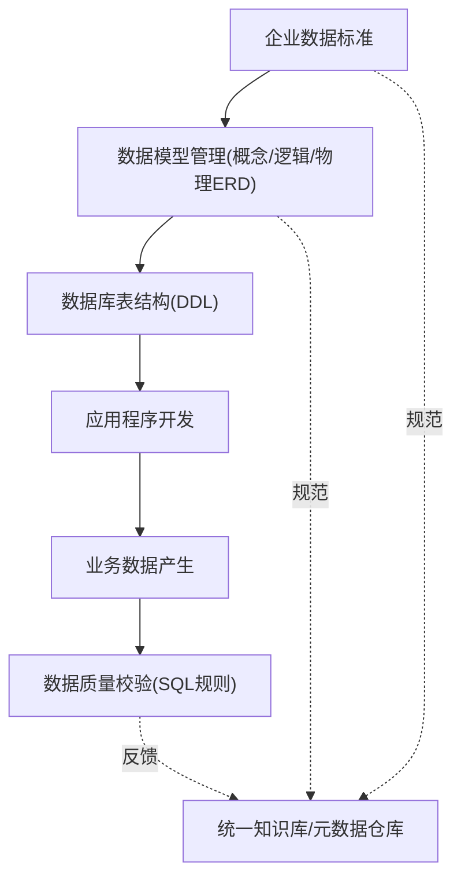
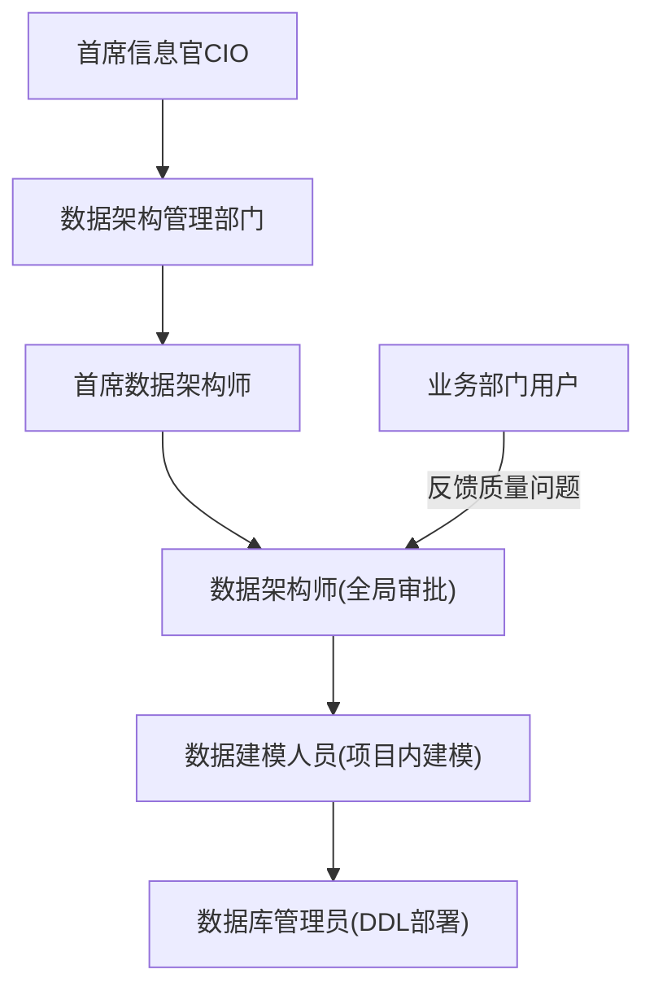

## 💡 数据治理基本概念与标准质量体系 — 知识总结

> 说明：本篇原文件名为"补充实战案例与团队复盘"，但实际内容为数据治理课程笔记，已按实际内容归纳总结。

### 1. 定位：数据治理在IT系统中的地位
数据治理不负责具体业务功能编码，而是站在企业/大型系统的宏观视角进行数据规划与管控：
- **全局覆盖**：面向企业内所有IT系统，定义数据标准、规则、组织体系、审批流程，管理数据从设计到消亡的全生命周期。
- **逆向推导的弊端**：许多团队跳过模型设计直接编码，事后从数据库表结构反推ER图，这种"反推模型"只是应付文档，失去指导业务的意义。
- **大数据热潮推动**：跨系统数据整合需求剧增，元数据、数据质量、数据标准成为宏观资产管理的核心基础。

**数据治理（Data Governance）**定义：企业数据治理部门发起推行的，关于制定和实施整个企业数据商业应用与技术管理的一系列政策流程，是持续改善机制——发现问题、解决问题、预防未来问题。

### 2. 核心术语对照
| 术语 | 概念与工程作用 |
| :--- | :--- |
| 元数据 Metadata | 描述数据的数据：企业标准、模型、表结构、环境描述信息 |
| 主数据 Master Data | 跨系统共用的核心业务对象（人/财/物），确保全局唯一 |
| 数据标准化 | 制定企业级定制数据标准，建立申请/变更/废止管理流程 |
| 数据质量 | 评估监控数据好坏：完整性、规范性、一致性、准确性等维度 |
| 数据集成 | 对应ETL/ETCL流程：数据的抽取、转换、清洗、加载 |
| 数据字典 | 数据标准化的核心产出物，数据标准的统一承载媒介 |

### 3. 四大核心技术模块

**3.1 元数据管理**：管理范围含数据标准/模型、数据库对象（表/字段/视图/存储过程）、环境硬件信息、应用源代码；不含具体行记录值。核心应用是**变更影响度分析**——表结构改造时自动分析影响哪些代码模块，减少人工扫描耗时。

**3.2 主数据管理**：抽取跨系统共用的核心信息（人/财/物），设计独立主数据系统，强制周边系统只读调用共享数据。**工程难点（伤筋动骨风险）**：需彻底改造现有系统的数据库结构/接口/程序，改动大、风险高，很多项目难落地（制造业因物料精度要求高，落地成功率略高）。

**3.3 数据标准化**：基于业务术语制定企业级数据标准，定义生命周期（创建/申请/审批/变更/废止）。典型问题：
- **同义不同名**：同一业务含义对应多个英文字段名（如 `cust_id`/`customer_number`/`c_no`）。
- **同名不同义**：同一英文名对应不同业务含义（如 `account` 有的表指"账户"，有的指"结算"）。
- 处理方式：将同义中文词归为一组，选定标准用语，非标准用语由工具预警。

**3.4 数据质量管理六大维度**：
1. **完整性**：必填字段是否有值。
2. **规范性**：数据值是否符合规定格式（如日期字段小时部分须在00-23）。
3. **一致性**：同一业务对象在不同表中的字段属性保持一致。
4. **准确性**：数值是否符合业务公式（如 $A \times B = C$，校验C是否等于计算结果）。
5. **唯一性**：逻辑/物理主键唯一性（无主键约束时靠代码保证，代码失效会产生重复行）。
6. **及时性与关联性**：数据抽取加载时效是否达标（如夜间ETL须在00:00-02:00内完成）。

### 4. 治理架构与实施流程

实施流程核心链路：制定企业级数据标准 → 设计概念/逻辑/物理模型（校验通过则生成DDL部署，未通过打回修改）→ 应用程序变更影响分析 → 数据剖析(Data Profiling)与业务规则制定 → 编写SQL校验脚本 → ETL/ETCL数据集成 → 自动化运行SQL质量检查 → 输出质量指标、异常明细与追踪报告。

**组织架构（自上而下）**：

### 5. 落地注意事项
- **模型管理的敏捷折中**：紧急需求可先在物理库改字段上线，事后靠治理平台自动扫描物理库与逻辑模型的结构差异，人工判定后反向补全模型，防止模型与物理库长期失联。
- **主数据的高风险改造成本**：属"伤筋动骨"工程，需重构业务系统写入逻辑，评估时要重点关注高层决策支持力度与预算充裕度，跨系统协调能力不足时避免盲目上马。
- **自上而下推动机制**：数据治理涉及多部门协调，单靠底层技术团队自下而上推动极不现实，启动阶段必须获取CIO或跨部门信息主管的顶层授权。
- **数据质量问题溯源**：严重性能瓶颈或数据冲突的根本成因通常是早期模型设计缺陷（表结构冗余、字段同名异义），监控应从上游建模阶段做起，从源头降低治理成本。

### 6. 核心概念速查
| 概念/组件 | 关键维度 | 工程作用 |
| :--- | :--- | :--- |
| 元数据 | 数据结构/配置/硬件/源码 | 变更影响度分析，快速定位受影响代码 |
| 主数据 | 人/财/物核心共享数据 | 建立全局单一源头，消除数据不一致 |
| 数据字典 | 标准用语/编码/映射规则 | 企业规范的物理媒介，供开发速查 |
| 数据剖析 Data Profiling | 规律/分布/异常值统计 | 分析现有数据状态，导出质量规则 |
| 数据质量规则 SQL | 完整/规范/一致/准确/唯一/及时 | 生成规则SQL全表扫描，输出异常明细 |
| CRUD矩阵 | 增删改查 | 描述程序模块与数据表实体的依赖关系 |

